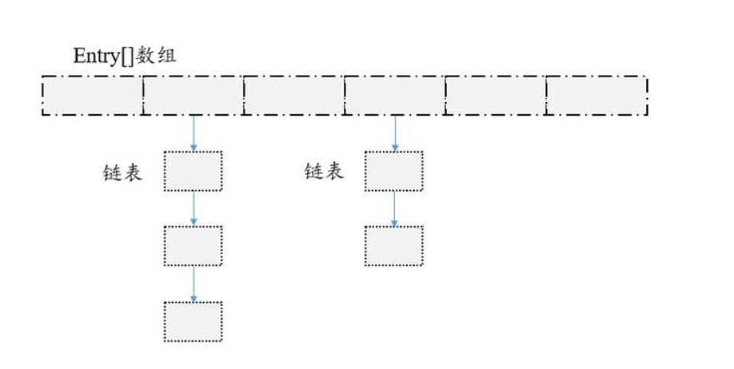

# 2020 C++ 第一次考试

### 结构化编程

现在设计一个由数组和链表共同组成的一个存储键值对的数据结构HashDict，结构图如下。



该数据结构内部包含了一个 Entry 类型的数组 table。每个 Entry 存储着键值对。它包含了四个字段（hashCode, key, value, next），从 next 字段我们可以看出 Entry 是一个链表中的节点。即数组中的每个位置被当成一个桶，一个桶存放一个链表。其中键值对中key为整数，value为字符串。

这个数据结构存储数据时的几种操作说明如下：

- 添加元素：当要向该数据结构中添加一个键值对（key-value）时，先对key做哈希运算，哈希函数：$hash = | 3*key^3+5*key^2+7*key+11 | $，获取key的hash值，然后用hash值对数组table的长度length取模获取键值对应该存储的位置pos，公式为$pos = hash \%\ length$。如果出现哈希冲突的情况，即计算出的位置pos已经存储了数据，则将键值对插入到当前位置已有的链表中，要求插入之后链表是按从小到大排序（按键排序）；如果没有出现哈希冲突，则在当前位置中保存一个单节点链表。

- 删除元素：按照和添加元素同样的逻辑获取对应的键值对所在的位置pos，然后在这个位置里的链表中剔除掉相应的链表节点，如果是单节点链表，则直接把当前位置的链表置为null。

- 扩容：

  在两种情况下需要进行扩容操作：

  1. HashDict中节点个数超过了现有数组长度（不包括相等）
  2. 向某一个桶中的链表增加元素后，该链表长度超过4（不包括4）

  每次扩容操作是将数组长度变为之前数组的**两倍+1**（如原来长度为8，扩容后为17），并将原有的键值对**按照添加元素的规则（重新计算hash值取模）重新添加到新的数组中**。

- 查询：查询数组的指定位置存储了哪些键值对。

**输入格式**：

首先输入一个数字L，L代表数组table的初始长度。

然后输入一个数字N，N代表操作次数，下面N行是具体的操作。

操作行的输入格式：

- 添加元素：`add [key] [value]`, add 代表该行执行添加操作，[key]和[value]是键值对的相应值。如`add 1 cpp`代表向HashDict中添加key为1，value为cpp的一个键值对。
- 删除元素：`delete [key]`， delete 代表该行执行删除操作，[key]是要删除的键值对的键值。保证这个键值一定在HashDict中已经存在。
- 查询：`search [pos]`，search代表执行查询操作，[pos]代表要查询的数组位置，需要输出该位置的链表。保证pos小于数组table的长度。如`search 0`代表查询数组table第一个位置中存储了哪些键值对。

**输出格式**:

只有查询操作需要输出，如果查询位置没有键值对，则直接输出null，如果有，则按照

`[key]:[value]->[key]:[value]`的格式输出（参考示例）。


**示例1**：

输入：

```
4
4
add 10 cpp
add 5 cat
add 3 dog
search 2
```

输出：

```
3:dog->5:cat
```

**示例2**：

输入：

```
2
11
add 5 cat
add 3 dog
search 0
add 10 cpp
search 0
search 1
add 7 bird
add 17 pig
search 4
delete 7
search 4
```

输出：

```
3:dog->5:cat
null
5:cat->10:cpp
7:bird->17:pig
17:pig
```

**示例3**：

输入：

```
4
10
add 5 cat
add 3 dog
add 7 cat1
add 11 dog1
search 2
add 9 cpp
search 2
search 5
search 6
search 8
```

输出：

```
3:dog->5:cat->7:cat1->11:dog1
7:cat1->9:cpp
3:dog
5:cat->11:dog1
null
```

## 考试须知

1. 考试时间：2020-05-13 10:00～12:00（星期三）。
2. 考试中请全程开启zoom。建议使用手机开zoom（电脑连接了VPN可能会很卡），并确保包含了电脑和自己在镜头范围内。如有问题请在zoom中聊天或者举手。
3. zoom改名为学号_姓名的格式。原则上考试期间不允许离开与走动。离开需征得监考同意。
4. 本次考试禁止粘贴其他来源的代码，包含资料内的代码和自己在考试前准备的代码！（自动补全不算粘贴，测试用例复制粘贴到控制台也是可以的，但是不可以粘贴到代码中）
5. 本次考试可以使用虚拟机。但是能不使用虚拟机原则上尽量不使用。
6. 考试中除了连接C++考试网站，不可以访问其他网站获取在线资料。
7. 考试可以查阅自己本地的离线资料，包括课程PPT以及纸质书等，请大家有需要的提前下载。考试期间不可以访问任何网站。
8. 考试期间请关闭任何可以与他人沟通的IM工具，如若发现则作为作弊处理。（该功能仅在考试中使用，平时为了保护大家隐私是关闭的）
9. 考试中尽量不要使用任何浏览器，我们提供了PDF，word版本的题目，如需打开PDF，学校有免费正版Adobe可供下载。
10. 提前交卷的请在zoom中说明，说明格式如下：学号_姓名 已完成，如果助教zoom聊天通知你可以结束考试才可以退出zoom，否则成绩无效。
11. 考试中切换设备需要找助教说明并申请，否则无法切换设备。
12. 请在考试结束前五分钟进行提交，考试结束后不可补交。
