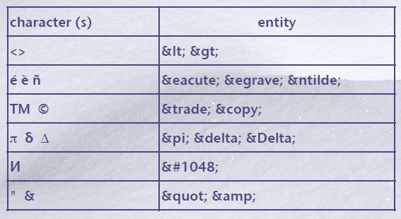
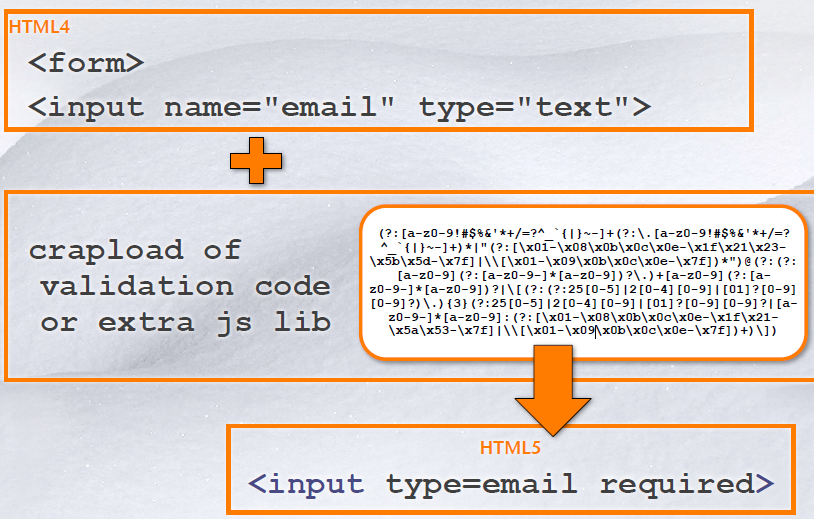
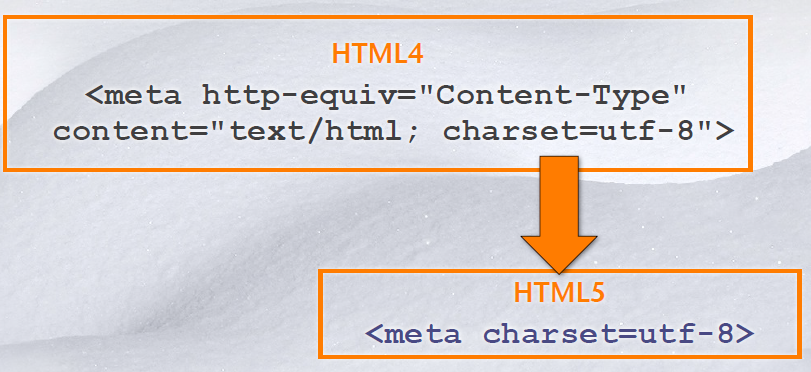
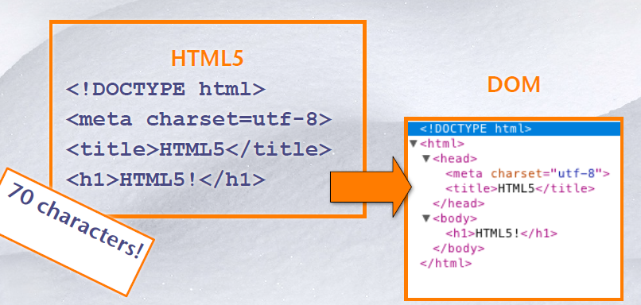
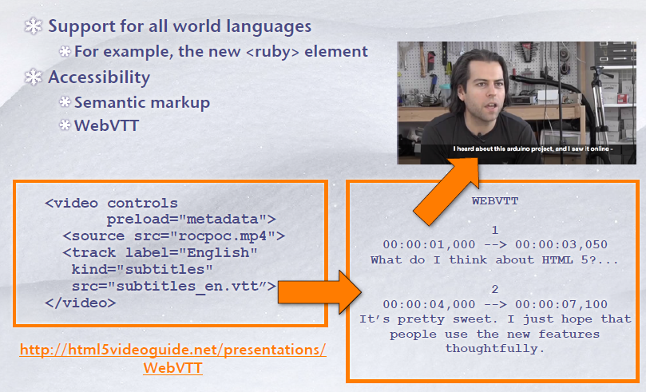
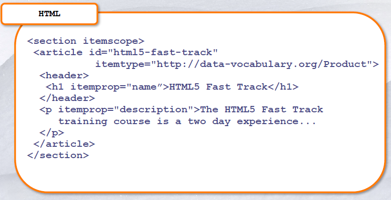
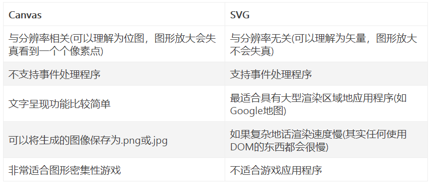
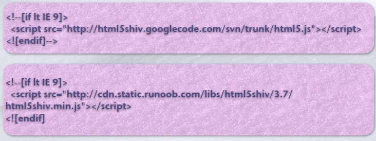

# HTML/XHTML

## 名词解释

### HTML

Hypertext Markup Language，超文本标记语言。是用于描述网页文档的一种标记语言，浏览器根据html创建web页面与web应用。

### SGML

Standard Generalized Markup Language，标准通用标记语言。是一种非常弹性的标记语言，是一种定义电子文档结构和描述其内容的国际标准语言。

### XHTML

eXtensible HyperText Markup Language，可扩展超文本标识语言。HTML是一种基于标准通用标记语言（SGML）的应用，是一种非常灵活的置标语言，而XHTML则基于可扩展标记语言（XML），XML是SGML的一个子集。

### Markup

标记，将代码嵌入到文本中，代码叫做tag。代码用来表示结构化文本并包含运行指令

### Markup language

标记语言，是一种将文本以及文本相关的其他信息结合起来，展现出关于文档结构和数据处理细节的电脑文字编码。可以使用其他工具进行特定的渲染。

### Logical Markup

逻辑标记。用来形容一部分文档的，与渲染无关。例如：\<strong>very\</strong>表示在文档中very很重要

### Markdown 

是⼀种轻量级标记语⾔，它允许⼈们使⽤易读易写的纯⽂本格式编写⽂档。编写的⽂档可以导出 HTML 、Word、图像、PDF、Epub 等多种格式的⽂档。编写的⽂档后缀为 .md, .markdown。

## HTML基础

### 结构

#### \<DOCTYPE>

+ 定义当前使用的文档类型（DTD）

#### \<Head>

+ 定义mata标签
+ 只用\<title>是必须的

##### \<title>

+ 放在页面头部
+ 浏览器的标题栏显示及书签页显示

##### \<meta>

+ 放在页面头部
+ 元素可提供有关页面的元信息（meta-information），比如针对搜索引擎和更新频度的描述和关键词。
+ \<meta http-equiv="Content-Type" content="text/html;
  charset=gbk" />

#### \<Body>

+ 渲染的代码

### 块级元素

+ 包含一个完整内容的区域，例如：段落、列表、表格
+ 浏览器会为每一个块级元素之间进行留白，作为区分

#### \

+ body中的页面段落

#### \<table>

+ 表格

#### \<blockquote>

+ 引用

### 内联元素

+ 影响小部分内容，例如：粗体字、代码段、图片
+ 浏览器允许许多内联元素出现在同一行
+ 必须被嵌入在块级元素里面

#### \ 

+ 文章中的换行符

+ 格式只有\ 

#### \<a>

+ 锚点
+ 浏览器中的hover

#### \

+ 插入图片
+ XHTML也需要alt属性来形容图片（alt在图片无法显示时的代替文本）

#### \<em>、\<strong>

+ \<em>强调文本（使用斜体字）

+ \<strong>特别强调文本（使用粗体字）

+ 不要随意嵌套，在XHTML可能报错

  \
HTML is \<em>really,\<strong>REALLY\</em> lots of \</strong> fun!\

#### \<q>

+ 内部短引用，显示：“aaa”
+ XHTML不包含文字性的引用标记，而且使用\<q>可以用CSS属性

### 注释

+ \<!--...-->

+ 注释不能被嵌套也不能只包含一个-

### 字符实体

## 表格

### 介绍

+ 用来获取用户输入

+ \<form arguments> ... \</form>

+ 参数有

  + action="url"（必须）：指定数据去向
  + method="get"：用get将数据包含在url传送
  + method="post"：将数据送到url request
  + target="target"：说明在submit后的跳转

### \<input>

+ type属性：text, checkbox, radio, password, hidden, submit, reset, button, file, or image
+ hidden
  + 所有input的field会被送回去服务器端，包含hidden field。
  + 这是一个方法可以包含用户看不到的信息

## web标准

### XHTML和web标准

+ 更加严格与结构化的语言
+ 我们未来页面展示的正确性
+ 可以被其他渲染语言如：XML、SVG改变

## HTML5

### 简介

+ HTML5 是下⼀代 HTML 标准。
+ HTML , HTML 4.01的上⼀个版本诞⽣于 1999年。⾃从那以后，Web 世界已经经历了巨变。
+ HTML5 仍处于完善之中。然⽽，⼤部分现代浏览器已经具备了某些 HTML5 ⽀持。

### 特性

#### Paves the Cow Paths

#### 简化DOCTYPE

#### 简化character set

#### 简化markup

#### 包容性更佳

+ 可兼容其他语言

#### 减少插件

+ HTML5提供audio、video、drawing、sockets的原生支持，减少了插件的使用
+ 插件被移除或是不需要下载

#### 安全性

+ HTML5使用原生的安全防护

### 改进

#### 新的API

(Application Programming Interface)--应用程序编程接口

- HTML Geolocation 地理位置
- HTML Drag & Drop拖放
- HTML Local Storage 本地存储
- HTML Application Cache 应用程序缓存
- HTML Web Workers web工作者
- HTNL SSE

#### 新的元素

+ 能使⽤CSS替代的元素

  + basefont，center，font，tt，u
+ 不再使⽤frame框架
+ 只有部分浏览器⽀持的元素
    + applet，bgsound，marquee
+ 其他被废除的元素
    + isindex，dir，rb等

#### 语义化

+ 根据结构化的内容选择合适的标签
+ 有利于SEO
+ 开发维护体验好
+ ⽤户体验更好
+ 更好的可访问性，⽅便任何设备对代码进⾏解析

#### 使用结构化、语义化标签

+ 定义方法区域、使用结构化标签
+ 将style移到CSS文件
+ 使用stylesheet
+ 考虑布局的网格系统

#### Microdata

+ 强调机器阅读性
+ 可与其他格式数据比较，例如：RDF、JSON

#### 表格

+ 不要求一定要JavaScript
+ 增加原生数据和颜色选择
+ 增加Search, e-mail, web address类型
+ 增加客户端的报错
+ 旧浏览器中新的表单控件会平滑降级

#### Audio and Video

+ 新标签\<audio> and \<video>
+ 原生的标签，不需导入插件，也可以被CSS和JavaScript修改

#### Canvas and SVG

+ 提供原生的绘画模块
+ 可以被CSS和JavaScript修改

#### web存储

+ HTML5 web存储,⼀个⽐cookie更好的本地存储⽅式。
+ 客户端存储数据的两个对象为：
  + localStorage - ⽤于⻓久保存整个⽹站的数据，保存的数据没有过期时间，直到⼿动去除。
  + sessionStorage - ⽤于临时保存同⼀窗⼝(或标签⻚)的数据，在关闭窗⼝或标签⻚之后将会删除这些数据。

+ HTML5 引⼊了应⽤程序缓存，这意味着 web 应⽤可进⾏缓存，并可在没有因特⽹连接时进⾏访问。

+ 应⽤程序缓存为应⽤带来三个优势：
  + 离线浏览 - ⽤户可在应⽤离线时使⽤它们
  + 速度 - 已缓存资源加载得更快
  + 减少服务器负载 - 浏览器将只从服务器下载更新过或更改过的资源。

+ ⼀旦应⽤被缓存，它就会保持缓存直到发⽣下列情况：
  + ⽤户清空浏览器缓存
  + manifest ⽂件被修改
  + 由程序来更新应⽤缓存

#### Web Workers

+ 当在 HTML ⻚⾯中执⾏脚本时，⻚⾯的状态是不可响应的，直到脚本已完成。
+ web worker 是运⾏在后台的 JavaScript，独⽴于其他脚本，不会影响⻚⾯的性能。可以继续做任何愿意做的事情：点击、选取内容等等，⽽此时 web worker 在后台运⾏。

#### Enabling JavaScript

+ 使⽤ Sjoerd Visscher 创建的 "HTML5 Enabling JavaScript", " shiv" 来解决该问题:

