# CSS

## 名词解释

### CSS

Cascading Style Sheets，层叠样式表。用来表现HTML（标准通用标记语言的一个应用）或XML（标准通用标记语言的一个子集）等文件样式的计算机语言。CSS不仅可以静态地修饰网页，还可以配合各种脚本语言动态地对网页各元素进行格式化。

### W3C

World Wide Web，万维网联盟。创建于1994年，是Web技术领域最具权威和影响力的国际中立性技术标准机构。

## 介绍

### WHY

+ more flexible
+ short
+ clear
+ Basic formatting tool
+ Easy multiple document management
+ Save time by using selector classes
+ New opportunities in formatting

### 语法

+ selector
+ property/value
+ declaration
+ declaration block
+ curly braces

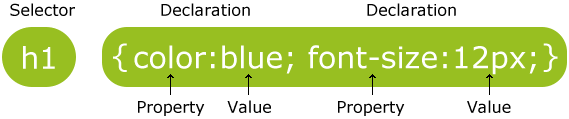

### 选择器

#### id选择器

+ 用“#”定义
+ 只有唯一的元素
+ #para1 {text-align:center;color:red;}

#### class选择器

+ 有一群元素
+ .center {text-align:center;}

#### 标签选择器

+ p{color:red;text-align:center;}

#### 属性选择器

+ [title]{color:blue;}

+ \<h1 title="Hello world">Hello world\</h1>

#### 伪类选择器

+ selector:pseudo-class {property:value;}
+ selector.class:pseudo-class {property:value;}
+ a:link {color:#000000;} /\* 未访问链接\*/
+ a:visited {color:#00FF00;} /\* 已访问链接 \*/
+ a:hover {color:#FF00FF;} /\* ⿏标移动到链接上 \*/
+ a:active {color:#0000FF;} /\* ⿏标点击时 */

#### 伪元素选择器

+ selector:pseudo-element {property:value;}
+ selector.class:pseudo-element {property:value;}
+ p:first-line{color:#ff0000;font-variant:small-caps;}

#### 组合选择器

+ 后代选择器(以空格分隔)

  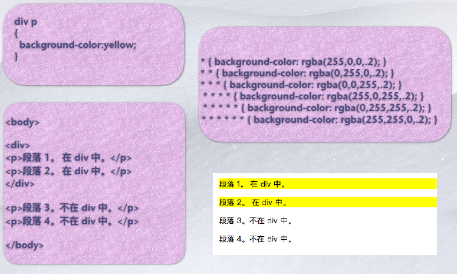

+ ⼦元素选择器(以⼤于号分隔）

  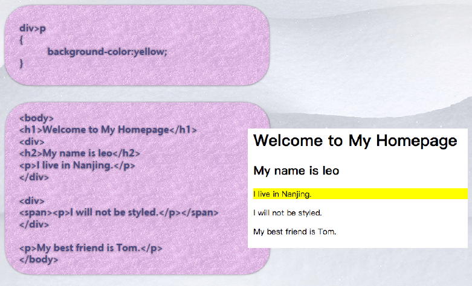

+ 相邻兄弟选择器（以加号分隔）

  

+ 普通兄弟选择器（以破折号分隔）

  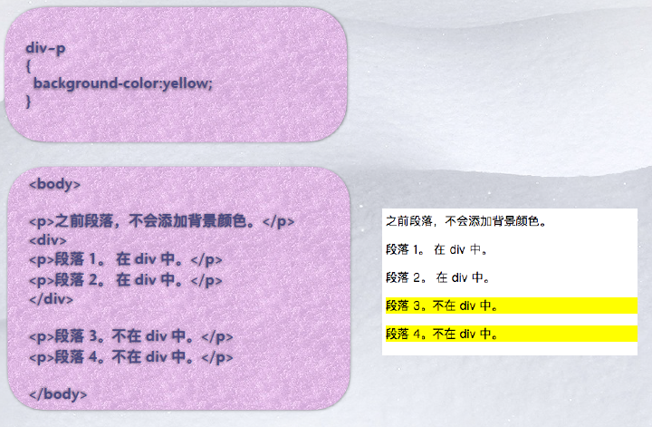

## 叠层顺序（Cascading Order）

### CSS顺序

+ browser’s default styles
+ external style sheet files
+ internal style sheets (inside a \

### 内联CSS

+ 将CSS放在元素声明里面
+ Ex. \
 This is a simple paragraph and the inline style makes it red.\

### 使用方法

+ 外部 > 内部 > 内联
+ 一般不使用内部，因为只能声明一个元素，不能复用
+ 外部允许不同文件使用同一个style sheet，修改一个地方就可以升级全部。

### 继承style

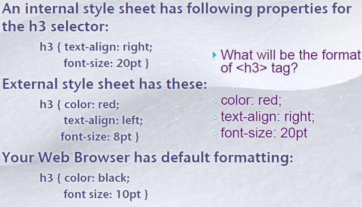

+ 根据叠层顺序进行继承

### !important

+ 根据important决定优先级
+ 优先级决定谁被渲染
+ 优先级顺序
  + user agent的声明
  + user一般的声明
  + author一般的申明
  + author important的声明
  + user important的声明

### CSS特殊性

关于CSS权重，需要一套公式来计算，由四位的数组成，值从左到右，左面的最大，一级大于一级，数位之间没有进制，级别之间不可超越。

+ 继承或者*的值：0，0，0，0
+ 每个标签选择器值：0，0，0，1
+ 每个类选择器（.），伪类值为：0，0，1，0
+ 每个ID选择器（#）为：0，1，0，0
+ 每个行内样式值：1，0，0，0
+ 每个!important值：无穷大

权重可以叠加

继承权重为0

权重相同则就近原则

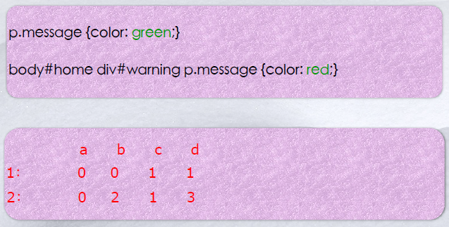

## CSS3

### 特性

+ 模块化设计，便于浏览
+ 使用特定于浏览器的前缀，直到完成
+ 圆角

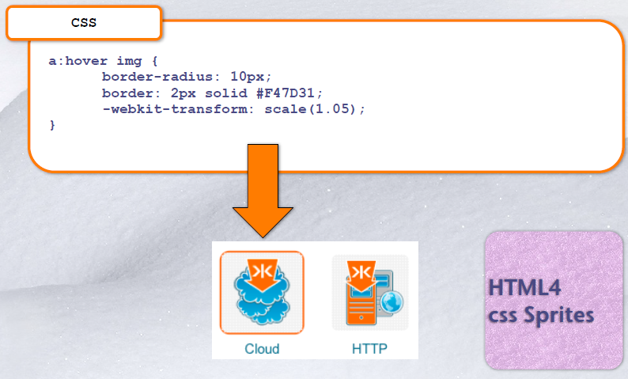

+ web字体

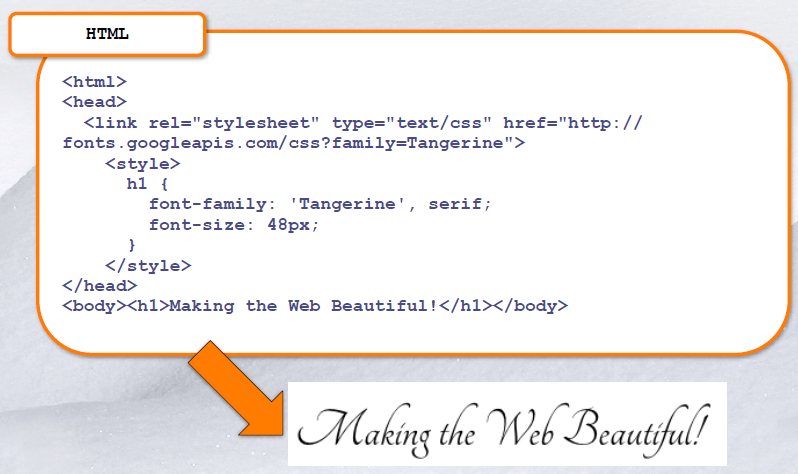

## 布局

### 盒模型（Normal Flow）

#### 概念

+ 所有物件都是一个盒子

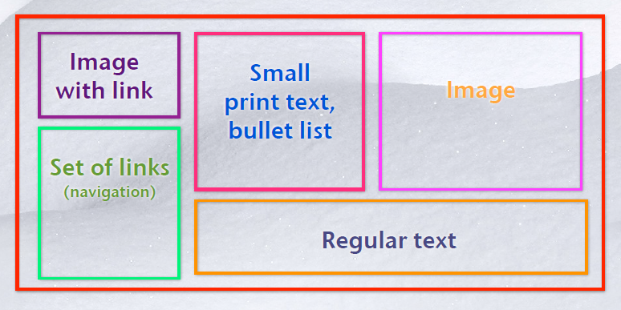

#### 属性

- width和height：**内容**的宽度、高度（不是盒子的宽度、高度）。
- padding：内边距。
- border：边框。
- margin：外边距。
- 总元素的宽度=宽度+左填充+右填充+左边框+右边框+左边距+右边距
- 总元素的⾼度=⾼度+顶部填充+底部填充+上边框+下边框+上边距+下边距

### 文档流（Normal Flow）

#### 概述

+ 所有内联元素由左至右排序（想象成word排版）

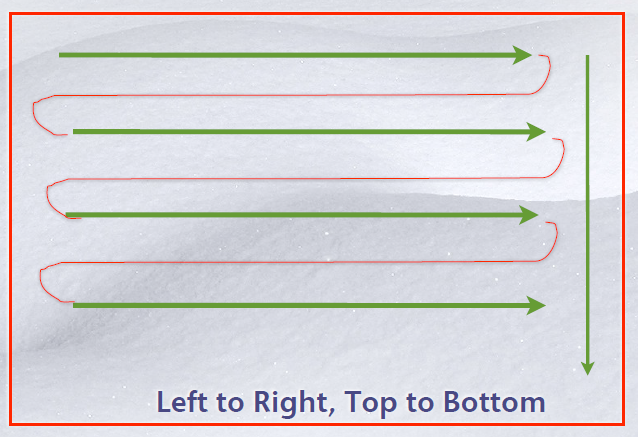

#### 脱离文档流

##### absolute

+ position:absolute

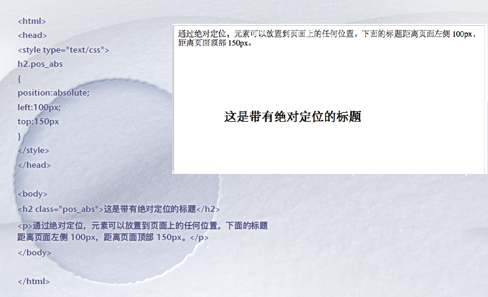

##### relative

+ position:relative

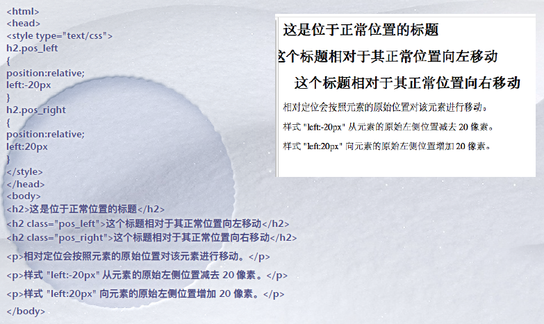

##### float

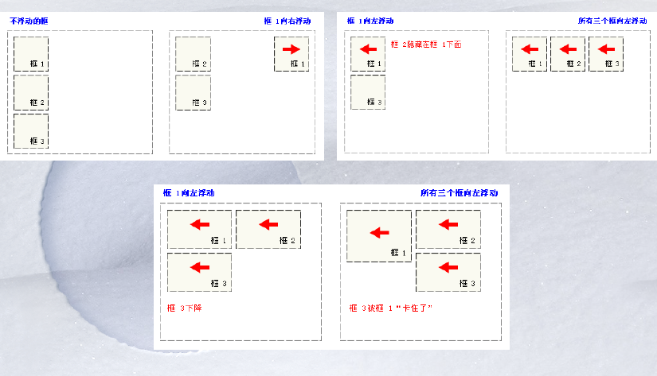

### Formatting Context

#### 概述

+ Formatting context 是 W3C CSS2.1 规范中的⼀个概念。它是⻚⾯中的⼀块渲染区域，并且有⼀套渲染规则，它决定了其⼦元素将如何定位，以及和其他元素的关系和相互作⽤。最常⻅的 Formatting context 有 Block fomatting context (简称BFC)和 Inline formatting context (简称 IFC)。
+ BFC是⼀个独⽴的布局环境，其中的元素布局是不受外界的影响，并且在⼀个BFC中，块盒与⾏盒（⾏盒由⼀⾏中所有的内联元素所组成）都会垂直的沿着其⽗元素的边框排列。

#### BFC

+ BFC(Block formatting context)直译为"块级格式化上下⽂"。它是⼀个独⽴的渲染区域，只有Block-level box参与， 它规定了内部的Block-level Box如何布局，并且与这个区域外部毫不相⼲。

##### 形成

+ 满⾜以下任意⼀个条件可以创建⼀个新的BFC：
  + 根元素 ；
  + 脱离普通⽂档流的元素（浮动、绝对定位、固定定位），position的值不是static或者relative。
  + ⾮块级元素（display属性值是inline-block、table、flex）
  + overflow属性值不为visible的块级元素。

##### 布局规则

+ 内部的Box会在垂直⽅向，⼀个接⼀个地放置。
+ Box垂直⽅向的距离由margin决定。属于同⼀个BFC的两个相邻Box的margin会发⽣重叠。
+ 每个盒⼦（块盒与⾏盒）的margin box的左边，与包含块border box的左边相接触(对于从左往右的格式化，否则相反)。即使存在浮动也是如此。
+ BFC的区域不会与float box重叠。
+ BFC就是⻚⾯上的⼀个隔离的独⽴容器，容器⾥⾯的⼦元素不会影响到外⾯的元素。反之也如此。
+ 计算BFC的⾼度时，浮动元素也参与计算。

#### IFC

##### 形成

+ 当多个内联（块级）元素排列在⼀起的时候就会形成⼀个IFC，之间不能穿插有块级元素，否则会被切割成多个IFC。

##### 影响

+ IFC对布局产⽣的影响主要有以下三个⽅⾯：
  + ⼀个IFC内的元素都是⽔平排列的。
  + 横向的margin、border、padding属性对于这些元素都是有效的。
  + 垂直⽅向可以调整对⻬⽅式。

## 设计

### 复杂的div嵌套

+ 代码复杂度⾼，⽹⻚加载速度慢

### 最佳可访问性和可读性

+ 编码时保持良好的html源码顺序⾮常重要，原因：
  + ⽹站技术故障时不能正确显示css样式，或移动和⽆线⽹络环境下，带宽有限，导致浏览器中出现没有样式的HTML。
  + 资源顺序对⽹站的可访问性起着重要作⽤，因为对于盲⼈⽤户，当代码有⼀定的逻辑顺序时，能够快速跳过⻚眉和导航区域，直达⻚⾯的主要内容。
  + 确保⽹站的主导航链接和主要⽹⻚内容在资源排序中排在最前⾯，这样可以帮助搜索引擎优化。

### 响应式布局

+ 曾经流⾏，不再是必不可少，原因
  + 公司研发⼈员越来越充⾜，可以在pc端和移动端实现两套布局，分项⽬进⾏维护。
  + 响应式布局在适配上越来越简单。
+ 仍有存在的价值：
    + 移动端碎⽚化的现象将会⽆限期存在
    + 前端也必然进⼊物联⽹领域，任何设备界⾯的响应布局都将会成为关键挑战。
    + 响应式布局是CSS逐步发展中的⼀环，体现了CSS的灵活性。

#### 优势

+ ⽹站可⽤性得到提升，同时与移动优先设计以及内容策略能够⾮常好的融合在⼀起。
+ 简化服务器端
+ 更容易维护
+ 只提供⼀个⼊⼝给搜索引擎
+ 能够⽀持未知设备

#### 缺点

+ 性能
  + 兼容各种设备⼯作量⼤，效率低下
  + 代码累赘，会出现隐藏⽆⽤的元素，加载时间加⻓
+ 限制应⽤的复杂性
    + 折衷性质的设计解决⽅案，多⽅⾯因素影响⽽达不到最佳效果
+ ⼀定程度上改变了⽹站原有的布局结构，会出现⽤户混淆的情况

#### 响应式网页设计

+ 围绕着三个概念建⽴：
  + 流畅或灵活的⻚⾯布局，根据浏览器窗⼝⼤⼩成⽐例缩放。
  + 灵活、⽐例适中的图像和视听媒体。
  + 使⽤CSS3媒体查询（media query），确定浏览器屏幕的宽度并作出相应的调整。

#### 流式布局和比例度量

+ ⻚⾯固定宽度布局：
  + ⼏年前流⾏
  + 复杂⻚⾯布局中，有助于⽤户更好地了解⻚⾯上的信息。
  + 尺⼨固定，不能适应当今屏幕⼤⼩各异的互联⽹世界。
+ 不设定为⼀个固定宽度

#### em排版尺⼨

+ 单纯成⽐例的流式布局并不能完全解决屏幕尺⼨问题，因为在⼩屏幕上⻚⾯布局可能会被压扁，⽽在⼤屏幕上会被拉伸变形。
+ 使⽤em排版尺⼨就⾮常重要，原因：
  + 当设备屏幕上的排版太⼤或太⼩时，⽤户都可以很容易地进⾏调整，，这对于有视⼒障碍的⽤户来说是⼀个重要的可访问特性。
  + 在CSS控制下，相对类型的⼤⼩可以很容易地缩放，在\<html>或\<body>标签中使⽤font-size元素，就可以很容易地对整个⻚⾯排版尺⼨进⾏缩放。通过调整em的值，可以⽴刻放⼤或缩⼩⻚⾯上的所有排版，这在响应式设计中是⼀种⾮常有⽤的功能，可以快速缩放⻚⾯排版，以轻松匹配整个屏幕尺⼨和分辨率。

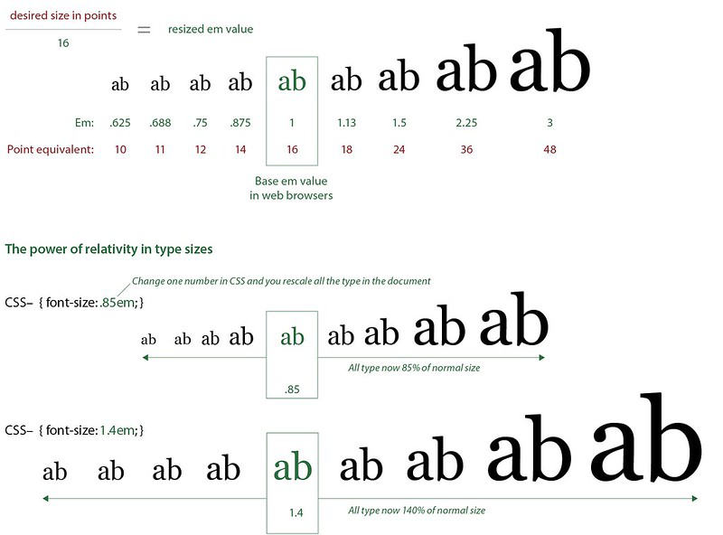

#### HTML5 \<picture>元素

+ picture 元素允许我们在不同的设备上显示不同的图⽚，⼀般⽤于响应式。
+ HTML5 引⼊了 \<picture> 元素，该元素可以让图⽚资源的调整更加灵活。
+ \<picture> 元素零或多个 \<source> 元素和⼀个 \ 元素，每个 \<source> 元素匹配不同的设备并引⽤不同的图像源，如果没有匹配的，就选择 \ 元素的 src 属性中的 url。

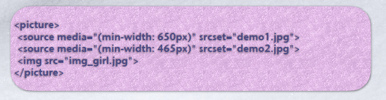

#### CSS3 media query

+ 有条件地检测⽤户显示屏的各个⽅⾯，然后根据这些条件有选择地加载出样式表，并提供最合适的布局、排版和图形。
+ 媒体查询可⽤于检测很多事情 ：
  + viewport(视窗) 的宽度与⾼度
  + 设备的宽度与⾼度
  + 朝向 (智能⼿机横屏，竖屏)
  + DPI分辨率

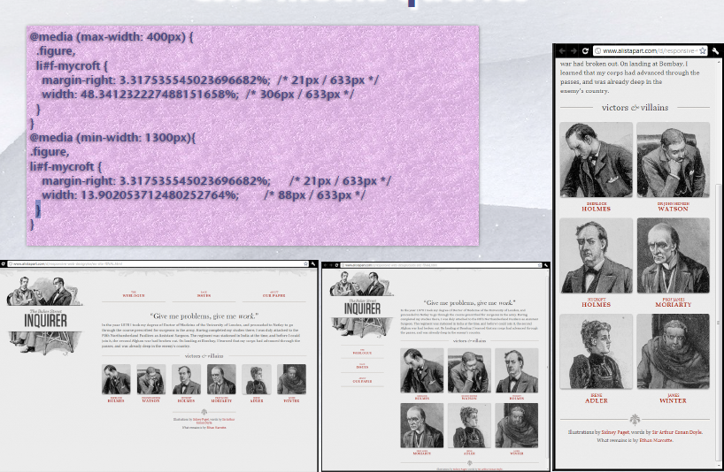

#### 独特布局

+ 响应式设计不仅仅是拉伸和缩⼩⻚⾯布局，⽽是要将内容和导航的独特布局以最好的⽅式显示到各种尺⼨的屏幕上。
+ ⼤部分响应式设计会使⽤⾄少三种不同的布局样式表。

### 移动优先

+ 优先内容和功能
  + 优先显示最重要的内容和功能，如果空间允许，再逐步加⼊次要内容和功能。

#### 好处

+ 通⽤访问
  + 只要移动端做的好，即使⽤户使⽤的是旧版本浏览器、没有Javascript或者关闭了Javascript的浏览器，或为视⼒残障⼈⼠设计的读屏浏览器，也能看到⼀个拥有基本功能的⽹站。
  + 移动优先是渐进将强理念的良好范例，所有⽤户都能访问核⼼内容和功能。不存在不能访问的情况。

+ 渐进渐强基本理念是⾸先基于⼀个具有⼴泛兼容性的核⼼⽅案，创建⼀个基线版本，然后再根据可能⽤到的浏览器的特性，慢慢添加⼀些特性和功能。

#### 实践

+ 使⽤有效的，⼴泛⽀持的HTML5和CSS3来构建你的站点。
+ 利⽤HTML5新语义元素和ARIA为内容添加意义、可访问性和搜索可⻅性。
+ 在布局和排版中使⽤⽐例度量，如百分⽐和em。
+ 根据⽤户的需求、观看设备的可能范围以及特定内容的性质，计算响应断点并使⽤媒体查询。
+ 使⽤移动优先的⽅法，建⽴最⼩和最基本的体验。
+ 根据屏幕空间、带宽和浏览器功能，逐步提升移动优先的体验。
+ 在研发周期中优先考虑浏览器因素，尽量避免使⽤复杂的、⾯向桌⾯的Photoshop排版和静态图形设计。花哨的静态设计模型是⼀种过时的思维⽅式，与现代web实现完全脱节。

### 面包屑导航

1、让⽤户了解当前所处位置，以及当前⻚⾯在整个⽹站中的位置。
2、体现了⽹站的架构层级，能够帮助⽤户快速学习和了解⽹站内容和组织⽅式，从⽽形成很好的位置感。
3、提供返回各个层级的快速⼊⼝，⽅便⽤户操作。
4、Google已经将⾯包屑导航整合到搜索结果⾥⾯，因此优化⾯包屑导航每个层级的名称，多使⽤关键字，都可以实现SEO优化。⾯包屑路径，对于提⾼⽤户体验来说，是很有帮助的。
5、⽅便⽤户，⾯包屑主要⽤于为⽤户提供导航⼀个⽹站的次要⽅法，通过为⼀个⼤型多级⽹站的所有⻚⾯提供⾯包屑路径，⽤户可以更容易的定位到上⼀次⽬录，引导⽤户通⾏；
6、减少返回到上⼀级⻚⾯的点击或操作，不⽤使⽤浏览器的“返回”按钮或⽹站的主要导航来返回到上⼀级⻚⾯；
7、不⽤常常占⽤屏幕空间，因为它们通常是⽔平排列以及简单的样式，⾯包屑路径不会占⽤⻚⾯太多的空间。这样的好处是，从内容过载⽅⾯来说，他们⼏乎没有任何负⾯影响；
8、降低跳出率，⾯包屑路径会是⼀个诱惑⾸次访问者在进⼊⼀个⻚⾯后去浏览这个⽹站的⾮常好的⽅法。⽐如说，⼀个⽤户通过⾕歌搜索到⼀个⻚⾯，然后看到⼀个⾯包屑路径，这将会诱使⽤户点击上⼀级⻚⾯去浏览感兴趣的相关主题。这样，从⽽，可以降低⽹站的总体跳出率。
9、有利于百度蜘蛛对⽹站的抓取，蜘蛛直接沿着那个链⾛就可以了，很⽅便。
10、⾯包屑有利于⽹站内链的建设，⽤⾯包屑⼤⼤增加了⽹站的内部连接，提⾼⽤户体验。

#### 适用条件

+ 虽然眼下很多⽹站都流⾏使⽤⾯包屑导航，但是并不是所有的⽹站都适⽤。符合下⾯两个条件的⽹站才适合使⽤⾯包屑导航。
  1、层级较深的⽹站，⾯包屑导航适合层级较深的⽹站，如果只有⼀级分类的话，通过主导航就可以起到快速定位的作⽤。⽐如“⾖瓣⽹”类型扁平构架的⽹站就没有使⽤⾯包屑导航。
  2、独⽴不交叉的⽹站结构，由于⾯包屑⽹站导航路径是线性结构的，因此⽹站内容必须划分的⾮常清晰，且不存在交叉；否则，⾯包屑导航的路径就不是唯⼀的，同⼀分类可能出现在不同的路径中，让⽤户感到困惑