# JavaScript

## 名词解释

### DOM

Document Object Model，文档对象模型。它是一种与平台和语言无关的应用程序接口(API),它可以动态地访问程序和脚本,更新其内容、结构和www文档的风格(目前,HTML和XML文档是通过说明部分定义的)。文档可以进一步被处理，处理的结果可以加入到当前的页面。

### BOM

Browser Object Model，浏览器对象模型。是用于描述这种对象与对象之间层次关系的模型，浏览器对象模型提供了独立于内容的、可以与浏览器窗口进行互动的对象结构。BOM由多个对象组成，其中代表浏览器窗口的Window对象是BOM的顶层对象，其他对象都是该对象的子对象。

### cookies

类型为“小型文本文件”，是某些网站为了辨别用户身份，进行Session跟踪而储存在用户本地终端上的数据（通常经过加密），由用户客户端计算机暂时或永久保存的信息。

## 客户端脚本

### 概述

+ 在浏览器从服务端获得页面数据之后运行的代码
+ 这些代码负责运行页面与返回用户操作

### 客户端编程

+ 程序嵌入在HTML文件中
+ 当他加载时，浏览器运行程序。整合程序的动态输出与静态内容

### 客户端 V.S. 服务端编程

#### 客户端优势

+ 速度快
+ 小型修改无需经过服务端
+ 无需平台依赖
+ 事件响应

#### 服务端优势

+ 安全性
+ 相容性
+ 持久化

### 脚本任务

+ 增加动态物件
+ 定义编程接口

## 介绍

### 优势

+ 垃圾收集器和动态绑定
+ 使用原型继承
+ 与面向对象相似
+ 所有东西都是对象
+ 事件响应
+ 复用性

### 使用

+ 嵌入到客户端页面的脚本

\

+ 使用外部的脚本

\

## 语法

### 特性

+ 大小写敏感
+ 语句分号不影响
+ 模块化（{...}）

### 对象

+ 已命名成员的集合
+ 创建对象
  + objBob = {name: “Bob", grade: 'A', level: 3};
+ 添加成员
  + objBob.fullname = 'Robert';

+ array、方法也算是对象

### 变量和类型

+ var, let, const(case sensitive)
+ 类型不固定，但是有类型
+ Number, Boolean, String, Array, Object, Function, Null, Undefined
+ typeof()可以知道类型

#### Number type

+ 整数或是实数时一个类型
+ 可以进行自由的类型转换，Ex. "2" * 3 is 6

#### String type

+ 没有char类型，一个字符也是存成String
+ ""或是''都可以
+ +可以用来连接字符串

#### Boolean type

+ false：0, -0, 0.0, NaN, "", null, and undefined
+ true：其他
+ 类型转换
  + var boolValue = Boolean(otherValue);
  + var boolValue = !!(otherValue);

#### Null, NaN, Undefined

+ 特殊类型，表示空

#### Arrays

+ 初始化方式
  + var empty=[];
  + var mycars=new Array();
+ 方法
  + push and pop add / remove from back
  + unshift and shift add / remove from front
  + shift and pop return the element that is removed

#### function

+ 内部方法：=>(arg1, arg2) => {//something here}
+ 匿名方法：(function (x,y) {return x+y}) (2,3);

### 基本语法

#### 逻辑运算符

+ 基本与java一样
+ 类型可以互相转换。Ex. 5<"7" is true
+ \=\==和!\==都是严格的等于测试，检测类型与值。Ex. "5.0" \=\== 5 is false

#### if/else、for、while

+ 基本与java一样
+ for有for-in和for-of。Ex. for (x in person)

## DOM

### 介绍

一种树形的API文档。

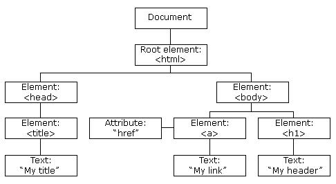

+ HTML DOM
  + 标准的物件模型以及HTML编程接口。他能够获得、修改、增加、删除HTML元素
+ DOM编程接口
  + HTML DOM可以使用JavaScript
  + HTML元素被定义为一个对象
  + 编程接口对每个对象定义成员属性和方法
+ DOM元素
  + 浏览器在运行时会自己找对应的元素
  + \

### 找元素

+ Finding HTML elements by id
  var myElement = document.getElementById("intro");
+ Finding HTML elements by tag name
  var x = document.getElementsByTagName("p");
+ Finding HTML elements by class name
  var x = document.getElementsByClassName("intro");
+ Finding HTML elements by CSS selectors
  var x = document.querySelectorAll("p.intro");
+ Finding HTML elements by HTML object collections
  var x = document.forms["frm1"];

### 节点类型

+ 元素（HTML标签）
+ 在块级元素里面的文字
+ 属性节点
  + 文字、属性都是元素节点的子节点
  + 不能有子节点

### 遍历DOM

#### 元素

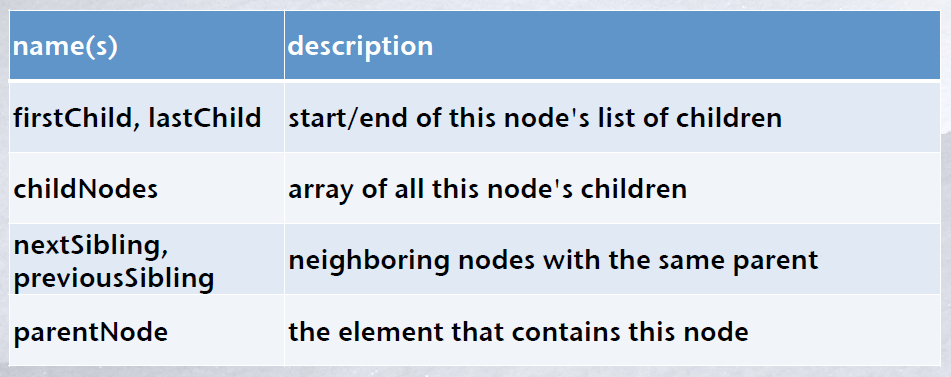

#### 示例

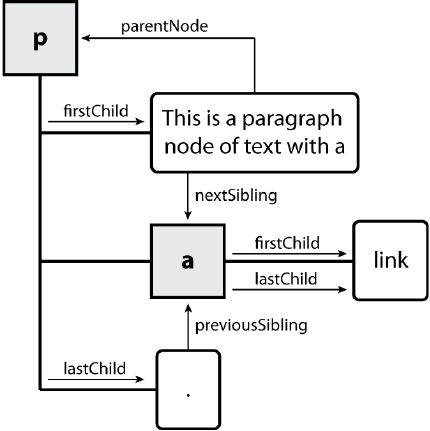

## BOM

### 对象

+ 每一个浏览器的JavaScript程序有下面的全局对象

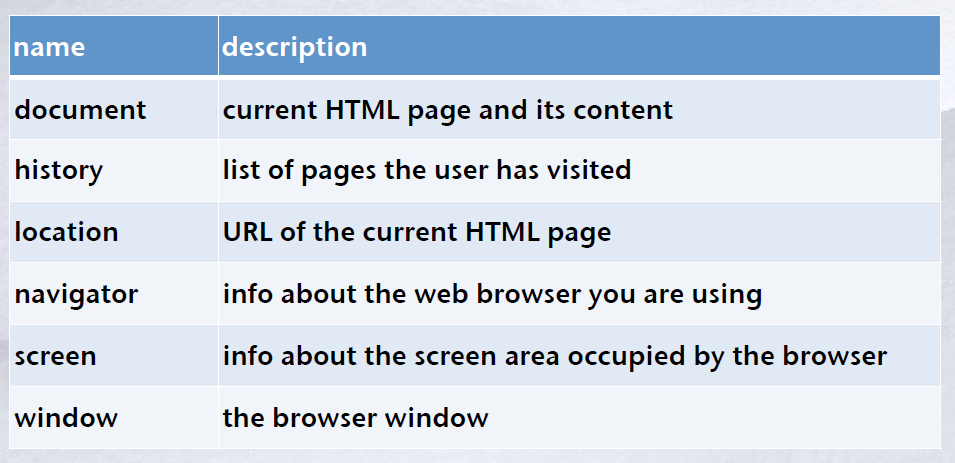

### window object

+ 所有浏览器支持
+ 所有全球的JavaScript对象、方法、变量自动成为window对象
+ 全局变量是window对象的成员变量
+ 全局函数是window对象的成员方法
+ 其他全局对象都是window对象的成员变量，只不过调用可以不用window前缀

### document object

+ 现在的web页面和页面中的元素
+ 成员变量：anchors, body, cookie, domain, forms, images, links, referrer, title, URL
+ 成员方法：getElementById, getElementsByName, getElementsByTagName, close, open, write, writeln

### location object

+ window.location.href 返回现在页面的URL
+ window.location.hostname 返回现在的host域名
+ window.location.pathname 返回现在页面的路径
+ window.location.protocol 返回现在使用的协议(http:// orhttps://)
+ window.location.assign 加载新的文件

### navigator object

+ navigator.appName
+ navigator.onLine
+ navigator.appCodeName
+ navigator.platform

### screen object

+ screen.width
+ screen.height
+ screen.availWidth
+ screen.availHeight
+ screen.colorDepth
+ screen.pixelDepth

### history object

+ history.back() - same as clicking back in the browser
+ history.forward() - same as clicking forward in the browser

## Cookies

### 创建

+ document.cookie="username=Tom"
+ document.cookie="username=Tom; expires=Thu, 18 Sep 2015 10:00:00 UTC";
+ document.cookie="username=Tom; expires=Thu, 18 Sep 2015 10:00:00 UTC; path=/";
+ expire参数决定销毁时间，否则就是在浏览器关闭时销毁。
+ path决定属于哪一层路径，默认是当前路径。

### 使用

+ read

  var x = document.cookie;
  Note document.cookie will return all cookies in one string much like:
  cookie1=value1; cookie2=value2; cookie3=value3;

+ change

  document.cookie="username=Tom; expires=Thu, 18 Sep 2015 10:00:00 UTC;

  path=/";

### 示例

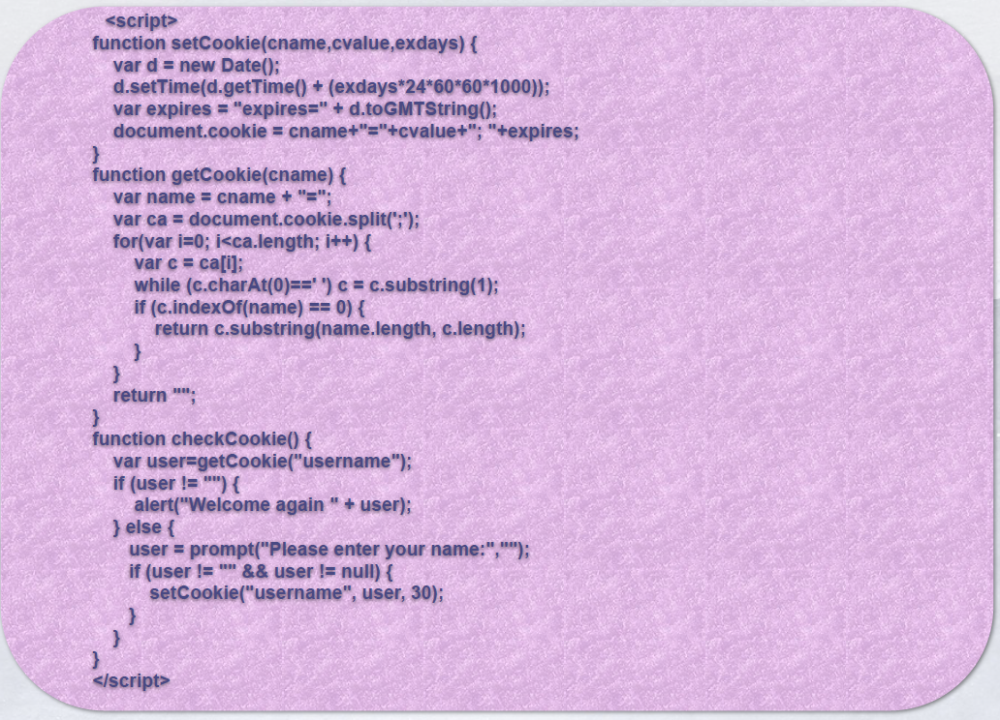

## 事件

### 事件驱动编程

+ 程序的走向根据事件决定
+ 在事件驱动应用中，会有listener循环，并且在被触发时调用一个callback方法

### 事件处理程序（Event Handler）

+ 事件发生，就会有一段JavaScript代码被执行。
+ 必须被注册
+ 一般与XHTML元素关联

### 语法

+ element.addEventListener(event, function, useCapture);

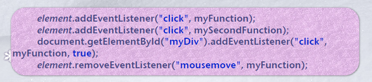

### 挂载方式

+ Event.observe(window,"load",myFunction);
+ var hiddenBox = \$( "#banner-message" );
  $( "#button-container button" ).on( "click", function( event ) {hiddenBox.show();});

## 观察者模式

### 概述

+ 观察者模式就是观察者与被观察者，观察者看到被观察者改变了，则发出消息告诉其他人被观察者改变了。

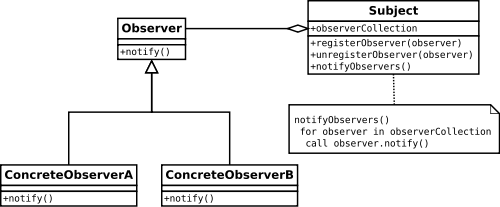

## 事件类型

### 分类

+ UI event types:
  DOMFocusIn, DOMFocusOut, DOMActivate
+ Mouse event types:
  click, mousedown, mouseup, mouseover, mousemove, mouseout
+ Key event types: (not in DOM 2, but will in DOM 3)
+ Mutation events:
  DOMSubtreeModified, DOMNodeInserted, ...
+ HTML event types:
  load, unload, abort, error, select, change, submit, reset, focus, blur, resize, scroll

### Event object

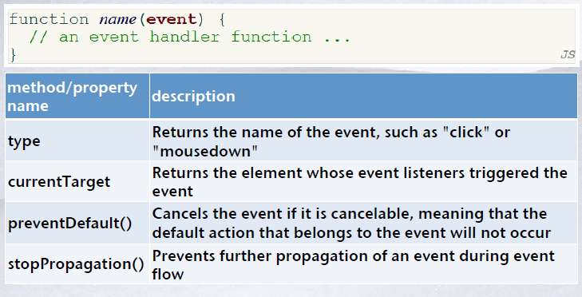

## DOM0

### 概述

#### 内联模块

事件驱动程序被作为一个元素属性添加

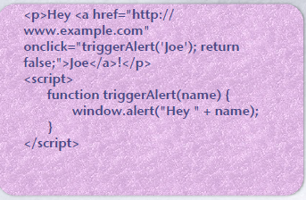

#### 传统模块

事件驱动程序被脚本添加与删除

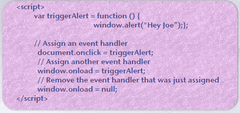

### 事件流

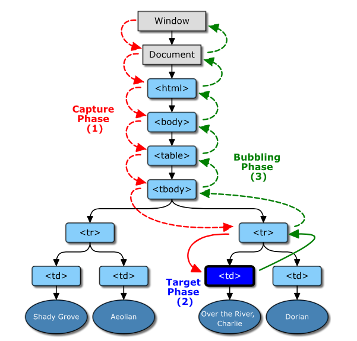

#### 捕获阶段

浏览器要找到当前被点击的对象。从最外层的document开始寻找， 一直沿着DOM树找到了被触发事件的对象。在这过程中是不会触发事件的

#### 目标阶段

该阶段是浏览器找到了被触发事件的元素对象。在这个阶段，是会触发事件函数。浏览器找到被触发事件的对象，执行该对象相应的事件函数。

#### 冒泡阶段

该阶段是浏览器从被触发事件的元素对象向上冒泡，直至到达document对象。在这个阶段，一般是会触发所经过的元素的相同类型的事件函数

## DOM2

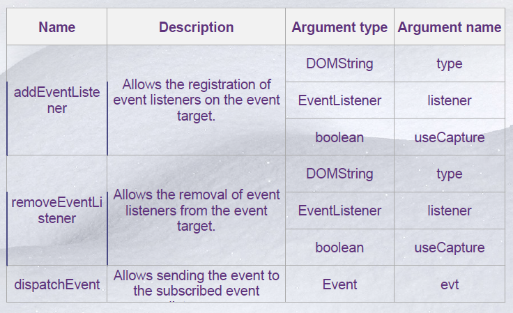

### 复写例子

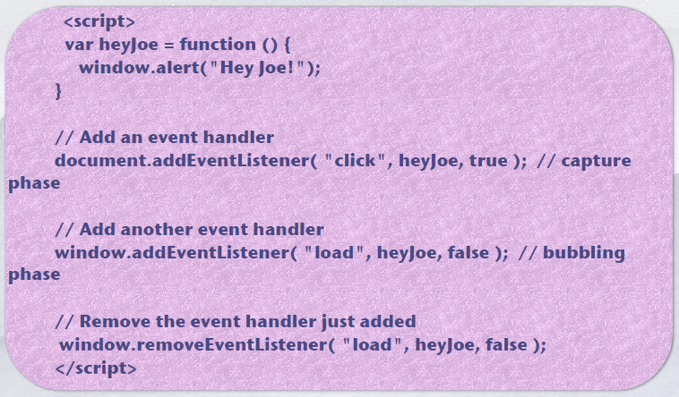

## 作用域

### 局部变量

+ 声明在方法里面
+ 局部变量是局部作用域

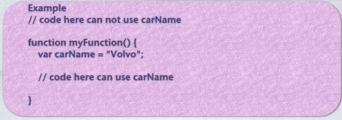

### 全局变量

+ 声明在方法外面
+ 全局变量是全局作用域

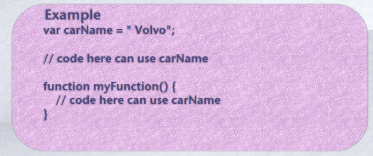

### 自动全局变量

+ 赋值一个未声明的变量，则该变量自动为全局（即使在方法里面被使用）

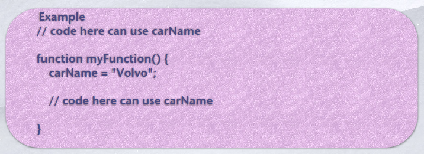

### 嵌套方法

+ 能让作用域覆盖另一个方法

## 闭包

### 概述

+ 所有的函数都是闭包
+ 内部函数⽐它的外部函数具有更⻓的⽣命周期
+ 闭包是引⽤了⾃由变量的函数
  + ⾃由变量是作⽤域可以导出到外部作⽤域的变量（简单来说，就是当前作用域没有定义的变量）
  + 函数内部变量和函数参数都可以是⾃由变量
  + 函数参数不包含this和arguments

### 场景

+ 实现私有成员
+ 保护命名空间
+ 避免污染全局变量
+ 变量需要⻓期驻留在内存

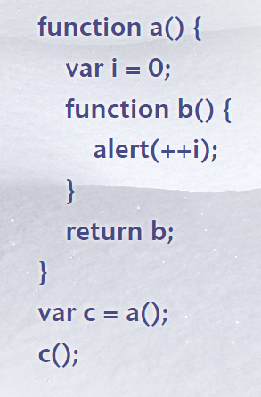

### 作用域链

+ 一层一层网上找自由变量
+ 找到全局变量还没有则放弃

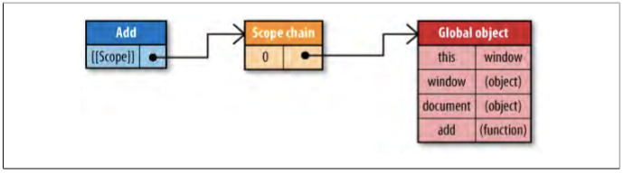

## 严格模式

### 功用

+ 消除Javascript语法的⼀些不合理、不严谨之处，减少⼀些怪异⾏为;
+ 消除代码运⾏的⼀些不安全之处，保证代码运⾏的安全；
+ 提⾼编译器效率，增加运⾏速度；
+ 为未来新版本的Javascript做好铺垫。

### 概述

+ ES6的模块⾃动采⽤严格模式，不管模块头部有没有use strict；
+ 严格模式有以下限制：
  变量必须声明后再使⽤
  函数的参数不能有同名属性，否则报错
  不能使⽤with语句
  不能对只读属性赋值，否则报错
  不能使⽤前缀0表示⼋进制数，否则报错
  不能删除不可删除的属性，否则报错
  不能使⽤delete prop删除变量，会报错，只能删除属性delete global[prop]
  eval不会在它的外层作⽤域引⼊变量
  eval和arguments不能被重新赋值
  arguments不会⾃动反映函数参数的变化
  不能使⽤arguments.callee
  不能使⽤arguments.caller
  禁⽌this指向全局对象
  不能使⽤fn.caller和fn.arguments获取函数调⽤的堆栈
  增加了保留字(⽐如protected,static和interface)

## JavaScript规则

### 声明在最顶部

+ 方便查找

### 初始化变量

+ 避免undefined

### 不声明Number、String、Boolean

+ 将这几个当成值，不要作为对象

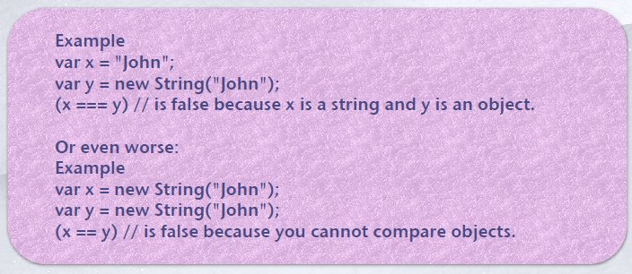

### 不使用new Object()

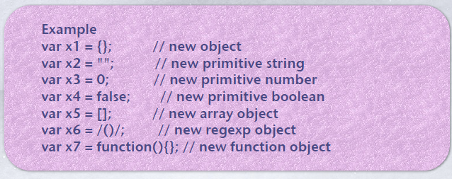

### 注意类型转换

+ number可能被转换成string或NaN

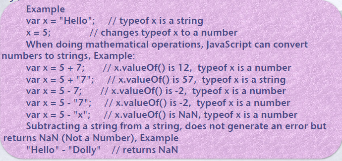

### 使用===

+ ==会先做类型转换
+ ===必须类型与值相匹配

### 默认参数

+ 对所有参数进行默认定义

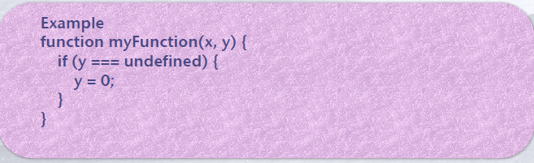

### 能不用库就不用库

+ library一定比原生js慢

## 正则表达式

### 特殊字符

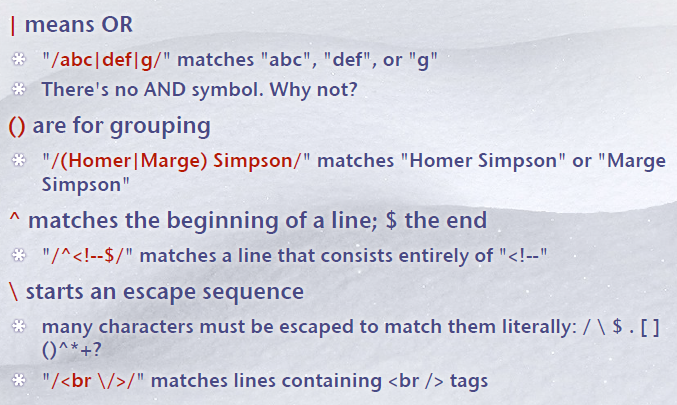

### 数量符

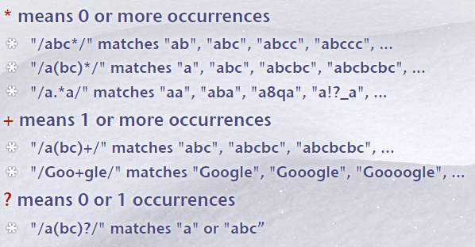

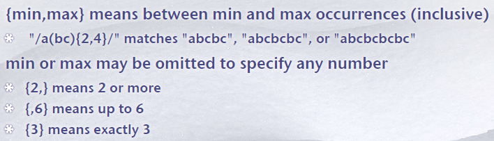

### 字符集

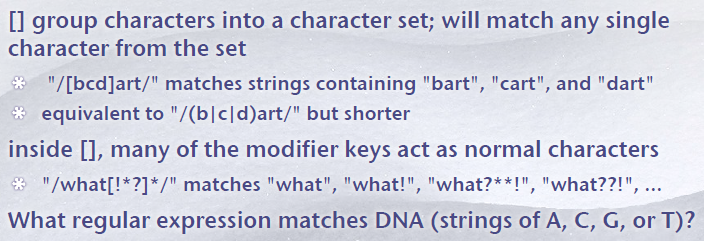

### 字符范围

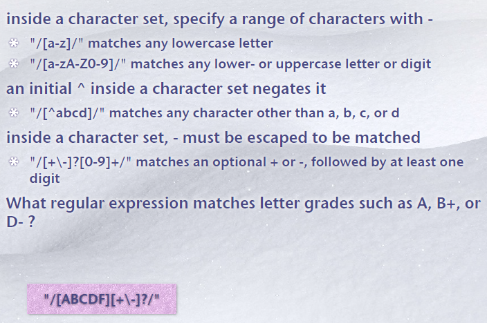

### 顺序

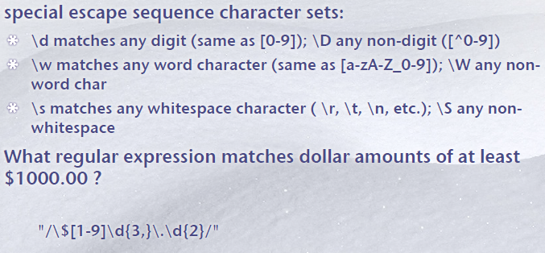

### 使用

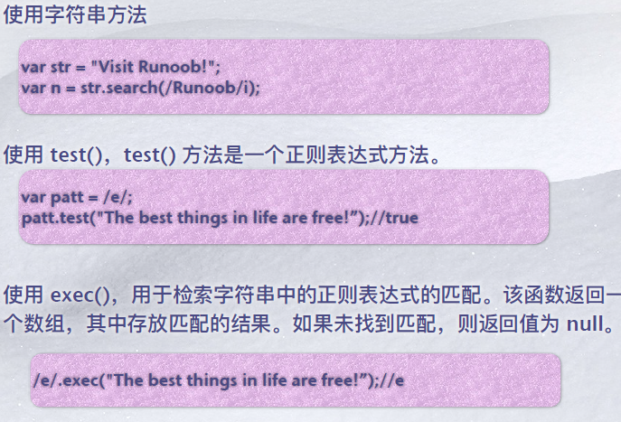

## 函数

### 提升

+ 引擎会在解释JavaScript代码之前⾸先进⾏编译，编译过程中的⼀部分⼯作就是找到所有的声明，并⽤合适的作⽤域将他们关联起来，这也正是词法作⽤域的核⼼内容。
+ 提升（Hoisting）是 JavaScript 将声明移⾄顶部的默认⾏为。
+ 函数提升只会提升函数声明，⽽不会提升函数表达式。

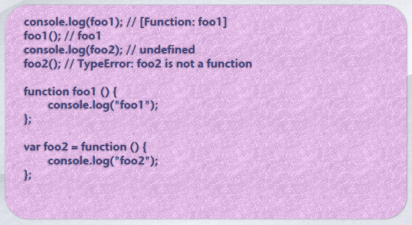

### let和const

+ ES6新增块级作⽤域。这个区块对这些变量从⼀开始就形成了封闭作⽤域，直到声明语句完成，这些变量才能被访问（获取或设置），否则会报错ReferenceError。
+ 暂时性死区（英temporal dead zone，简 TDZ），即代码块开始到变量声明语句完成之间的区域。
+ 通过 let 声明的变量没有变量提升、拥有暂时性死区，作⽤于
  块级作⽤域：
  + 当进⼊变量的作⽤域（包围它的语法块），⽴即为它创建（绑定）存储空间，不会⽴即初始化，也不会被赋值
  + 访问（获取或设置）该变量会抛出异常 ReferenceError
  + 当执⾏到变量的声明语句时，如果变量定义了值则会被赋值，如果变量没有定义值，则被赋值为undefined

### this

+ 在函数体中，⾮显式或隐式地简单调⽤函数时，在严格模式下，函数内的this会被绑定到undefined上，在⾮严格模式下则会被绑定到全局对象window/global上。

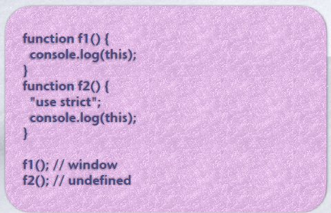

+ this指向最后调⽤它的对象

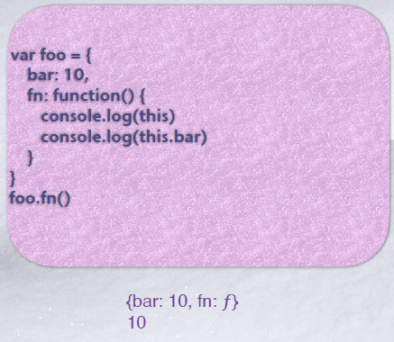

+ 上下文的this

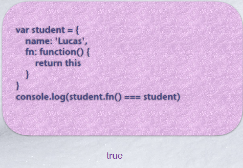

+ ⼀般通过call/apply/bind⽅法显示调⽤函数时，函数体内的this会被绑定到指定参数的对象上。

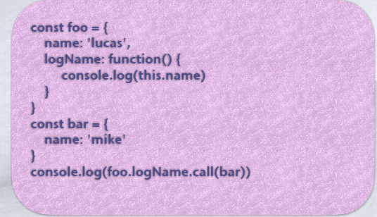