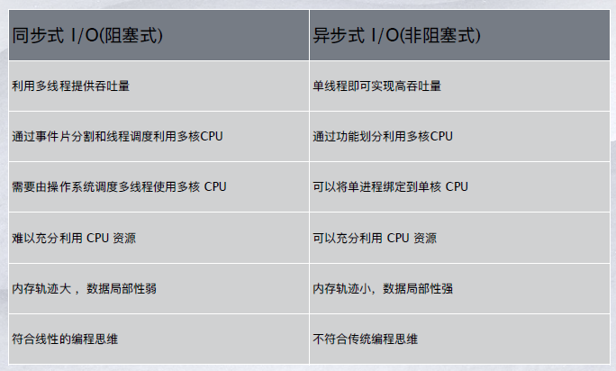
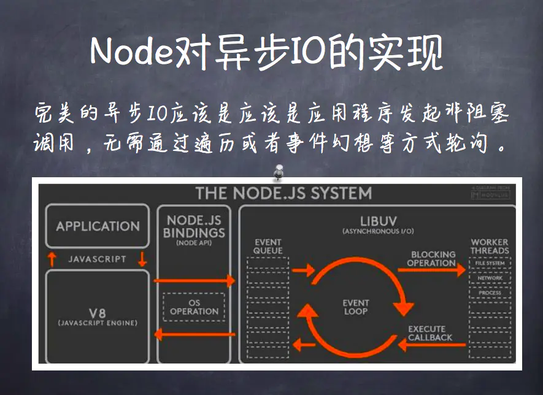
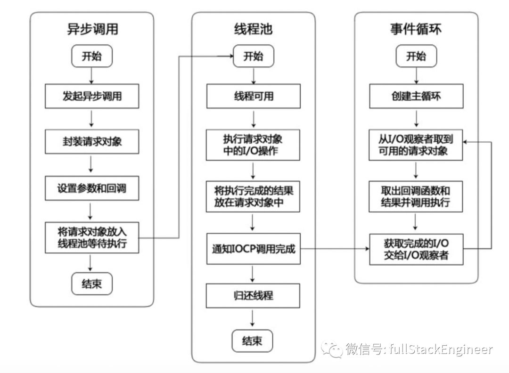

# Node.js

## 简介

### 特点

Node作为一个新兴的前端框架，后台语言，有很多吸引人的地方：

RESTful API

单线程

Node可以在不新增额外线程的情况下，依然可以对任务进行并发处理 —— Node.js是单线程的。它通过事件循环（event loop）来实现并发操作，对此，我们应该要充分利用这一点 —— 尽可能的避免阻塞操作，取而代之，多使用非阻塞操作。

非阻塞IO

V8虚拟机

事件驱动

超过100万的模块

### 应用场景

越来越多的开发者开始转向 Node.js ，⼏乎每个公司/⼩组都会有⾃⼰的命令⾏⼯具、脚⼿架。使⽤ Node.js 能够快速开发各式各样的能极⼤提⾼开发效率的神器。

⽹站（如express/koa等）
im即时聊天(socket.io)
api（移动端，pc，h5）
HTTP Proxy（淘宝、Qunar、腾讯、百度都有）
前端构建⼯具(grunt/gulp/bower/webpack/fis3…)
写操作系统（NodeOS）
跨平台打包⼯具（PC端的electron、nw.js，⽐如钉钉PC客户
端、微信⼩程序IDE、微信客户端，移动的cordova，即⽼的
Phonegap，还有更加有名的⼀站式开发框架ionicframework）
命令⾏⼯具（⽐如cordova、shell.js）
反向代理（⽐如anyproxy，node-http-proxy）

## 基本原理

### 异步IO

#### 比较

#### 实践

当100个用户请求同时被接受到时，当需要IO(网络IO/文件IO)操作时，单线程的javascript并不会停下来等待IO操作完成，而是“事件驱动”开始介入，javascript执行线程继续执行未完的javascript代码，当执行完成后该线程处于空闲状态。

### 事件驱动编程

#### 事件循环

