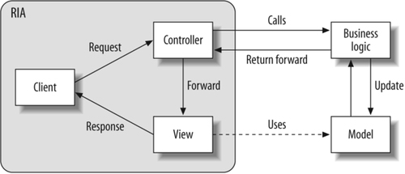
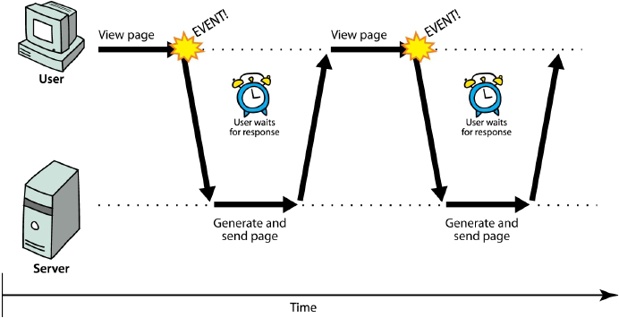
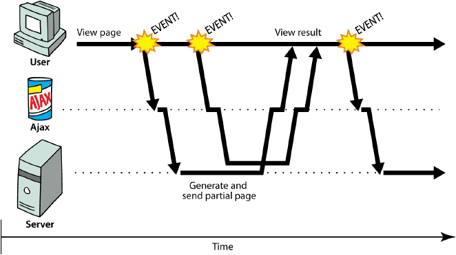
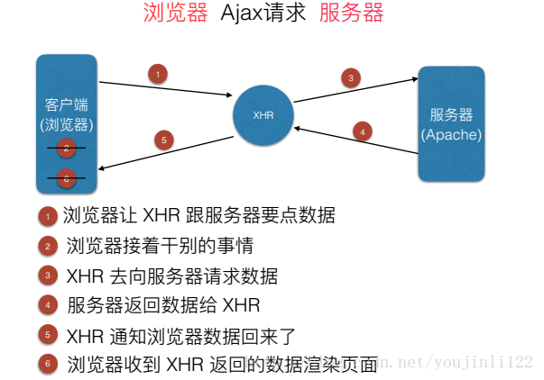
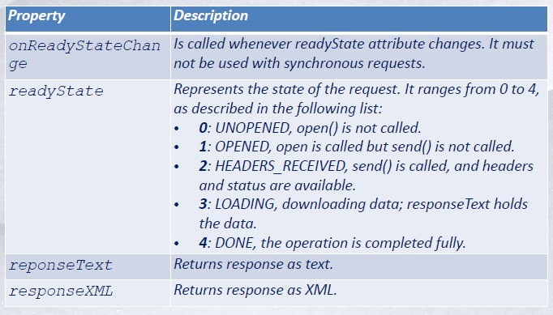

# AJAX

## 名词解释

### RIAs

Rich Internet Applications，丰富互联网应用程序。丰富互联网应用程序是下一代的将桌面应用程序的交互的用户体验与传统的Web应用的部署灵活性和成本分析结合起来的网络应用程序。

## RIAs

丰富互联网应用程序中的富客户技术通过提供可承载已编译客户端应用程序（以文件形式，用HTTP传递）的运行环境，客户端应用程序使用异步客户/服务器架构连接现有的后端应用服务器，这是一种安全、可升级、具有良好适应性的新的面向服务模型，这种模型由采用的Web服务所驱动。

### 架构



### 优点

+ 不需要安装
+ 容易升级
+ 丰富UI
+ 服务端、客户端平衡
+ 异步通信

### 缺点

+ 缺少搜索引擎可视化
+ 缺少与HTML的集成
+ 软件开发复杂性

## Ajax

### 同步通信

+ 使用者要等待新页面加载



### 异步通信

+ 使用者在页面加载时仍可以持续交互



### 优缺点

#### 优点

+ 最大的优点就是页面无需刷新，在页面内与服务器通信，非常好的用户体验。 

+ 使用异步的方式与服务器通信，不需要中断操作。 
+ 可以把以前服务器负担的工作转嫁给客户端，减轻服务器和带宽，可以最大程度减少冗余请求。 
+ 基于标准化的并被广泛支持的技术，不需要下载插件或者小程序。

#### 缺点

+ AJAX干掉了Back和History功能，即对浏览器机制的破坏。 
  在动态更新页面的情况下，用户无法回到前一个页面状态，因为浏览器仅能记忆历史记录中的静态页面。一个被完整读入的页面与一个已经被动态修改过的页面之间的差别非常微妙；用户通常会希望单击后退按钮能够取消他们的前一次操作，但是在Ajax应用程序中，这将无法实现。 
+ 安全问题技术同时也对IT企业带来了新的安全威胁，ajax技术就如同对企业数据建立了一个直接通道。这使得开发者在不经意间会暴露比以前更多的数据和服务器逻辑。ajax的逻辑可以对客户端的安全扫描技术隐藏起来，允许黑客从远端服务器上建立新的攻击。还有ajax也难以避免一些已知的安全弱点，诸如跨站点脚步攻击、SQL注入攻击和基于credentials的安全漏洞等。 
+ 对搜索引擎的支持比较弱。如果使用不当，AJAX会增大网络数据的流量，从而降低整个系统的性能。

### 组成

+ JavaScript
+ DOM
+ CSS
+ XMLHttpRequest

### 工作原理



## XMLHttpRequest

### 对象概述

Ajax功能实现所依赖的对象，Ajax就是通过浏览器的内置对象XHMHttpResquest来发送异步请求的，异步请求不会妨碍客户端的任何操作。 

### 成员变量



### 成员函数


### Ajax请求流程

+ 客户端事件发生，Ex. 按钮点击

+ 创建XHMHttpResquest对象

  ```javascript
  Variable = new XMLHttpRequest();
  Variable = new ActiveXObject("Microsoft.XMLHTTP");//老版本IE
  ```

+ 设置XHMHttpResquest参数

  ```javascript
  xmlhttp.onreadystatechange = function(){
  //process the server response
  };
  ```

+ XHMHttpResquest发送异步请求给服务器端

  ```javascript
  //HTTP GET request without querystring
  xmlhttp.open(‘GET’,’serverpage.php’,true);
  xmlhttp.send(null);
  //HTTP GET request with querystring
  xmlhttp.open(‘GET’,’serverpage.php?
  username=’+Math.random(),true);
  xmlhttp.send(null);
  //HTTP GET request without querystring
  xmlhttp.open(‘GET’,’serverpage.php?
  username=user1&pass=password”,true);
  xmlhttp.send(null);
  //HTTP POST request
  xmlhttp.open(‘POST’,’serverpage.php’,true);
  xmlhttp.send(‘username=user1&pass=password’);
  ```

+ 服务器端发送结果

+ XHMHttpResquest传送结果给客户端

  ```javascript
  xmlhttp.onreadystatechange = function(){
  if (xmlhttp.readyState === 4) {
  // everything is good, the response is received
  if (xmlhttp.status === 200) { // process the response }
  else { // request encountered some problem,
  // for example, the response may contain a HTTP
  404 (Not Found) response code
  }
  } else { // still not ready } };
  ```

## Ajax使用

### 安全性

#### XHMHttpResquest安全限制

+ 不能执行存在磁盘的页面
+ 只能运行存在web服务器的页面

#### Two-request limit

+ 只能限制两个服务器连接

### 跨域

#### 原理

- 浏览器的限制，出于安全考虑。前台可以正常访问后台，浏览器多管闲事报跨域问题，但其实前台已经访问到后台了。
- 跨域，协议、域名、端口任何一个不一样浏览器就认为是跨域。
- XHR（XMLHttpRequest）请求，因为ajax是XHR请求，浏览器就会捕捉跨域问题。

#### 简单请求和非简单请求

- 简单请求 GET HEAD POST，请求header里面：无自定义头，Content-Type为以下几种：text/plain，multipart/form-data，application/x-www-form-urlencoded。
- 非简单请求 put,delete方法的ajax请求，发送json格式的ajax请求，带自定义头的ajax请求。

#### 解决思路

- 让浏览器不做限制，指定参数，让浏览器不做校验，但该方法不太合理，它需要每个人都去做改动。
- 不要发出XHR请求，这样就算是跨域，浏览器也不会报错，解决方案是JSONP，通过动态创建一个script，通过script发出请求。
- 在跨域的角度：一种是被调用方修改代码，加上字段，告诉浏览器，支持跨域，支持调用。
- 通过nginx代理方式，在a域名里面的的请求地址使用代理指定到b域名。

### 数据格式

#### XML

+ 额外互用性（对客户端和服务器端都有良好支持性）
+ 严格格式
+ 容易无效化
+ 高效的Ajax不使用

#### JSON

+ 轻量级、易于分析数据

#### 