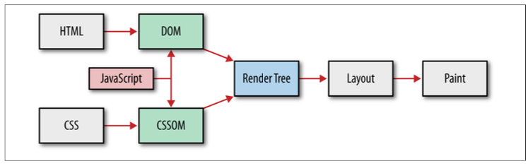
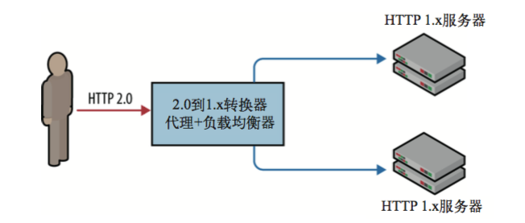

# 优化

## 名词解释

### SEO

Search Engine Optimization，搜索引擎优化。利用搜索引擎的规则提高网站在有关搜索引擎内的自然排名。目的是让其在行业内占据领先地位，获得品牌收益。很大程度上是网站经营者的一种商业行为，将自己或自己公司的排名前移。

### WPO

web performance optimization，web性能优化。⽹站越快,⽤户的黏性越⾼;（参与度）。⽹站越快,⽤户忠诚度更⾼; （留存率）。⽹站越快,⽤户转化率越⾼。

### CDN

Content Delivery Network，即内容分发网络。CDN是构建在现有网络基础之上的智能虚拟网络，依靠部署在各地的边缘服务器，通过中心平台的负载均衡、内容分发、调度等功能模块，使用户就近获取所需内容，降低网络拥塞，提高用户访问响应速度和命中率。CDN的关键技术主要有内容存储和分发技术。

## 优化思路

### 性能要点

+ 延迟和带宽对 Web 性能的影响;
+ 传输协议(TCP)对 HTTP 的限制;
+ HTTP 协议⾃身的功能和缺陷;
+ Web 应⽤的发展趋势及性能需求;
+ 浏览器局限性和优化思路。
+ 不同层之间总是相互依赖， 但优化⽅式却有很多可能性。任何优化建议和最佳做法都不是⼀成不变的，涉及的每个要素都是动态发展的:
  + 浏览器越来越快
  + ⽤户上⽹条件不断改善
  + Web 应⽤的功能和复杂度也与⽇俱增

### 渲染阻塞

+ 渲染阻塞（render-blocking）
  + “有东⻄阻⽌了屏幕上节点的实际绘制”
+ 应该尽快将 HTML 和 CSS 提供给客户端，以优化应⽤程序的⾸次渲染时间。

### JS执行

+ 每当浏览器遇到脚本标签时，DOM 构造就会暂停！整个 DOM 构建过程都将停⽌，直到脚本执⾏完成。
  + JavaScript 可以同时修改 DOM 和 CSSOM
+ async

### 优化三大任务

+ 获取资源
+ 页面渲染
+ JS执行

## 测试

### 基准测试

#### 问题

+ 场景及⻚⾯选择:很难重复真实⽤户的导航模式;
+ 浏览器缓存:⽤户缓存不同，性能差别很⼤;
+ 中介设施:中间代理和缓存对性能影响很⼤;
+ 硬件多样化:不同的 CPU、GPU 和内存⽐⽐皆是;
+ 浏览器多样化:各种浏览器版本，有新有旧;
+ 上⽹⽅式:真实连接的带宽和延迟可能不断变化。

### 性能监控

#### FP（全称“First Paint”，“⾸次绘制”）

+ 对于应⽤⻚⾯，⾸次出现视觉上不同于跳转之前内容的时间点，或者说是⻚⾯发⽣第⼀次绘制的时间点。

#### FCP（全称“First Contentful Paint”，“⾸次内容绘制”）

指浏览器完成渲染DOM中第⼀部分内容（可能是⽂本、图像或其他任何元素）的时间点，此时⽤户应该在视觉上有直观的感受。

+ 注意：只有⾸次绘制⽂本、图⽚（包含背景图）、⾮⽩⾊的canvas或SVG时才被算作FCP。

#### FP与FCP这两个指标之间的主要区别

+ FP是当浏览器开始绘制内容到屏幕上的时候，只要在视觉上开始发⽣变化，⽆论是什么内容触发的视觉变化，在这⼀刻，这个时间点，叫做FP。
+ 相⽐之下，FCP指的是浏览器⾸次绘制来⾃DOM的内容。例如：⽂本，图⽚，SVG，canvas元素等，这个时间点叫FCP。
+ FP和FCP可能是相同的时间，也可能是先FP后FCP。

#### FMP（全称“First Meaningful Paint”，翻译为“⾸次有意义绘制”） 

+ 指⻚⾯关键元素的渲染时间。

+ 没有标准化定义，因为关键元素可以由开发者⾃⾏定义。
+ FMP本质上是通过⼀个算法来猜测某个时间点可能是FMP，所以有时候不准。

#### ⾸屏时间

+ 进⼊⻚⾯之后，应⽤渲染完成整个⼿机屏幕（未滚动之前）内容的时间。

+ 业界对于这个指标没有确切定论，⽐如是否包含屏幕内图⽚的渲染完成时间。

#### ⽤户可交互时间

+ ⽤户可以与应⽤进⾏交互的时间。

+ ⼀般来说，是DOMReady的时间，因为通常会在这时绑定事件操作。
+ 如果⻚⾯中涉及交互的脚步没有下载完成，那么当然没有到达所谓的⽤户可交互时间。

#### 总下载时间

+ ⻚⾯所有资源加载完成所需要的时间。

+ ⼀般可以统计window.onload时间，这样可以统计出同步加载的资源全部加载完的耗时。
+ 如果⻚⾯中存在较多的异步渲染，那么可以将异步渲染全部完成的时间做为总下载时间。

#### ⾃定义指标

+ 由于应⽤特点不同，可以根据需求⾃定义时间。

+ ⽐如，⼀个类似Instagram的⻚⾯由图⽚瀑布流组成，那么可能⾮常关⼼屏幕中第⼀排图⽚渲染完成的时间。

## 优化

### Performance接口

+ Performance 接⼝可以获取到当前⻚⾯中与性能相关的信息。它是High Resolution Time API 的⼀部分，同时也融合了 Performance Timeline API、Navigation Timing API、 User Timing API 和 Resource Timing API。
+ 该类型的对象可以通过调⽤只读属性 Window.performance 来获得。
+ 功能强⼤，但并不适⽤于所有场景。
  + ⽐如，如果在单⻚应⽤中改变URL但不刷新⻚⾯（单⻚应⽤的典型路由⽅案），那么使⽤window.performance.timing所获取的数
    据是不会更新的，还需要开发者重新设计统计⽅案。同时，window.performance.timing可能⽆法满⾜⼀些⾃定义的数据。

### 浏览器优化

+ 可⾏的优化⼿段会因浏览器⽽异，但从核⼼优化策略来说，可以宽泛地分为两类：
  + 基于⽂档的优化：熟悉⽹络协议，了解⽂档、CSS 和 JavaScript 解析管道，发现和优先安排关键⽹络资源，尽早分派请求并取得⻚⾯，使其尽快达到可交互的状态。主要⽅法是优先获取资源、提前解析等。
  + 推测性优化：浏览器可以学习⽤户的导航模式，执⾏推测性优化，尝试预测⽤户的下⼀次操作。然后，预先解析DNS、预先连接可能的⽬标。

#### 四种技术

+ 资源预取和排定优先次序：⽂档、CSS 和 JavaScript 解析器可以与⽹络协议层沟通，声明每种资源的优先级:初始渲染必需的阻塞资源具有最⾼优先级，⽽低优先级的请求可能会被临时保存在队列中。
+ DNS预解析：对可能的域名进⾏提前解析，避免将来 HTTP 请求时的 DNS 延迟。预解析可以通过学习导航历史、⽤户的⿏标悬停，或其他⻚⾯信号来触发。
+ TCP预连接：DNS 解析之后，浏览器可以根据预测的 HTTP 请求，推测性地打开TCP 连接。 如果猜对的话，则可以节省⼀次完整的往返(TCP 握⼿)时间。
+ ⻚⾯预渲染：某些浏览器可以让我们提示下⼀个可能的⽬标，从⽽在隐藏的标签⻚中预先渲染 整个⻚⾯。这样，当⽤户真的触发导航时，就能⽴即切换过来。

### 猜测优化

+ 预解析特定的域名
  \<link rel="dns-prefetch" href="//hostname_to_resolve.com">
+ 预取得⻚⾯后⾯要⽤到的关键性资源
  <link rel=“subresource" href="/javascript/myapp.js">
+ 预取得将来导航要⽤的资源
  <link rel=“prefetch" href="/images/big.jpeg">
+ 根据对⽤户下⼀个⽬标的预测，预渲染特定⻚⾯
  <link rel="prerender"href="//example.org/next_page.html">

## 实践

### 准则

+ 消除或减少不必要的⽹络延迟
+ 将需要传输的数据压缩⾄最少。

### 优化方向

+ 减少DNS查询
+ 减少TCP连接
+ 最小化HTTP请求次数
+ 使用CDN
+ 裁剪不必要资源
+ 将客户端资源放在cache
+ 压缩转移数据
  + 文字数据在用Gzip压缩后可以减少60%-80%
  + 图片数据可以通过裁剪metadata和重新裁剪大小来压缩
+ 裁剪HTTP请求大小
  + HTTP1.x不对数据进行压缩
  + HTTP2.0压缩了，但大小仍然很高
+ 平行化请求和回复过程
  + 确保服务端有足够资源可以承载平行请求和回复
+ 对特定的协议优化

#### 针对HTTP1.x优化

+ 针对 HTTP 1.x 的优化次序很重要：⾸先要配置服务器以最⼤限度地保证 TCP 和 TLS 的性能最优，然后再谨慎地选择和采⽤移动及经典的应⽤最佳实践,之后再度量，迭代。

+ 采⽤了经典的应⽤优化措施和适当的性能度量⼿段,还要进⼀步评估是否有必要为应⽤采取特定于 HTTP 1.x 的优化措施(其实是权宜之计)。

  + 利⽤HTTP管道
    如果你的应⽤可以控制客户端和服务器这两端,那么使⽤管道可以显著减少⽹络 延迟。

  + 采⽤域名分区
    如果你的应⽤性能受限于默认的每来源 6 个连接,可以考虑将资源分散到多个来源。

  + 打包资源以减少HTTP请求
    拼接和精灵图等技巧有助于降低协议开销，⼜能达成类似管道的性能提升。

  + 嵌⼊⼩资源
    考虑直接在⽗⽂档中嵌⼊⼩资源，从⽽减少请求数量。

+ 管道缺乏⽀持,⽽其他优化⼿段⼜各有各的利弊。事实上,这些优化措施如果过于 激进或使⽤不当,反倒会伤害性能(这⼀点请参考第 11 章的深⼊讨论)。总之,要 有务实的态度,通过度量来评估各种措施对性能的影响,在此基础上再迭代改进。 天底下就没有包治百病的灵丹妙药！！！

#### 针对HTTP2.0的优化

+ HTTP 2.0 的主要⽬标就是提升传输性能,实现客户端与服务器间较低的延迟和较⾼的吞吐量。显然,在 TCP和 TLS 之上实现最佳性能,同时消除不必要的⽹络延迟, 从来没有如此重要过。
  + 服务器的初始 cwnd 应该是 10 个分组; TCP的拥塞控制主要原理依赖于⼀个拥塞窗⼝(cwnd)来控制，在之前我们还讨论过TCP还有⼀个对端通告的接收窗⼝(rwnd)⽤于流量控制。
  + 服务器应该通过 ALPN(针对 SPDY 则为 NPN)协商⽀持 TLS;
    + ALPN（Application Layer Protocol Negotiation，应⽤层协议协商），ALPN 是客户端发送所⽀持的 HTTP 协议列表，由服务端选择；
    + NPN（Next Protocol Negotiation，下⼀代协议协商） 是服务端发送所⽀持的 HTTP 协议列表，由客户端选择。
  + 服务器应该⽀持 TLS 恢复以最⼩化握⼿延迟。
+ 要通过 HTTP 2.0 获得最佳性能,特别是从每个来源仅⽤⼀个连接的⻆度说,的确需要各层协议的紧密配合。接下来,或许有点意外,那就是采⽤移动及其他经典的最佳做法: 少发数据、削减请求,根据⽆线⽹络情况调整资源供给。不管使⽤什么版本的协议,减少传输的数据量和消除不必要的⽹络延迟,对任何应⽤都是最有效的
  优化⼿段。
+ 最后,杜绝和忘记域名分区、⽂件拼接、图⽚精灵等不良的习惯,这些做法在 HTTP 2.0 之上完全没有必要。事实上,继续使⽤这些⼿段反⽽有害!可以利⽤ HTTP 2.0 内置的多路分发以及服务器推送等新功能。

#### 去掉针对1.x的优化

+ 每个来源使⽤⼀个连接
  HTTP 2.0 通过将⼀个 TCP 连接的吞吐量最⼤化来提升性能。事实上,在 HTTP2.0 之下再使⽤多个连接(⽐如域名分区)反倒成了⼀种反模式,因为多个连接 会抵消新协议中⾸部压缩和请求优先级的效⽤。
+ 去掉不必要的⽂件合并和图⽚拼接
  打包资源的缺点很多,⽐如缓存失效、占⽤内存、延缓执⾏,以及增加应⽤复杂性。有了 HTTP 2.0,很多⼩资源都可以并⾏发送,导致打包资源的效率反⽽更低。
+ 利⽤服务器推送
  之前针对 HTTP 1.x ⽽嵌⼊的⼤多数资源,都可以⽽且应该通过服务器推送来交付。这样⼀来,客户端就可以分别缓存每个资源,并在⻚⾯间实现重⽤,⽽不必 把它们放到每个⻚⾯⾥了。
+ 要获得最佳性能,应该尽可能把所有资源都集中在⼀个域名之下。域名分区在 HTTP2.0 之下属于反模式,对发挥协议的性能有害:分区是开始,之后影响会逐渐扩散。打包资源不会影响 HTTP 2.0 协议本身,但对缓存性能和执⾏速度有负⾯影响。

#### HTTP1.x和HTTP2.0兼容

+ 相同的应⽤代码,双协议部署
  相同的应⽤代码可能通过 HTTP 1.x 也可能通过 HTTP 2.0 交付。可能任何⼀种协议之下都达不到最佳性能,但可以追求性能⾜够好。所谓⾜够好,需要通过针对每⼀种应⽤单独度量来保证。这种情况下,第⼀步可以先撤销域名分区以实现 HTTP 2.0 交付。然后,随着更多⽤户迁移到 HTTP 2.0,可以继续撤销资源打包并尽可能利⽤服务器推送。
+ 分离应⽤代码,双协议部署
  根据协议不同分别交付不同版本的应⽤。这样会增加运维的复杂性,但实践中对很多应⽤倒是⼗分可⾏。⽐如,⼀台负责完成连接的边界服务器可以根据协商后的协议版本,把客户端请求引导⾄适当的服务器。
+ 动态HTTP 1.x和HTTP 2.0优化
  某些⾃动化的 Web 优化框架,以及开源及商业产品,都可以在响应请求时动态重写交付的应⽤代码(包括连接、拼合、分区,等等)。此时,服务器也可以考虑协商的协议版本,并动态采⽤适当的优化策略。
+ HTTP 2.0,单协议部署如果应⽤可以控制服务器和客户端,那没理由不只使⽤ HTTP 2.0。事实上,如果真有这种可能,那就应该专⼀使⽤ HTTP 2.0。

### 指标

1. ⽹⻚级指标(Page-level Metrics)
这些是为整个⻚⾯捕获并显示的顶级度量值。
2. 整⻚加载时间(Load Time)
测量的时间是从初始化请求，到开始执⾏window.onload事件。
3. ⻚⾯所有元素加载时间(Fully Loaded)
从初始化请求，到Document Complete后，2秒内（中间⼏百毫秒轮询）没有⽹络活动的时间，但这2秒是不包括在测量中的，所以会出现两个差值⼤于或⼩于2秒。
4. 第⼀个字节加载时间(First Byte)
第⼀个字节时间（通常缩写为TTFB）被测量为从初始化请求，到服务器响应的第⼀个字节，被浏览器接收的时间（不包括DNS查询、TCP连接的时间）。
5. ⻚⾯渲染时间(Start Render)
测量的时间是从初始化请求，到第⼀个内容被绘制到浏览器显示的时间。在瀑布图中有两个参数指标Start Render和msFirstPaint。
Start Render是通过捕获⻚⾯加载的视频，并在浏览器第⼀次显示除空⽩⻚之外的其他内容时查看每个帧来衡量的。它只能在实验室测量，通常是最准确的测量。
msFirstPaint（IE专⽤属性）是由浏览器本身报告的⼀个测量，它认为绘制的第⼀个内容。通常是相当准确，但有时它报告的时候，浏览器只画⼀个空⽩屏幕。
6. ⾸屏展现平均值(Speed Index)
表示⻚⾯呈现⽤户可⻅内容的速度（越低越好）。有关如何计算的更多信息，请参⻅：Speed Index。
7. DOM元素数量(DOM Elements)
在测试结束时测试⻚⾯上的DOM元素的计数。
8. 请求级度量标准(Request-level Metrics)
这些是为每个请求捕获和显示的度量。

## Netflix优化

### 概念

+ 密切关注 JavaScript 的开销
+ Netflix 的折中⽅案是，使⽤ React 在服务器端渲染登录⻚⾯，但同时也为注册过程的其他部分预取 React 代码。这不仅优化了⾸次加载性能，还优化了注册过程其余部分的加载时间，因为它是单⻚应⽤，所以有更⼤的 JS 包需要下载。

### 预加载

+ 通过浏览器内置的 API 和 XHR 预加载
+ 交互时间减少了 30%

### 减少JS传输

+ 移植到原⽣ JavaScript 的组件列表：
  + 基础交互（主⻚选项卡）
  + 语⾔切换器
  + “Cookie 横幅（Cookie banner）”（针对⾮美国⽤户）
  + 客户端⽇志分析
  + 性能度量和记录
  + ⼴告归属检测引导代码（出于安全考虑，放在沙箱式 iFrame 中）