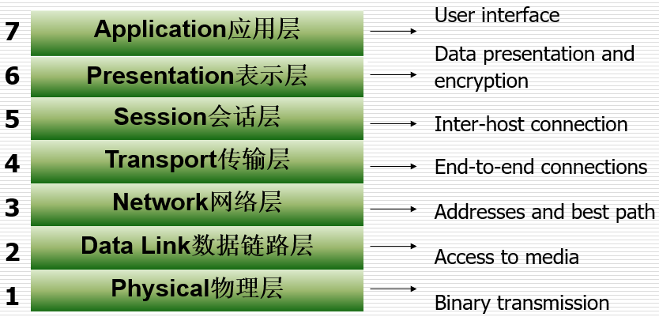
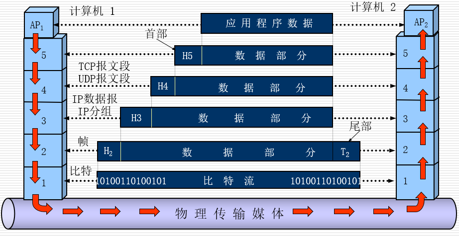
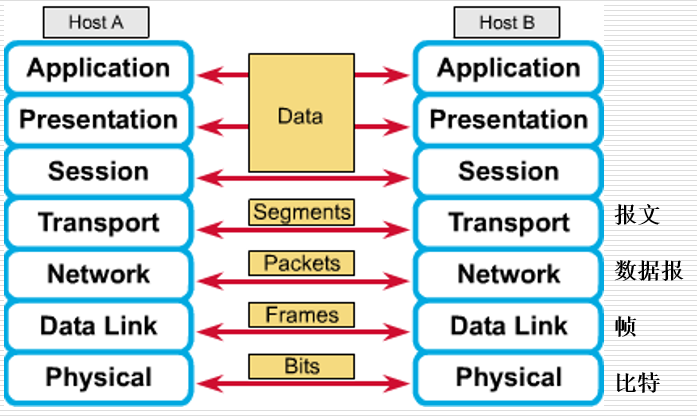
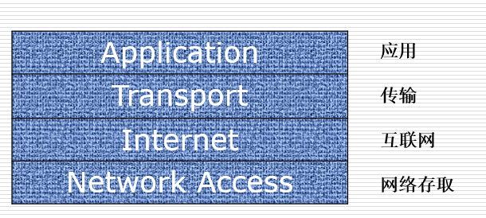
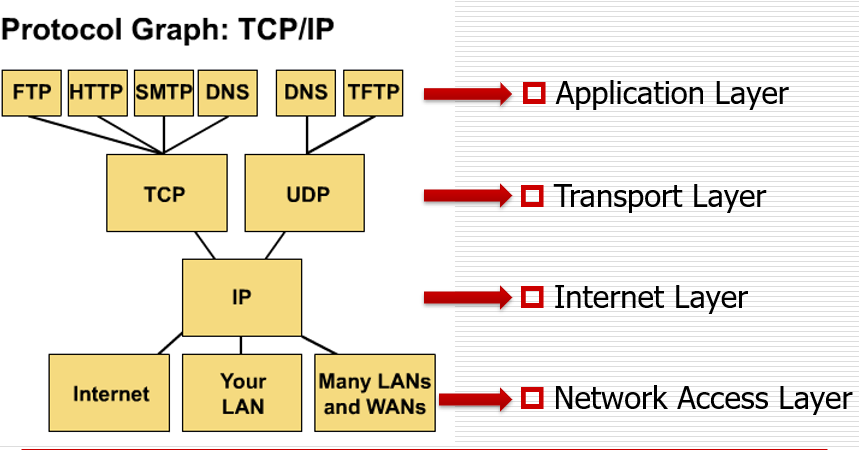
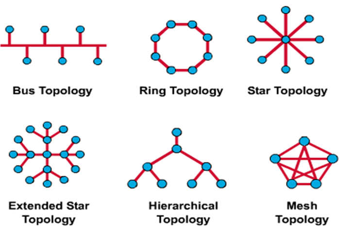

# Computer Network & Network Reference Model

## Overview of Computer Network

### Network

#### 什么是网络？

+ 计算机网络是能够相互（资源共享）的互连起来的自治计算机系统的集合。

#### 网络组成

+ 若干个主机。它们向各用户提供服务。
+ 一个通信子网。它由一些专用的结点交换机和连接这些结点的通信链路所组成。
+ 一系列的协议。这些协议是为在主机之间或主机和子网之间的通信而用的。

### LAN

#### 名词解释

+ Local Area Networks 局域网

#### 概念

+ 指在某一区域内由多台计算机互联成的计算机组。

+ 多用户复用同一个介质、高速、错误率容易控制

#### 设备

+ Hub（集线器）
  + 工作于第一层（物理层）
  + 多端口中继器
  + 对信号进行整形放大，扩大网络传输距离
+ Bridge（网桥）
  + 工作于第二层（数据链路层）s
  + 基于MAC地址分段
  + 对帧进行转发，将多个网段在数据链路层连接起来
+ Switch（交换机）
  + 工作与第二层（数据链路层）
  + 多端口网桥，大规模集成电路
+ Router（路由器）
  + 工作于第三层（网络层）
  + 基于逻辑的IP地址做选择

### WAN

#### 名词解释

+ Wide Area Networks 广域网

#### 概念

+ 指一种跨地区的数据通讯网络,通常包含一个国家或地区。
+ 低速、错误率不容易控制

#### 设备

+ Router（路由器）

  + 与局域网相似

+ Modem CSU/DSU TA/NT1（调制解调器）

  + 模拟数字信号，远程局域网连接
  + 用modem做点，进行点对点连接
  + CSU - Channel Service Unit：通道服务单元；把终端用户和本地数字电话环路相连的数字接口设备。

  + DSU - Data Service Unit：数据服务单元；指的是用于数字传输中的一种设备，它能够把DTE设备上的物理层接口适配到T1或者E1等通信设施上。

### LAN V.S. WAN

 #### 服务

+ LAN

  + Ethernet：以太网；最受欢迎的服务。

+ WAN

  + ISDN - Integrated Services Digital Network：综合业务数字网；以电话综合数字网为基础发展成的通信网，能提供端到端的数字连接，用来承载包括话音和非话音在内的多种电信业务。

  + DSL - Digital Subscriber Line：数字用户线路；以铜电话线为传输介质的点对点传输技术

  + ATM - Asynchronous Transfer Mode：异步传输模式；具有分组交换和电路交换的优点，对应于OSI协议参考模型的第2层。ATM通过AAL层适配，将不同业务应用接纳进来。

  + Frame Relay - 帧中继：是一种用于连接计算机系统的面向分组的通信方法。它主要用在公共或专用网上的局域网互联以及广域网连接。大多数公共电信局都提供帧中继服务，把它作为建立高性能的虚拟广域连接的一种途径。

  + SONET - synchronous optical network：同步光网络；美国的光传送网标准。

  + SDH - Synchronous Digital Hierarchy：同步数字体系；SONET应用在美国和加拿大，SDH应用在世界其他国家。

### Internet

#### 概念

+ Internet：互联网；指当前全球最大的、最开放的由众多网络相互连接而成的特定互连网，它采用TCP/IP协议族作为通信的规则，且其前身是美国的ARPANET。
+ internet：互连网；泛指多个计算机网络互连而成的计算机网络。
+ ISP - Internet Service Provider：互联网服务提供者/互联网服务提供商；向广大用户综合提供互联网接入业务、信息业务、和增值业务的电信运营商。

### 网络相关用语

#### 概念

+ Data：数据；数据是二进制序列的表示。数据本身不是信息。相同数据用不同解析方式会得到不同信息。
+ information：信息是其所表示意义的解释
+ signal：信号是传输过程中电信号的表示形式。

+ Protocol：协议；协议定义消息传输和传递的详细方式。不同OS可共用同一个协议。

+ Data Packets：数据分组；对传输方来说， 计算机数据通常被分解成小的、易传输的单元，称为数据分组。
+ Source and Destination：报文需系带源地址与目的地址。
+ Media：介质，传递报文的材料
+ Digital Bandwidth：带宽，传输能力度量。（bits/second（bps））
+ Throughput：通量，现实中最大速度通常不是带宽，而是通量，通量小于等于带宽。

## OSI Reference Model

### OSI

#### 名词解释

+ OSI - Open System Interconnection：开放式系统互联；该模型定义了不同计算机互联的标准，是设计和描述计算机网络通信的基本框架。

#### 分层

+ 根据功能划分

#### 应用层

+ 上三层
+ 处理用户程序涉及的部分

#### 数据流层

+ 下四层
+ 负责网络通讯
+ 由硬件和操作系统完成

### 七层简介

#### 第一层：物理层

+ 关键字：signal、media
+ 点到点的控制
+ 定义规格和硬件规范

#### 第二层：数据链路层

+ 关键字：frame、media access control
+ 提供了物理链路中可靠的数据传输
+ 第一层不做逻辑判断，第二层检查是否正确
+ 第二层只能做局域访问、点对点通讯

#### 第三层：网络层

+ 关键字：Path selection、Routing、Addressing
+ 设备到设备的连接

+ 在信息发送时提供了两个终端设备之间的连通性和路径选择
+ 基于IP地址做逻辑定位

#### 第四层：传输层

+ 关键字：Reliability、Flow control、Error correction
+ 终端进程到终端进程
+ 路由器不做复杂数据校验，而是终端来做。
+ 负责传输可靠性和质量控制
+ 将数据校验、段整合后交给上层应用

#### 第五层：会话层

+ 关键字：Dialog and Conversations
+ 应用程序根据自己的逻辑设定会话，控制不同进程
+ 检查点：对文件块做标记
+ 管理表示层实体之间的数据交换

#### 第六层：表示层

+ 关键字：Common Format
+ 操作系统不同，如果以各自标准进行通讯，则会有歧义
+ 确保不同操作系统的数据在应用层可读。
+ 主要负责数据结构和数据传输语法的标准

#### 第七层：应用层

+ 关键字：Browser
+ 提供用户网络服务

### 各层数据

#### 数据封装

#### 点对点通讯（P2P协议）

## TCP/IP Model

### TCP/IP

#### 名词解释

+ TCP - Transmission Control Protocol：传输控制协议
+ UDP - User Datagram Protocol：用户数据电报协议
+ IP - Internet protocol：互联网协议
+ FTP - File Transfer Protocol：文件传输协议
+ HTTP - Hypertext Transfer Protocol：超文本传输协议
+ SMTP - Simple Mail Transfer protocol：简单邮件传输协议
+ DNS - Domain Name System：域名系统
+ TFTP - Trivial File Transfer Protocol：简单文件传输协议

#### 分层

#### 应用层

+ OSI上三层
+ 处理高层拓扑、显示问题、编码和通话控制。

#### 传输层

+ OSI第四层
+ 处理可靠性、流控制、纠错的服务质量问题，将应用层信息打包成段。

#### 互联网层

+ OSI第三层
+ 透过路由器保证最佳路径的决断和包转移

#### 网络存储层

+ OSI下两层
+ 网络与主机的交互

#### 协议

### TCP/IP V.S. OSI

#### 相同点

+ 分治法
+ 基于报文交换

#### 不同点

+ 层数
+ TCP/IP因为是Internet的报文标准，所以人们更常使用TCP/IP

## Network Topology

### Topology

#### 简介

+ 定义网络结构
+ 物理拓扑：节点和链接的形状
+ 逻辑拓扑：介质怎样被host访问

#### 拓扑种类

### 总线拓扑

#### 物理特征

+ 与早期同轴电缆的结构类似
+ 优点：所有节点 之间都能直接通信 。
+ 缺点：如果线缆上的一点断开， 会影响到所有两边的节点。

#### 逻辑特征

+ 广播式传输
+ 有两个介质同时发出请求时要控制

### 环形拓扑

#### 物理特征

+ 只能往同一个方向传数据

#### 逻辑特征

+ 每个节点都可收数据，但是发送数据需要在指定的token，保证每个节点都可在可控时间周期之内发送数据

### 双环形拓扑

#### 特征

+ 每次只用一环，内环是备用
+ 在环形拓扑的基础上增加一个 冗余环路， 提高了可靠性和灵活性。

### 星形拓扑

#### 物理特征

+ 一个中心节点
+ 优点：允许所有节点方便地交流，有较好的安全性和接入控制。
+ 缺点：中间节点崩溃会使整个网络崩溃，冲突也会是一个严重的问题。

#### 逻辑特征

+ 中心点负担大
+ 所有信息流都会通过一个设备

### 树形拓扑

#### 物理特征

+ 树形分层（二叉树、骨干树）

#### 逻辑特征

+ 节点有逻辑层次关系（权限大小）

### 网络拓扑

#### 物理特征

+ 优点：连通性和可靠性最好。
+ 缺点：介质和连接的数量无法控制。

#### 逻辑特征

+ 适用于大量设备（Internet是用网络拓扑）

### 细胞拓扑

#### 物理特征

+ 用于无线网（节点经常移动）

#### 逻辑特征

+ 节点之间直接沟通

## Network Devices

### LAN Devices in a Topology

#### 名词解释

+ NICs - Network Interface Card：网卡

#### 设备

+ 中间设备：路由器
+ 终端设备：PC、服务器

### 第一层

#### Media（介质）

+ 将数据变成01信号并作传播

#### Repeaters（中继器）

+ 将信号识别并放大
+ 去除噪音
+ 整理 、放大并重发信号， 不做过滤 ，不划分冲突域 。

#### Hubs（集线器）

+ 强的中继器（端口不同）
+ 多端口的中继器， 整理、放大并复制电信号 向所有端口转发，不做过滤，不划分冲突域 。
+ 逻辑上是总线，物理上是星形

### 第二层

#### NICs（网卡）

+ 主板上有MAC地址
+ 接受和发送数据
+ 实现串行信号和并行信号之间的转换。（网线：串行通信）

#### Bridges（网桥）

+ 通过 MAC地址判断，维护 MAC地址表，划分冲突域。
+ 两个端口
+ 在OSI模型中，第三层网络层负责IP地址，第二层数据链接层则负责MAC地址

#### Switches（交换机）

+ 建立两个端口间的临时通路
+ 基于硬件来做转发
+ 与Hub不同，逻辑上也是星形拓扑

#### Router（交换机）

+ 网段的划分
+ 路径选择与交换报文