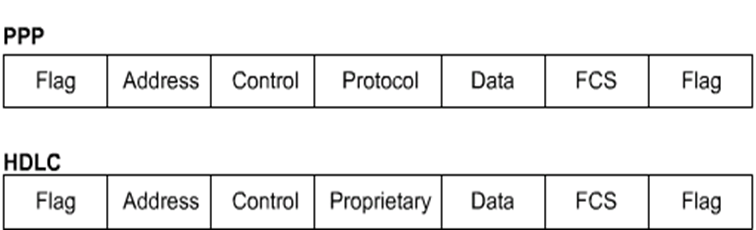
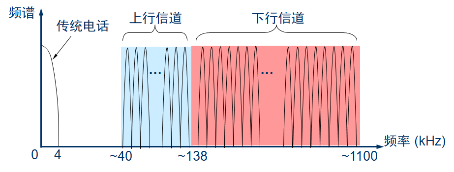
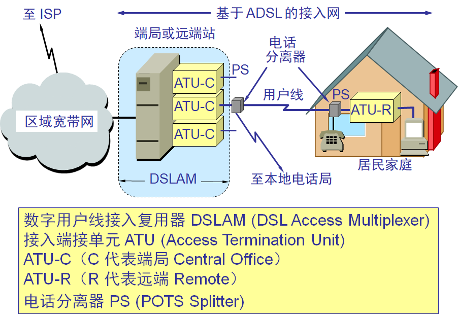
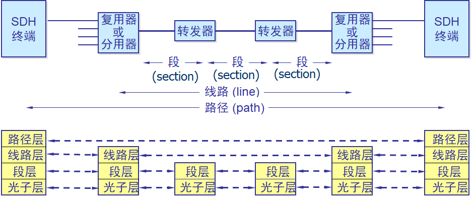
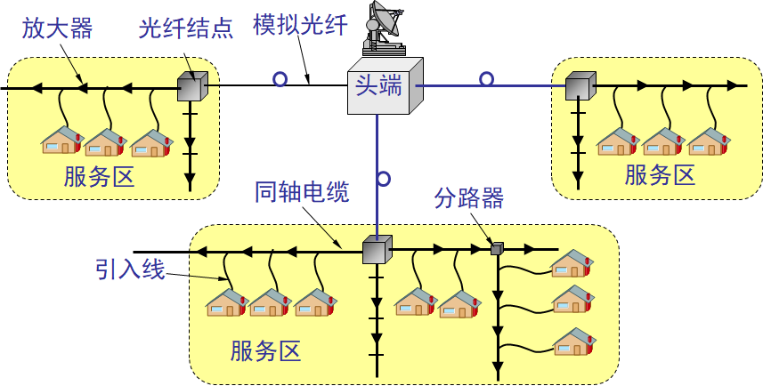
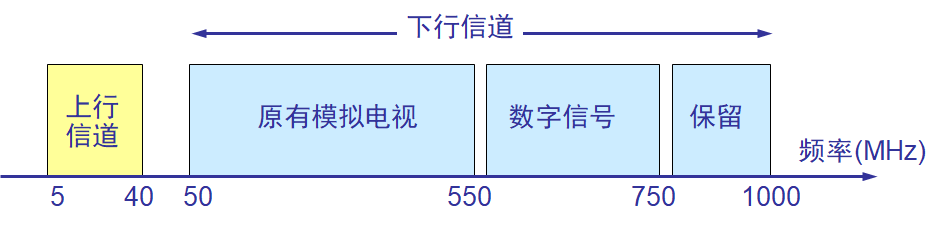

# WANs

## WAN Technology & Devices

### Technology

#### 名词解释

* WSP - WAN Service Provider：WAN服务提供者

* Toll Network: 长途网络，广域网云中的交换机/主干线路的集合

* CO - Central Office：中心局

  广域网服务提供者的设备所在地

* CO Switch：中心局交换机，离用户最近的WSP服务

* CPE - Customer Premise Equipment：用户端设备，比如CSU/DSU等

* Demarcation：边界，LAN和WAN的分界线

* Local loop：本地回路，CPE连接到CO的线路

* DCE - data circuit-terminating equipment：数据设备

* DTE - data terminal equipment：数据终端设备

* SVC - Switched Virtual Circuits：交换虚拟电路

* PVC - Permanent Virtual Circuits：永久虚拟电路

* CSU - channel service unit：信道服务单元

* DSU - data service unit：数据服务单元

* CSU/DSU - channel service unit/digital service unit：即Modem，调制解调器

#### 定义

+ 广域网是通过广域网服务提供商将局域网连接起来的通信网络

#### 例子

+ 小办公室（只有一个局域网）:该公司成立已有四年，拥有 15 名员工：6 名工程师、4 名计算机辅助制图 (CAD) 设计师、1 名前台、2 名资深合作伙伴和 2 名行政助理。

+ 园区（多个 LAN）:数百名员工的中小型企业。许多项目都是同时开发，每个项目都需要一个项目经理和支持人员。该公司已分为若干个职能部门，每个部门都有自己的运营团队。

+ 分支机构 (WAN): 设立了一个数据中心，用于存放公司的各种数据库和服务器。为确保公司的所有团队（无论其办公室位于何处）都可访问相同的服务和应用程序，该公司现在需要架设一个广域网。

+ 分布式网络（全球）:使用基于 Web 的应用程序（包括 Web 会议、电子教学和在线协作工具）来提高生产效率和降低成本。通过部署站点到站点的远程访问虚拟专用网络 (VPN)，该公司能够使用 Internet 方便且安全地连接遍布全球的员工和机构。

#### Virtual Circuit

+ 虚拟电路，本地和远程主机间的连接路径

* SVCs: Switched Virtual Circuits，交换虚拟电路

  根据需要(on demand)在本地和远程主机间建立或断开的路径

  * 三个阶段	
    * 建立
    * 传输
    * 终止
  * 电话和ATM(还记得这是什么不——异步传输模式)使用SVCs
  * 提高带宽的利用率，降低成本

* PVCs: Permanent Virtual Circuits，永久虚拟电路

  一直维持的虚拟电路

  * 只有一种模式: 数据传输
  * X.25和帧中继使用了PVCs
  * 降低带宽的利用率，提高了成本

### Devices

#### Modem

+ 调制解调器，也叫CSU/DSU

* 成对的
* 用来转换模拟信号和数字信号，从而允许使用话音频段进行网络通信

#### Router

+ 连接网络，WAN的串行口。

+ 路由可以作为内部路由，骨干路由，区域边界路由，自治系统边界路由。

## WANs & The OSI Model

### WAN

#### 物理层

+ DTE - Data Terminal Equipment：数据终端设备
  + 就是用数据的

* DCE: Data Circuit-terminating Equipment，数据电路终端设备
  + 发数据的，还要控制数据的传输，就是路由器DCE那一边要配置clock rate的原因

- PTT: Post-telephone and Telegraph，电话和电报

* 物理层协议描述
  * 连接通信服务提供商提供的服务所需的电气、机械、操作和功能特性
  * 描述DTE和DCE之间的接口

  * 协议里描述的服务通常由PTT服务机构提供(就是中国移动中国联通这种)
  * 在WAN中，典型的，WSP扮演DCE的角色而DTE是附加到线路上的设备。这种模式下。DTE通过CSU/DSU来获取服务。
  * DTE和DCE之间的接口有
    * EIA/TIA-232(RS-232)
    * EIA/TIA-449
    * V.24
    * V.35
    * X.21
    * G.703
    * EIA-530

#### 数据链路层

* 数据链路层协议定义如何封装传向远程位置的数据以及最终数据帧的传输机制
  * 包括了在点对点、多点、多路访问交换设备上的各种协议
  * 这些标注由ITU-T，ISO，IETF，EIA等组织共同管理维护
* 这些协议见下面的 接入方式 部分

## WAN Accessing Methods

### PPP/HDLC

#### 帧格式

+ 所有的点对点传输协议使用同一种格式

#### SLIP

+ Serial Line Internet Protocol，串行线路网际协议

* 只支持IP协议
* 不支持动态IP分配
* 不支持认证
* 不支持压缩
* 不支持检错

### PPP

#### 介绍

+ Point-to-Point Protocol，点对点协议

* 由IETF制订，用于取代SLIP
* 包含一个指示这个帧携带的数据在网络层使用协议的域，即图中的`Protocol`，从而实现协议复用
* 允许在连接建立过程中检测链路质量
* 提供了通过账户名和密码进行认证的方式: PPP和CHAP(含义在下面)
* 可以压缩
* 可以检错

#### 帧格式

* `Flag`: 帧开始的标识, 01111110
* `Address`: 11111111，广播地址(反正是要根据三层的地址来路由的)
* `Control`:  00000011，用户数据以无序的帧进行传输
* `Protocol`: `Data`中所使用的协议
* `Data`: 数据报，最大长度1500字节(因为往往会送到以太网里去)
* FCS: 纠错

#### PPP会话的建立与终止

+ 链路的建立和配置协商（LCP）；

+ 链路的质量检测；
+ 网络协议的配置协商（NCP）；
+ 链路终止。

###  PAP

#### 介绍

+  PPP Authentication Protocol，PPP认证协议
+ 两次握手。客户端明文发送用户名和密码，服务端验证后发送确认或拒绝。
+ 远程节点不停的在链路上反复发送用户名/密码，直到验证通过或者连接终止。不健壮的身份认证协议，使用明文发送密码。连接建立前只有一次认证。

### CHAP

#### 介绍

+  Challenge Handshake Authentication Protocol，挑战握手认证协议

#### 过程

+ 链路建立阶段结束之后，认证者向对端点发送“challenge”消息；

+ 对端点用经过单向哈希函数计算出来的值做应答；

+ 认证者根据它自己计算的哈希值来检查应答，如果值匹配，认证得到承认，否则连接应该终止；

+ 经过一定的随机间隔，认证者发送一个新challenge给端点，重复步骤1-3。

### ISDN

#### 介绍

+ Integrated Service Digital Networks，综合业务数字网

  * 允许数字信号通过电话线传输
  * 能够传输语音、视频和数据
  * 通过使用频带外的信道，安装(setup，这里应该指拨号的时间)比使用调制解调器更快
  * 提供更快的传输速率

#### BRI和PRI

* D Channel: Delta Channel，D信道，信号信息(signaling information)，通过LAPD(Link Access Procedure of D-Channel，D信道链路规程)

* B Channel: Barrier Channel，B信道，用于电路交换(circuit-switch)的数据，通过PPP或HDLC

* BRI: Basic Rate Interface，基本速率接口

* PRI: Primary Rate Interface，基群速率接口

* ISDN BRI将144 kbps的带宽分为两个B信道和一个D信道(2B + D)

  * BRI B信道工作在64 kbps的速率下，用于传输数据和语音流量
  * BRI D信道工作在16 kbps的速率下，用于告诉公用交换电话网络如何处理B信道

* PRI提供23B + D(T1或者叫DS1线路，美国和日本地区)或30B + D(E1 线路，欧洲地区)

  * PRI B信道和D信道都工作在64 kbps的速率下

#### 标准

* ISDN交换机

  * SPID: Service Profile Identifier，服务档案标识符
    * 用来标识用户身份，并且配置线路(就是用户名)
    * 14位数字

* ISDN利用了一套跨低三层的ITU-T规范

* ISDN可以选择多种帧封装协议，默认为HDLC，但事实上PPP的鲁棒性更好。不过同时只能有一套协议。

* DDR: dial-on-demand routing，按需拨号路由

  * ISDN BRI和LAN间的路由通过DDR进行

  * DDR自动建立和释放电路交换请求，通过网络流量体现了透明的连接

  * DDR也通过负载阈值(load threshold)控制B信号的建立和释放

### ADSL

#### DSL

+ Digital Subscriber Line，数字用户线

* 就是利用数字技术对现有的模拟电话用户线进行改造，使其能承载宽带业务
* 将0-4kHz的低端频谱留给传统电话使用，而把原来没有被利用的高端频谱留给用户上网使用

#### 类型

* ADSL: Asymmetric DSL，非对称DSL
* HDSL: High speed DSL，高速DSL
* SDSL: Single-line DSL，一对线的DSL
* VDSL: Very High speed DSL，甚高速DSL
* IDSL: ISDN DSL
* RADSL: Rate-Adaptive DSL: 速率自适应DSL，是ADSL的子集，可以自动调节线路速率

#### 特点

* ADSL的的极限传输距离与数据率以及用户线的线径都有很大的关系（用户线越细，信号传输时的衰减就越大），而所能得到的最高数据传输速率与实际的用户线上的信噪比密切相关

* ADSL的"不对称"指的是上行和下行的带宽不对称

* ADSL在用户线的两端各安装一个ADSL的调制解调器

* DMT: Discrete Multi-Tone，离散多音调

  * 我国当前正在采用的调制技术，”多音调“指的是”多载波“或”多子信道“。
  * 采用的是频分复用。把40 kHz ~ 1.1 MHz的频段分为25个上行信道和249个下行信道。每个子信道占据4 kHz带块，并使用不同的载波(音调)进行数字调制。可以看做在一对用户线上使用许多小的调制解调器并行地传输数据。

#### 数据库

* ADSL启动时，两端的调制解调器会测试可用的频率、各子信道收到的干扰情况和信号的传输质量。然后自适应地调整速率
* 通常，ADSL的下行速率在32 kb/s ~ 6.4 Mb/s，上行速率在32 kb/s ~ 640 kb/s
* ADSL的接入结构

#### 第二代ASDL

* 更高的数据率
* 采用了无缝速率自适应技术 SRA(Seamless Rate Adaptation)，可在运营中不中断通信和不产生误码的情况下，自适应地调整数据率
* 改善了线路质量评测和故障定位功能，这对提高网络的运行维护水平具有非常重要的意义

### SONET

#### 介绍

+ Synchronous Optical Network，同步光纤网
+ 各级时钟都来自一个非常精确的主时钟（铯原子钟，精度优于10-11秒）

#### 体系结构

#### 接口层

* Photonic Layer: 光子层，处理跨越光缆的比特传输
* Section Layer: 段层，在光缆上传输STS-N帧
* Line Layer: 线路层，负责路径层的同步和复用
* Path Layer: 处理路径端接设备(PTE, Path Terminating Element)之间的业务的传输

#### SDH

+ Synchronous Digital Hierarchy，同步数字系列

* SDH 与 SONET两个名词基本同义，前者是在美国地区，后者是在欧洲地区

* 通过主时钟(铯原子钟)同步

* STS: Synchronous Transport Signal，同步传输信号

  OC: Optical Carrier，光载波

  STM: Synchronous Transfer Module，同步传输模块

  * STS是电气设备的传输速度，OC是光设备的传输速度。STM是SDH中的STS。对应关系和速率见下图

    

  * STS-1帧是时分复用帧，8000帧每秒，125 μs/frame

### HFC

#### 介绍

+ Hybrid Fiber Coax，光纤同轴混合网

* 是在目前覆盖面很广的有线电视网 CATV 的基础上开发的一种居民宽带接入网(没错，就是有线通)
* 将原 CATV 网中的同轴电缆主干部分改换为光纤，并使用模拟光纤技术。在模拟光纤中采用光的振幅调制AM。模拟光纤从头端连接到光纤结点(fiber node)，即光分配结点ODN (Optical Distribution Node)。在光纤结点光信号被转换为电信号。在光纤结点以下就是同轴电缆。

#### 特点

+ 采用结点体系结构 

+ 具有比 CATV 网更宽的频谱，且具有双向传输功能

#### 优点

* 具有很宽的频带，并且能够利用已经有相当大的覆盖面的有线电视网。

* 要将现有的450 MHz 单向传输的有线电视网络改造为750 MHz 双向传输的HFC 网（还要将所有的用户服务区互连起来而不是一个个HFC 网的孤岛），也需要相当的资金和时间。
* 在电信政策方面也有一些需要协调解决的问题。

#### UIB

+ User Interface Box，用户接口盒

+ 每个家庭要安装一个UIB，它要提供三种连接:

* 使用同轴电缆连接到机顶盒(set-top box)，然后再连接到用户的电视机
* 使用双绞线连接到用户的电话机
* 使用电缆调制解调器连接到用户的计算机

#### Cable Modem

+ 电缆调制解调器

* 是为 HFC网而使用的调制解调器
* 传输速率高。其下行速率一般在3~10  Mb/s之间，最高可达30 Mb/s，而上行速率一般为0.2~2Mb/s，最高可达 10Mb/s
* 比在普通电话线上使用的调制解调器要复杂得多，并且不是成对使用，而是只安装在用户端

#### FTTx技术

* FTTH: Fiber To The Home，光纤到户
* FTTB: Fiber To The Building，光纤到大楼
* FTTC: Fiber To The Curb，光纤到路边