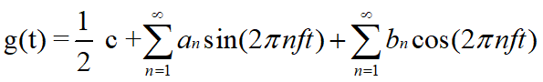

# Physical Layer

## Type of Network

### Network

#### 种类

+ 共享介质环境；
+ 点对点网络环境（广泛使用于拨号网络中）

## LAN Media

### 物理介质

#### 简介

+ 传输数据
+ 分为电信号、光信号、微波信号

### Twisted Pair（双绞线）

#### 类型

+ STP - Shielded Twisted Pair：屏蔽双绞线
+ ScTP - Screened Twisted Pair：网屏式双绞线
+ UTP - Unshielded Twisted Pair：非屏蔽双绞线

#### STP

+ 由8根不同颜色的线分成4对绞合在一起，无金属屏蔽材料。
+ 每根线外使用有颜色的塑料隔离。每两根线一个壳，八根线共一个壳， 最外层一个外部护套 。
+ 规格：1G-10G速率
+ 距离：100米

#### UTP

+ 是一种广泛用于数据传输的铜质双绞线。
+ 由4对细铜线组成， 每根线外使用 颜色的 塑料隔离。八根线共一个壳，最外层一个外部护套 。
+ 规格：1G-10G速率
+ 距离：100米

#### ScTP

+ 是一种广泛用于数据传输的铜质双绞线。// 注意，这里的2,3两种虽然都是屏蔽双绞线，但是它们的结构略有不同，详见第2章ppt的7、8两页。此处的ScTP不是著名的SCTP协议
+ 由4对细铜线组成， 每根线外使用 颜色的 塑料隔离。只有最外层一个外部护套 。

#### STP和ScTP的优点

+ 比 UTP 抗外部干扰的能力强 。

#### STP和ScTP的缺点

+ 信号传播距离较短；

+ 隔离层极大地增加了线缆的大小、重量和价格

+ 金属屏蔽层必须接地， 线缆难以安装 。

#### UTP的优点

+ 线缆不需要接地，因此便于在线缆末端加上连接器；

+ 价格低廉；

+ 直径小直径小，，因此安装简单且因此安装简单且更适合安装在更适合安装在管道中；

+ 和其他铜传输介质具有一样的数据传输速率；

+ 使用RJ连接器后极大地降低了噪音的影响。

#### UTP的缺点

+ 更容易受到电子噪音和干扰的影响；

+ 相对于同轴电缆和相对于同轴电缆和光缆而言光缆而言，能支持的线缆长度较，能支持的线缆长度较短。

### Coaxial（同轴电缆）

#### 规格

+ 铜导线，外部包有绝缘塑料， 再外层是铜网屏蔽层， 最外层是外部护套。
+ 细：传的近，粗：传的远
+ 规格：1G-10G速率
+ 距离：500米（距离比双绞线远）

#### 同轴线缆的优点

+ 与 STP 和 UDP 相比， 同轴线缆可以在几乎没有中继器推动的情况下，在距离较远的两个网 络节点之间传输数据；

+ 比光缆便宜（比 STP 和 UTP 贵）。

### Fiber-Optic（光纤）

#### 规格

+ 硅的氧化物作纤芯， 外面一层覆层用于防止光外溢，再外层是缓冲层，包裹在一层加强材料当中，最外层是外套。

#### Fiber-Optic的优点

+ 可以使用更长的距离

+ 接口不容易损坏

#### Fiber-Optic 的缺点

+ 价格昂贵 。

#### Single Mode（单模光纤）

+ 轴传播
+ 比多模光纤快，传输距离长
+ 较多使用在WAN
+ 直径小，没反射
+ 通常使用激光器型发送器，也使用发光二极管 。

#### Multimode（多模光纤）

+ 光以不同的角度进入光纤；不同角度识别光信号
+ 直径比单模光纤大；
+ 多用在 LAN 中；多路传输
+ 能量损耗较大。

### 无线传输

#### 类型

+ Lasers（激光）
+ Infrared （红外线）
+ Radio （无线电）

#### Lasers（激光）

+ 通讯双方约定好电磁波范围与通讯方案
+ 中间不能有障碍物

#### Infrared （红外线）

+ 可以被反射和重新导向
+ 中间不能有障碍物

#### Radio （无线电）

+ 可以通过障碍物
+ 易受功率大电器干扰

## UTP for Ethernet

#### 名词解释

+ IEEE - Institute of Electrical and Electronics Engineers：电气和电子工程师协会；是一个国际性的电子技术与信息科学工程师的协会。

+ TIA - Telecommunications Industry Association：美国通信工业协会；是全方位的服务性国家贸易组织。

+ UL - Underwriters Laboratories：美国保险商安全标准；

+ ANSI - American National Standards Institute：美国国家标准学会；美国国家标准化中心，各界标准化活动都围绕着它进行。

+ EIA - Electronic Industries Alliance：电子工业协会；美国电子行业标准制定者之一。

#### 双绞线分类

+ 一类线：主要用于语音传输，不用于数据传输（两根线双绞）

+ 二类线：传输频率1MHz，用于语音和最高4Mbps的数据传输，常见于令牌网

+ 三类线：EIA/TIA568标准指定电缆，传输频率16MHz，用于语音传输及最高传输速率为10Mbps的数据传输，主要用于10BASE-T （以太网开始）

+ 四类线：传输频率为20MHz，用于语音传输和最高传输速率16Mbps的数据传输，主要用于令牌网和 10BASE-T/100BASE-T 

+ 五类线：增加了绕线密度，外套高质量绝缘材料，用于语音和数据传输(主要为100/1000BASE-T)，是最常用的以太网电缆（5MB带宽、规格化，更高的绞合度）

+ 超五类线：衰减小，串扰少，具有更高的衰减/串扰比和信噪比、更小的时延误差，主要用于1000BASE-T

+ 六类线：传输频率为1MHz～250MHz，性能远高于超五类标准，适用于高于1Gbps的应用

+ 七类线：带宽为600MHz，可能用于今后的10G比特以太网。

#### 线缆类型

+ Straight Cable（直通线）
  + 发送数据一致。
  + 1号引脚与1号引脚相连，2号与2号相连，其他依次类推，两端设备使用相同的引脚（T568A或T568B）。
  + 主机 - 交换机，交换机 - 路由器
  + 两台设备使用的传输引脚不同时使用直通线
+ Rollover Cable（全反线）
  + 又叫控制台线缆，发的信号和接收的信号是反向的。
  + 1号引脚与8号引脚相连，2号与7号相连，其他依次类推
  + 用于连接PC的串口与路由器或交换机的控制台端口。
  + 连接计算机与网络设备的控制台端口时使用全反线；
+ Crossover Cable（交叉线）
  + 1号引脚与3号引脚相连，2号与6号相连，4号与7号相连，5号与8号相连 。
  + 一边使用T568A，另一边使用T568B
  + 连接相同的设备（Ex. PC - PC）
  + 连接两个交换机后合二为一（8口 + 8口 = 14口）
  + 两台设备使用的传输引脚相同时使用交叉线；

## Media and Signal Problems

### 问题域

#### 名词解释

+ EMI - electromagnetic interference ，电磁干扰
+ late collision：发生在 一个帧传送过程中的前64个字节的冲突。
+ consumption delay：由late collision引起的 延迟。

#### 传输

+ 时间（取决于介质）
+ 散射问题
+ 延时

#### 信号衰减

+ 有限长度下做有效传输

#### 反射

+ 保证介质稳定

#### 干扰

+ EMI
+ 电子干扰
+ 抖动

#### 冲突与冲突域

+ 要对第一层的接入做限制
+ 第二层路由器才能做网络分段

## Basic Knowledge of Data Communication

### 理论基础

#### 基本术语

+ 信号(signal)——数据的电气的或电磁的表现。
  + “模拟的”(analogous)
    + 消息的参数的取值是连续的
    + 模拟信号是随时间变化而平稳变化的连续波形式
  + “数字的”(digital)——消息的参数的取值是离散的
    + 数字信号是离散信号，可能包含有限的几个预定值
+ 码元(code)——在使用时间域（或简称为时域）的波形表示数字信号时，代表不同离散数值的基本波形。
  + 定义一个传输单位（不一定是一位）
  + Ex. 8种波形 -> 可传输3位（2^3）
+ 波特率（bit）（调制速率）：信号每秒钟变化的次数
+ 比特率（baud）：每秒钟传送的二进制位数。
  + 波特率与比特率的关系取决于信号值与比特位的关系
  + 例：每个信号值表示为３位，则比特率是波特率的３倍；每个信号值表示为１位，则比特率和波特率相同
  + 对于比特率为a bps的信道，发送８位所需的时间为 8/a秒，若８位为一个周期Ｔ，则一次谐波的频率是：f = a/8 Hz
+ 基带：基本频带，指传输变换前所占用的频带，是原始信号所固有的频带 。
+ 基带传输：在传输时直接使用基带数字信号（不转换为模拟信号，即不调制）。
+ Line coding（线路编码）：保证传输内容不被混肴

#### 信号处理

+ 模拟信号可以被分为简单信号和复合信号

  + 简单信号（正弦波）不能被分解为更简单的模拟信号

  + 复合信号可以被分解为多个正弦波

+ 复合模拟信号的分解：**傅立叶分析** = 任何波形可用简单信号表示

  + 任何一个周期为T的有理周期性函数 g(t)可分解为若干项（可能无限多项）正弦和余弦函数之和：

  

  ​      f = 1/T 基本频率；an, bn ：n次谐波项的正弦和余弦振幅值

+ 数字信号一般是非周期性的，通常在传输介质上表现为方波

+ 一个数字信号可以分解为无穷多个被称为谐波的简单正弦波，每个谐波都具有不同的频率与相位

+ 在介质上发送数字信号时，其实质是在发送无穷多的简单谐波，如果某些分量未能忠实地通过介质传输，则在接收端将产生信号畸变

+ 由于介质本身的限制，信号畸变是难以完全避免的

+ 任何实际的信道都不是理想的，在传输信号时会产生各种失真以及带来多种干扰。 

+ 码元传输的速率越高，或信号传输的距离越远，在信道的输出端的波形的失真就越严重

### 通信方式

#### 问题

+ 实际信道：带宽受限、有噪声、干扰和失真
+ 无法识别波形
+ 码间串扰：无法界定两个码元的界限

#### 最高传输速率

+ 无噪信道的最高传输速率
  $$
  C = W*log_2 L (bps)
  $$

  + 其中 W 为信道的带宽（以 Hz为单位）

  + L 为表示数据的信号电平的数量 。（码元能表示的信息数）

+ 噪声信道的最高传输速率
  $$
  C = W*log_2 (1+S/N) (bps)
  $$

  +  其中 W 为信道的带宽（以Hz 为单位） 
  + S 为信道内所传信号的平均功率 
  + N 为信道内部的高斯噪声功率
  + S/N 称为信噪比 。（信噪比高，传输速率大）

### 编码

#### 名词解释

+ NRZ - Non-Return to Zero：不归零制码；信号电平的一次反转代表1，电平不变化表示0，并且在表示完一个码元后，电压不需回到0。

+ RZ - Return to Zero：归零制码；是信号电平在一个码元之内都要恢复到零的编码方式。
+ AMI - alternate mark inversion code：传号交替反转码；二进制的0用0电平表示，二进制码的1交替的用+1和-1的半站空归零表示。
+ TDM - Time Division Multiplexing：时分复用；时分复用是将时间划分为一段段等长的时分复用（TDM）帧，每个时分复用的用户在每个 TDM 帧中占用固定序号的时隙。
+ STDM - Statistic TDM：统计时分复用；是一种根据用户实际需要动态分配线路资源的时分复用方法。
+ FDM - Frequency Division Multiplexing：频分复用；用户在分配到一定的频带后，在通信过程中自始至终都占用这个频带。
+ WDM - Wavelength Division Multiplexing：波分复用；就是光的频分复用。 
+ CDM - Code Division Multiplexing：码分复用；
+ CDMA - Code Division Multiple Access：码分多址；是一种多路方式，多路信号只占用一条信道。

#### 分类

+ 单极性编码
+ 极化编码
  + NRZ(Non-Return to Zero，不归零制码)
  + RZ(Return to Zero，归零制码)
  + 双相位编码
    + 曼彻斯特码
    + 差分曼彻斯特码

+ 双极性编码
  + 传号交替反转码(AMI)
  + 双极性8连0替换码(B8ZS)
  + 3阶高密度双极性码(HDB3)

#### 单极性编码

+ 原理
  + 用0电平表示“0”，正电平表示“1”

+ 缺点
  + 难以分辨一位的结束和另一位的开始
  + 发送方和接收方必须有时钟同步
  + 若信号中“0”或“1”连续出现，信号直流分量将累加，单极性编码的直流分量问题严重

+ 结论
  + 容易产生传播错误

#### NRZ(Non-Return to Zero，不归零制码)

##### 正向编码

+ 原理

  + 用负电平表示“0”，正电平表示“1”（或相反）

+ 缺点

  + 难以分辨一位的结束和另一位的开始

  + 发送方和接收方必须有时钟同步

  + 尽管不会如单极性编码严重，但若信号中“0”或“1”连续出现，信号直流分量仍将累加（大量0或大量1出现）

##### 反相编码

+ 原理
  + 信号电平的一次翻转代表比特1，无电平变化代表0

+ 不归零反相编码优于不归零电平编码
  + 由于每次遇到“1”（或“0”）都要发生跃迁，因此可以根据电平跃迁进行有限的同步

#### RZ(Return to Zero，归零制码)

+ 原理
  + 用负电平表示“0”，正电平表示“1”（或相反），比特中位跳变到零电平，从而提供同步

+ 优点
  + 信号本身带有同步信息，经济性好，且不易出错

+ 缺点
  + 需要采用三个不同电平，两次信号变化来编码1比特，因此增加了占用的带宽

#### 曼彻斯特码（Manchester）

+ 原理
  + 每一位中间都有一个跳变，从低跳到高表示“0”，从高跳到低表示“1”
  + 不产生积累

+ 优点
  + 克服了NRZ码的不足。每位中间的跳变既可作为数据，又可作为时钟，能够自同步；同时只采用两个电平，跳变减少，比RZ码效率更高
+ 缺点
  + 编码效率低（50%）

#### 差分曼彻斯特码（Differential Manchester）

+ 原理
  + 每一位中间跳变：表示时钟

+ 每一位位前跳变：表示数据
  + 有跳变表示“0”，无跳变表示“1”

+ 优点
  + 时钟、数据分离，便于提取
  + 适合硬件实现

#### 双极性传号交替反转码（AMI）

+ 与RZ相同的是: 采用三个电平：正、负与零

+ 与RZ不同的是: 零电平表示“0”，正负电平的跃迁表示“1”，实现对“1”电平的交替反转。

+ 优点
  + 对每次出现的“1”交替反转，使直流分量为0
  + 尽管连续“0”不能同步，但连续“1”可以同步

### 多路复用

#### 简介

+ 由于一条传输线路的能力远远超过传输一个用户信号所需的能力，为了提高线路利用率，经常让多个信号共用一条物理线路
+ 多用户使用同一线路

#### 分类

+ 时分复用 TDM ( Time Division Multiplexing）
+ 频分复用 FDM ( Frequency Division Multiplexing)
+ 波分复用 WDM ( Wavelength Division Multiplexing)
+ 码分复用 CDM (Code Division Multiplexing )

#### 时分复用TDM

+ 时分复用是将时间划分为一段段等长的时分复用（TDM ）帧，每个时分复用的用户在每个 TDM 帧中占用固定序号的时隙。

+ 每一个用户所占用的时隙是周期性地出现

+ TDM 信号也称为等时(isochronous)信号。

+ 时分复用的所有用户在不同的时间占用同样的频带宽度
+ 缺点
  + 每个用户有自己的信道，当用户未使用时会造成资源浪费。

#### 统计时分复用 STDM

+ 指针系带用户信息
+ 谁先来谁先被服务

#### 频分复用 FDM

+ 用户在分配到一定的频带后，在通信过程中自始至终都占用这个频带。

+ 所有用户在同样的时间占用不同的带宽资源（请注意，这里的“带宽”是频率带宽）
+ 波分复用就是光的频分复用。（每个用户有特定长的光信号）

#### 码分复用 CDM

+ 常用的名词是码分多址 CDMA(Code Division Multiple Access)
+ 各用户使用经过特殊挑选的不同码型，因此彼此不会造成干扰。
+ 这种系统发送的信号有很强的抗干扰能力，其频谱类似于白噪声，不易被敌人发现
+ 使用不同编码（不同基站编码互相正交），不互相影响