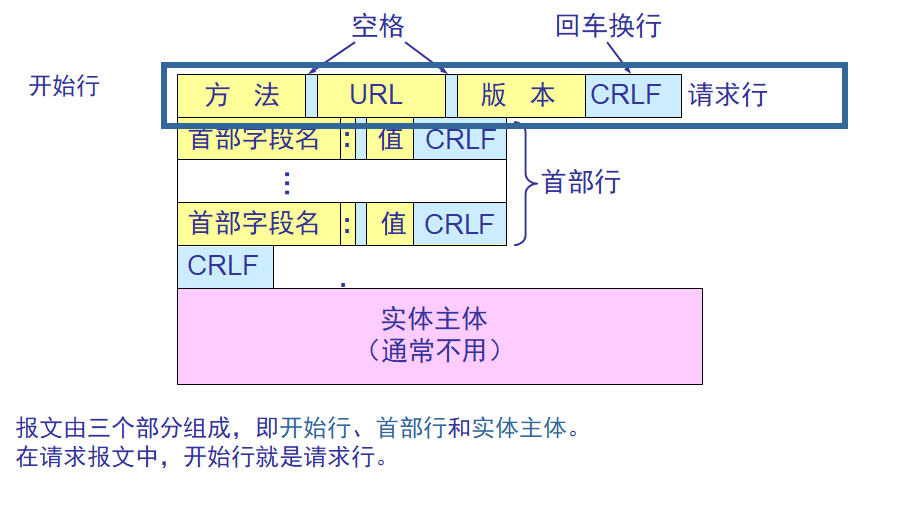
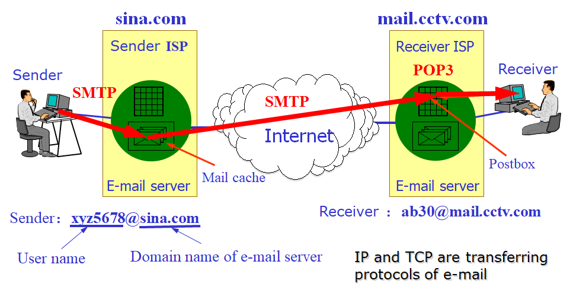
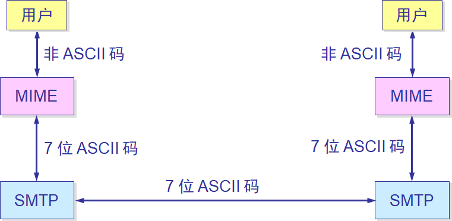
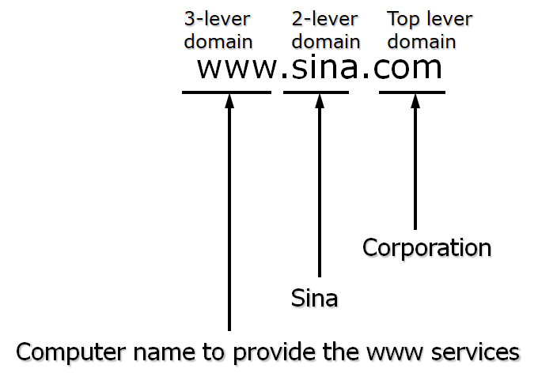
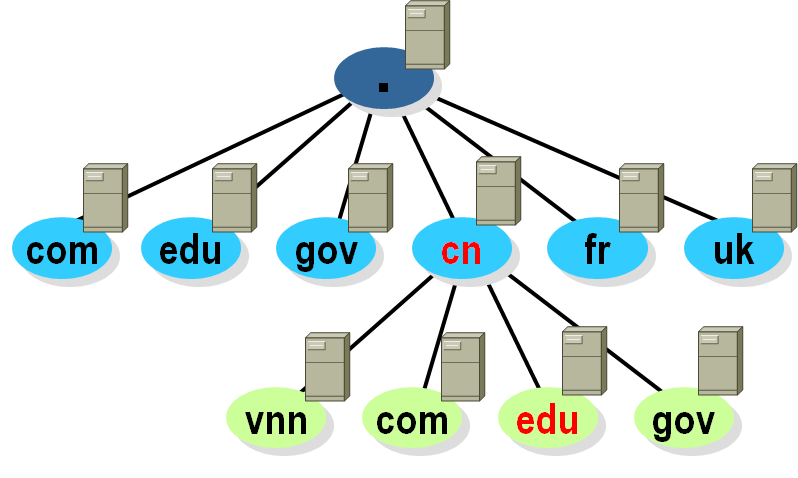

# Application Layers

## The Session Layer

### 简介

#### 作用

* 建立，维护和终止应用间的会话
  * 包括开始，停止和重新同步两台主机间的临时会话(rap session)
* Checkpoint 检查点
  * 用来分割会话的各个部分，各个部分被称为对话(dialog)
  * 对话的分割是通信有序地初始化、终止和维护的过程

#### 应用

* NFS: Network File System，网络文件系统
* SQL: Structured Query Language，结构化查询语言
* RPC: Remote Procedure Call，远程过程调用
* X Window System，X视窗系统
* ASP: AppleTalk Session Protocol，AppleTalk会话协议
* SCP: DNA Session Control Protocol，DNA(Digital Network Architecture，数字网络架构) 会话控制协议

## The Presentation Layer

### 简介

#### 作用

* 负责将数据表示成接受设备可以理解的格式，有以下三个主要功能

  * 数据格式化

    如编码转换，图片格式，多媒体格式

  * 数据压缩

  * 数据加密

## The Application Layer

### 简介

#### 作用

* 支持与具体应用的通信组件
* 标识并建立目标通信对象的可用性
* 同步协作的应用
* 建立错误恢复协议
* 负责数据完整性
* 通过网络应用(network applications)为OSI模型的其余部分提供一个直接接口，或是通过独立应用提供非直接接口，如文字处理，电子表格，演示管理器(presentation managers)，网络重定向器

### HTTP

#### 简介

+ Hyper-Text Transfer Protocol，超文本传输协议
+ 通过URL切换
+ 向远端服务器请求，服务器发回html文档
+ HTTP 是面向事务的客户服务器协议。
+ HTTP 1.0 协议是无状态的(stateless)。
+ HTTP 协议本身也是无连接的，虽然它使用了面向连接的 TCP 向上提供的服务。
+ 万维网浏览器就是一个 HTTP 客户，而在万维网服务器等待 HTTP 请求的进程常称为 HTTP daemon，有的文献将它缩写为 HTTPD。
+ HTTP daemon 在收到 HTTP 客户的请求后，把所需的文件返回给 HTTP 客户。  

#### 报文结构

#### 请求报文

| 方法（操作） | 意义                            |
| ------------ | ------------------------------- |
| OPTION       | 请求一些选项的信息              |
| GET          | 请求读取由URL所标志的信息       |
| HEAD         | 请求读取由URL所标志的信息的首部 |
| POST         | 给服务器添加信息（例如，注释）  |
| PUT          | 在指明的URL下存储一个文档       |
| DELETE       | 删除指明的URL所标志的资源       |
| TRACE        | 用来进行环回测试的请求报文      |
| CONNECT      | 用于代理服务器                  |

### 协议

#### URL

+ Uniform Resource Locator，统一资源定位符
+ 统一资源定位符 URL 是对可以从因特网上得到的资源的位置和访问方法的一种简洁的表示。

+ URL 给资源的位置提供一种抽象的识别方法，并用这种方法给资源定位。

+ 只要能够对资源定位，系统就可以对资源进行各种操作，如存取、更新、替换和查找其属性。

+ URL 相当于一个文件名在网络范围的扩展。因此 URL 是与因特网相连的机器上的任何可访问对象的一个指针。

#### FTP

+ FTP - File Transfer Protocol：文件传输协议

* FTP是可靠的，面向连接的服务。基于TCP。
* 21端口
* 工作流程
  * 首先通过套接字建立控制连接
  * 然后建立数据连接，通过数据连接传输数据

#### TFTP

+ TFTP - Trivial File Transfer Protocol：一般文件传输协议

* 无连接的服务。基于UDP。
* 小且易于实现

#### Telnet

+ 远程登录服务

* 允许远程登录，然后通过命令行方式执行指令

#### SMTP

+ Simple Mail Transfer Protocol，简单邮件传输协议

#### POP3

+ Post Office Protocol 3，邮局协议3

* SMTP和POP3都是通过TCP/IP来传输邮件的

#### MIME

+ Multipurpose Internet Mail Extensions，多用途互联网邮件扩展类型

#### SNMP

+ Simple Network Management Protocol，简单网络管理协议
+ UDP实现
+ 发送请求 -> 对网络主机做管理和监控

#### DNS

+ Domain Name System，域名系统/Domain Name Server，域名服务器

* 提供域名向IP转换的服务（把所有了解的域名换成对应的IP）
* 域名服务器是分层的，树状的结构
* 如果当前DNS可以转换域名则返回结果，如果不行则向上层DNS发送请求
* 点隔开：越后面level越高

#### TLD

+ Top Level Domain，顶级域名

* 国家TLD

  .cn .us .uk

* 通用TLD

  .com .net .org .edu .gov .mil .int .aero .biz .cat .coop .info .jobs .mobi .museum .name .pro .travel

* 基础TLD

  .arpa 提供域名反查服务

### 传输

#### 方式

* 一小段传输完成后自动断开连接
* 维持连接直到用户手动断开