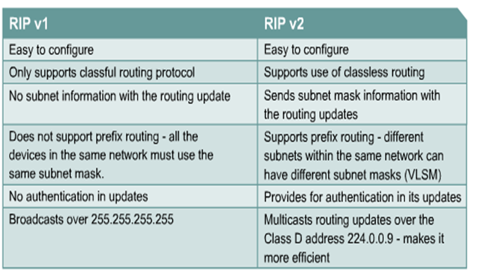
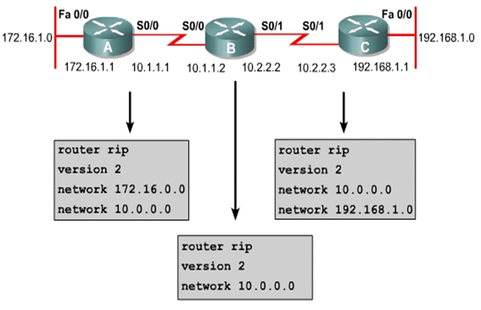
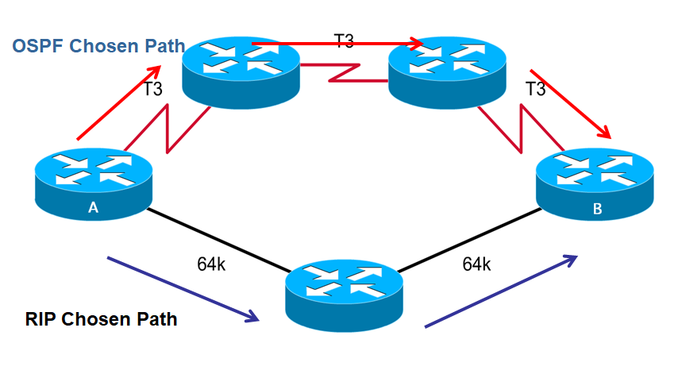
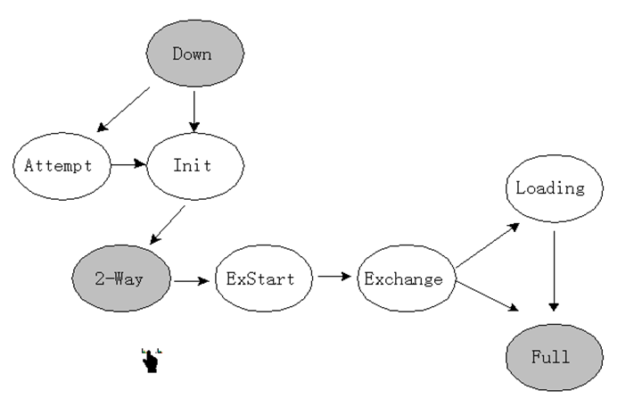

# Routing Protocols

## RIPv1/RIPv2

### RIP History

#### 介绍

+ RIP是内部网关协议
+ RIP v1是距离矢量协议，默认间隔是30s
+ 以跳数作为度量
+ 最大跳数为15
+ 适合小型网络

#### 名词解释

+ VLSM - Variable Length Subnet Mask：可变长子网掩码，是为了有效的使用无类别域间路由（CIDR）和路由汇聚(route summary)来控制路由表的大小
+ CIDR -Classless Inter-Domain Routing：无类域间路由，用于帮助减缓IP地址和路由表增大问题的一项技术。

### Differences Between RIP v1 and RIP v2 

#### RIP v1

+ 有类路由协议；

+ 最多6路负载均衡，默认为4路；

+ 不发送子网掩码；

+ 更新信息作为广播被发送；

+ 不支持身份验证（VLSM）；

+ 不支持可变长子网掩码和无类域间路由（CIDR）。

#### RIP v2

+ 用跳数度量的矢量路由协议

+ 使用抑制定时器和水平分割防止路由环路，默认秒数是180s

+ 支持可变长子网掩码（无类路由）

+ 支持验证

+ 以224.0.0.9作为路由更新的目的地址。

### Configuration of RIP v2

#### 指令

+ 验证RIP v2
  + Router# show ip protocols 
    + 验证RIP配置
  + Router# show ip route
    + 显示IP路由表

+ 解决RIP v2的问题 
  + Router# debug ip rip
    + 显示RIP更新
  + Router# undebug all (/no debug all)
    + Router# turn off all debugging

#### 配置范例

## OSPF(single area)

### Link-state routing protocol

#### OSPF简介

+ Open Shortest Path First ：开放式最短路径优先，是一个link-state routing protocol
+ Neighborship Database(毗邻数据库)→Topology Database(拓扑数据库)→SPF→路由表；
+ 链路状态协议；
+ 使用代价、速度、通信量、可靠性、安全性等作为度量；
+ 适合于大型的网络；
+ 以后可以将网络划分为多个区域；
+ 支持变长子网掩码；
+ 快速收敛。

#### OSPF V.S. RIP

### 专业术语

#### link

+ 物理连接两个网络设备

#### Link-State

+ 两个路由器间的连接状态

#### Cost

+ 这个值根据带宽的连接而改变

#### Area

+ 有同样area ID的路由器有同样的link-state资讯
+ 在单区域中，Area号为0。
+ 在多区域中，所有的其他区域都要求接到Area0，所以Area0称为中枢链路。

#### DR

+ Designated Router

+ 在OSPF多路访问网络中，在同一个区域内被选举出来代表所有路由的路由。为了减少在同一个网段中几个邻居互相交换信息的数量。

#### BDR

- Backup Designated Router
- 备用DR，当DR停机时发挥作用。

### 内容

#### 名词解释

+ NBMA - Non-broadcast multi-access：非广播-多路访问网络。是OSPF通信协议中定义的四种网络类型的其中一种。

#### 操作

+ 建立邻接关系：路由器周期性地发送hello报文，周围的路由器收到后将其加入自己的邻接数据库，然后根据网络类型和是否已有DR/BDR决定是否跳过第二步；

+ 选举DR和BDR：如果只有一个路由器，则为DR，下一个进入的路由器为BDR，否则根据优先级和router ID判断；

+ 发现路由：DR/BDR发送LSA，其他路由器发送DBD和LSR；

+ 选择合适的路由路径：使用最短路径优先算法，最多加载4条链路消耗相同的路由；

+ 维护路由信息：hello报文用于发现新的邻居和停机的邻居。

#### 状态

+ 停止、初始（Init）、双向（Two-Way）、准启动（EX-Start）、交换（Exchange）、加载（Loading）、全毗邻（Full）

#### 网络类型

+ Broadcast multi-access：广播多路接入（以太网）
+ Point-to-point networks ：点对点
+ NBMA - Non-broadcast multi-access：非广播多路接入

#### 选举DR和BDR

+ 优先级+Router ID

+ 默认优先级为1，范围可以是0-255，数字越大，优先级越高

+ Router ID是环回地址；若无环回地址则为最大的接口地址

#### DR&BDR

+ 链路拓扑改变时，路由器通过224.0.0.6通知DR或BDR

+ DR或BDR通过224.0.0.5通知该区域内的路由

#### Hello协议

+ 地址为224.0.0.5

+ 在广播多路接入和点对点网络中，默认每10秒发送一次hello报文；

+ 在NBMA网络中，每30秒一次
+ Hello只能发送给同个路由

#### 路由协议包

+ Hello

+ DBD，数据库描述

+ LSR，链路状态请求

+ LSU，链路状态更新

+ LSAck，链路状态应答

#### 报文头格式

#### 邻居状态机

