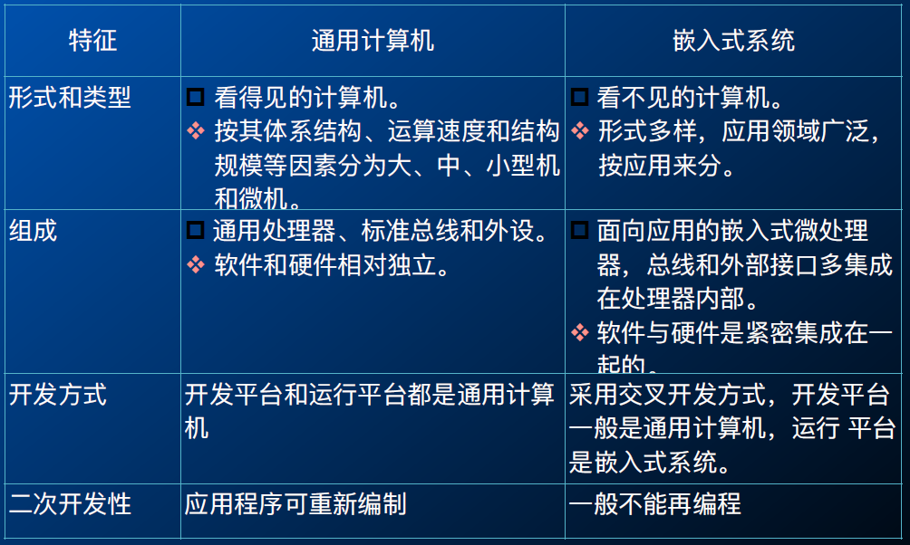

# 嵌入式系统概述

## 定义

+ “嵌⼊式系统”是“嵌⼊式计算机系统”的简称。

### 普遍定义

嵌⼊式系统是“以应⽤为中⼼，以计算机技术为基础，软硬件可裁减，适⽤于应⽤系统对功能、可靠性、成本、体积、功耗有严格要求的专⽤计算机系统”。
嵌⼊式系统就是⼀个具有特定功能或⽤途的隐藏在某种设备中的计算机软硬件集合体，没有固定的特征形状。

### 三要素

+ 嵌⼊性：嵌⼊到对象体系中，有对象环境要求
+ 专⽤性：软、硬件按对象要求设计、裁减
+ 计算机：实现对象的智能化功能

## 功能

### 无限感知网络

⽆线感知⽹络，是由许多在空间中分布的⾃动装置组成的⼀种⽆线通信计算机⽹络，这些装置使⽤传感器协作地监控不同位置的物理或环境状况（⽐如温度、声⾳、振动、压⼒、运动或污染物）。⽆线传感器⽹络的发展最初起源于战场监测等军事应⽤。⽽现今⽆线传感器⽹络被应⽤于很多⺠⽤领域，如环境与⽣态监测、健康监护、家居⾃动化以及交通控制等。

### 物联网

物联网（IoT）是物理设备、车辆（也称为“联网设备”和“智能设备”）、建筑物和其他嵌入电子设备、软件、传感器、执行器和网络连接的项目之间的互联网络，使这些对象能够收集和交换数据。

### CPS

网络物理系统（CPS）是一种由基于计算机的算法控制或监视的机制，与因特网及其用户紧密结合在一起。

深度融合了各类信息技术：传感器、嵌⼊式计算、云计算、⽹络通信、软件，使得各种信息化能⼒（3C：计算-Computer、通信-Communication和控制-Control）⾼度协同和⾃治，实现⽣产应⽤系统⾃主、智能、动态、系统化地监视并改变物理世界的性状。

## 传统计算机 V.S. 嵌入式系统

## 组成

+ 嵌入式硬件 + 嵌入式软件

### 硬件

+ 微处理器
+ I/O设备

### 软件

+ 初始化代码及驱动
+ 嵌入式操作系统与应用程序

## 特点

### 形式多样、面向特定应用

+ 用于特定任务
+ 低功耗、体积⼩、集成度⾼
+ 应用程序和操作系统一体化

### 处理器和处理器体系结构多

+ 嵌⼊式系统可采⽤多种类型的处理器和处理器体系结构
+ 嵌入式产品的微处理器产业链是巨大产业。

### 关注成本

+ NRE成本：一次性开发成本
+ 产品成本：硬件、外壳、软件版税
+ 每个产品的最后成本=总体成本/产品总量=NRE成本/产品总量+每个产品成本

### 实时性和可靠性要求

+ ⼤多数实时系统都是嵌⼊式系统
+ 嵌⼊式系统多数有实时性的要求，软件⼀般是固化运⾏或直接加载到内存中运⾏，具有快速启动的功能
+ 有出错处理和⾃动复位功能
+ 保护机制：硬件的看⻔狗定时器，软件的内存保护和重启动机制

### 适应多种处理器

+ 可剪裁、轻量型、实时可靠、可固化的嵌⼊式操作系统
+ 高可靠嵌⼊式操作系统：时、空、数据隔离。

### 开发需要专门工具

+ 系统资源有限，不具备自主开发能力
+ 交叉卡法，计算机连接嵌入式设备进行调试

## 分类

### 位数

+ 4、8、16、32、64位

+ 4、8、16大量应用
+ 32、64主流发展趋势

### 应用

### 速度

+ 强实时系统, 其系统响应时间在毫秒或微秒级。
+ ⼀般实时系统, 其系统响应时间在⼏秒的数量级上,其实时性的要求⽐强实时系统要差⼀些。
+ 弱实时系统, 其系统响应时间约为数⼗秒或更⻓。这种系统的响应时间可能随系统负载的轻重⽽变化。

### 确定性

+ 硬实时：系统响应时间不能满足，会引起系统崩溃。
+ 软实时：系统响应时间不能满足，不引起系统崩溃。

### 复杂程度

+ 循环轮询系统
+ 有限状态机系统
+ 前后台系统
+ 单处理器多任务系统
+ 多处理器多任务系统