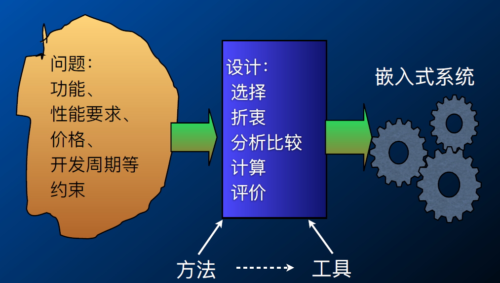
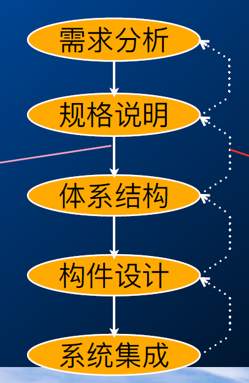
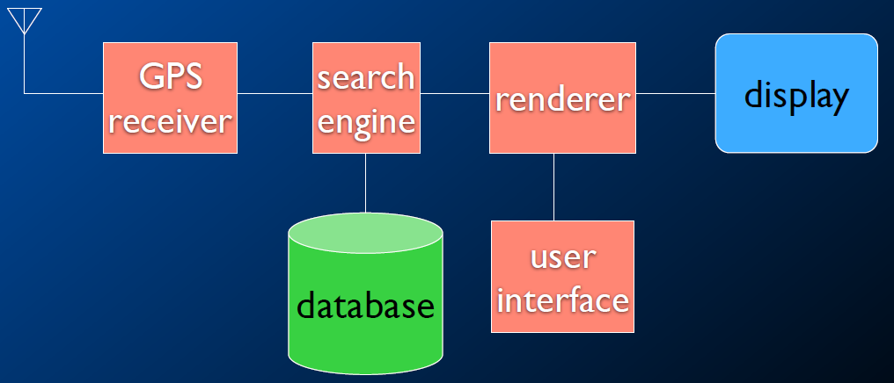
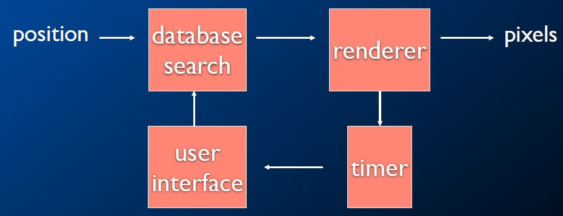
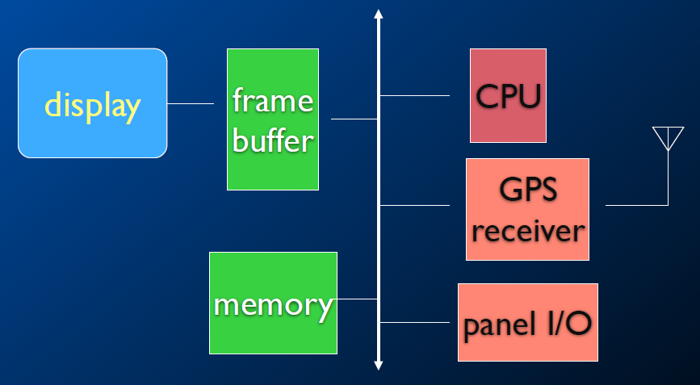
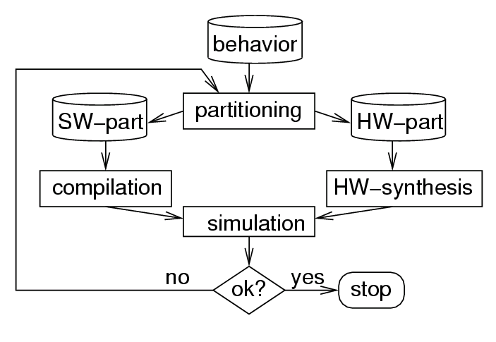

# 设计方法

## 挑战

## 设计过程

### 流程

### 架构

### 划分

+ 嵌⼊式系统的设计涉及硬件与软件部件，设计中必须决定什么功能由硬件实现，什么功能由软件实现。
+ 硬件和软件具有双重性
+ 软硬件变动对系统的决策造成影响
+ 划分和选择需要考虑多种因素
+ 硬件和软件的双重性是划分决策的前提

### 软件

+ 操作系统功能
+ 协议栈（TCP/IP）
+ 应用软件框架

### 硬件

## 设计方法学

### 传统软硬件设计问题

+ 一开始就划分软硬件两部分
+ 独立开发

+ 设计质量差、设计修改难、研制周期不能保障

### 现在的设计方法

+ 软硬件共同设计

