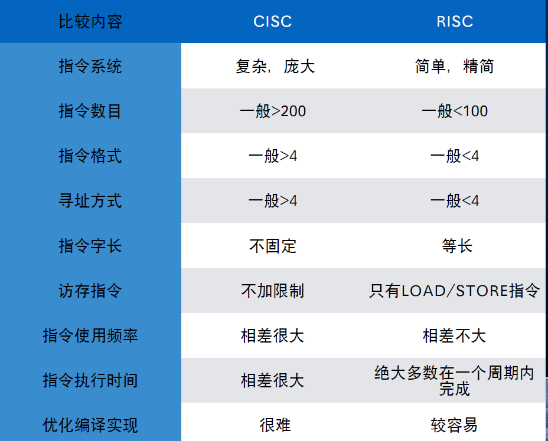
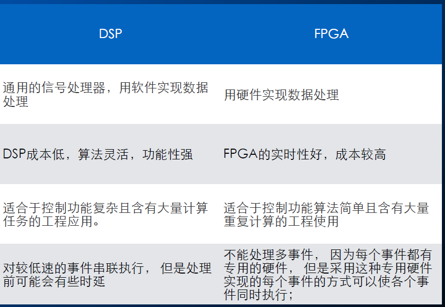

# 嵌入式硬件

## 简介

###  组件

+ CPU
+ 总线
+ 储存单元
+ I/O设备

## 结构

### 冯诺伊曼结构

+ 数据和程序放在同一个储存单元
+ CPU通过总线从储存单元调用程序与数据

### 哈佛结构

+ 程序与数据不同存储，数据与程序独立访问
+ 允许同时对不同寄存器获取数据
+ 高储存、预测带宽

## 指令

### RISC vs. CISC

+ Complex instruction set computer：复杂指令集
+ Reduced instruction set computer：精简指令集

### RISC-V

+ 简单、完全开源并且免费
+ 将基准指令和扩展指令分开，可以通过扩展指令做定制化的模块和扩展。
  + RISC-V的基准指令确定后将不会再有变化，这是RISC-V稳定性的重要保障。
+ 32、64、128位指令集

## 微处理器

### MPU

+ 嵌⼊式微处理器
+ 就是和通⽤计算机的处理器对应的CPU。
+ 功能和微处理器基本⼀样,是具有32位以上的处理器,具有较⾼的性能.
+ 具有体积⼩,功耗少,成本低,可靠性⾼的特点.
+ 有的可提供⼯业级应⽤.

### MCU

+ 嵌⼊式微控制器
+ 就是将整个计算机系统的主要硬件集成到⼀块芯⽚中,芯⽚内部集成ROM/EPROM, RAM, 总线, 总线逻辑, 定时/计数器, Watchdog, I/O, 串⾏⼝等各种必要功能和外设.
+ 特点：
  + ⼀个系列的微控制器具有多种衍⽣产品;
  + 单⽚化,体积⼤⼤减⼩,功耗和成本降低,可靠性提⾼;
  + 是⽬前嵌⼊式⼯业的主流,约占嵌⼊式系统50%的份额;
  + 多是8位和16位处理器

### DSP

+ 嵌⼊式DSP
+ 是专⻔⽤于信号处理⽅⾯的处理器，其在系统结构和指令算法⽅⾯进⾏了特殊设计，具有很⾼的编译效率和指令执⾏速度。
+ 应⽤领域：
  + 数字滤波
  + 频谱分析
  + FFT

### SoC

+ 嵌⼊式SoC是追求产品系统最⼤包容的集成器件。绝⼤多数系统构件都在⼀个系统芯⽚内部。
+ 特点：
  + 结构简洁
  + 体积⼩、功耗⼩
  + 可靠性⾼
  + 设计⽣产效率⾼

### DSP V.S. FPGA

## ARM

### 架构

+ RISC架构
  + 大而统一的寄存器文件
  + 简单地址模式
  + 统一而固定长度的指令
+ 增强功能
  + 每个指令控制ALU和移位器
  + 自增与自减地址模式
+ 结果：高效、低代码量、低耗电、低空间

## 流水线

+ 大部分指令执行在一个循环内
+ 指令集的特殊功能消除了小跳转去获得最佳的流水线流
+ 3级流水线
  + 取指——译码——执行
+ 5级流水线
  + 取指——译码——执行——数据缓冲——写回
+ 6级流水线
  + 取指——发射——译码——执行——存储器——写回

