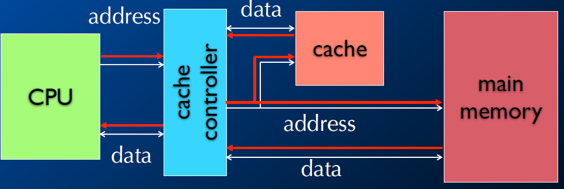

# 存储体系

+ 这章基本上就是COA的简化版

## Memory

### 类型

+ DRAM
+ SRAM
+ Flash
+ MRAM

### RAM

+ DRAM：密集、需要刷新
+ SDRAM：同步DRAM，主要类型，使用时钟来改善效能
+ SRAM：更快、不密集、需要更高供电

### ROM

+ 工厂编程
+ Flash是可编程ROM主要形式
+ 电力擦除块。
+ 写比读慢很多
+ NOR Flash更弹性
+ NAND Flash更密集

### Flash

+ 非易失存储
+ 随机访问读
+ 写：
  + 比读慢很多
  + 一次写一整块
  + 写容易导致器械损坏，一个设备大约写10000次。

+ 类型
  + NOR
    + 读字
    + 块擦除
  + NAND
    + 读页
    + 块擦除
    + 更便宜、擦除快、顺序访问

| 功能      | NAND     | NOR      |
| --------- | -------- | -------- |
| 主要应用  | 文件储存 | 代码执行 |
| 储存空间  | 高       | 低       |
| 每bit花费 | 好       |          |
| 写速度    | 好       |          |
| 读速度    |          | 好       |

## 存储架构

### Flat Single-space Memory

+ 简单
+ 空间可能不连续

### Segmented Memory

+ 增加的地址空间
+ 两部分地址：段、偏移量

### Bank-switched Memory

+ 可以被加到任何处理器
+ 支持链接

### Multiple-space Memory

+ 需要C语言扩展

### Virtual Memory

+ 增加相似空间大小
+ 与磁盘交换数据

### Cache Memory

+ 主存的数据映射到cache里面
+ 加快CPU获取数据速度
+ Cache hit、Cache miss、Working set 

+ Replacement Policies
  + cache的替换策略
  + Random、Least-Recently Used（LRU）

### MMU

+ Memory management unit
+ 允许程序访问物理内存
+ 允许虚拟内存加载进内存
+ Page Fault：请求的位置不在内存里面