# Tree 樹

## 1. Tree 樹
- **定义：**节点的集合。非空的树有唯一的节点root，并有许多子树 T1 , T2 , ……, Tk。
- Tree = T(r, Ti)
- r = root 根節點
- 高度 = max{left height, right height}+1
- Ti 子樹(各個節點以下為一棵樹，兄弟節點之間為`無序的`)


### Component 組成
- `Degree of node 節點的度`：子節點數目
- Degree of tree 樹的度：所有子節點中最大的度
- `Leaf 葉節點`：度為0的節點(沒有任何子節點)
- Branch 分支：度不為0的節點(中間節點)
- `Level 高度(層數)`：根節點的高度為0(也有人說1)，其後所有節點的高度為其父節點加一
- `Depth of tree 樹的深度`：樹的最大高度

## 2. Binary Tree 二叉樹
- 与树的定义相同。
- 所有`節點的度 <= 2`，`子節點為有序的`，左至右依序稱為左子樹(left sub tree)和右子樹(right sub tree)
- **与树的不同：**
  1. 每个二叉树的元素只有两个子树。
  2. 二叉树的节点是有序的。

### 性質
1. n 個節點的二叉樹，有 n-1 條`邊(edge)`

2. 第 i 層最多有 2^i 個節點(i>=0)

3. 高 h 的二叉樹`最少有 h+1 個節點`，`最多有 2^(h+1) -1 個節點`


4. 葉節點個數n0，度為二的節點個數為n2，有n0 = n2 + 1


5. n 個節點的二叉樹`最大為 n-1 層`，`最小為 [log2(n+1) -1] 層`

### Full Binary Tree 滿二叉樹
- 高 h 的滿二叉樹有 2^(h+1) - 1 個節點 (完全填滿)


### Complete Binary Tree 完全二叉樹
- 除了最後一層之外，較低層全部填滿的樹
- 高度為 h 的完全二叉樹，最少有 2^(h) 個節點，最多有 2^(h+1) - 1 個節點

- **性質：**
  1. 第 i (0 <= i <= n-1)個插入的節點，i=0 時為樹根，i>0 時父節點為 floor(i-1)/2，左子節點為 (2 * i + 1)
  2. 节点i的左子节点为2i + 1。如果2i + 1 >= n，节点i没有左子节点。
  3. 节点i的右子节点为2i + 2。如果2i + 2 >= n，节点i没有右子节点。
### Binary Tree Representation 表示
- 數組(將樹視為完全二叉樹，參照序號i作為下標)

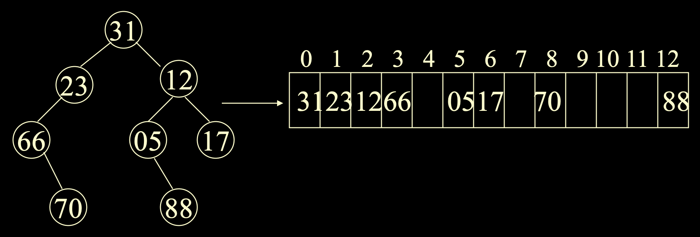

- 鏈表


- 向量表（游标表示）—— 表示的树如上图Example
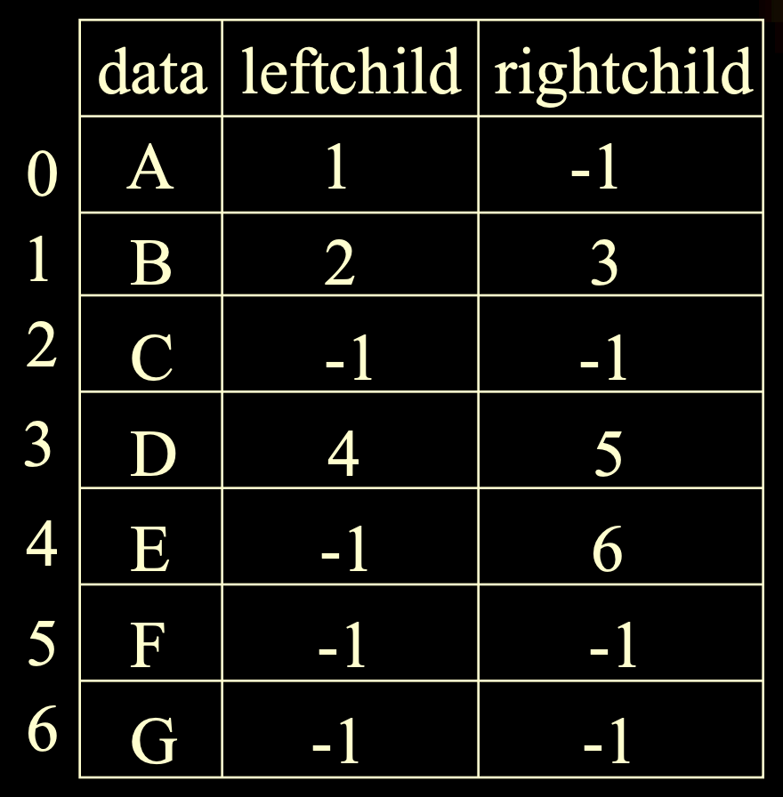

### Operation 操作(方法)
1. BinaryTree create() 創建二叉樹
2. boolean isEmpty() 判斷數是否為空
3. Node root(x) 取根節點
4. BinaryTree makeTree(root, left, right) 創建二叉樹
5. BinaryTree breakTree(root) 清空二叉樹
6. ArrayList<T> preorder() 前序遍历
6. ArrayList<T> inorder() 中序遍历
6. ArrayList<T> postorder() 後序遍历
6. ArrayList<T> levelorder() 按層遍历

### Traversal 遍历（代码为不用递归的方法）

1. Preorder 先序遍历(前序)：VLR

2. Inorder 中序遍历：LVR

   ```c++
   void Inorder(BinaryNode <T>* t){ 
       Stack <BinaryNode<T>*> s(10);
       BinaryNode<T>* p = t;
       for ( ; ; ){ 
           //每次进循环压栈所有左子树，再每次出栈一个并打印，再将p指向出栈数的右子树
           
           while(p!=NULL){ 
               s.push(p); 
               p = p->Left; 
           } //将所有左子树压栈，栈底为root
           
           if (!s.IsEmpty( )){ 
               p = s.pop( );
               cout << p->element;
               p = p->Right; //p变右子树
           }else 
               return;
       }
   }
   ```

3. Postorder 后序遍历：LRV

   ```c++
   void Postorder(BinaryNode <T> * t){ 
       Stack <StkNode<T>>s(10);
       StkNode<T> Cnode;
       BinaryNode<T> * p = t;
       for( ; ; ){ 
           //tag为0，左子树遍历完了。tag为1，右子树遍历完了。
           while (p!=NULL){ 
               Cnode.ptr = p; 
               Cnode.tag = 0; 
               s.push(Cnode);
               p = p->Left;
           } //将所有左子树压栈，栈底为root
           
           Cnode = s.pop( ); 
           p = Cnode.ptr;
           
           while ( Cnode.tag == 1){ //从右子树回来 
               cout << p->element;
               if ( !s.IsEmpty( )){ 
                   Cnode = s.pop( ); 
                   p = Cnode.ptr; 
               }else 
                   return;
           }
           
           Cnode.tag = 1; 
           s.push(Cnode); 
           p = p->Right; //从左子树回来
       }//for
   } 
   ```

4. Levelorder 按層遍历：依完全二叉樹編號按序遍历
    

### 建立一颗二叉树

+ 利用MakeTree函数

+ 利用先序、中序唯一的构造一棵二叉树

  

+ 利用二叉树的广义表表示来构造一棵二叉树

  

+ 利用二叉树的后缀表示来构造一棵二叉树

  

### Binary-Tree Representation of a Tree 树的表示法

+ 广义表表示：a(b(f,g),c,d(h,i,j),e)

+ 双亲表示法

  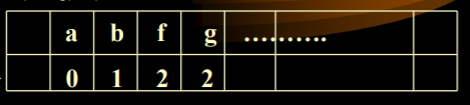

+ 左子女—右兄弟表示法

  

### Forest -> Binary Tree 森林 轉 二叉樹

- Forest 森林：多棵樹的集合


1. 將每棵樹轉為二叉樹(任何節點 v 第一個子節點為 vL 其餘子節點排列為右鏈，作為 vL 的右子樹)
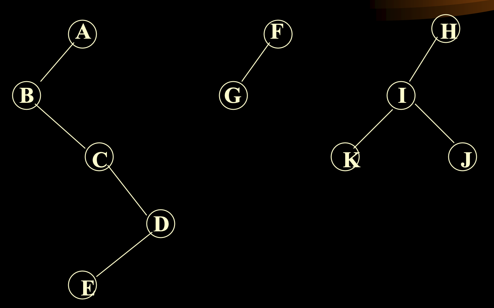

2. 將所有子樹以右鏈相連


### 树遍历

+ **深度優先遍历：**
  1. 先序次序遍历（先序）与对应的左子女—右兄弟的二叉树的先序遍历一致
  2. 后序次序遍历（后序）与对应的左子女—右兄弟的二叉树的中序遍历一致

+ **廣度優先遍历：**
  1. 分层访问


### 森林遍历

+ **先根次序遍历：** 
  1. 访问F的第一棵树的根 
  2. 按先根遍历第一棵树的子树森林 
  3. 按先根遍历其它树组成的森林
  4. 等于二叉树的先序
+  **中根次序遍历：** 
  1. 按中根遍历第一棵树的子树森林 
  2. 访问F的第一棵树的根 
  3. 按中根遍历其它树组成的森林
  4. 等于二叉树的中序
+ **后根次序遍历：** 
  1. 按后根遍历第一棵树的子树森林 
  2. 按后根遍历其它树组成的森林 
  3. 访问F的第一棵树的根
  4. 等于二叉树的后序
+ **广度优先遍历（层次遍历）**


## 3. String 字符串

### Component 組成
1. string 串：字符組成的有限序列(用""包起來)
2. length 串的長度：字符個數，不包括分界符("")和結束字符('\0')
3. null 空串：不包含任何字符的串(或只包含結束字符的串)
4. subString 子字符串：串中任意連續子序列

### Operation 操作
1. String create() 創建字符串
2. int length() 求串長
3. String concat(string1, string2) 連接兩個字符串(並置)
4. String subString(start, end) 取子字符串
5. int find(subString) 求子串第一次出現的位置
6. (Java) boolean equals(Object obj) 比較字符串是否相等
6. (Java) char charAt(int index) 字符在串中第一次出現的位置

## 4. Thread Tree 線索樹
+ **目标：**n个结点的二叉树有2n个链域， 其中真正有用的是n – 1个，其它n + 1个都是空域。为了充分利用结点中的空域，使得对某些运算更快。

- 增加前驅(上一个被输出的节点)與後繼(下一个被输出的节点)的指針，加速遍歷運算
- 根据多加的标识位(leftThread、rightThread)判断子节点(leftchild、rightchild)存的是什么

- 不同遍歷順序對應不同的線索方式


## 5. Huffman Tree 霍夫曼樹
- **增長樹：**將原樹度為 0 的節點添加 2 個外節點，度為 1 的節點添加 1 個外節點

- **霍夫曼树：**给定n个权值作为n个叶子结点，构造一棵二叉树，若带权路径长度达到最小，称这样的二叉树为最优二叉树，也称为霍夫曼树(Huffman Tree)。

### Properties 屬性
1.  外通路长度（外路径）E：根節點到外節點(度為 0，也就是後來添加的節點)的路徑長總和    
ex: 3 + 3 + 2 + 3 + 4 + 4 + 3 + 3 = 25
2. 内通路长度（内路径）I：根節點到內節點(度不為 0，也就是原本的節點)的路徑長總和    
ex: 2 + 1 + 3 + 2 + 1 + 2 = 11
3. 帶權路徑長：路徑乘以節點的權重

### Representation 表示
- m 個數作為外節點構造霍夫曼樹


### Huffman算法

+ **思想：** 权大的外结点靠近根， 权小的远离根。 
+ **算法：** 
  1. 假设有W1、W2、、、、Wm个权值。
  2. 从这些权值中找出两个最小值W1，W2构成新的权值W=W1+W2,也就是建立一棵二叉树，这个二叉树表通过该结点的频度。
  3. 然后对剩下的权值W， W3，W4，…Wm 经由小到大排序，
  4. 重复2、3直到剩一个权值，也就是树的根。
+ 当内结点的权值与外结点的权值相等的情况下， 内结点应排在外结点之后。

### Huffman Code 霍夫曼編碼

- 將各個字符的使用頻率作為權值，構造霍夫曼樹
- 左子樹標號 0，右子樹標號 1，路徑編碼作為字符的霍夫曼編碼
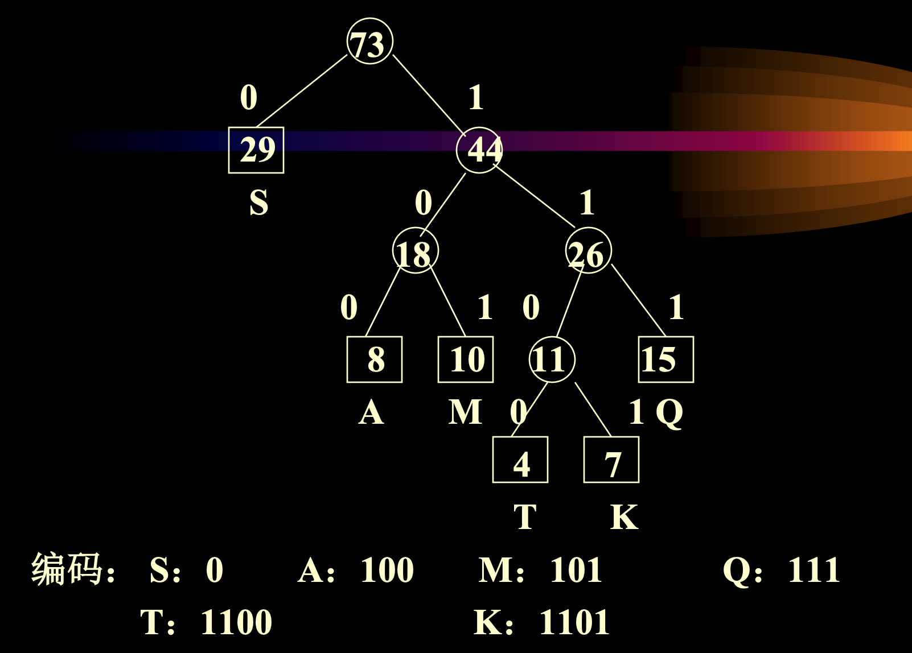


## 6. General List 廣義表
- 序列中元素可以是另一個序列

### Properties 屬性
1. 長度：元素個數
2. 深度：所含元素最大層數


### Operation 操作
1. Node head(list) 取表頭
2. Node tail(list) 取表尾
3. Node first(list) 取第一個元素
4. T info(node) 取元素內容
5. Node next(node) 下一個元素
6. Class<T> nodeType(node) 返回元素類型(原子或是子表)
7. boolean push(list, element) 插入元素
8. boolean addon(list, x)
9. boolean setinfo(element, x) 設置節點內容
10. boolean sethead(list, x) 設置表頭
11. boolean setnext(element1, element2) 設置下一個元素
12. boolean settail(list1, list2) 設置表尾

- Node 類型


# Specific Trees

## 1. Binary Search Tree 二叉搜索樹

### Properties 屬性

1. 任兩個節點的鍵(key)不相等

2. 节点左子树的鍵比节点的鍵小

3. 节点右子树的鍵比节点的鍵大

4. 左/右子樹分別也是一棵二叉搜索樹
    

  ### index Binary Search Tree 標號二叉搜索數

  1. 由二叉树衍生，增加Leftsize。
  2. Leftsize的值 = 左子树的元素个数 + 1

  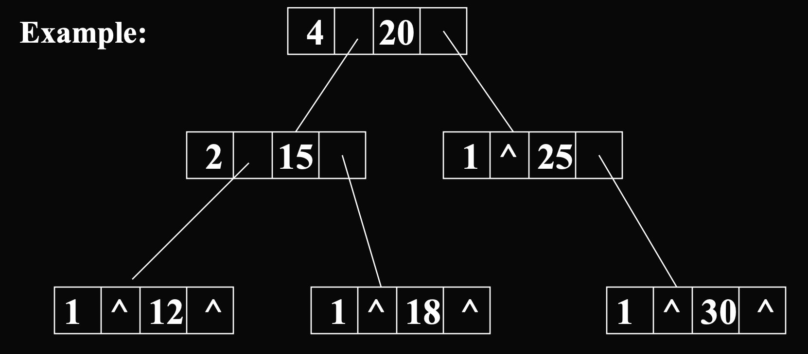

+ **插入：**

  ```java
  private BinaryNode insert( Comparable x, BinaryNode t ){ 
      if( t = = null )
          t = new BinaryNode( x, null, null );
      else if( x.compareTo( t.element ) < 0 )
          t.left = insert( x, t.left );
      else if( x.compareTo( t.element ) > 0 )
          t.right = insert( x, t.right );
      else
          ; //duplicate; do nothing
      return t;
  }
  ```

+ **删除：**

  1. 删除节点
  2. 找左子树最大的节点或右子树最小的节点来代替删除的节点位置。
  3. 删除替代的节点原来位置上重复的节点。

  ```java
  private BinaryNode remove( Comparable x, BinaryNode t ){ 
      if( t == null )
          return t;
      
      //找要删除的值x
      if( x.compareTo( t.element ) < 0 ) //过大
          t.left = remove( x, t.left );
      else if( x.compareTo( t.element ) > 0 ) //过小
          t.right = remove( x, t.right );
      else if( t.left != null && t.right != null ){ 
          t.element = findMin( t.right ).element;
          t.right = remove( t.element , t.right );
      }else
          t = ( t.left != null ) ? t.left : t.right;
  }
  ```

  

## 2. AVL Tree 平衡樹
- **Purpose 目的：**提高二叉搜索樹的效率並減少平均搜索長度

- **高度：**平均高度 —— O(log_2 n) = 搜索的时间复杂度

- **定义：**

  1. 二叉搜索树。
  2. 每个节点满足左子树高度 - 右子树高度 = 1。

- **平衡方法：**从不平衡的那个节点开始往下看，分为4种类型

  1. 右侧外外 —— 左单旋（提右降左）= 左下旋

  

  2. 右侧外内 —— 先右后左

  

  3. 左侧外外 —— 右单旋（提左降右）= 右下旋

  

  4. 左侧外内 —— 先左后右

  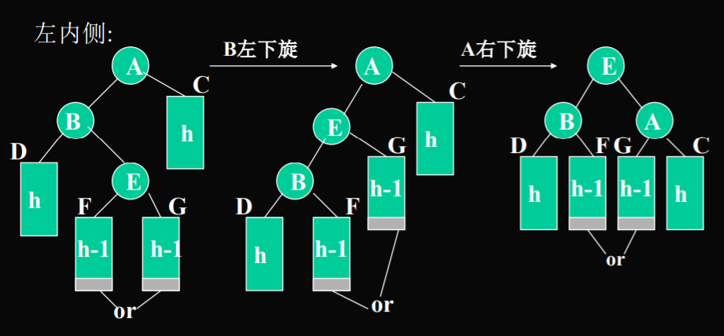

### Properties 屬性
1. 符合二叉搜索樹的要求
2. 左子樹高度和右子樹高度相差 <= 1
3. height 高度：最深節點的層數作為樹的高度
4. Balance Factor 平衡因子：右子樹高度減左子樹高度
5. height 高度：n 個節點的AVL樹高度為O(log_2 (n))

### Special Operation 特殊操作
- insert 插入：插入後可能引發高度不平衡 -> 旋轉 —— 最坏：O(log_2 n)

1. 單旋轉(LL, RR 外側)：由 A(h+3){B(h+2){BL(h+1), BR(h)}, C(h)} -> B(h+2){BL(h+1), A(h+1){BR(h), C(h)}}


2. 雙旋轉(LR, RL 內側)：執行兩次單旋轉


EX: 依序列{A, Z, C, W, D, X ,Y} 構造AVL
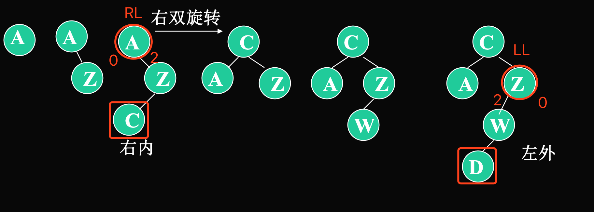


## 3. m-way Tree m路搜索樹

### Prperties 屬性
1. 所有節點至多有 m 個子節點(度最大為 m)，由 p = m-1 個標記分開

2. 有 p 個標記的節點，必有恰好 p+1 個子節點

3. 高度h的m路搜索树元素数量介于h与m^h - 1

4. 有n个元素的m路搜索树高度介于log_m (n+1) 与n

  
```
key(C0) < k1 < key(C1) < k2 < ... < kp < Cp
ki <= Ci <= k(i+1)
```
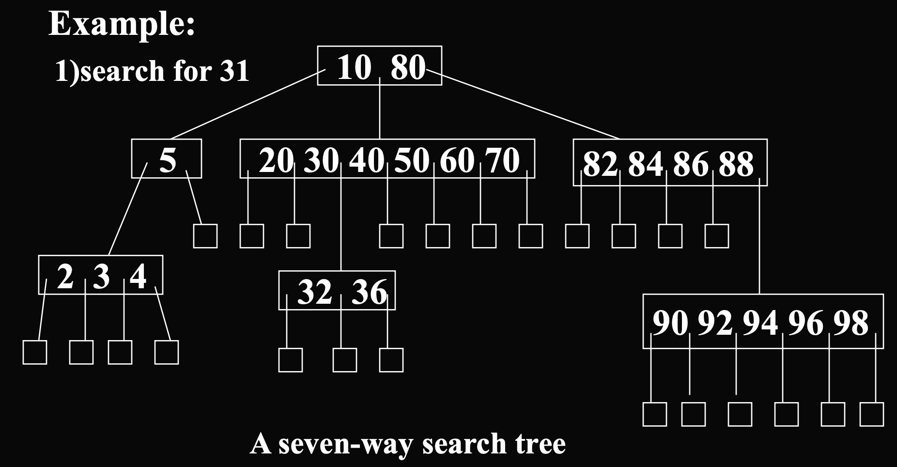

3. height 高度：n 個節點的樹的高度`最小為 logm(n+1) 層`，`最多為 n 層`
4. nodes 節點數：高度為 h 的樹`最少有 h (一層一個)個節點`，`最多有 m^h - 1 個節點`

## 4. B Tree B樹(Balenced-Tree)
- 二叉搜索樹 -> (帶平衡條件) -> 平衡二叉搜索樹(AVL 樹)
- m路搜索樹 -> (帶平衡條件) -> 平衡m叉搜索樹(B-樹)

### Definition (Properties) 定義(屬性)
1. m阶的B树是一个m路搜索树。
2. 根節點至少有兩個子節點
3. 除了根節點之外所有內節點至少有 ceil(m/2) 個子節點
4. 所有内节点不能超过(m -1)。
5. 所有外節點都在同一層 
    
6. 外節點數 = 鍵數 + 1
    

### Operation 操作
1. **search 搜索：**任何搜索不超過 h(高度) 次 —— O(h)
2. **insert 插入：**插入發生在外節點上面一層(必為內節點)  


- 若插入 m-1 個關鍵碼(key)的節點(full node)，需作分裂：取中間元素為上一層的關鍵碼
- EX 1

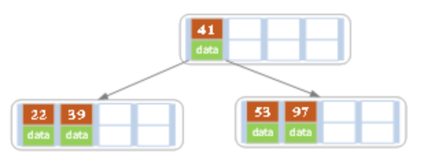
- EX 2


3. deletion 刪除：分成三種情況
    1) 用後繼點取代刪除鍵值
    2) 若該節點含有 >= ceil(m/2) - 1 個鍵：直接刪除
    3) 若兄弟節點節點含有 >= ceil(m/2) - 1 個鍵：向旁邊借一個(父鍵下移，兄弟節點鍵上移)
    4) 若兄弟節點節點含有 == ceil(m/2) - 1 個鍵：父鍵下移，並與兄弟節點組成一個節點

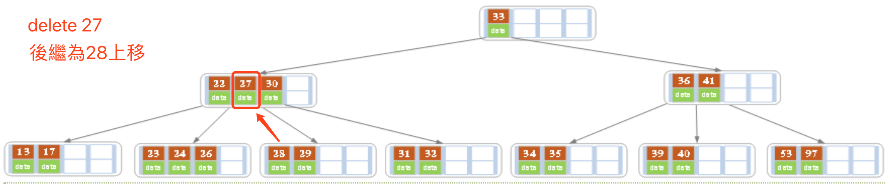
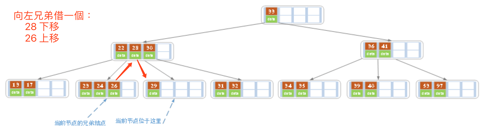

