# Graph 圖

## Definition 定義
- G = G(V, E)：V 頂點(`vertex`)集合、E 邊(`edge`)的集合
- Undirected Graph 無向圖：邊為雙向(或稱為無向)，即 (v0, v1) = (v1, v0)

- Directed Graph 有向圖：邊為有向(可能單向可能雙向 <start, end>)，即 <v1, v2> != <v2, v1>
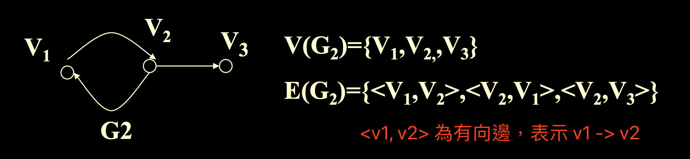
- 不討論多重邊({<v1, v2>, <v1, v2>, ...})或自反邊({<v1, v1>})
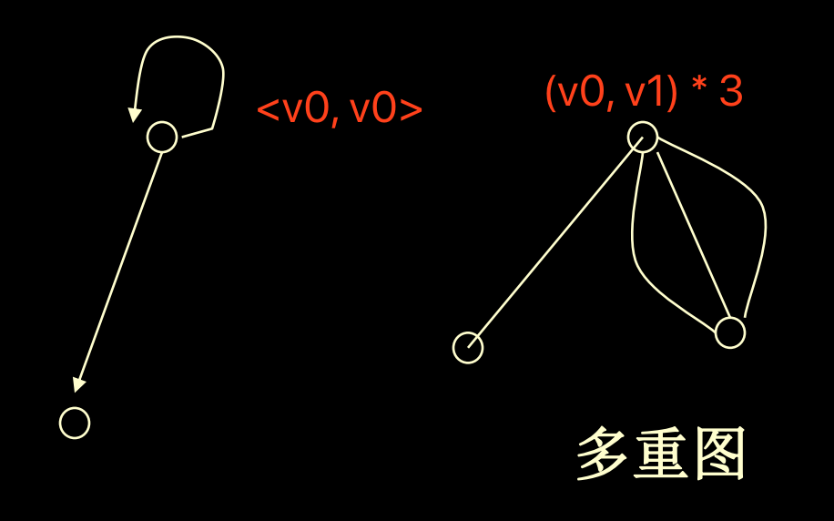

## Properties 屬性(性質)

### Degree of Vertex 頂點的度
- TD(v) 度：以 v 為端點的邊的數量
- ID(v) in-degree 入度：進入 v 的邊的數量
- OD(v) out-degree 出度：離開 v 的邊的數量
- TD(v) = ID(v) + OD(v)
- 圖中所有邊的數量 e = sum(TD(vi))/2 = 所有點的度的總和/2

### SubGraph 子圖
- 對於 G = G(V, E)，G' = G'(V', E')，其中 V' 為 V 的子集，E' 為 E 的子集，且E' 的所有端點都在 V' 內，稱 G' 為 G 的子圖


### Path 路徑
- p: i1, i2, i3, ..., ik：由i1到i2到...ik的邊的有序集合

#### Simple Path 簡單路徑
- 起點與終點不同

#### Cycle Path 迴路
- 起點與終點相同

### Connected 連通的
- 若存在一條路徑 p 從 vi 到 vj(p = vi, ..., vj)，稱vi, vj為連通的
- 对无向图来说，如果两个顶点连通，则此图是连通的

## Category 分類

### Undirected Graph 無向圖
- 圖中每個節點至多有 n-1 個邊，n 個節點的圖共有 r 個邊，有 r <= n * (n - 1) / 2

### Complete Graph 完全圖(完全無向圖)
- 若邊數 r = n * (n - 1) / 2，即每個節點有 n-1 個邊
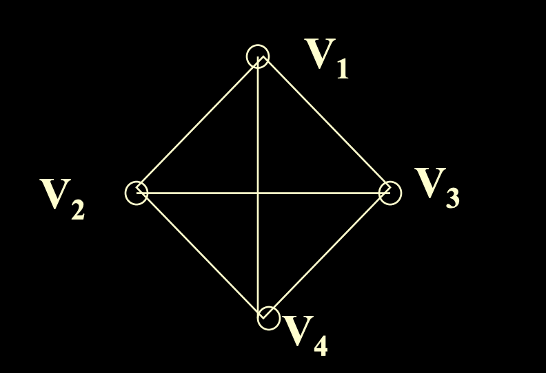

### Directed Graph 有向圖
- 圖中每個節點至多有 (n-1) * 2 個邊(進入&離開)，n 個節點的圖共有 r 個邊，有 r <= n * (n - 1)

### Complete Directed Graph 完全有向圖
- 若邊數 r = n * (n - 1)，即每個節點有 n-1 個離開的邊與 n-1 個進入的邊


#### Connected Graph 連通圖
- 若圖中所有點都是連通的
- 若圖不是連通的，各子連通圖稱為`Branch 分支`
- `Maximum connected subgraph 最大子連通圖`又稱為`Connected Component 連通組件`

#### Strong Connected Graph 強連通圖
- 對有向圖中每個頂點對(i, j)都存在 i 到 j 和 j 到 i 的路徑

### Network 網路
- 當賦予邊權重(weight / cost)時，稱為加權圖(Weighted Graph/weighted digraph)。
- 網絡指加权的连通图。


### Spanning tree 生成树

+ 一个连通图的生成树是他的`minimum connected subgraph 极小连通子图`。
+ 一个有n个节点的生成树有(n - 1)个边。


## Representation 表示

### Adjacency 鄰接的
- 某個邊 e 的兩端點為 v1, v2，則稱 v1, v2 為鄰接的

#### Adjacency Matrix 鄰接矩陣

+ G=(V,E), V={V1 ,V2 ,……,Vn }
+ A(i,j)= 1 if <i,j>,<j,i>属于E or (i,j)属于E ，A(i,j) = 0 otherwise
+ 无向图的矩阵是对称的。

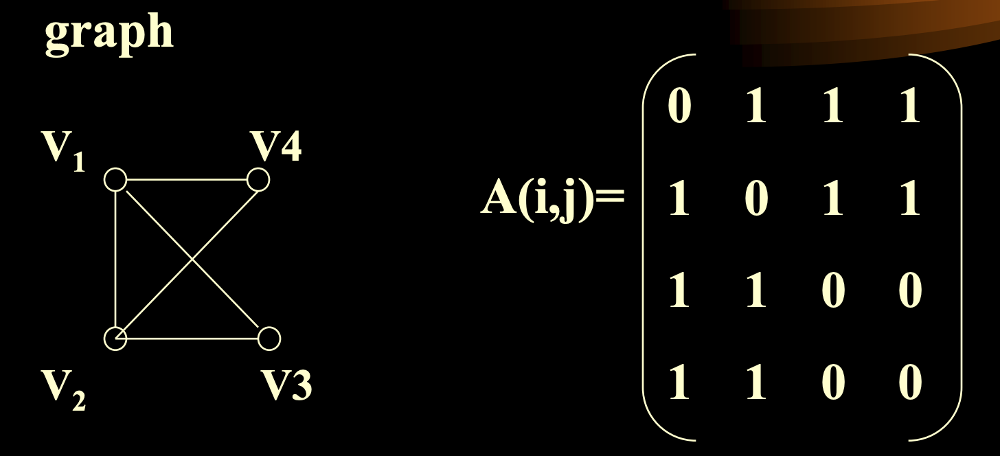
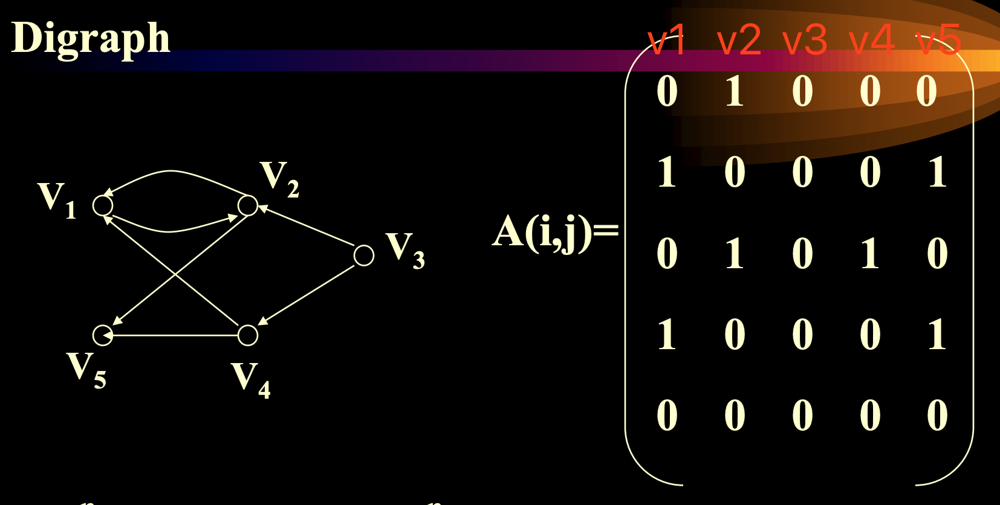

#### Linked-Adjacency List 鄰接鏈錶
- 使用線性表(元素序號為數組下標)，帶上鏈表(鄰接的頂點)

- 当边数少时，减少储存需求。

  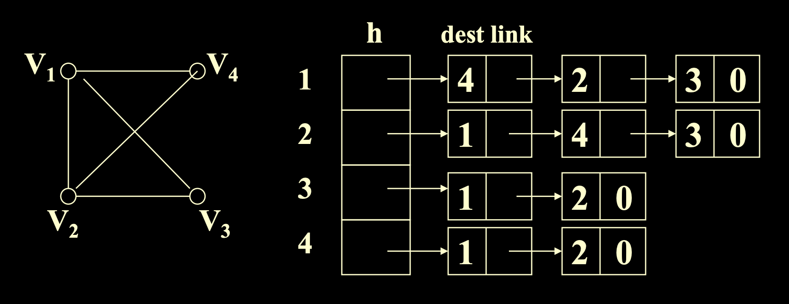
  

#### Adjacency Multilist 多重鄰接表
- 鄰接鏈表對於同一條邊會存在多個節點，使用多重鄰接表可減少節點數量(一條邊一個節點)
- 無向圖
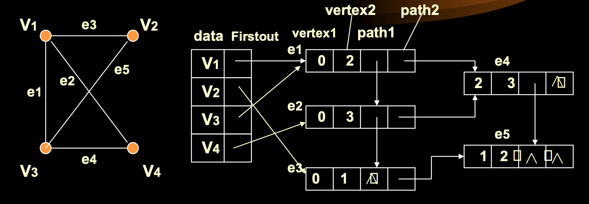

- 有向圖


## Operation 操作

### Traversal 遍歷
- 自樹中某個頂點出發訪問所有頂點，並且每個頂點只訪問一次。
- **遍历二叉树：**前序, 中序, 后序
- **遍历树：** 
  1. 深度优先遍历 (先根,后根) 
  2. 广度优先遍历 
- **遍历森林：** 
  1. 深度优先遍历 (先根,中根,后根) 
  2. 广度优先遍历 
- **遍历图：**
  1. 深度优先遍历 DFS (Depth First Search) 
  2. 广度优先遍历 BFS (Breadth First Search)

#### DFS Depth First Search 深度優先算法
- 訪問頂點 v0，然後訪問其中一個未被訪問的子節點，遞歸訪問
- 若不存在未被訪問的子節點，退回到路徑上含有未被訪問子頂點的頂點，訪問問被訪問的子節點，递归实现。


```c++
template<NameType,DistType> void Graph<NameType,DistType> :: 
DFS(int v,visited[]){ 
    cout<<GetValue(v)<<'';
    visited[v]=1;
    int w=GetFirstNeighbor(v);
    
    while (w!=-1){ 
        if(!visited[w]) 
            DFS(w,visited);
        w=GetNextNeighbor(v,w);
    }
}

```

- **算法複雜度：**鄰接表 O(n + e)，鄰接矩陣 O(n^2)

#### BFS Breadth First Search 廣度優先遍歷
- 訪問頂點 v0，先訪問 v0 的所有子頂點 v1, v2, ..., vk，然後依序訪問 vi(i=1~k)中沒有被訪問過的子頂點，非遞歸實現。


```c++
template<NameType,DistType> void Graph<NameType,DistType> :: BFS(int v){
    int* visited=new int[NumVertices];
    for (int i=0; i<NumVertices; i++) 
        visited[i]=0;
    cout<<GetValue(v)<<'';
    visited[v]=1;
    queue<int> q;
    q.EnQueue(v);
    
    while(!q.IsEmpty()){ 
        v=q.DeQueue();
        int w=GetFirstNeighbor(v);
        while (w!=-1){ 
            if(!visited[w]){ 
                cout<<GetValue(w)<<'';
                visited[w]=1;
                q.EnQueue(w);
            }
            w=GetNextNeighbor(v,w);
        }
    }
    delete[] visited;
}
```

- **算法複雜度：**鄰接表 O(n + e)，鄰接矩陣 O(n^2)

#### 連通分量：對於非連通無向圖

+ 连通分量 = 最大连通子图

- 對每個分支做一次遍歷即可


### Spanning Tree 生成樹
- 含有 n 個頂點與 n-1 條邊的子圖
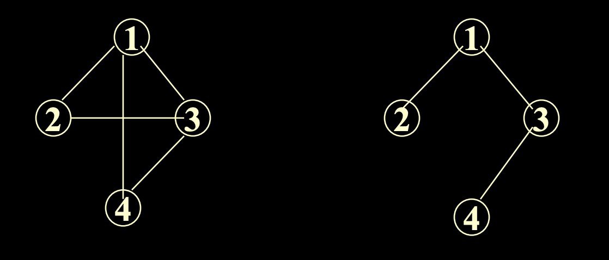

#### Minimum-cost Spanning Tree 最小(代價)生成樹
- 找到個邊權值總和最小的生成樹
- 一棵樹的`極小連通子圖(Mimimum Connected Graph)`稱為最小生成樹


### 贪心算法

- **Kruskal 算法：**G(V, E)，取 E' = {} —— *添加最小边到图里*
1. 每次找出 E 中最小權值的邊 ei(不使 E' 中的邊形成迴路)
2. 使 E = E - {ei}, E' = union(E', {ei})
3. 遞歸直到 |E'| = n-1，即存在 n-1 個邊，恰好將 n 個頂點連通在一起
4. 算法分析：
   + e 边的条数、n 顶点个数
   + 检测邻接矩阵O(n^2 )
   + 每插入一条边，执行一次最小堆入堆 -> fiterup() 算法：log_2 e -> 总的建堆时间为O(elog_2 e) —— 最坏情况
   + e次出堆操作：每一次出堆，执行一次filterdown(), 总时间为O(elog_2 e)
   + 2e次find操作：O(elog_2 n) —— 并查集查找（有两顶点）
   + n-1次union操作：O(n) —— 并查集合并
   + 总的计算时间为 O(elog_2 e + elog_2 n + n^2 + n)

```c++
void Graph<string , float>::Kruskal(MinSpanTree&T){ 
    MSTEdgeNode e;
    MinHeap<MSTEdgeNode>H(currentEdges);
    int NumVertices=VerticesList.Last , u , v ;
    Ufsets F(NumVertices); //建立n个单元素的连通分量
    
    //建立边的类并加到最小堆里面
    for(u=0;u<NumVertices;u++)
        for (v=u+1;v<NumVertices;v++)
            if(Edge[u][v]!=MAXINT){ 
                e.tail=u;
                e.head=v;
                e.cost=Edge[u][v];
                H.insert(e);
            }
    
    int count=1; //生成树边计数
    while(count<NumVertices){ 
        H.RemoveMin(e);
        u=F.Find(e.tail); 
        v=F.Find(e.head);
        
        if(u!=v){
            F.union(u,v);
            T.Insert(e);
            count++;
        }
    }
}
```

- **Prim 算法 O(n^2)：**G(V, E) —— *每到一个顶点找最小边出去*
1. 取 V 中任意頂點 v0，使 N = {v0}, E' = {}

2. 找到與 N 中任意頂點相連的邊權重最小的邊 e0，將 e0 的另一端點 vi(vi 不在 N 中)，使 N = union(N, vi), E' = union(E', e0)

3. 遞歸直到 |N| = n, |E'| = n-1，即選中 n 個頂點與 n-1 條邊，構成最小生成樹

4. 算法分析：

  + 时间复杂度：n + n(n + n) = O(n^2 )

  
  
  

```c++
void graph<string,float>::Prim(MinSpanTree&T){ 
    int NumVertices=VerticesList.last;
    float*lowcost=new float[NumVertices];
    int * nearvex=new int[NumVertices];
    for (int i=1;i< NumVertices;i++){
        lowcost[i]=Edge[0][i]; 
        nearvex[i]=0;
    }
    nearvex[0]=-1;
    MSTEdgeNode e;
    for (int i=1; i< NumVertices; i++){ 
        float min=MAXINT; int v=0;
        for ( int j=1; j< NumVertices; j++)
            if(nearvex[j]!=-1&&lowcost[j]<min){
                v=j; 
                min=lowcost[j];
            } //for j, 选择最小的边
        if (v){ 
            e.tail=nearvex[v];
            e.head=v;
            e.cost=lowcost[v];
            T.Insert(e);
            nearvex[v]=-1;
            for(int j=1; j< NumVertices; j++)
                if( nearvex[j]!=-1 && Edge[v][j]<lowcost[j] ){ 
                    lowcost[j]=Edge[v][j]; 
                    nearvex[j]=v;
                }
        } //if
    } //for i
}
```

### Shortest Path 最短路徑

- v 到 w 的所有路徑中，權值(cost 代價)總和最小的路徑

#### Dijkstra 算法(非負權值單源最短路徑)
- 圖中所有邊的權值非負(>=0)
- 計算圖中某點 v0 到其他各點 vi 的最短路徑

- 步驟
1. 選擇起始點 v0，使 S = {v0}，E = {}，E' 為 p:s, vi(s 為 S 中的點)，即 S 中元素到非 S 中元素的最短邊的集合
2. 選擇權值(代價)最小的邊 ei 加入 E，即 E = union(E, {ei})，S = union(S, {vi})
3. E 中的元素必表示 v0 到 s 的最短距離(s 為 S 中元素)
4. 更新 E' 集合，重複2,3步驟直到所有點的最短距離都找到


```c++
void Graph::shortestpath(int n,int v){ 
    for( int i=0; i<n; i++){ //初始将除v外所有点设为为加入
        dist[i]=Edge[v][i];
        s[i]=0;              //s[i]==1表示点i已加入
        if( i!=v && dist[i]< MAXNUM ) 
            path[i]=v;
        else 
            path[i]=-1;
    }
    
    s[v]=1; 
    dist[v]=0;
    for( i=0; i<n-1; i++){ //共遍历n-1次
        float min=MAXNUM; 
        int u=v;
        for( int j=0; j<n; j++)//选择未加入的最近的点加入
            if( !s[j] && dist[j]<min ) { 
                u=j; min=dist[j];
            }
        s[u]=1;
        for ( int w=0; w<n; w++)//计算经过新点到其他点的距离
            if( !s[w] && Edge[u][w] < MAXNUM &&
               dist[u]+Edge[u][w] < dist[w]){
                
                dist[w]=dist[u]+Edge[u][w]; 
                path[w]=u;
            }
    }//for
}
```

- **複雜度：**O(n^2)

#### Bellman-Ford 算法(任意權值單源最短路徑)(貝爾曼-福特)
- 構造最短路徑長度數組，dist^i[u]為從源點(起點)經過 i 條邊到達 u 的最短路徑長度
- 帶負權值邊不可構成迴路(v0 [+a]-> v1 [-b] -> v0，相當於不動而長度自減)
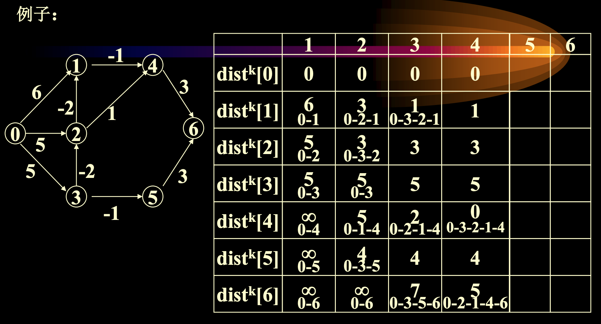

```c++
void Graph::BellmanFord(int n, int v){ 
    for(int i=0;i<n;i++){ 
        dist[i]=Edge[v][i];
        if(i!=v&&dist[i]<MAXNUM)
            path[i]=v;
        else 
            path[i]=-1;
    }
    
    for (int k=2;k<n;k++)
        for(int u=0;u<n;u++)
            if(u!=v)
                for(i=0;i<n;i++)
                    if (Edge[i][u]< >0 && Edge[i][u]<MAXNUM &&
                        dist[u]>dist[i]+Edge[i][u]{
                            dist[u]=dist[i]+Edge[i][u];
                            path[u]=i;
                        }
}
```

- 複雜度：O(n^3)

#### Floyed 算法 所有頂點的最短路徑(非負權值)
- 計算所有頂點的最短路徑和
1. 執行 Dijkstra 算法 n 次
2. Floyed 算法

- 複雜度：都是 O(n^3)

- Floyed 算法步驟
1. 以鄰接矩陣表示，初始矩陣為 A0，自反邊長度為 0，未連通視為無限

2. 作 n-1 次迭代(路徑最多長 n-1)，每次令 Ai[i, j] = min(Ai-1[i, j], Ai-1[i, 1] + Ai-1[1, j])，即上次迭代最短路徑(<v0, vi-1>)與再經過一條邊(<v0, vk, vi-1>)的路徑取最小值作為新的最短路徑(<v0, vi>)

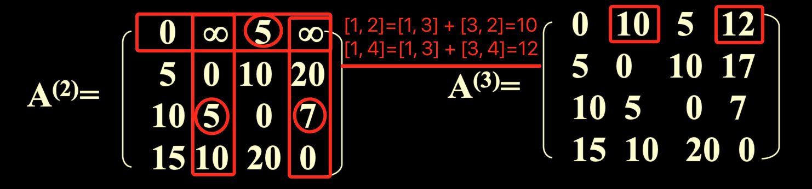


```c++
void Graph::Alllength(int n){ 
    for(int i=0; i<n; i++)
        for(int j=0; j<n; j++){ 
            a[i][j]=Edge[i][j];
            if(i==j) a[i][j]=0;
            if(i< >j&&a[i][j]<MAXNUM)
                path=i;
            else 
                path[i][j]=0;
        }
    for(int k=0; k<n; k++)
        for(int i=0; i<n; i++)
            for(int j=0; j<n; j++)
                if( a[i][k]+a[k][j]<a[i][j] ){ 
                    a[i][j]=a[i][k]+a[k][j];
                    path[i][j]=path[k][j];
                }
    
}
```

### Activity Network 活動網絡

- 用`頂點`表示活動的網絡 AOV 網絡
- 用`邊`表示活動的網絡 AOE 網絡

#### AOV Active on Vertex Network 頂點活動網絡
- 用頂點表示活動，邊表示`先後順序(符號 -<)`(關係一個`偏序集`，使用`無環有向圖`實現)


- 圖中存在邊 <i, j>，稱 i 為 j 的`直接前驅`，j 為 i 的`直接後繼`
- 圖中存在路徑 p:i -> j，稱 i 為 j 的`前驅`，j 為 i 的`後繼`

#### Topological Sort 拓扑排序
- 圖 G(V, E) 中 V 的線性排序
- **條件：**若存在邊 <i, j>，則線性序列中 i 必須在 j 前面
- **算法步驟：**透過無環有向圖進行拓墣排序
1. 尋找圖中入度為 0 的節點 ei(存在多個則次序任意)
2. 刪除 ei 與所有 ei 的出邊
3. 遞歸直到所有節點都被消去，刪除順序即為拓墣排序

- **Implement 實現**


- **算法分析：**
  1. n个顶点，e条边 
  2. 建立链式栈O（n） 
  3. 每个结点输出一次，每条边被检查一次O（n＋e） 
  4. 复杂度：O(n+n+e)

#### AOE Active on Edge Network 邊活動網絡(事件頂點網絡)
- 邊代表活動，頂點代表事件(狀態)，邊上權重代表活動需要時間
- 存在唯一入度為 0 的點(源)，為起始狀態
- 存在唯一出度為 0 的點(匯)，為終止狀態
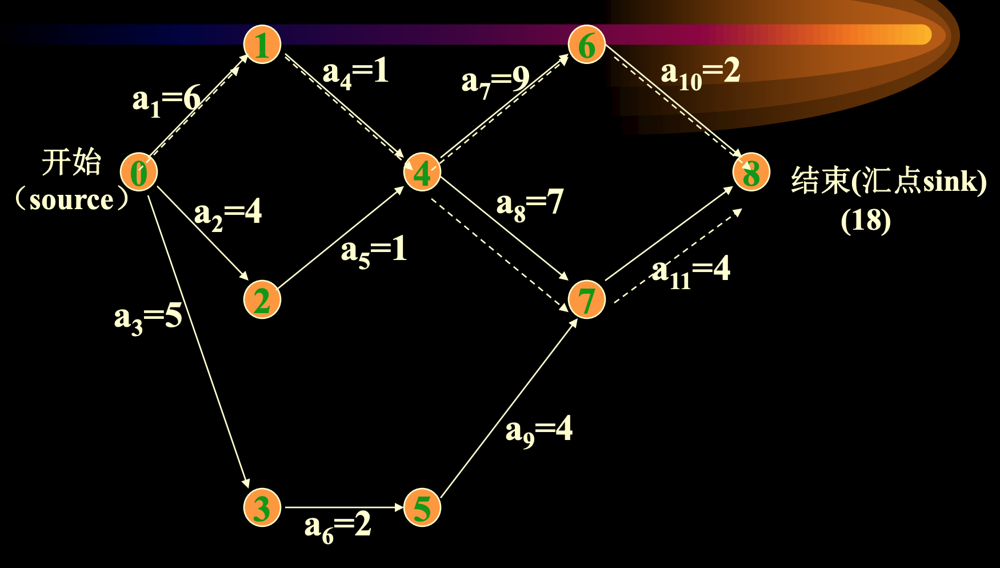

##### Critical Path 關鍵路徑
- 從開始到結束最長的路徑(時間瓶頸)

- 相關變量
1. Ve[i] 最早發生時間：為 v0 -> vi 的最長路徑長度（因为要把前面所有事先工作做完才能做vi，因此找前面路径最大值）
2. Vl[i] 最遲發生時間：為 Ve[i] - (vi -> vn-1 的最長路徑)（下一个动作 j 至少要Ve[j]个时间，因此我这个事件可以在Ve[i + 1] - <vi, vj>的时间前完成就行）
3. e[k] 活動 ak: <vi, vj>的最早開始時間，e[k] = Ve[i]
4. l[k] 活動 ak: <vi, vj>的最遲開始時間，l[k] = Vl[i] - dur(<i,j>)
5. `Slack time` 鬆弛時間：l[k] - e[k] 事件`最早可能開始時間`與`最遲可能開始時間`的差
6. l[k] == e[k]  —— ak是没有时间余量的关键活动（不能推迟或提前）


- 尋找關鍵路徑算法步驟：
1. 定 Ve[0] = 0，推出所有 Ve[i] 的值，也就是其餘點的最早可能發生時間
2. 由 Ve[n-1] 逆推，推出所有 Vl[i] 的值，也就是其餘點的最遲可能發生時間
3. 1,2步驟都必須依照拓墣排序順序，且 Ve[i] 必須算出所有前驅才能計算，Vl[i] 必須算出所有後繼才能計算

##### Implement 實現(Representation 表示)
- 使用鄰接表表示，且下標順序已為一個拓墣排序


```c++
void Graph ::CriticalPath ( ){ 
    int i , j ; 
    int p, k ; float e, l ;
    float * Ve=new float [n]; 
    float * Vl=new float[n];
    
    for (i=0; i<n ; i++) //初始化所有Ve=0
        Ve[i]=0;
    for (i=0; i<n ; i++){ //取每一个点，将其后续点根据边权关系赋值
        Edge <float> * p=NodeTable[i].adj;
        while (p!=NULL){ 
            k = p. dest;//修改开始时间小于当前时间加上边权的后续点
            if (Ve[i]+p. cost > Ve[k]) 
                Ve[k]=Ve[i]+p.cost ;
            p=p.link;;//获取当前点的下一个后续点
        }
    }//求Vl，将所有点初始化为结束点开始时间
    for (i=0; i<n ; i++)Vl[i]=Ve[n-1];
    for (i=n-2; i>=0 ; i--){ //取每一个点，将其时间根据后续权赋值
        p=NodeTable[i].adj;
        while(p!=NULL){ 
            k=p. dest;//如果当前点开始时间大于后续时间减去边权
            if (Vl[k]-p.cost<Vl[i])
                Vl[i]=Vl[k]-p. cost ;//则修改
            p=p. link;//获取下一个后继点
        }
    }
    for (i=0; i<n ;i++){ 
        p=NodeTable[i].adj;
        while (p!=NULL){ //最早开始时间==最迟的点为关键点
            k= p. dest;
            e=Ve[i]; 
            l=Vl[k]-p. cost ;
            if(l= =e)
                cout<< "<" <<i<< "," << k 
                << " > "<< "is critical Activity" << endl;
                p=p. link;
        }
    }
}
```

- **複雜度**
1. 拓墣排序求 Ve[i] + 逆拓墣排序求 Vl[i] O(n + e)
2. 求各活動 e[k], l[i] O(e)
3. 全部 O(n + e)
