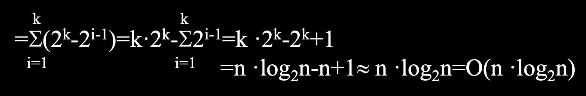
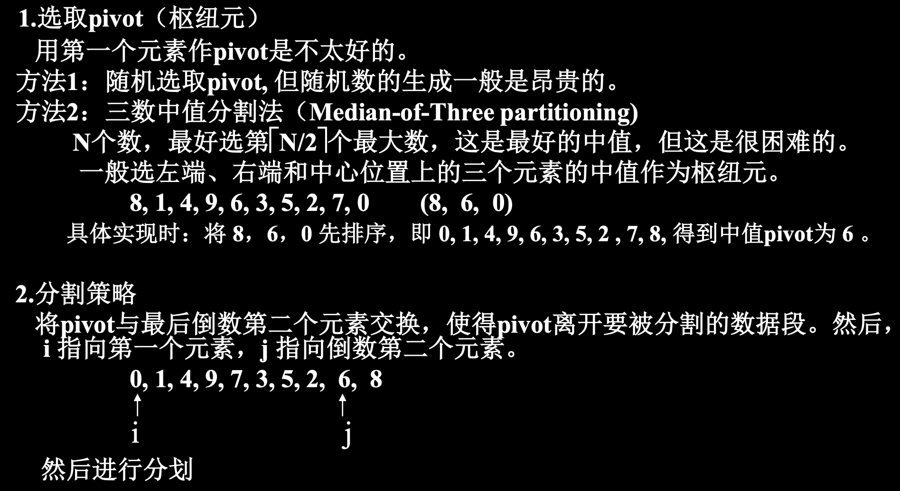
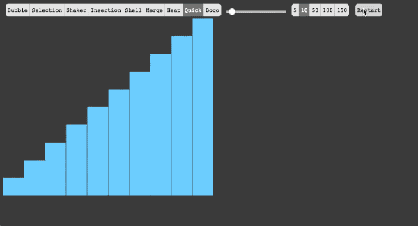
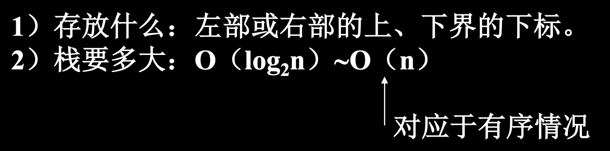
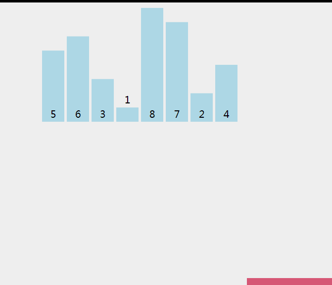
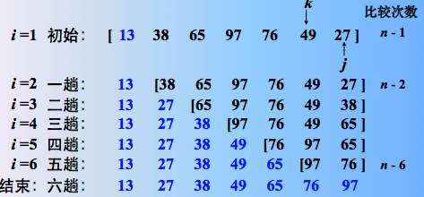
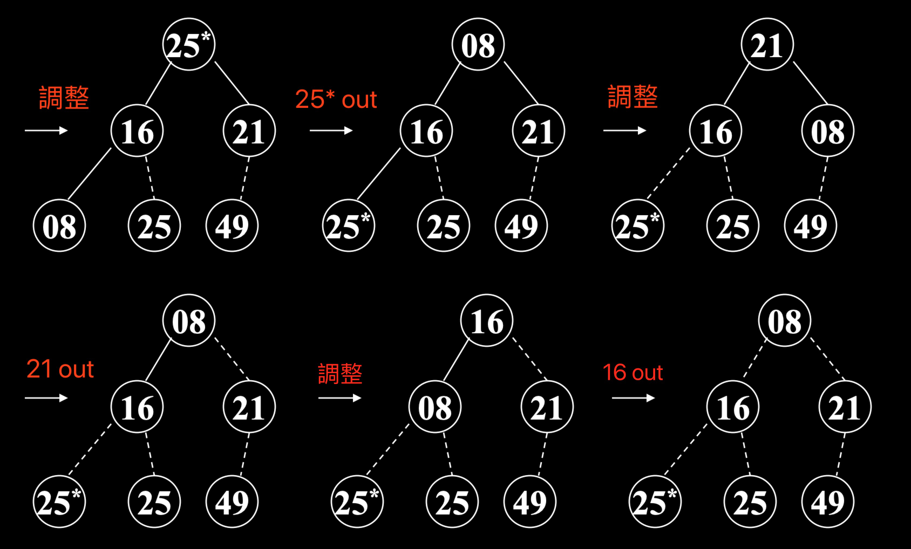
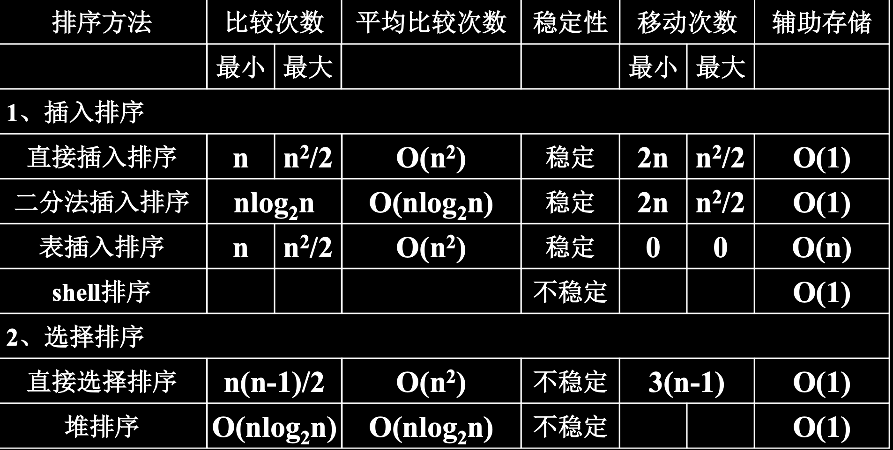

# Sorting 排序算法

## 0. General Idea
- **排序：**將元素(基本數值或是可比較對象)按照其关键码小往大(非遞減)或大往小(非遞增)次序重新排列
- **key 關鍵碼：**由原數據(Data)計算得出或標記(tag)作為比較前後順序的依據

### Category 分類
- **內排序：**內存中 n 個對象的排序
1. 插入排序
2. 交换排序
3. 选择排序
4. 归并排序
5. 基数排序

- **外排序：**數據量較大，或數據牽涉磁盤與內存間的移動

### Stability 穩定性
- **穩定的：**關鍵碼相同的元素在排序後前後次序不變
- **不穩定的：**相反

### Algorithm Analysis 算法分析
- **Time Complexity 時間開銷：**比較次數、數據移動次數
  + 比较总次数 KCN + 移动次数 RMN
- **Space Complexity 空間開銷：**所需附加空間
- **原數據表定義**


## 1. Insert Sort 插入排序

### 0. Main Idea 主要思想
- 將 Vn 插入以排序好的 0 ~ V(n-1)裡面

### 1. Straight Insert Sort 直接插入排序
- 將第 i 個元素依序放到 0 ~ i-1 個元素中該放的位置(i = 1 ~ n-1)
- `穩定的`

#### 步驟：n 個數排序，下標為 0 ~ n-1
1. 選擇數列中第 i 個數(i = 1 ~ n-1)為 num
2. 將 num 往前比較直到遇到 <= num 的數，插入在此數後面


```java
public static void insertionSort( Comparable [ ] a ){ 
    int j;
    for ( int p = 1; p < a.length; p++ ){ 
        Comparable tmp = a[ p ];
        for ( j = p; j > 0 && tmp.compareTo( a[ j – 1 ] ) < 0; j-- )
            a[ j ] = a[ j – 1 ];
        a[ j ] = tmp;
    }
} 
```

#### Algorithm Analysis 算法分析

1. 比較次數 KCN = sum(2~n){(i+1)/2} = O(n^2)
2. 交換次數 RMN <= sum(2~n){(i+3)/2} = O(n^2)


### 2. Binary Insert Sort 折半插入排序(二分法插入排序)
- 每次只與區間中最中間元素比較
- `穩定的`

#### 步驟：n 個數排序，下標為 0 ~ n-1
1. 將已排好序列作為初始`區間`，分成左右兩份
2. 將欲插入元素 i 與中間元素 n(mid) 比較，i <= n則選左邊，否則選右邊
3. 選擇區間作為下一次比較的區間，重複執行1,2


```c++
template <class Type> void BinaryInsertSort( datalist<Type> &list){ 
    for (int i=1; i<list.currentSize; i++) 
        BinaryInsert(list, i);
}

template <class Type> void BinaryInsert( datalist<Type> &list, int i){ 
    int left=0, Right=i-1;
    Element<Type>temp=list.Vector[i];
    while (left<=Right){ 
        int middle=(left+Right)/2;
        if (temp.getkey( )<list.Vector[middle].getkey( ))
            Right=middle-1;
        else 
            left=middle+1;
    }
    
    for (int k=i-1; k>=left ; k--) 
        list.Vector[k+1]=list.Vector[k];
    list.Vector[left]=temp;
}g
```

#### Algorithm Analysis 算法分析

1. 比較次數與總個樹有關
2. 設 n = 2^k，則每次插入需要比較 KCNi = floor(log2(i)) + 1次，總共需要 sum(i=1~n-1){KCNi} = (log2(n)-1)n + 1 = O(nlgn)

- 複雜度：O(nlgn)



### 3. 鏈表插入排序
- 直接排序以鏈表實現(1.使用數組實現)

### 4. Shell Sort 希爾排序(Diminishing-increment Sort 縮小增量排序)
- 使用增量(gap < n)分組，每組使用直接排序或其他排序
- `不穩定`

#### 步驟：n 個數排序，下標為 0 ~ n-1
1. 取一增量(gap < n)，最每組進行排序
2. 減少增量，遞歸執行第一步，直到 gap = 1


```java
public static void shellsort( Comparable [ ] a ){ 
    for ( int gap = a.length / 2; gap > 0; gap /= 2 )
        for ( int i = gap; i < a.length; i++ ){ 
            Comparable tmp = a[ i ];
            int j = i;
            for ( ; j >= gap && tmp.compareTo( a[j- gap]) < 0 ; j -= gap)
                a[ j ] = a[ j – gap ];
            a[ j ] = tmp;
        }
}
```

#### Algorithm Analysis 算法分析

- 與 gap 有關，最佳增量序列未知
- KCN 和 RMN 大約為 n^1.3 = O(n^1.3)

## 2. Exchange Sort 交換排序
- 不斷交換反序的數對，直到任意兩樹都為順序

### 1. Bubble Sort 冒泡排序
- 將數列中的最大數依序冒泡到列尾(或是列頭)
- `穩定的`

#### 步驟：n 個數排序，下標為 0 ~ n-1
1. 比較 n-1 趟
2. 第 i 趟(i = 0 ~ n-2)依序比較相鄰的兩個元素 [j, j+1], j = 0 ~ n-2-i


```c++
template<class Type> void BubbleSort( datalist<Type> & list){ 
    int pass=1;
    int exchange=1;
    while (pass<list.CurrentSize &&exchange){ 
        BubbleExchange(list, pass, exchange); pass++;
    }
}

template<class Type> void BubbleExchange(datalist<Type> &list, const
int i, int & exchange){ 
    exchange=0;
    for (int j=list.CurrentSize-1; j>=i; j--)
        if (list.Vector[j-1].getkey( )>list.Vector[j].getkey( )){ 
            swap( list.Vector[j-1], list.Vector[j] );
            exchange=1;
        }
    
}
```

#### Algorithm Analysis 算法分析

- 複雜度：O(n^2)


### 2. Quick Sort 快速排序
- 取某一數，依關鍵碼將其餘的數分兩堆，對其餘兩堆再遞歸進行一次快速排序
- `不穩定`

#### 步驟：n 個數排序，下標為 0 ~ n-1
1. 取任意一個數(通常取中間 m)，i, j分別從左右往中間移動


2. 若 num[i] <= m 且 num[j] >= m，則 i++, j--
3. 若 num[i] >m 且 num[j] < m，則 num[i], num[j] 交換並且 i++, j--
4. 若 num[i] > m 而 num[j] >= m，則 j--
4. 若 num[i] <= m 而 num[j] < m，則 i++
5. 直到 i == j 則將所選數字放到中間位置 i 以左為左邊區塊，j 以右為右邊區塊
6. 分別對兩側區塊遞歸執行快速排序



```java
private static void quicksort( Comparable [ ] a, int left, int right ){
    if( left + CUTOFF <= right ){ 
        Comparable pivot = median3( a, left, right );
        int i = left, j = right – 1;
        for( ; ; ){ 
            while( a[ ++i ] . comparaTo( pivot ) < 0 ) { }
            while( a[ --j ] . compareTo( pivot ) > 0 ) { }
            if( i < j )
                swapReferences( a, i, j );
            else 
                break;
        }
        swapReferences( a, i, right – 1 );
        quicksort( a, left, i – 1 );
        quicksort( a, i + 1, right );
    }else
        insertionSort( a, left, right );
    
}
```

#### Algorithm Analysis 算法分析

- **Time Complexity 時間複雜度：**最壞 O(n^2)，平均 O(nlgn)


- **Space Complexity 空間複雜度**


## 3. Select Sort 選擇排序

### 1. Straight Select Sort 直接選擇排序

#### 步驟：n 個數排序，下標為 0 ~ n-1
1. 第 i(i = 0 ~ n-1) 趟，從 n 個數中選取最小(最大也可)的值 min，順序置於列頭(列尾也可)
2. 將 min 的值與 i 位置的值交換
		

```c++
template <class Type> void SelectSort(datalist<Type> &list){ 
    for ( int i=0; i<list.CurrentSize-1; i++)
        SelectExchange(list, i);
}

template <class Type> void 
    SelectExchange( datalist<Type> &list, const int i){ 
    int k=i;
    for ( int j=i+1; j<list.CurrentSize; j++)
        if (list.Vector[j].getkey( )<list.Vector[k].getkey( )) 
            k=j;
    if ( k!=i) 
        Swap(list.Vactor[i], list.Vector[k]);
}
```

#### Algorithm Analysis 算法分析

- 複雜度：O(n^2)


### 2. 錦標賽排序
- `穩定的`

#### 步驟：n 個數排序，下標為 0 ~ n-1
1. n 個對象兩兩比較，挑出 ceil(n/2) 個比較小(比較大)的對象


2. 不斷兩兩比較直到找出最小值，保留此最小值，對剩下的對象再做一次，直到找出 n-1 個最小值


#### Algorithm Analysis 算法分析

- 複雜度：O(nlgn)
- 需要 n-1 個附加空間用於建樹


### 3. 堆排序
- 小到大排序(遞增)使用最大堆(Max Heap)
- 大到小排序(遞減)使用最小堆(Min Heap)
- `不穩定`

#### 步驟：n 個數排序，下標為 0 ~ n-1
1. 原數據 -> 完全二叉樹 -> 調整為最大堆(最小堆)
2. 樹根下降(或是直接與最後一個位置的數對換)到最後一個位置後移除
3. 恢復(調整)下降後不滿足最大堆的部分
4. 遞歸2,3步直到所有數字都被排序


- Result: 8, 16, 21, 25*, 25, 49

```java
public static void heapsort( Comparable [ ] a ){ 
    for( int i = a.length / 2; i >= 0; i-- )
        percDown( a, i, a.length );
    for( int i = a.length – 1; i > 0; i-- ){ 
        swapReferences( a, 0, i );
        percDown( a, 0, i);
    }
}

private static int leftChild( int i ){ 
    return 2 * i + 1;
}
```

#### Algorithm Analysis 算法分析

- 建堆：O(n^2)
- 排序：O(nlgn)


## 4. Merge Sort 歸併排序
- 歸併：合併两個有序列表
1. i, j 分別指向兩個列表的第一個元素
2. 取出 i, j 中較小的元素，並且向後移動一格 i++ or j++
3. 一個列表取完則輸出另一個列表的剩餘對象

### 1. 迭代的歸併排序
- `穩定的`

#### 步驟：n 個數排序，下標為 0 ~ n-1
1. n 個長為 1 的數組各自歸併
2. floor(n/2) + 1 個長為 2 的數組各自歸併...
4. 直到所有數都被歸併為同一個數組


```c++
template <class Type> void MergeSort(datalist <Type> & list){ 
    datalist <Type> tempList(list.MaxSize);
    int len=1;
    while (len<list.CurrentSize){ 
        MergePass(list, tempList, len); 
        len *=2 ;
        if (len >= list.CurrentSize){ 
            for (int i=0 ; i< list.CurrentSize; i++)
                list.Vector[i]=tempList.Vector[i];
        }else {
            MergePass (tempList, list, len); 
            len*=2;
        }
    }
    delete[ ]tempList;
}


template <class Type> void MergePass( datalist<Type> & initList, datalist
<Type> & mergedList, const int len){ 
    int i=0;
    while (i+2*len<=initList.CurrentSize-1){ 
        merge( initList, mergedList, i, i+len-1, i+2*len-1);
        i+=2*len;
    }
    if (i+len <= initList.CurrentSize-1)
        merge( initList, mergedList, i, i+len-1, initList.CurrentSize-1);
    else 
        for ( int j=i ; j<= initList.CurrentSize; j++)
            mergedList.Vector[j]=initList.Vector[j];
}

template<class Type> void 
    merge(datalist<Type> & initList, datalist<Type> & mergedList,
          const int l, const int m, const int n){ 
    int i=l, j=m+1, k=1;
    while ( i<=m && j<=n )
        if (initList.Vector[i].getkey( )<initList.Vector[j].getkey( )){ 
            mergedList.Vector[k]=initList.Vector[i]; i++;k++;
        }else {
            mergedList.Vector[k]=initList.Vector[j]; j++; k++;
        }
    if ( i<=m)
        for (int n1=k, n2=i; n1<=n && n2<=m; n1++, n2++)
            mergedList.Vector[n1]=initList.Vector[n2];
    else
        for (int n1=k, n2=j; n1<=n && n2<=n; n1++, n2++)
            mergedList.Vector[n1]=initList.Vector[n2];
}
```

#### Algorithm Analysis 算法分析

- 歸併 lgn 趟，趟次比較 n 次，複雜度為 O(nlgn)

### 2. 遞歸的表歸併排序

#### 步驟：n 個數排序，下標為 0 ~ n-1


```java
public static void mergeSort( Comparable [ ] a ){ 
    Comparable [ ] tmpArray = new Comparable[ a.length ];
    mergeSort( a, tmpArray, 0, a.length – 1 );
}

private static void mergeSort( Comparable [ ] a, Comparable [ ] tmpArray,
int left, int right ){ 
    if( left < right ){ 
        int center = ( left + right ) / 2;
        mergeSort( a, tmparray, left, center );
        mergeSort( a, tmpArray, center + 1, right );
        merge( a, tmpArray, left, center + 1, right );
    }
}

private static void merge( Comparable [ ] a, Comparable [ ] tmpArray,
int leftPos, int rightPos, int rightEnd ){ 
    int leftEnd = rightPos – 1;
    int tmpPos = leftPos;
    int numElements = rightEnd – leftPos + 1;
    while( leftPos <= leftEnd && rightPos <= rightEnd )
        if( a[ leftPos ].compareTo( a[ rightPos ] ) <= 0 )
            tmpArray[ tmpPos++ ] = a[ leftPos++ ];
    else 
        tmpArray[ tmpPos++ ] = a[ rightPos++ ];
    while( leftPos <= leftEnd )
        tmpArray[ tmpPos++ ] = a[ leftPos++ ];
    while( rightpos <= rightEnd)
        tmpArray[ tmpPos++] = a[ rightpos++ ];
    for( int i = 0; i < numElements; i++, rightEnd-- )
        a[ rightEnd ] = tmpArray[ rightEnd ];

} 
```

## 5. 內排序總結


