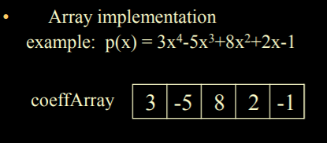
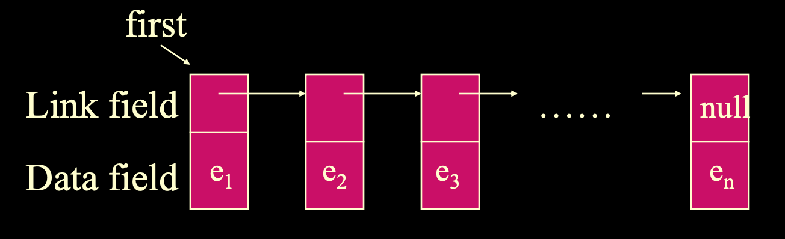
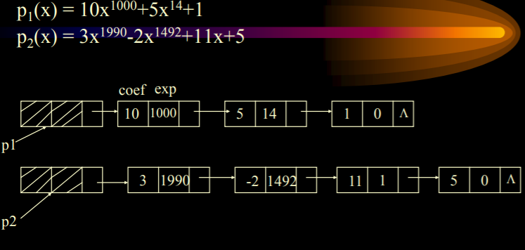
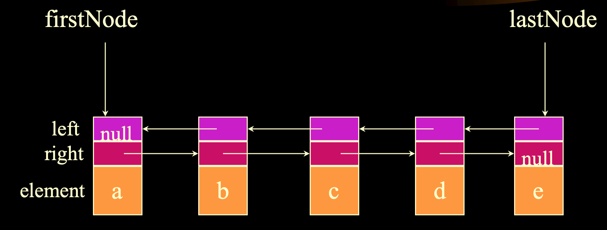
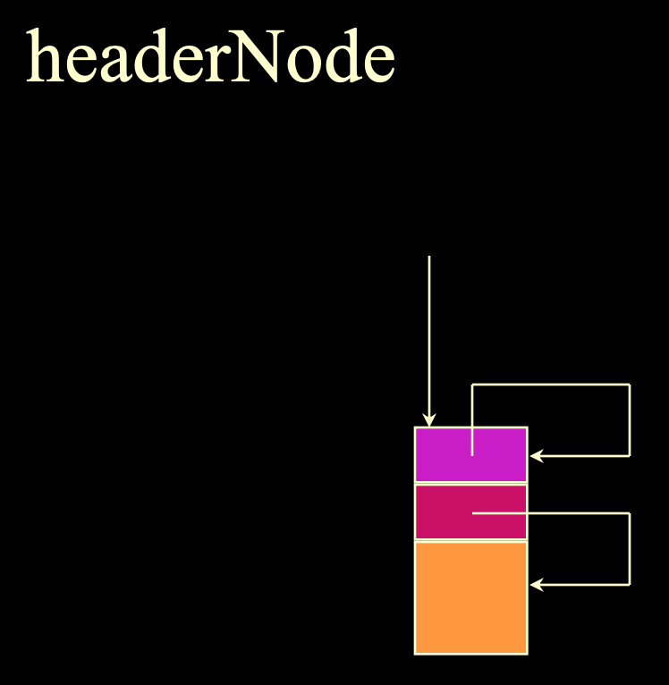
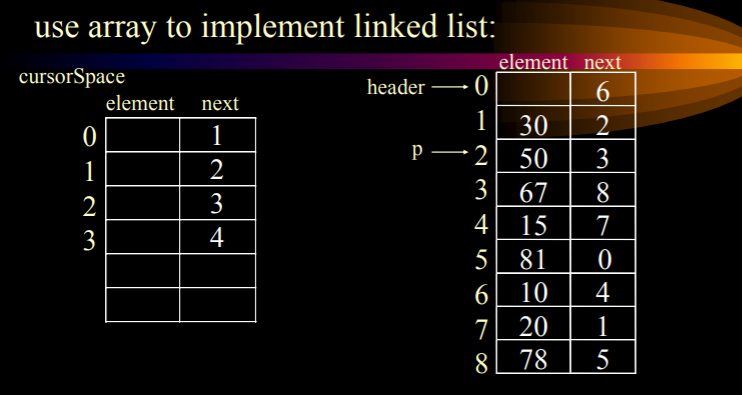
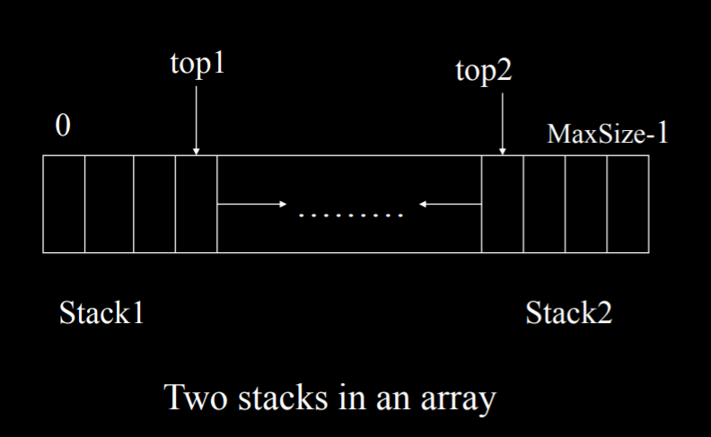
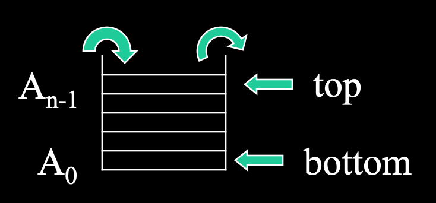
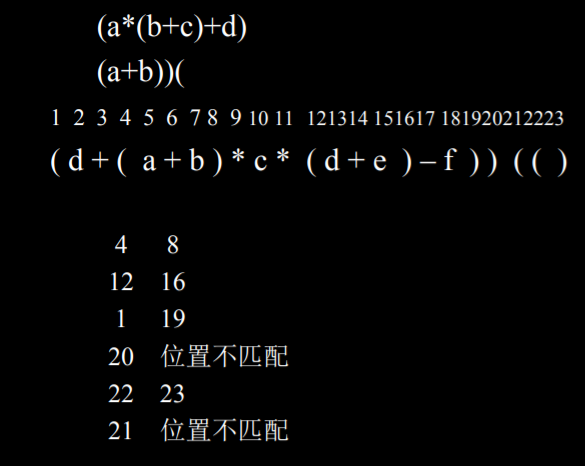

# List, Stack and Queue

## ADT

+ **定义：**一群对象及对象操作的集合。
+ **数据对象：**一些值(value)以及实例(instances)的集合。例如：Boolean、NaturalNumber、String......

## 1. List 列表 ADT
- 有序元素集合：L = (e0, e1, e2, e3, ..., en)
- e0 is the first element 
- en is the last element 
- ei precedes ei+1

### Operations 操作
1. List create() 創建列表
2. boolean isEmpty() 判斷列表是否為空
3. int length() 計算列表長度
4. T find(int k) 查找第k個元素
5. boolean search(T item) 查找給定元素
6. boolean delete(int k) 刪除第k個的元素
7. boolean insert(T item, int k) 在第k位後面插入元素
8. void print() 打印列表

### Impletation 實現1：Array 數組 [ei]
- **定义：**使用数组表示对象的实例。[e1, e2, ..., en]

- **位置查找：**location(i)=i-1 —— O(1)

- **元素查询：**Search(x) —— O(length)

- **删除：**remove(k,x) 删除第k个元素，将它赋值x并返回 —— O(n)

- **插入：**insert (x , i) 插入x在第i个元素后 —— O( n)

- **问题：**

  1. 查找快
  2. 插入/刪除慢

- **应用：**

  1. 多项式ADT —— 问题：指数大时不好储存

     

### Impletation 實現2：Single Linked List 單向鏈表 (next, data)
- **定义：**每一个数据对象的节点都有一个link或pointer指向与他有关的另一个节点。0(1, e1), 1(2, e2), ... , n(null, en)

  

- 链(chain)是指一个节点表示一个元素的链表。

- 最后一个节点的pointer是null。

- **类定义：**

  1. ListNode 代表结点的类 
  2. LinkedList 代表表本身的类
  3. LinkedListItr 代表位置的类 
  4. 都是包DataStructures 的一部分

- **查找：**find (object x) —— O(N)

- **删除：**Remove( x ) ——  O(1)

- **查前一个：**Findprevious ( x ) —— O(N)

- **插入：**Insert(x, p) —— O(1)

- **应用：**

  1. 多项式ADT 

     

  2. 基数排序 Radix Sort

     

     

### Impletation 實現3：Double Linked List 雙向鏈錶 (prev, next, data)
- **一般：**0(null, 1, e1), 1(0, 2, e2), 2(1, 3, e3), ..., n(n-1, null, en)


- **循環：**0(n, 1, e1), 1(0, 2, e2), 2(1, 3, e3), ..., n(n-1, 0, en)




### Impletation 實現4：Circular Linked List 循環鏈錶 (next, data)
- 0(1, e1), 1(2, e2), ... , n(0, en)

  

  

- **应用：**

  1. 约瑟夫问题：可能不考。

  ```java
  w = m;
  
  for( int i = 1; i<= n-1; i++){ 
      for (int j =1; j<=w-1; j++) rear = rear.link;
      if (i = = 1){ 
          head = rear.link ; p = head; 
      }else{ 
          p.link = rear.link; p = rear.link; 
      }
      rear.link = p.link;
  }
  
  P.link = rear;
  rear.link = null;
  ```

### Impletation 實現5：Cursor implementation of Linked Lists静态链表（游标实现）

+ **用处：**用游标来表示指针实现链表。

+ **核心思想：**

  1. 数据储存在一组结构体中。每一个结构体包含有数据及指向下一个结构体的指针。
  2. 一个新的结构体可以通过调用malloc而从系统的全局内存得到，并可通过调用free而被释放。
3. 分为`数据链表`与`备用链表`。

4. `备用链表`表示游标当前空闲节点的位置。

   

## 2. Stack 棧

- **定义：**LIFO(last in first out) 後進先出的線性列表

- 進棧和出棧端稱為棧頂(top)，底部稱為棧底(bottom)

- **实现：**

  1. 链表 topOfStack -> 栈顶。when topOfStack= = null is empty stack。

  2. 数组 

     1） topOfStack -> 栈顶。when topOfStack= = -1 is empty stack。

     2） 当多个栈并存时，很浪费空间。

     3） 

  

- **应用：**

  1. 平衡符号（括号匹配） Balancing Symbols(Parenthesis Matching) —— O(n)

      

      ```c++
     #include <iostream.h>
     #include <string.h>
     #include <stdio.h>
     #include “stack.h”
     const int Maxlength = 100; // max expression length
     void PrintMatchedPairs(char *expr){ 
         Stack<int> s(Maxlength);
         int j, length = strlen(expr);
         
         for ( int i = l; i <= length; i++){ 
             if ( expr[i-1]=='(' )
                 s.Add(i);
             else if (expr[i-1]= =")")
                 try {
                     s.Delete(j); 
                     cout <<j<<' '<<i<< endl;
                 }catch (OutOfBounds){
                     cout << "No match for right parenthesis"
                         << " at "<< i << endl;
                 }
         }
         while ( !s.IsEmpty ()){ 
             s.Delete(j);
             cout<< "No match for left parenthesis at "<< j << endl;
         }
     } 
     
     void static main(void){ 
         char expr[MaxLength];
         cout<< "type an expression of length at most"<<MaxLength<<endl;
         cin.getline(expr, MaxLength);
         cout<<"the pairs of matching parentheses in "<<endl;
         puts(expr);
         cout<<"are"<<endl;
         printMatcnedPairs(expr);
     }
     ```
     
2.  表达式计算 Expression Evaluation
  
   + **后缀表达式计算**
    
     1) 开辟一个运算分量栈 
    
     2) 遇分量进栈; 
    
     3) 遇运算符: 取栈顶两个分量进行运算,栈中退了两个分量,并将结果进栈。
    
   
    
   + **中缀转后缀**
    
     A+B\*C#---------> ABC\*+#
    
     1) 遇运算分量(操作数)直接输出 
    
     2) 遇运算符：比较当前运算符与栈顶运算符的优先级. 若当前运算符的 优先级<=栈顶运算符的优先级, 则不断取出运算符栈顶输 出; 否则进栈. 因此一开始栈中要放一个优先级最低的运 算符, 假设为“#”， 例子： A+B+C； A\*B-C (A+B)\*(C-D)#-------> AB+CD-\*# 
    
     3) 遇‘（’ : 压栈， 每个运算符有双重优先级. 
    
     4) 遇‘）’ : 不断退栈输出，直到遇到’(’ 
    
     5) 遇‘#’ : 将栈中的所有运算符出栈打印，过程终止。

## 3. Queue 隊列(佇列)
- FIFO(first in first out) 先進先出

- 進隊(enqueue)端稱為尾部(rear)，出隊(dequeue)端稱為頭部(front)

- **实现：**

  1. 数组

     1) the queue size : currentSize; 

     2) an empty queue has currentSize= = 0; 

     3) an full queue has currentSize= = theArray.length;

  2. 环形数组

     1) When front or back reachs theArray.length-1, reset 0 

     2) back = (back+1) % theArray.length 

     3) front = (front + 1) % theArray.length
  
     4) 每次进队，back = back + 1。
  
  3. 链表