# Hash 哈希函數

## General Idea 基本思想
1. 鍵值映射：address = hash(key)
2. 提高查找速率

1) Sequention Search 線性搜索代價 O(n)
2) Binary Search 二元搜索代價 O(log2n)
3) Hash Method 哈希映射搜索代價 O(1) 

- EX 1
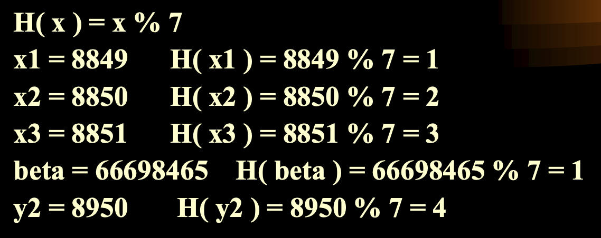
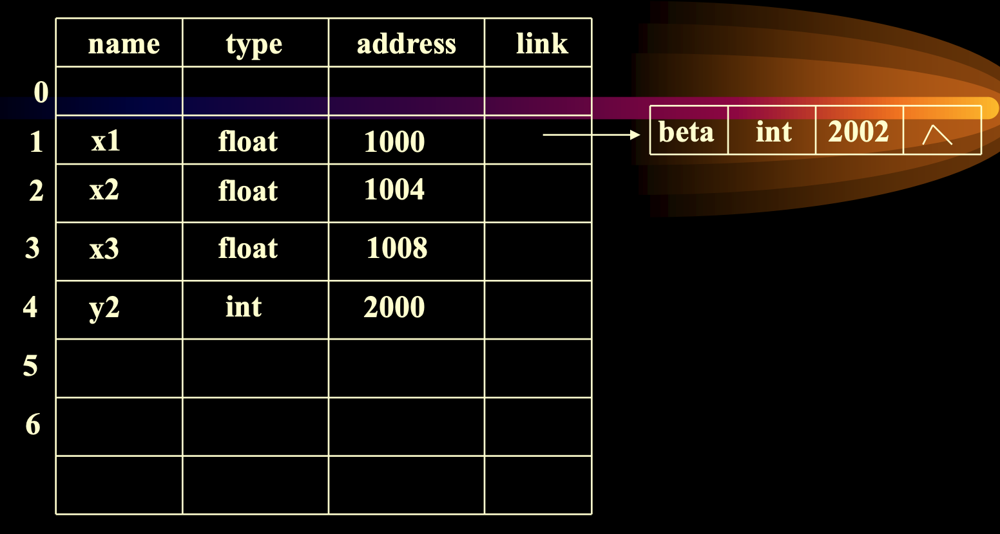

## Problem 痛點
1. 選擇一個碰撞率(衝突率)小的函數（根据装填因子&alpha;），n = 表中节点数，m = 表长
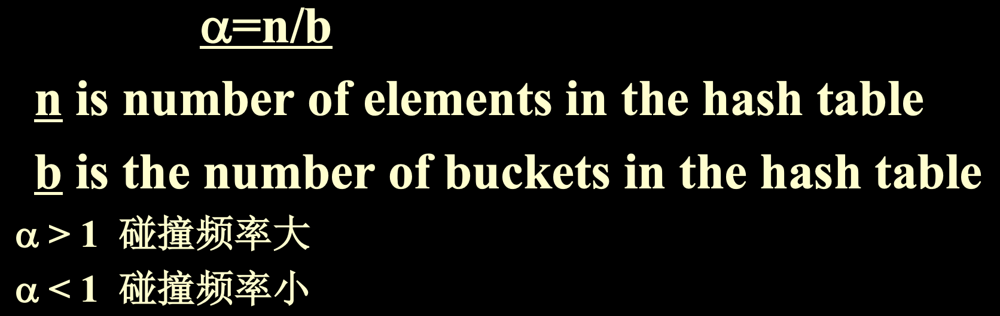

## 1. Function Select 函數選擇

### 1. 取餘法

+ 特点：以关键码除以p的余数作为哈希地址。

### 2. 平方法

+ 特点：对关键码平方后，按哈希表大小，取中间的若干位作为哈希地址。(适于不知道全部关键码情况)

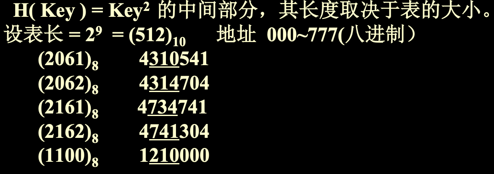

### 3. 雜湊法

+ Hash(key)= ⎣ B*( A*key  mod  1 ) ⎦  (A、B均为常数，且0<A<1，B为整数)
+ 特点：以关键码key乘以A，取其小数部分，然后再放大B倍并取整，作为哈希地址。

+ 例：欲以学号最后两位作为地址，则哈希函数应为：
   H(k)=100*(0.01*k % 1 )
   其实也可以用法2实现： H(k)=k % 100

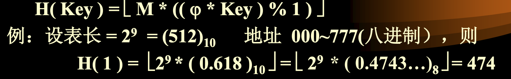

## 2. Collision Solution 碰撞處理
- **Load Factor 裝填因子：**F(I)函數選擇
- **开地址法：**
  1. 设计思路：有冲突时就去寻找下一个空的哈希地址，只要哈希表足够大，空的哈希地址总能找到，并将数据元素存入。
  2. 公式：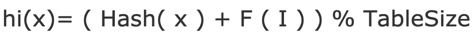

### 1. Linear Probing 線性探測
- F(I) 選擇一次函數，通常選擇 F(I) = i
- hi(x) = ( Hash(x) + i ) % tableSize
- 若 H(x) = d，而 bucket d 已經被佔據，則依序查找 d+1, d+2, ..., m-1, 0, 1, 2, ..., d-1

- EX:
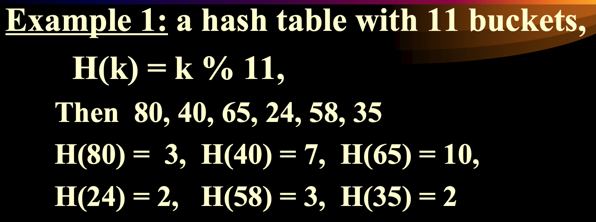
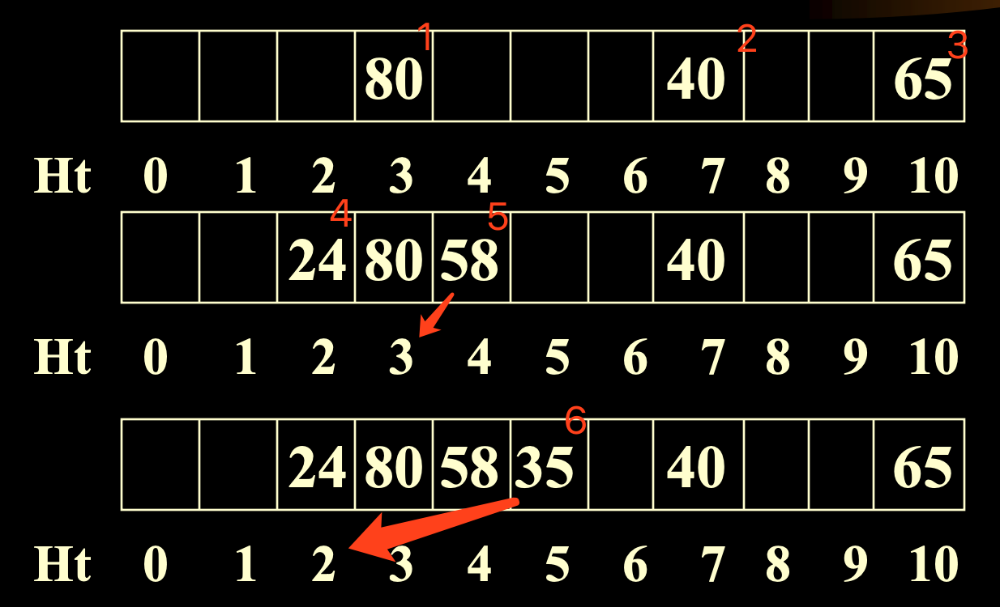
- 成功率
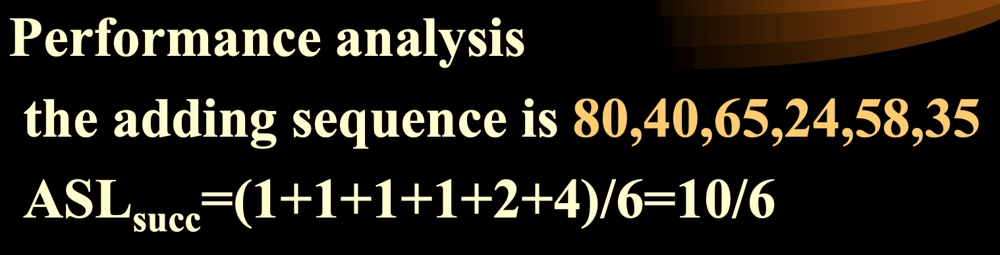

#### Problem 問題
- Clustering Problem 堆積：幾乎每次加入元素都碰撞

#### Solution 解決辦法
- 沒有，依賴哈希函數選擇(根據不同輸入有不同最佳函數)
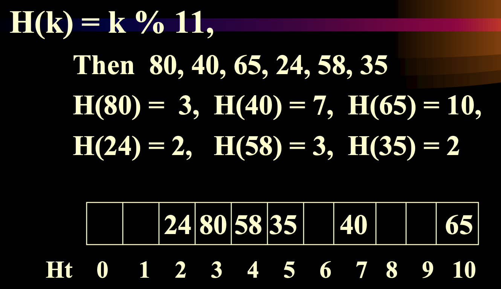

### 2. Quadratic Probing 平方探測
- F(I) 選擇兩次函數，通常選擇 F(I) = i^2
- hi(x) = ( Hash(x) + i^2 ) % tableSize

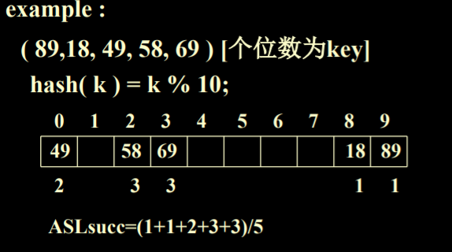

### 3. Double Hashing 雙重哈希(多重散列)
- F(I) 為另一個哈希函數的倍數，即 F(I) = hash2(x)*i
- hi(x) = ( hash1(x) + hash2(x) * i ) % tableSize

### 4. Rehashing 再散列
- 一遭遇衝突就擴容(再散列)，直到不發生衝突。
- 也於填充程度(填入項樹/表大小)到達臨界值時用於擴容（当表项数 > 表的70% 时,可再散列。）
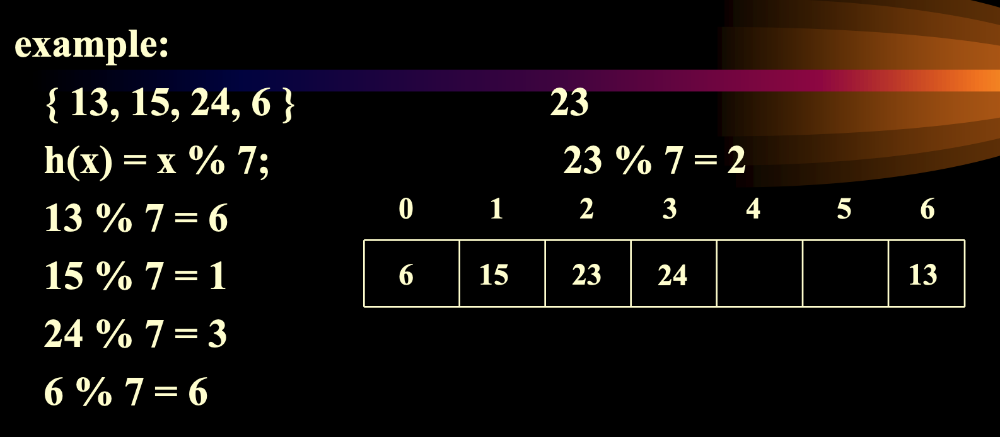

### 5. Separate Chaining 分離鏈接法
- 表中每個槽(bucket)維護一個鏈表

