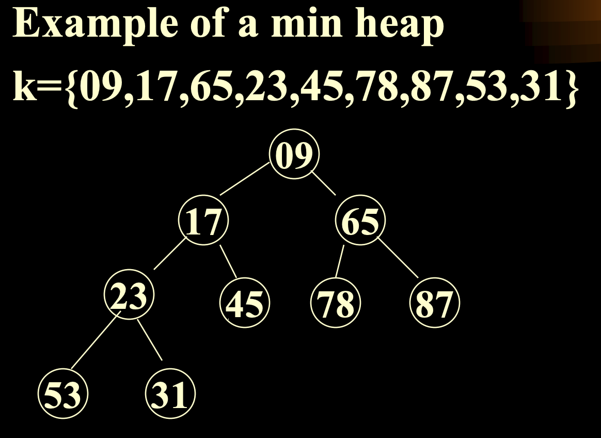

# Priority Queue 優先隊列

## 1. Priority Queue 優先隊列

### Properties 屬性
1. 每個元素含有值(value)或優先級(priority)
2. 查找(find)/刪除(delelete)操作，在`最小/最大優先級隊列(min/max priority queue)`均針對`優先級最小/最大`的元素

### Implementation 實現

#### 1. Linear List 線性表

+ **线性表：**
  1. 一个有限序列。
  2. 数据元素都是首尾相接的。

1. **insert 插入：**插入在最右側，O(1)
2. **delete 刪除：**查找最小優先級後刪除，O(n)

## 2. Heaps 堆

### Definition 定義：max/min heap(最大堆/最小堆)
1. 是一顆完全二叉樹(complete binary tree)
2. 任意節點的值 >= or <= 其子節點的值(樹根往下為遞減/遞增)
3. 最大堆的顶点为最大值，最小堆的顶点为最小值。
- Max Heap

- Min Heap

### Properties 屬性
1. int currentSize —— 堆的当前大小
2. int maxSize —— 堆的最大大小
3. T HeapNode —— 堆节点

### Operation(Methods) 操作
- int size() 取堆大小

- T Max() 查找最大元素

- MaxHeap< T > insert(T item) 插入節點 ——  O(log_2 n)
  1) 插入元素放在完全二叉樹的下一個位置
  2) 若為最大堆(最小堆)，而插入節點大於(小於)父節點，則插入元素與父節點對調
  
- MaxHeap< T > delete(T item) `刪除元素(刪除根節點)`，最大堆刪最大，最小堆刪最小 
  
  ——  O(log_2 n)
  1) 刪除必刪除根節點，將完全二叉樹表示的最後一個元素放到跟節點，再做平衡
  2) 平衡時選擇兩個子節點中較大(較小)的節點上移
  
- void initialize() 初始化 —— 自底向上排序

- MaxHeap< T > create(T[] items) 創建堆
  1) 依序插入，每插入後交換，複雜度O(n)
  2) 排序後自頂向下創建，複雜度O(nlgn)(排序代價相同)

#### MaxHeap< T > sort() 堆排序(最大堆)
1. 樹根為最大，將樹根下移到完全二叉樹的最後一位(此元素不再參與排序，移出樹)
2. 恢復最大堆(較大元素上移，較小的下移)，然後回去執行1.，直到所有元素都排序過
3. 时间复杂度：初始化 + 调整 = O(n log_2 n)

### Algorithm Analysis 算法分析
- n个元素尋找第 k 大的元素
1. n 個數據放入數組，`選擇排序`，取第 k 個 => 複雜度 O(n^2)
2. 讀入 k 個元素，按遞減排序，其餘元素每個與最後一個元素比較，若插入則重新排序，全部插入後最後一個元素就是第 k 大的元素 => 複雜度 O(n^2)
3. n 個元素建`最大堆`，執行 k 次 delete，根節點為第 k 大元素 => 複雜度 O(nlgn)
4. 前k 個元素建`最小堆`，其餘元素與根節點(此時為第 k 大)比較，大於則替換根節點並調整，全部插入後根節點就是第 k 大的元素 => 複雜度 O(nlgn)