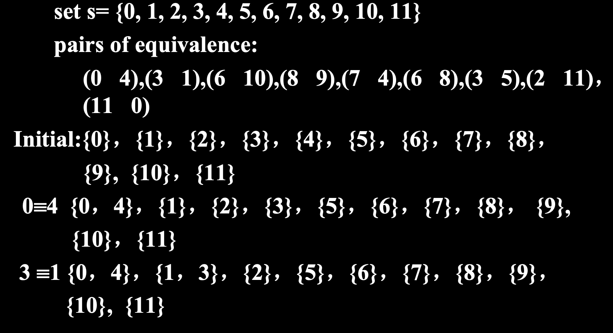
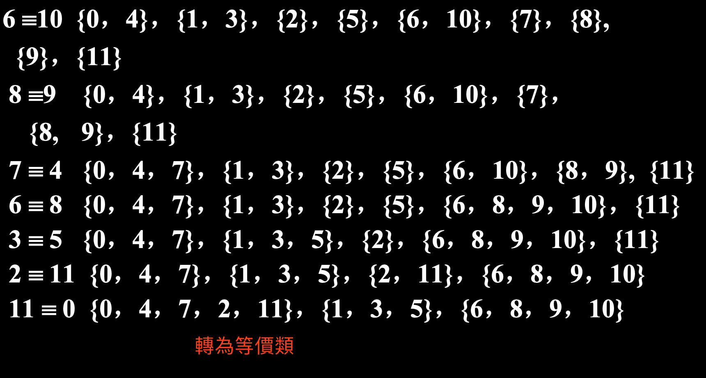
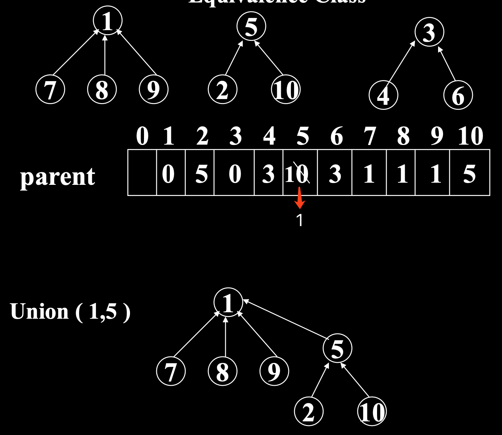
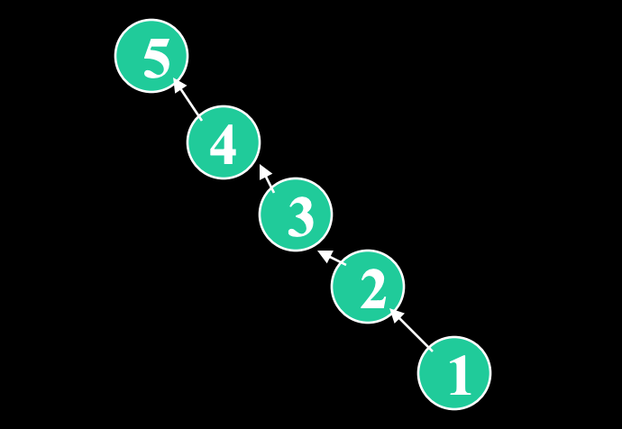
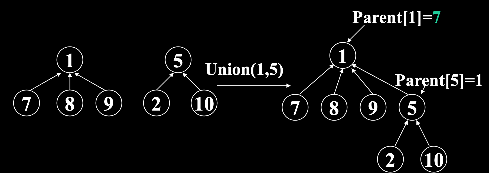
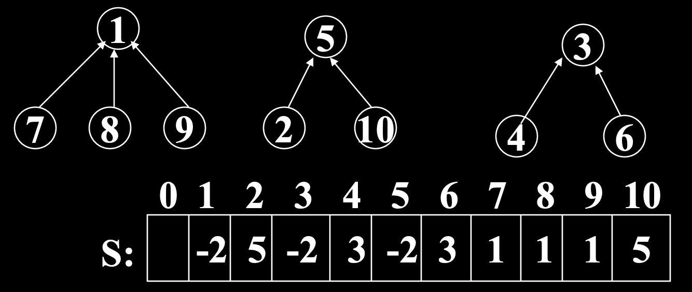
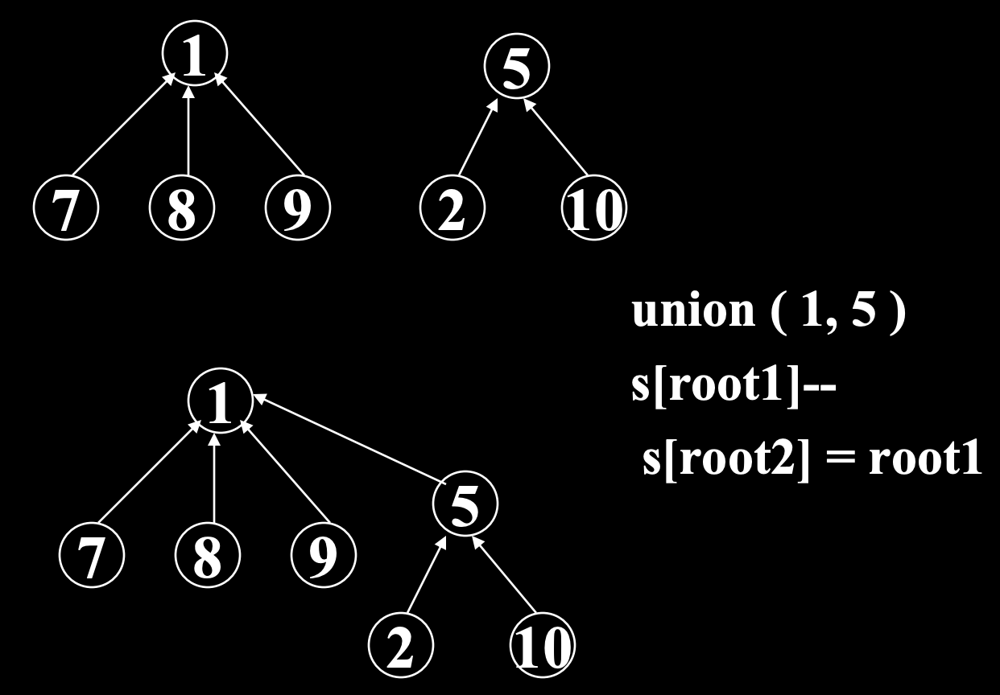
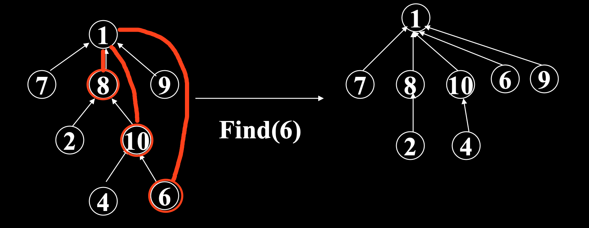

# Disjoint Set 并查集

## 1. Equivalence Class 等價類(Online Equivalence Class 等價類劃分)
1. 自反性：aRa
2. 對稱性：aRb => bRa
3. 傳遞性：aRb, bRc => aRc

- Equivalence Relationship 等價關係 => Online Equivalence Class 等價類劃分(A/R)

### Operation 操作
1. combine(a, b)：合併(union)a, b元素的等價類
2. find(e)：查找含有元素e的等價類

### Implementation 實現
1. Tree Representation(Forest)樹實現：一棵樹代表一個等價類，等價類劃分為樹的集合(即森林)
2. 附帶一個父節點指針數組(Parent)

- union(a, b) 並集：將一個樹(等價類)作為另一個樹的根節點的子元素

#### Time Complexity 時間複雜度
1. find(x) 查找操作：O(h)，h 為高度
2. union(a, b) 合併操作：&theta;(1)

#### Problem 問題
- 單邊鏈的查找表現不好

#### Solution 解決方法
1. Weight Rule ：讓節點多的樹作節點少的樹的父節點

2. Height Rule ：讓較高的樹作較矮的樹的父節點
- Parent 中根節點位置保存樹的高度

3. Path Compression 路徑壓縮：查找目標到根的路徑上所有節點全部變成一層節點

