# 阶段综合作业

181250090 刘育麟

因为没有web.xml的关系，maven的package指令可能会报错，请使用idea自带的build artifact指令来打包。

## 作业要求


## 完成情况

全部完成，这是完成后的测试截图与运行情况。

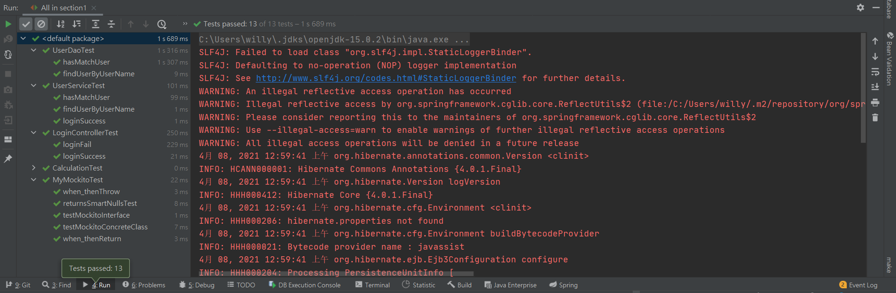

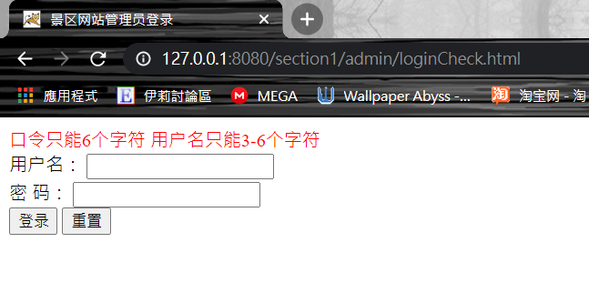

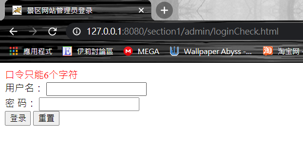

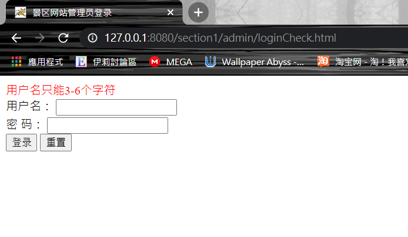

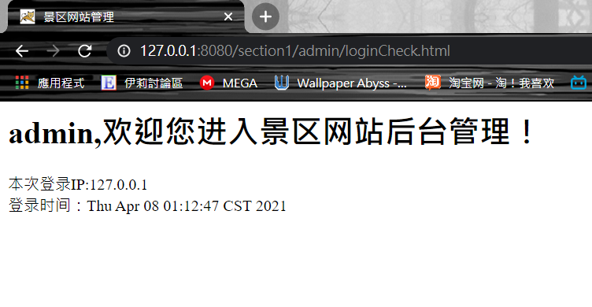

### 1

主要写config文件夹下的RootConfig.java、WebConfig.java、WebAppInitializer.java文件。修改路径为section1的路径。

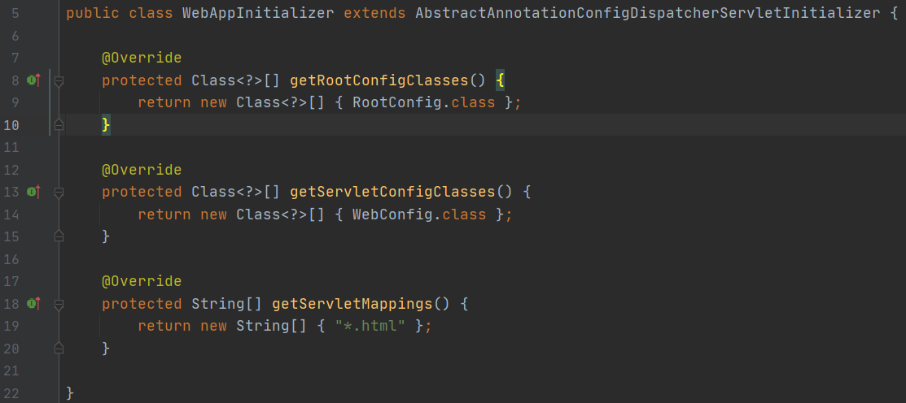

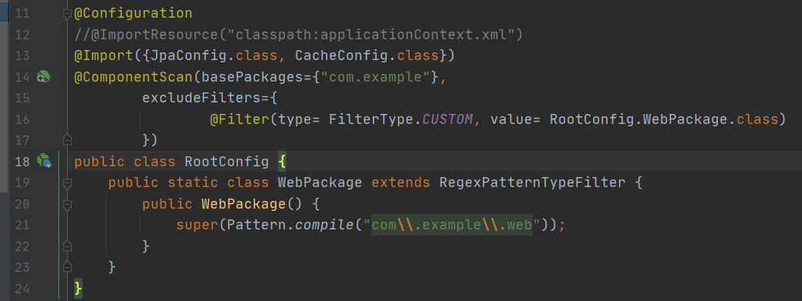

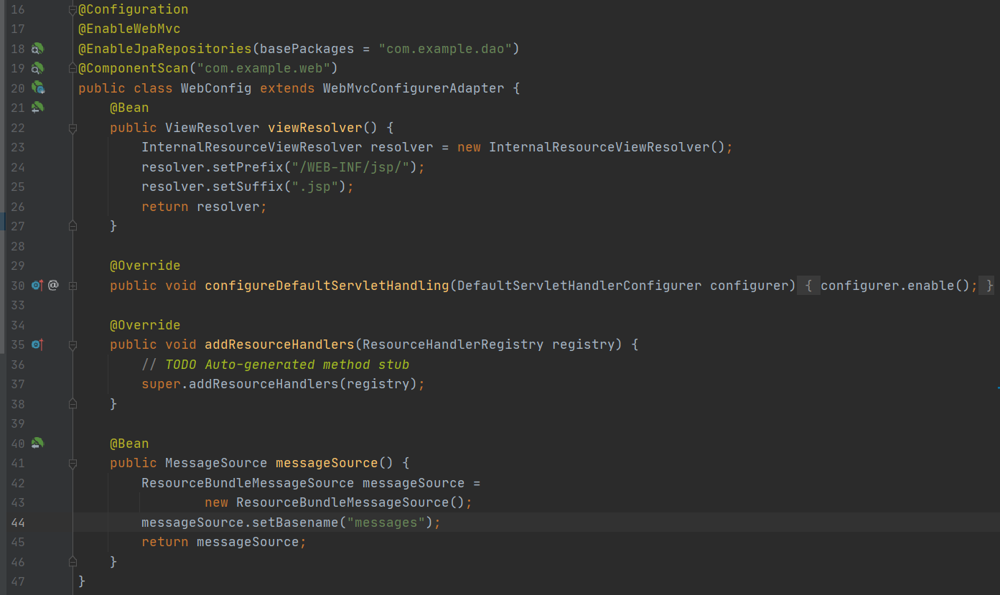

### 2

添加依赖，依赖这几个都必须添加，版本号也必须相同，否则会报错。

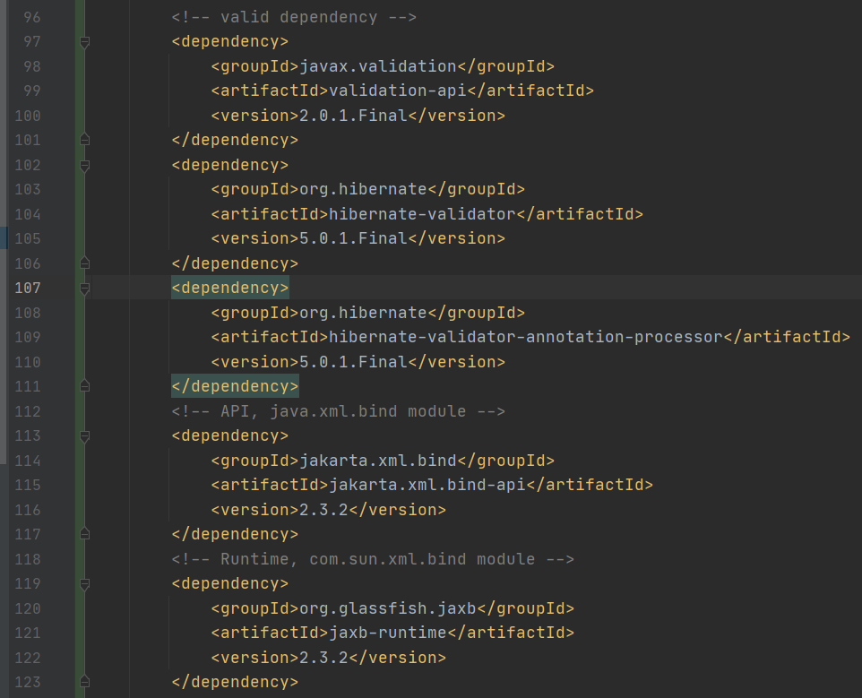

在loginCheck的参数LoginInfo添加注解@Valid，并且添加BindingResult参数作为catch到error之后的返回。

在loginInfo的userName和password添加注解

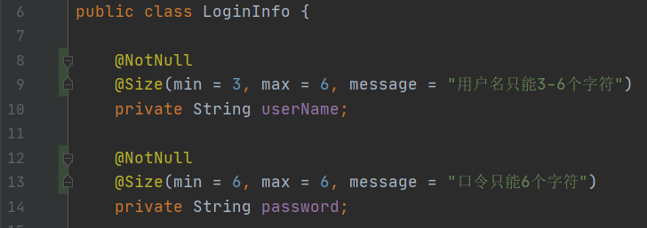

### 3

主要写config文件夹下的JpaConfig.java文件。这个文件用来代替ApplicationContext.xml文件。将sql文件移动到resources下面，让config可以访问到。

对每个需要ApplicationContext.xml的地方，注解替换为

```java
@ContextConfiguration(classes = JpaConfig.class)
```

使JPA可以运行的注解。

```java
@EnableJpaRepositories(basePackages = "com.example.dao")
```

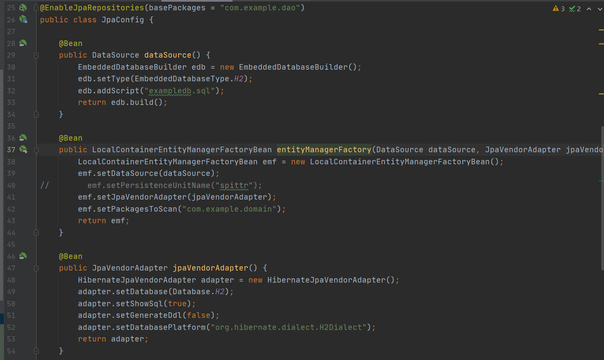

而这个内部类是事务管理器

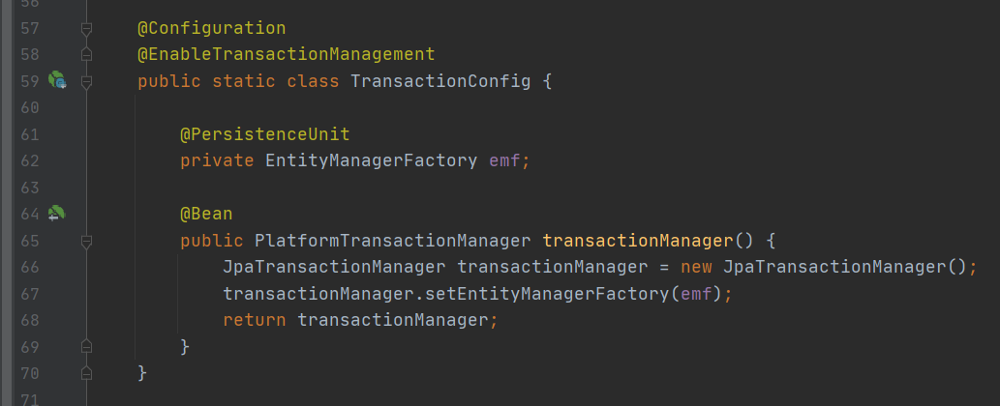

### 4

修改dao的文件为JpaRepository的接口，并且自己实现部分的数据库查询语句，并且把可能需要修改的增删改的地方进行修改。


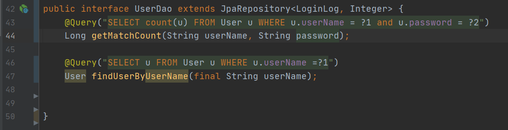

将两个domain的变量添加column，使每个变量一一对应。

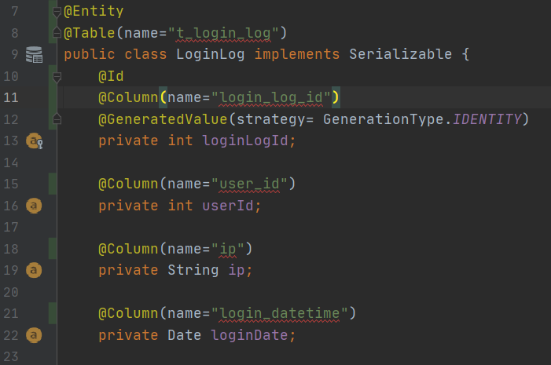

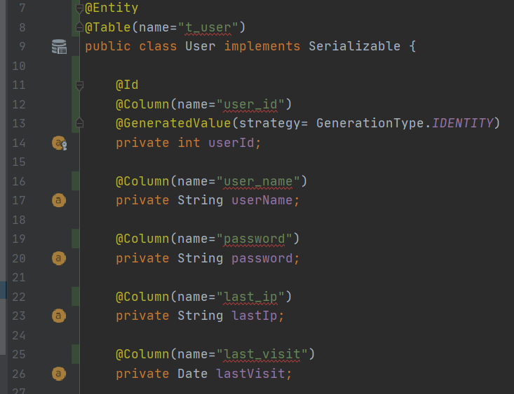

### 5

主要写config文件夹下的CacheConfig.java文件。编写完之后在resources下面添加ehcache.xml作为cache的配置。最后在对应方法下添加注解@Cacheable("spittleCache")

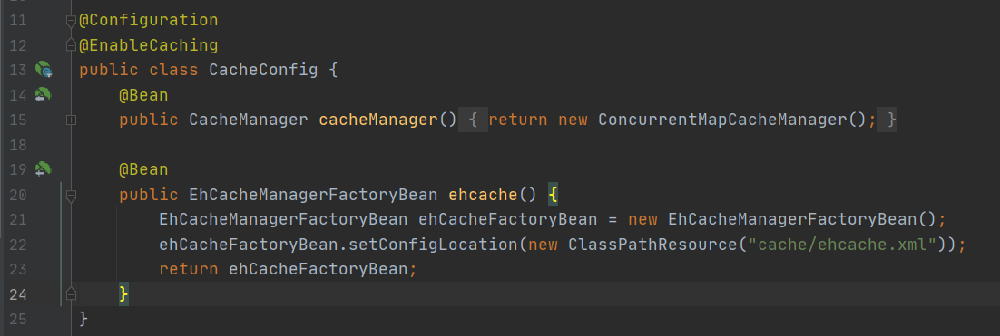

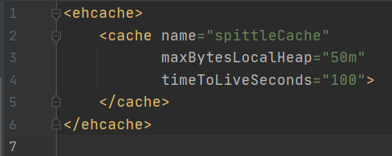

### 6

对每个dao添加@Mock注解并且对service添加@InjectMocks注解，在每个测试前对dao进行Mockito的模拟输入输出。

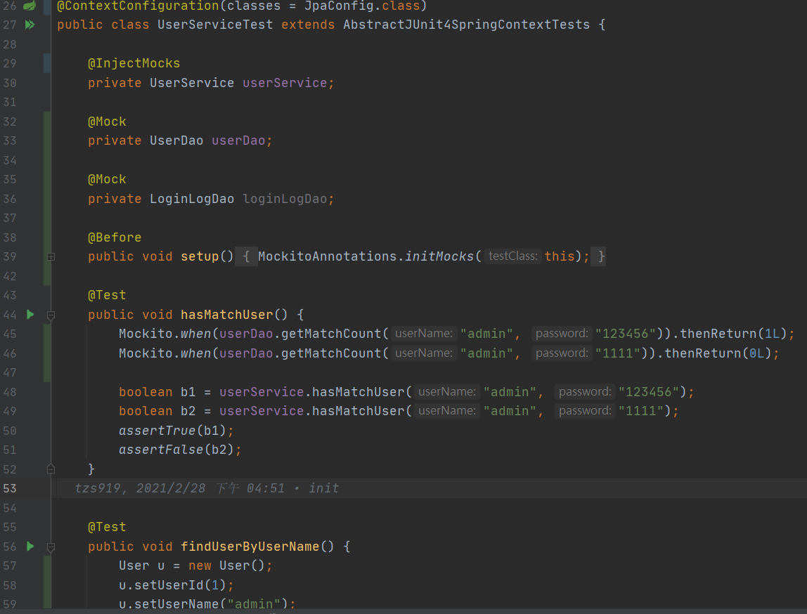

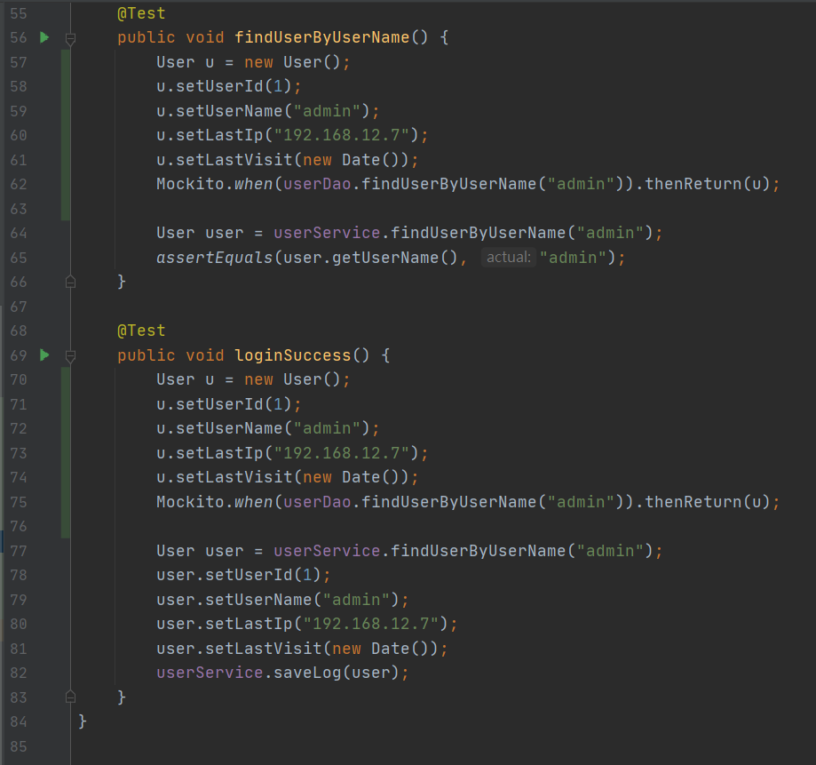