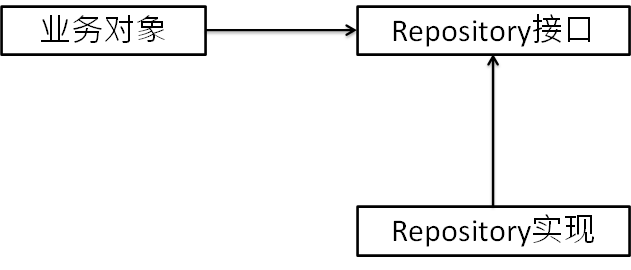
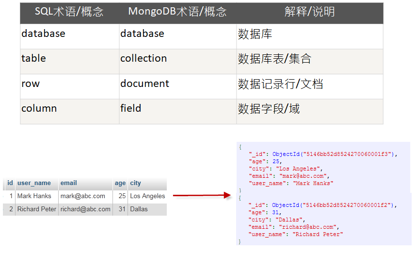

# 持久化技术

## JDBC

### 持久化数据



持久层实现接口分离

1. 运行测试业务逻辑时，业务测试对象可以mock
2. 方便替换持久化实现层，具体的数据库可以随便换，不影响数据库。

### 异常

#### SQLException

+ 发生异常时很难恢复

+ 难确定异常类型

#### Hibernate异常

+ 定义了许多具体异常，方便定位问题

+ 对业务对象的侵入

#### Spring所提供的平台无关的持久化异常

+ DataAccessException，将上面两个异常转换成这个异常

+ 具体异常，方便定位问题

+ 隔离具体数据库平台

### 模板方法

父类和子类的中的方法，业务逻辑不一样，实现上有细微差别的方法就是模板方法。

Spring将整个数据库的访问模板建好，用户只需要关心数据库语句的实现。

模板方法定义过程的主要框架，template

+ 管理资源（连接、statement）

+ 事务控制

+ 处理异常

变化的部分，回调（callback），自定义的数据访问代码

Spring提供的模板（后两个不怎么用，因为跟Spring强绑定在一起）

+ JdbcTemplate

+ HibernateTemplate

+ JpaTemplate

### 配置数据源方式

#### 通过 JNDI 查找的数据源

Java 命名与目录接口（Java Naming and Directory Interface）

在Web容器中配置JNDI参数，定义一个数据源（数据名字）

Spring中配置JNDI数据源

<jee:jndi-lookup id=“dataSource”

 jndi-name=“/jdbc/**DS”

resource-ref=“true”/>

#### 连接池的数据源

将数据库的连接放在一个池子里面，只要有人需要就将池子里面的连接传给他。因为将一个连接创建与删除消耗时间，连接池可以减少消耗。

数据源连接池的开源实现

+ Apache Commons DBCP

#### 通过 JDBC 驱动程序定义的数据源

两种数据源

+ DriverManagerDataSource：注意没有进行池化处理，每次都是赶回一个新的连接。

+ SingleConnectionDataSource：只有一个连接的池，每次都是返回这个连接。

与具备池功能的数据源相比，唯一的区别在于这些数据源bean都没有提供连接池功能，所以没有可配置的池相关属性。生产环境不建议使用，还是用数据源连接池。

#### 配置嵌入式数据源

\<jdbc:embedded-database>

可以创建数据表和初始化数据，只要程序停止数据源就消失

用于开发和测试

#### Java配置

```java
@Configuration
public class JdbcConfig {
    
    @Profile("ut")
    @Bean
    public DataSource dataSource() { // 嵌入式的内存数据库，放在本地内存，关掉程序就消失
        return new EmbeddedDatabaseBuilder()
                .setType(EmbeddedDatabaseType.H2) 
                .addScripts("classpath:spittr/db/jdbc/schema.sql", "classpath:spittr/db/jdbc/test-data.sql")
                .build();
    }

    @Profile("qa")
    @Bean
    public DataSource dataSource2() { // jdbc驱动的数据源，每次重新创建连接
        DriverManagerDataSource ds = new DriverManagerDataSource();
        ds.setDriverClassName("com.mysql.jdbc.Driver");
        ds.setUrl("jdbc:mysql://localhost:3306/exampledb6");
        ds.setUsername("root");
        ds.setPassword("exampledb20");
        return ds;
    }
    
    @Profile("prod")
    @Bean
    public DataSource dataSource3() { // 连接池的数据源
        BasicDataSource ds = new BasicDataSource();
        ds.setDriverClassName("com.mysql.jdbc.Driver");
        ds.setUrl("jdbc:mysql://localhost:3306/exampledb6");
        ds.setUsername("root");
        ds.setPassword("exampledb20");
        ds.setInitialSize(5); // 初始化的连接源
        ds.setMaxActive(10); // 最多的连接数
        return ds;
    }
    
    @Bean
    public JdbcTemplate jdbcTemplate(DataSource dataSource) {
        return new JdbcTemplate(dataSource);
    }

}
```

#### XML配置

```xml
<beans>
    <beans profile="ut">
        <jdbc:embedded-database id="dataSource" type="H2">
            <jdbc:script location="classpath:spittr/db/jdbc/schema.sql"/>
            <jdbc:script location="classpath:spittr/db/jdbc/test-data.sql"/>
        </jdbc:embedded-database>
    </beans>

    <beans profile="qa">
        <bean id="dataSource" class="org.springframework.jdbc.datasource.DriverManagerDataSource"
              p:driverClassName="com.mysql.jdbc.Driver"
              p:url="jdbc:mysql://localhost:3306/exampledb6"
              p:username="root"
              p:password="exampledb20"/>
    </beans>

    <beans profile="prod">
        <bean id="dataSource" class="org.apache.commons.dbcp.BasicDataSource"
              destroy-method="close"
              p:driverClassName="com.mysql.jdbc.Driver"
              p:url="jdbc:mysql://localhost:3306/exampledb6"
              p:username="root"
              p:password="exampledb20"/>
    </beans>
</beans>
```

### Profile选择数据源

@ActiveProfiles("ut")

### 两种模板

#### JdbcTemplate

private static final String INSERT_SPITTER = "insert into Spitter (username, password, fullname, email, updateByEmail) values (?, ?, ?, ?, ?)";

#### NamedParameterJdbcTemplate

private static final String INSERT_SPITTER = "insert into Spitter (username, password, fullname, email, updateByEmail) values (:username, :password, :fullname, :email, :updateByEmail)";

## Hibernate

### ORM

object-relational mapping、Object_Relative DateBase-Mapping

在Java对象与关系数据库之间建立某种映射，以实现直接存取Java对象

例子：Hibernate、MyBatis、JPA (Java Persistence API)

### 配置

org.hibernate.Session接口

获得org.hibernate.SessionFactory对象，负责Session的打开、关闭、管理

Session接口提供了基本的数据访问功能。通过Session接口，应用的Repository能满足所有的持久化需求

+ org.springframework.orm.hibernate4.LocalSessionFactoryBean

定义映射关系：XML、注解（JPA、Hibernate）

```java
@Configuration
@EnableTransactionManagement
@ComponentScan
public class RepositoryTestConfig implements TransactionManagementConfigurer {

    @Inject
    private SessionFactory sessionFactory;

    @Bean
    public DataSource dataSource() {
        EmbeddedDatabaseBuilder edb = new EmbeddedDatabaseBuilder();
        edb.setType(EmbeddedDatabaseType.H2);
        edb.addScript("spittr/db/hibernate4/schema.sql");
        edb.addScript("spittr/db/hibernate4/test-data.sql");
        EmbeddedDatabase embeddedDatabase = edb.build();
        return embeddedDatabase;
    }

    public PlatformTransactionManager annotationDrivenTransactionManager() {
        System.out.println(sessionFactory);
        HibernateTransactionManager transactionManager = new HibernateTransactionManager();
        transactionManager.setSessionFactory(sessionFactory);
        return transactionManager;
    }

    @Bean
    public SessionFactory sessionFactoryBean() {
        try {
            LocalSessionFactoryBean lsfb = new LocalSessionFactoryBean();
            lsfb.setDataSource(dataSource());
            lsfb.setPackagesToScan("spittr.domain");
//      lsfb.setAnnotatedClasses();
            Properties props = new Properties();
            props.setProperty("dialect", "org.hibernate.dialect.H2Dialect");
//      props.setProperty("dialect", "org.hibernate.dialect.MySQL5Dialect");
            lsfb.setHibernateProperties(props);
            lsfb.afterPropertiesSet();
            SessionFactory object = lsfb.getObject();
            return object;
        } catch (IOException e) {
            return null;
        }
    }

    @Bean
    public BeanPostProcessor persistenceTranslation() {
        return new PersistenceExceptionTranslationPostProcessor();
    }
}
```

### 三类查询

HQL:hibernate query language，即hibernate提供的面向对象的查询语言

+ select/update/delete…… from …… where …… group by …… having …… order by …… asc/desc

QBC查询: query by criteria 完全面向对象的查询

本地SQL查询

```java
@ContextConfiguration(classes = RepositoryTestConfig.class)
public class OtherTest {

    @Autowired
    SessionFactory sessionFactory;

    //HQL:hibernate query language，即hibernate提供的面向对象的查询语言
    @Test
    @Transactional
    public void hqlTest1() {
        Query query = sessionFactory.getCurrentSession().createQuery("FROM Spitter");
        List<Spitter> list = query.list();
        System.out.println(list);
    }

    @Test
    @Transactional
    public void hqlTest2() {
        Query query = sessionFactory.getCurrentSession().createQuery("FROM Spitter where id = ?");
        query.setParameter(0, 2L);
        List<Spitter> list = query.list();
        System.out.println(list);
    }


    //QBC查询: query by criteria 完全面向对象的查询
    @Test
    @Transactional
    public void qbcTest() {
        Criteria criteria = sessionFactory.getCurrentSession().createCriteria(Spitter.class);
        criteria.add(Restrictions.eq("id", 2L));
        List<Spitter> list = criteria.list();
        System.out.println(list);
    }

    //本地SQL查询
    @Test
    @Transactional
    public void sqlTest() {
        SQLQuery sqlQuery = sessionFactory.getCurrentSession().createSQLQuery("SELECT * FROM spitter").addEntity(Spitter.class);
        List<Spitter> list = sqlQuery.list();
        System.out.println(list);
    }
}
```

## JPA

JPA的宗旨是为POJO提供持久化标准规范

JPQL（Java Persistence Query Language)

JPQL就是一种查询语言，具有与 SQL 相类似的特征

JPA语法大全

### 配置

javax.persistence.EntityManager（功能相当于session对象）

实体管理器工厂（entity manager factory）

+ org.springframework.orm.jpa.LocalContainerEntityManagerFactoryBean

+ org.springframework.orm.jpa.vendor.HibernateJpaVendorAdapter

```java
@Configuration
@EnableJpaRepositories(basePackages="spittr.db")
public class JpaConfig {

  @Bean
  public DataSource dataSource() {
    EmbeddedDatabaseBuilder edb = new EmbeddedDatabaseBuilder();
    edb.setType(EmbeddedDatabaseType.H2);
    edb.addScript("spittr/db/jpa/schema.sql");
    edb.addScript("spittr/db/jpa/test-data.sql");
    EmbeddedDatabase embeddedDatabase = edb.build();
    return embeddedDatabase;
  }

  @Bean
  public LocalContainerEntityManagerFactoryBean entityManagerFactory(DataSource dataSource, JpaVendorAdapter jpaVendorAdapter) {
    LocalContainerEntityManagerFactoryBean emf = new LocalContainerEntityManagerFactoryBean();
    emf.setDataSource(dataSource);
    emf.setPersistenceUnitName("spittr");
    emf.setJpaVendorAdapter(jpaVendorAdapter);
    emf.setPackagesToScan("spittr.domain");
    return emf;
  }
  
  @Bean
  public JpaVendorAdapter jpaVendorAdapter() {
    HibernateJpaVendorAdapter adapter = new HibernateJpaVendorAdapter();
    adapter.setDatabase(Database.H2);
    adapter.setShowSql(true);
    adapter.setGenerateDdl(false);
    adapter.setDatabasePlatform("org.hibernate.dialect.H2Dialect");
    return adapter;
  }
  

  @Configuration
  @EnableTransactionManagement
  public static class TransactionConfig {

    @Inject
    private EntityManagerFactory emf;

    @Bean
    public PlatformTransactionManager transactionManager() {
      JpaTransactionManager transactionManager = new JpaTransactionManager();
      transactionManager.setEntityManagerFactory(emf);
      return transactionManager;
    }    
  }
  
}

```

### 获取

```java
@PersistenceContext
private EntityManager entityManager;
//并不会真正注入EntityManager，因为它不是线程安全的，
//注入的是一个代理，通过代理关联到当前事务上下文的真正的EntityManager
//    下面是直接注入EntityManager的方法
//    @PersistenceUnit
//    private EntityManagerFactory emf;
//    emf.createEntityManager();
```

### JPARepository

定义查询方法，无需实现

+ 领域特定语言（domain-specific language，DSL)，spring data的命名约定

+ 查询动词 + 主题 + 断言

+ 查询动词：get、read、find、count

声明自定义查询

+ 不符合方法命名约定时，或者命名太长时

+ @Query(“select ...”)

使用EntityManager直接低层实现

+ 接口名+Impl的实现类

#### 实现代码

```java
public interface SpitterRepository extends JpaRepository<Spitter, Long>, SpitterSweeper {

    Spitter findByUsername(String username);

    List<Spitter> findByUsernameOrFullNameLike(String username, String fullName);

    @Query("select s from Spitter s where s.email like '%gmail.com'") // 自己实现查询方法
    List<Spitter> findAllGmailSpitters();
}
```

#### 用接口实现自己的方法

```java
public class SpitterRepositoryImpl implements SpitterSweeper {

   @PersistenceContext
   private EntityManager em;
   
   public int eliteSweep() {
     String update = 
         "UPDATE Spitter spitter " +
             "SET spitter.status = 'Elite' " +
             "WHERE spitter.status = 'Newbie' " +
             "AND spitter.id IN (" +
             "SELECT s FROM Spitter s WHERE (" +
             "  SELECT COUNT(spittles) FROM s.spittles spittles) > 10000" +
             ")";
      return em.createQuery(update).executeUpdate();
   }
   
}
```

## MongoDB

### NoSQL

NoSQL(Not Only SQL) ，指的是非关系型的数据库

没有声明性查询语言

没有预定义的模式

键-值对存储、列存储、文档存储、图形数据库

### 术语



### MongoDB shell

MongoDB Shell是MongoDB自带的交互式Javascript shell,用来对MongoDB进行操作和管理的交互式环境

#### 指令

show dbs

db

db.something.insert({x:10})

db.something.find()

### Spring Data MongoDB

```java
@Configuration
@EnableMongoRepositories(basePackages = "orders.db")
public class MongoConfig extends AbstractMongoConfiguration {

	@Override
	protected String getDatabaseName() {
		return "OrdersDB";
	}
	
	@Override
	public MongoClient mongo() throws Exception {
		return new MongoClient();
	}

}
```

```java
public interface OrderRepository extends MongoRepository<Order, String> {
	
	List<Order> findByCustomer(String customer);
	
	List<Order> findByCustomerLike(String customer);

	List<Order> findByCustomerAndType(String customer, String type);

	List<Order> getByType(String type);
		
	@Query("{customer:'Chuck Wagon'}") // 自己的查询
	List<Order> findChucksOrders();

}
```

```java
@Document
public class Order {
	
	@Id
	private String id;
	
	@Field("client")
	private String customer;
	
	private String type;
	
	private Collection<Item> items = new LinkedHashSet<>(); // Item不单独持久化为文档，他始终是Order文档中的Item列表的的一个成员，并且会作为文档中的嵌入元素
}
```

## Redis

### 特点

快速读取、数据安全

key-value的Hash表结构，value是某数据结构 

内存数据库（缓存）

集群

主从（master/slave）复制

数据持久化

注意key、value区分大小写

### 数据类型

https://www.runoob.com/redis/redis-data-types.html

String

Linked Lists

+ 队列lpush/rpop

+ 阻塞等待：BRPOP和BLPOP

Hashes

Sets

### Java使用

会将数据序列化，所以redis内部是看不出来是什么东西的。Product类要实现序列化接口

```java
@Configuration
public class RedisConfig {

    @Bean
    public RedisConnectionFactory redisCF() {
        return new JedisConnectionFactory();
    }

    @Bean
    public RedisTemplate<String, Product> redisTemplate(RedisConnectionFactory cf) {
        RedisTemplate<String, Product> redis = new RedisTemplate<>();
        redis.setConnectionFactory(cf);
        return redis;
    }

}
```

```java
public class CartTest {

    /*
     * IMPORTANT: This test class requires that a Redis server be running on
     *            localhost and listening on port 6379 (the default port).
     */

    @Autowired
    private RedisConnectionFactory cf;

    @Autowired
    private RedisTemplate<String, Product> redis;

    @After
    public void cleanUp() {
        redis.delete("9781617291203");
        redis.delete("cart");
        redis.delete("cart1");
        redis.delete("cart2");
    }

    @Test
    public void workingWithSimpleValues() { // 设置一个key-value值
        Product product = new Product();
        product.setSku("9781617291203");
        product.setName("Spring in Action");
        product.setPrice(39.99f);

        redis.opsForValue().set(product.getSku(), product);

        Product found = redis.opsForValue().get(product.getSku());
        assertEquals(product.getSku(), found.getSku());
        assertEquals(product.getName(), found.getName());
        assertEquals(product.getPrice(), found.getPrice(), 0.005);
    }

    @Test
    public void workingWithLists() { // 添加list
        Product product = new Product();
        product.setSku("9781617291203");
        product.setName("Spring in Action");
        product.setPrice(39.99f);

        Product product2 = new Product();
        product2.setSku("9781935182436");
        product2.setName("Spring Integration in Action");
        product2.setPrice(49.99f);

        Product product3 = new Product();
        product3.setSku("9781935182955");
        product3.setName("Spring Batch in Action");
        product3.setPrice(49.99f);

        redis.opsForList().rightPush("cart", product);
        redis.opsForList().rightPush("cart", product2);
        redis.opsForList().rightPush("cart", product3);

        assertEquals(3, redis.opsForList().size("cart").longValue());

        Product first = redis.opsForList().leftPop("cart");
        Product last = redis.opsForList().rightPop("cart");

        assertEquals(product.getSku(), first.getSku());
        assertEquals(product.getName(), first.getName());
        assertEquals(product.getPrice(), first.getPrice(), 0.005);

        assertEquals(product3.getSku(), last.getSku());
        assertEquals(product3.getName(), last.getName());
        assertEquals(product3.getPrice(), last.getPrice(), 0.005);

        assertEquals(1, redis.opsForList().size("cart").longValue());
    }

    @Test
    public void performingOperationsOnSets_setOperations() { // 添加Set
        for (int i = 0; i < 30; i++) {
            Product product = new Product();
            product.setSku("SKU-" + i);
            product.setName("PRODUCT " + i);
            product.setPrice(i + 0.99f);
            redis.opsForSet().add("cart1", product);
            if (i % 3 == 0) {
                redis.opsForSet().add("cart2", product);
            }
        }

        Set<Product> diff = redis.opsForSet().difference("cart1", "cart2");
        Set<Product> union = redis.opsForSet().union("cart1", "cart2");
        Set<Product> isect = redis.opsForSet().intersect("cart1", "cart2");

        assertEquals(20, diff.size());
        assertEquals(30, union.size());
        assertEquals(10, isect.size());

        Product random = redis.opsForSet().randomMember("cart1");
        // not sure what to assert here...the result will be random
        assertNotNull(random);
    }


}
```

### Java序列化

#### 代码

自己定义序列化，让自己可以在redis里面读懂存的东西

默认处理：JdkSerializationRedisSerializer

key：StringRedisSerializer

Value：Jackson2JsonRedisSerializer

```java
@Test
public void settingKeyAndValueSerializers() { // 序列化
    // need a local version so we can tweak the serializer
    RedisTemplate<String, Product> redis = new RedisTemplate<>();
    redis.setConnectionFactory(cf);

    redis.setKeySerializer(new StringRedisSerializer());
    redis.setValueSerializer(new Jackson2JsonRedisSerializer<Product>(Product.class));
    redis.afterPropertiesSet(); // if this were declared as a bean, you wouldn't have to do this

    Product product = new Product();
    product.setSku("9781617291203");
    product.setName("Spring in Action");
    product.setPrice(39.99f);

    redis.opsForValue().set(product.getSku(), product);

    Product found = redis.opsForValue().get(product.getSku());
    assertEquals(product.getSku(), found.getSku());
    assertEquals(product.getName(), found.getName());
    assertEquals(product.getPrice(), found.getPrice(), 0.005);

    StringRedisTemplate stringRedis = new StringRedisTemplate(cf);
    String json = stringRedis.opsForValue().get(product.getSku());
    assertEquals("{\"sku\":\"9781617291203\",\"name\":\"Spring in Action\",\"price\":39.99}", json);
}
```
## EhCache

### 概念

CacheManager：Cache的容器对象，并管理着（添加或删除）Cache的生命周期

Cache: 一个Cache可以包含多个Element，并被CacheManager管理。它实现了对缓存的逻辑行为

Element：需要缓存的元素，它维护着一个键值对， 元素也可以设置有效期，0代表无限制

### Spring使用缓存

#### CacheManager配置

org.springframework.cache.concurrent.ConcurrentMapCacheManager（支持JDK的原生缓存）

org.springframework.cache.ehcache.EhCacheCacheManager（支持数据持久化）

org.springframework.data.redis.cache.RedisCacheManager（远程储存，分布式适用）

#### 启用缓存

@EnableCaching

+ aspect、pointcut

缓存管理器，与缓存实现集成：org.springframework.cache.CacheManager

#### 具体方法缓存注解

@Cacheable：调用方法之前，先在缓存中找方法的返回值

@CachePut：直接调用方法，在调用完之后将返回值存到缓存中。

@CacheEvict：清除缓存。