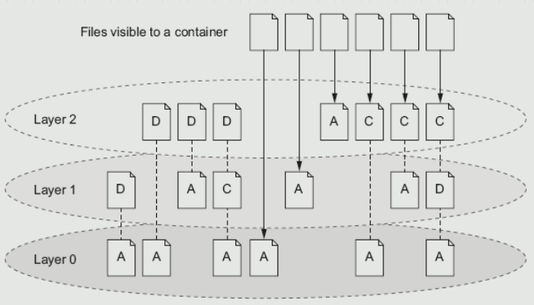
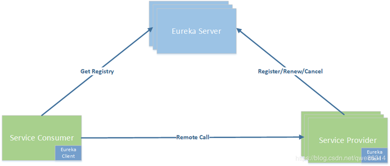
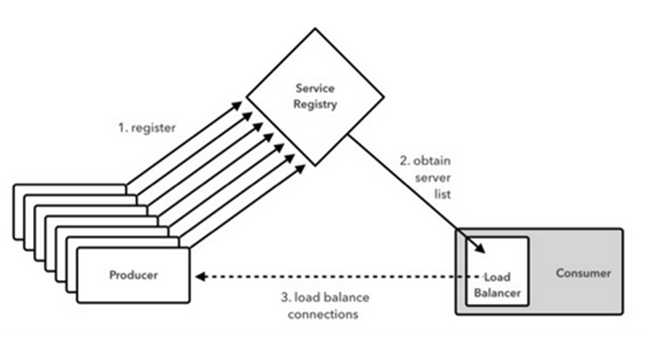
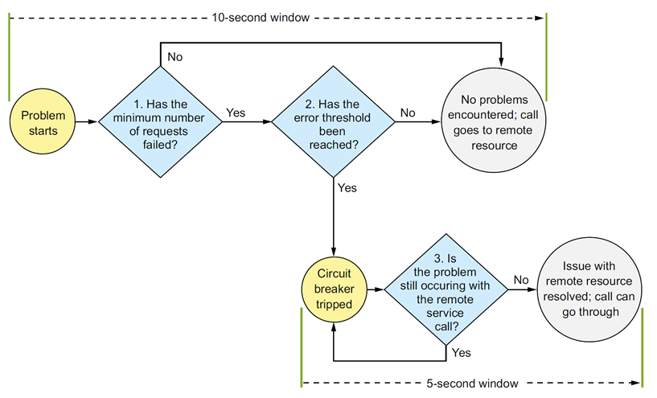
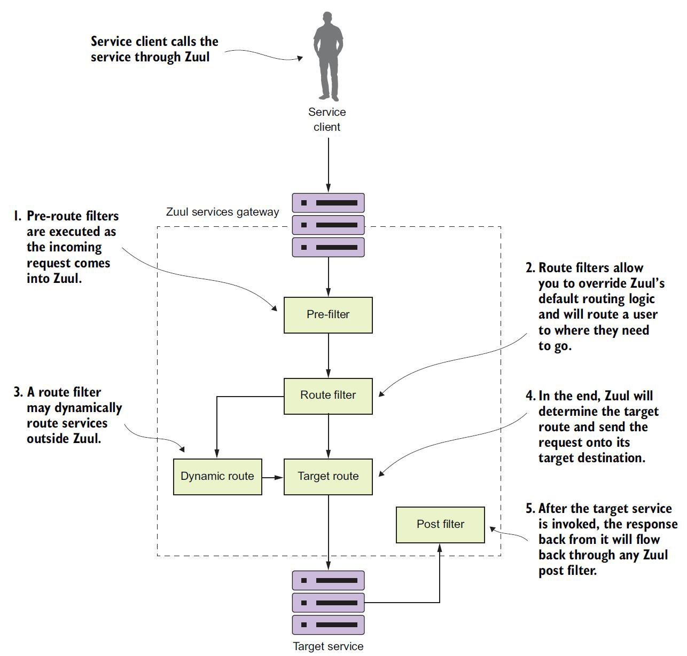

# 微服务

## Docker

### 容器 V.S. 虚拟机

+ 容器是另外一种轻量级的虚拟化，容器是共用主机内核，利用内核的虚拟化技术隔离出一个独立的运行环境，拥有独立的一个文件系统，网络空间，进程空间视图等。

+ 容器是在Linux内核实现的轻量级资源隔离机制

+ 虚拟机是操作系统级别的资源隔离，容器本质上是进程级的资源隔离

### Docker Engine

+ Docker daemon就是Docker Engine，一般在宿主主机后台运行。

+ 用户使用client通过pipe、unix socket或tcp直接跟daemon交互。

+ Docker index指向Docker registries，也叫docker仓库，可以用来让你上传和下载images。Hub.docker.com为docker官方仓库

### Docker常用命令

docker container：与容器相关的命令

docker container ls –aq：显示id

docker inspect 容器名：显示容器信息

docker image：镜像相关，ls列出镜像

docker network：与网络相关，容器间通信

docker version：client和server的版本号和OS系统（服务端是在linux虚拟机上面）

docker info：查看配置信息

docker pull：从远程仓库拉取镜像

docker port：查看端口映射

docker ps：查看正在运行的容器

docker attach <容器 ID>：附着到容器

docker exec -it <容器 ID>  /bin/bash：进入容器，执行命令

docker rm -f  <容器 ID>：删除容器

docker container prune：清理掉所有处于终止状态的容器

docker stop、docker start、docker restart、docker rm、docker rmi

### docker run参数

长的参数是--，短的参数是-

docker run hello-world

-d: 后台运行容器，并返回容器ID

-i: 以交互模式运行容器，通常与 -t 同时使用

-t: 为容器重新分配一个伪输入终端，通常与 -i 同时使用

-p: 指定（发布）端口映射，格式为：主机(宿主)端口:容器端口

-P: 随机端口映射，容器内部端口随机映射到主机的高端口（Dockerfile中使用expose才起作用）

--name="nginx-lb": 为容器指定一个名称（之后查询容器就不需要id，只要用名字就能访问）

-e username="ritchie": 设置环境变量（系统中的环境变量会有这个，可以传初始化参数）

--env-file=c:/temp1/t.txt: 从指定文件读入环境变量

--expose=2000-2002: 开放（暴露）一个端口或一组端口；

--link my-mysql:taozs : 添加链接到另一个容器

-v c:/temp1:/data: 绑定一个卷(volume)

--rm  退出时自动删除容器

### 镜像分层

写时复制，保证线程安全。修改时才复制过去修改的层，否则就用下面的层



### 数据卷

+ Docker-managed volume（docker管理卷）：docker帮你管理你的数据，存在哪里由docker决定，镜像删除文件也不删除

+ Bind mount volume（绑定挂载卷）：自己决定数据存在哪里


#### 命令

docker volume create edc-nginx-vol：创建一个自定义容器卷 

docker volume ls：查看所有容器卷

docker volume inspect edc-nginx-vol：查看指定容器卷详情信息

docker inspect -f {{.Mounts}} b1

docker volume rm edc-nginx-vol：删除自定义数据卷

#### 创建使用指定卷的容器

docker run -d --name=edc-nginx -p 8800:80 -v edc-nginx-vol:/usr/share/nginx/html nginx  注意：-v 后面只有一个目录名，则指的是在容器中目录，然后会自动创建一个volume与它对应。如果edc-nginx-vol不存在，则会自动创建一个volume

docker run -d --name=edc-nginx -v /app/wwwroot:/usr/share/nginx/html nginx

docker rm -v：命令在删除容器时删除该容器的卷

docker volume prune

docker cp c:/temp1 first:/data ：在主机与容器之间COPY

docker cp first:/data /tmp

### 导入导出

docker export 1e560fca3906 > ubuntu.tar

导出容器 1e560fca3906 快照到本地文件 ubuntu.tar

docker import ubuntu.tar test/ubuntu:v1

将快照文件 ubuntu.tar 导入到镜像 test/ubuntu:v1

 docker import http://example.com/exampleimage.tgz example/imagerepo

### 容器网络

cat /etc/hosts：查看ip地址

容器和容器之间互相通信

none网络，--net=none

host网络，--net=host

bridge网络，--net=bridge ， docker0 的 linux bridge

container模式，--net=container:NAME_or_ID

#### 建立两个网络的连接

 connect NETWORK CONTAINER：将容器搭到别的网络里面，让一个容器同时连着两个网络

## 微服务

### 单体应用程序

数据库的表对所有模块可见

一个人的修改整个应用都要重新构建、测试、部署

整体复制分布式部署，不能拆分按需部署

### 微服务特征

应用程序分解为具有明确定义了职责范围的细粒度组件

完全独立部署，独立测试，并可复用

使用轻量级通信协议，HTTP和JSON，松耦合

服务实现可使用多种编程语言和技术

将大型团队划分成多个小型开发团队，每个团队只负责他们各自的服务

### Spring Boot和Spring Cloud

Spring Boot提供了基于java的、面向REST的微服务框架

Spring Cloud使实施和部署微服务到私有云或公有云变得更加简单（对第三方库进行集成）

#### 微服务要考虑的问题

微服务划分，服务粒度、通信协议、接口设计、配置管理、使用事件解耦微服务

服务注册、发现和路由

弹性，负载均衡，断路器模式（熔断），容错

可伸缩

日志记录和跟踪

安全

构建和部署，基础设施即代码

#### Rest原则

Representational State Transfer，表现层状态转移

资源（Resources），就是网络上的一个实体，标识：URI

表现层（Representation）：json、xml、html、pdf、excel

状态转移（State Transfer）：服务端--客户端

HTTP协议的四个操作方式的动词：GET、POST、PUT、DELETE

CRUD：Create、Read、Update、Delete

如果一个架构符合REST原则，就称它为RESTful架构。

#### Spring Boot创建

@SpringBootApplication

+ 配置类@Configuration

+ @ComponentScan

@RestController

+ @Controller、@ResponseBody

+ 请求响应，JSON编解码（序列化）

mvn spring-boot:run

健康检查：localhost:8080/health

### Dockerfile

1.FROM：指定基础镜像，必须为第一个命令

2.MAINTAINER: 维护者信息

3.RUN：构建镜像时执行的命令

4.ADD：将本地文件添加到容器中，tar类型文件会自动解压

5.COPY：功能类似ADD，但是不会自动解压文件

6.CMD：构建容器后调用，也就是在容器启动时才进行调用

7.ENTRYPOINT：配置容器，使其可执行化。配合CMD可省去"application"，只使用参数

8.LABEL：用于为镜像添加元数据

9.ENV：设置环境变量

10.EXPOSE：指定与外界交互的端口

11.VOLUME：用于指定持久化目录

12.WORKDIR：工作目录，类似于cd命令

13.USER:指定运行容器时的用户名或 UID

14.ARG：用于指定传递给构建运行时的变量

15.ONBUILD：用于设置镜像触发器

## 配置服务

### 为什么要分开

服务多，配置多，维护麻烦

方便使用多种数据源

### 配置信息和代码分开

配置信息硬编码到代码中 - 最低层级

分离的外部属性文件

与物理部署分离，如外部数据库

配置作为单独的服务提供（配置管理服务） - 虽高层级

配置管理更改需要通知到使用数据的服务

### 配置方法

基于Spring Boot

pom.xml文件中的依赖

+ spring-cloud-config-server

+ spring-cloud-starter-config

指定父模块

导入dependencyManagement，依赖的构件和版本号

application.yml：服务端口号、后端数据来源

+ git、native

bootstrap.yml，指定服务名configserver

@EnableConfigServer

数据来源本地文件系统（ native）

#### 不同环境

@Profile

-Dspring.profiles.active=***

命名约定：应用程序名称-环境名称.yml

访问：http://localhost:8888/licensingservice/default

数据来源Git

数据更新

### 属性注入

@Value：数据库属性自动创建数据源对象

@RefreshScope：属性刷新

### 端点

refresh端点：属性刷新

health端点：查看运行情况

env端点：获取全部环境属性

### docker-compose命令

docker-compose --help

docker-compose up -d

docker-compose ps

docker-compose stop：终止整个服务集合

docker-compose stop nginx： 终止指定的服务 （这有个点就是启动的时候会先启动 depond_on 中的容器，关闭的时候不会影响到 depond_on 中的）

docker-compose logs -f [services...]：查看容器的输出日志

docker-compose build --no-cache --force-rm：构建镜像时不使用缓存（能避免很多因为缓存造成的问题）

docker-compose rm nginx：移除指定的容器

### 访问配置服务

#### 配置服务

```yaml
server:
  port: 8888
spring:
  profiles:
    active: native
  cloud:
    config:
      server:
        encrypt.enabled: true
        native:
          searchLocations: classpath:config/licensingservice
```

#### 获取配置

```yaml
spring:
  application:
    name: licensingservice
  profiles:
    active:
      default
  cloud:
    config:
      uri: http://localhost:8888
```

## 服务发现与负载均衡

### 服务发现的好处

快速水平伸缩（请求太多时，可以动态的增加容器），而不是垂直伸缩。不影响客户端（客户端不需要知道实例的数量）

提高应用程序的弹性（系统出错时的恢复能力，在某个服务出问题时，服务代理会将该服务删掉，客户端不会访问到）

### 服务调用关系


### Eureka

服务代理

多实例，为了解决并行请求、增加数据可靠性。

分为服务端和客户端，服务端进行服务的注册，微服务起来之后会向Eureka服务端进行注册，服务的客户端通过访问Eureka Server进行获取访问的端口号。客户端负责注册信息与接受访问服务。



#### Spring实现

```java
@SpringBootApplication
@EnableEurekaServer
public class EurekaServerApplication {
    public static void main(String[] args) {
        SpringApplication.run(EurekaServerApplication.class, args);
    }
}
```

```yaml
#Default port is 8761
server:
  port: 8761

eureka:
  client:
    registerWithEureka: false
    fetchRegistry: false
  server:
    waitTimeInMsWhenSyncEmpty: 5 # 单位是毫秒，在服务启动时要来注册，要等待这个时间后服务才能被访问
  serviceUrl:
    defaultZone: http://localhost:8761
```

### Ribbon

集成在服务的进程中，解决客户端负载均衡的问题

主要提供客户侧的软件负载均衡算法

需要缓存Eureka Server的所有信息，当一个服务要被访问时，Ribbon按照一定的策略挑一个服务去调用一个服务给他。



#### 三种方式

+ Spring DiscoveryClient：@EnableDiscoveryClient

+ 使用支持Ribbon的RestTemplate

+ 使用Netflix Feign（简化客户端开发）

#### Spring DiscoveryClient

pom.xml文件中的依赖

+ spring-cloud-starter-eureka

启动类加@EnableDiscoveryClient，使能够使用DiscoveryClient和Ribbon库

注入：private DiscoveryClient discoveryClient;

discoveryClient.getInstances

new RestTemplate（访问rest API的方式，在这种方式是自己实现）

restTemplate.exchange（进行方法调用）

（没有使用ribbon的负载均衡能力。自己实例化RestTemplate，自己构建URL）

#### 支持Ribbon的RestTemplate

使用Ribbon功能

@LoadBalanced（加上Ribbon的负载均衡效果）

注入RestTemplate restTemplate;

restTemplate.exchange，指定要调用的服务名，而不是IP

#### Netflix Feign调用服务

pom.xml文件中的依赖

+ spring-cloud-starter-feign

启动类加注解：@EnableFeignClients

定义接口

+ 接口加注解：@FeignClient("organizationservice")
+ 不需要实现接口

### 自定义负载均衡策略

自己实现IRule接口就行

```java
@Bean
public IRule ribbonRule() {
    return new RandomRule();//BestAvailableRule();
}
```

## 客户端弹性

### 好处

远程服务发生错误或表现不佳导致的问题：客户端长时间等待调用返回

客户端弹性模式要解决的重点：让客户端免于崩溃。

目标：让客户端快速失败，而不消耗数据库连接或线程池之类的宝贵资源，防止远程服务的问题向客户端上游传播。

### 四种模式

客户端负载均衡（client load banlance）模式

+ Ribbon提供的负载均衡器，帮助发现问题，并删除实例

断路器模式(Circuit Breaker Patten)

+ 监视调用失败的次数，快速失败

后备（fallback）模式

+ 远程服务调用失败，执行替代代码路径

舱壁隔离模式(Bulkhead Isolation Pattern)

+ 线程池充当服务的舱壁

### Hystrix

Hystrix是一个延迟和容错库，旨在隔离对远程系统，服务和第三方库的访问点，停止级联故障，并在不可避免发生故障的复杂分布式系统中实现弹性。

pom.xml文件中的依赖

+ spring-cloud-starter-hystrix

启动类加注解：@EnableCircuitBreaker

用断路器包装远程资源调用，方法加注解：@HystrixCommand

默认1秒超时，超时会抛异常：com.netflix.hystrix.exception.HystrixRuntimeException

@HystrixCommand(
     commandProperties = {@HystrixProperty(name = "execution.isolation.thread.timeoutInMilliseconds", value = "12000")}
 )

### 后备（fallback）模式

fallbackMethod = "buildFallbackCargo"

buildFallbackCargo方法位于相同类，与原方法具有相同签名

@HystrixCommand(
     fallbackMethod = "buildFallbackCargo")

### 舱壁隔离模式(Bulkhead Isolation Pattern)

Hystrix默认共享同一个线程池（10个线程），用于不同的远程资源访问

@HystrixCommand(
     threadPoolKey = "getCargoThreadPool",
     threadPoolProperties =
         {
             @HystrixProperty(name = "coreSize", value = "30"),
             @HystrixProperty(name = "maxQueueSize", value = "10")
         }
 )

### 断路器模式(Circuit Breaker Patten)



## 服务网关

### 分布式系统的横切关注点

cross-cutting concern
安全
日志记录
用户跟踪
服务网关（service gateway）

### 服务网关

服务网关位于服务客户端和相应的服务实例之间

服务之间不能直接访问，要通过网关访问

所有服务调用（内部和外部）都应流经服务网关

服务网关提供的能力

+ 静态路由
+ 动态路由
+ 验证和授权
+ 度量数据收集和日志记录

### Zuul

将应用程序中的所有服务的路由映射到一个URL

网关在获得请求后，向服务代理去要地址，网关内也有ribbon负责进行负载均衡


#### 自动配置

服务ID
Zuul需要访问Eureka，查看注册的服务。有服务才会创建路由

#### 手动配置

静态URL是指向未通过Eureka服务发现引擎注册的服务的URL

禁用Ribbon与Eureka集成，手动指定负载均衡的服务实例

#### Spring实现

```yaml
#zuul.ignored-services: "*" # 忽略在建立时的自动静态配置
zuul.prefix:  /api # 前缀
zuul.routes.organizationservice: /organization/** # 手动静态配置
zuul.routes.licensingservice: /licensing/**
zuul.routes.authenticationservice: /auth/**

zuul.routes.licensestatic.path: /licensestatic/** # 外部不使用spring写的服务，根据静态路由转发到对应地址
zuul.routes.licensestatic.url:  http://licenseservice-static:8081
#zuul.routes.licensestatic.serviceId: licensestatic # 实现负载均衡
#zuul.routes.licensestatic.ribbon.listOfServers: http://licenseservice-static1:8081, http://licenseservice-static2:8082
#ribbon.eureka.enabled: false

zuul.sensitiveHeaders: Cookie,Set-Cookie
zuul.debug.request: true
hystrix.command.default.execution.isolation.thread.timeoutInMilliseconds: 2500
#hystrix.command.licensingservice.execution.isolation.thread.timeoutInMilliseconds: 2
#licensingservice.ribbon.ReadTimeout: 2
signing.key: "345345fsdfsf5345"

```

#### 动态重新加载

Git-更新zuulservice配置

zuul POST:http://localhost:5555/refresh

#### 设置超时时间

Hystrix,1S
Ribbon,5S
Ribbon的懒加载导致第一次调用慢，引起失败

### Zuul过滤器

使用Zuul和Zuul过滤器允许开发人员为通过Zuul路由的所有服务实现横切关注点

ZuulFilter

+ 前置过滤器，在Zuul将实际请求发送到目的地之前被调用
+ 后置过滤器，在目标服务被调用并将响应发送回客户端后被调用
+ 路由过滤器，用于在调用目标服务之前拦截调用



#### 关联ID

Zuul会在请求进来时，加上一个关联ID，并且将请求头部存在Zuul的一个内存区域代为管理。通过请求的关联ID，在每一次请求的时候，可以根据ID知道这是同一次请求的处理。

关联ID在每一个服务的RestTemplate的处理时将关联ID附上

#### 前置过滤器

```java
public Object run() {

    if (isCorrelationIdPresent()) {
       logger.debug("tmx-correlation-id found in tracking filter: {}. ", filterUtils.getCorrelationId());
    }
    else{
        filterUtils.setCorrelationId(generateCorrelationId());
        logger.debug("tmx-correlation-id generated in tracking filter: {}.", filterUtils.getCorrelationId());
    }

    RequestContext ctx = RequestContext.getCurrentContext(); // 获取请求上下文
    logger.debug("Processing incoming request for {}.",  ctx.getRequest().getRequestURI());
    logger.debug("====incoming=========ServiceId=={}",filterUtils.getServiceId());
    return null;
}
```

#### 后置过滤器

```java
@Override
public Object run() {
    RequestContext ctx = RequestContext.getCurrentContext();

    logger.debug("Adding the correlation id to the outbound headers. {}", filterUtils.getCorrelationId());
    ctx.getResponse().addHeader(FilterUtils.CORRELATION_ID, filterUtils.getCorrelationId()); // 附上内存中存着的关联ID

    logger.debug("Completing outgoing request for {}.", ctx.getRequest().getRequestURI());
    logger.debug("====outgoing=========ServiceId=={}",filterUtils.getServiceId());
    return null;
}
```

#### 路由过滤器

动态路由，重新构造一个request的请求，并且决定要发往哪里。（太复杂了老师也没实现）

### Zuul和Eureka和Ribbon和Feign（重要）

Zuul是总的入口，他要向Eureka获取当前系统当中注册的服务以及状态，针对up的服务建立相应的路由，比如静态路由的方式。由Zuul代为访问目标服务，访问目标服务的方式由Ribbon决定，Ribbon来做负载均衡。Feign简化了客户端访问服务的方式，只需要透过Feign接口就能访问服务，但是还是要借助Ribbon去访问，也就是每一个服务都要透过Ribbon进行负载均衡。