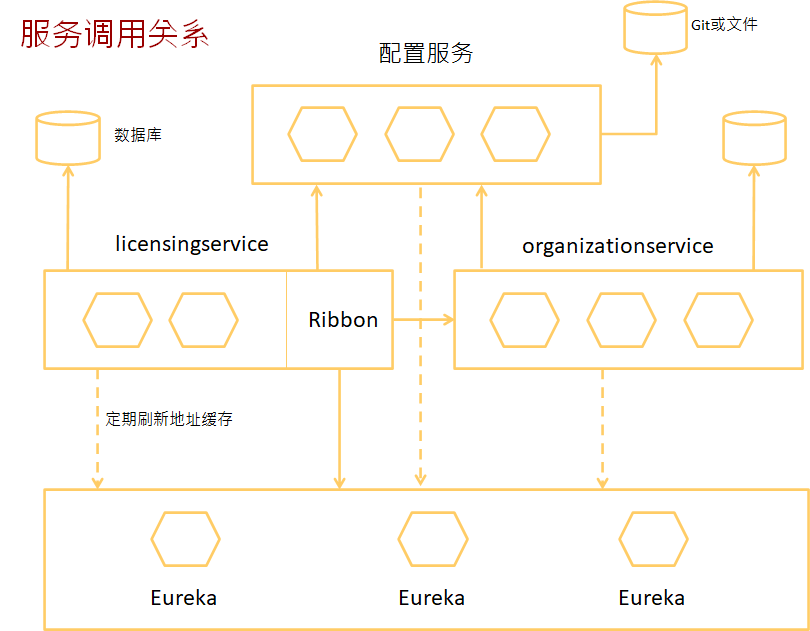

# 上课复习点

### Spring支持的第三方框架 - 1

不是这个图的都是第三方框架


### 横切面关注点 - 3

日志、安全、事务、缓存

### AOP通知注解 - 3

@Before

@After

@AfterReturning

@AfterThrowing

@Around

### AOP生效注解 - 3

@AspectJ注解驱动的切面

纯POJO切面，xml配置

@EnableAspectJAutoProxy //开启AspectJ的自动代理机制

### 包含Component的注解 - 2

@Controller、@Service、@Configuration、@Repository（@Aspect不是）

### RequestMapping加的位置 - 2

可以是类的注解、可以是方法的注解

### Spring MVC的启用注解 - 4

加注解@EnableWebMvc、配视图解析器、启用组件扫描、排除静态资源的请求

### 控制器方法实现、视图名字、Java对象、视图转换、重定向 - 4

**根据URL指定控制器**

@RequestMapping("/")

**找到JSP文件**

resolver.setPrefix("/WEB-INF/views/");
resolver.setSuffix(".jsp");

加上文件名拼成指定的JSP文件，譬如/WEB-INF/views/home.jsp

**获得输入**

查询参数（Query Parameter）：在URL里面有?max=34  @RequestParam(“max”)

路径参数（Path Variable）：占位符，在URL里面有“/{name}” @PathVariable(“name”)

表单参数（Form Parameter）：参数名与对象字段名相同

### JDBC是否做了池化处理？ - 6

DriverManagerDataSource：注意没有进行池化处理

SingleConnectionDataSource:只有一个连接的池

### 生产环境中的配置处理 - 2

```java
@Configuration
public class DataSourceConfig {

   @Bean(destroyMethod = "shutdown")
   @Profile("dev")
   public DataSource embeddedDataSource() {
   }

   @Bean
   @Profile("prod")
   public DataSource jndiDataSource() {
   }

}
```

激活方法：@ActiveProfiles(“dev”)

### 业务层、持久层接口隔离好处 - 6

1. 运行测试业务逻辑时，业务测试对象可以mock
2. 方便替换数据访问层，具体的数据库可以随便换，不影响数据库。

### Hibernate - 7

配置：

org.hibernate.Session接口。获得org.hibernate.SessionFactory对象。org.springframework.orm.hibernate4.LocalSessionFactoryBean

定义映射关系：XML、注解（JPA、Hibernate）

查询：

1. HQL:hibernate query language，即hibernate提供的面向对象的查询语言。select/update/delete…… from …… where …… group by …… having …… order by …… asc/desc

2. QBC查询: query by criteria 完全面向对象的查询

3. 本地SQL查询

### JPA实现数据访问，如何定义数据库 - 7

@Entity

@Id

@GeneratedValue(strategy=GenerationType.IDENTITY)

@Column(name="username")

### JPA实现注解、类、接口、参数 - 7

加注解@EnableJpaRepositories

继承接口org.springframework.data.jpa.repository.JpaRepository

javax.persistence.EntityManager

实体管理器工厂（entity manager factory）

org.springframework.orm.jpa.LocalContainerEntityManagerFactoryBean

org.springframework.orm.jpa.vendor.HibernateJpaVendorAdapter

### MongoDB使用注解document，是谁定义的 - 8

@Document
标注在实体类上，类似于hibernate的entity注解，标明由mongo来维护该表。

```java
org.springframework.data.mongodb.core.mapping.Document.class
把一个java类声明为mongodb的文档，可以通过collection参数指定这个类对应的文档。
@Document(collection="mongodb 对应 collection 名")      

// 若未加 @Document ，该 bean save 到 mongo 的 user collection
// 若添加 @Document ，则 save 到 reUser collection
@Document(collection="reUser") 
public class User{
}
```

### MongoDB、Java对象序列化 - 8

java对象中属性是对象时不能被自动序列化到 MongoDB 中。

### MongoDB Collection，关系数据库，基于js代码的shell - 8

NoSQL(Not Only SQL) ，指的是非关系型的数据库

没有声明性查询语言

没有预定义的模式

键-值对存储、列存储、文档存储、图形数据库

MongoDB Shell是MongoDB自带的交互式Javascript shell,用来对MongoDB进行操作和管理的交互式环境

### Redis特点，支持的数据类型 - 8

速度快、key-value的Hash表结构，value是某数据结构 、内存数据库（缓存）、主从（master/slave）复制、数据持久化、高可用和分布式

String

Linked Lists：队列lpush/rpop、阻塞等待：BRPOP和BLPOP

Hashes

Sets

### EhCache和Redis区别，支不支持数据持久化、注解 - 9

- ehcache直接在jvm虚拟机中缓存，速度快，效率高；但是缓存共享麻烦，集群分布式应用不方便。
- redis是通过socket访问到缓存服务，效率比ecache低，比数据库要快很多，
  处理集群和分布式缓存方便，有成熟的方案。如果是单个应用或者对缓存访问要求很高的应用，用ehcache。如果是大型系统，存在缓存共享、分布式部署、缓存内容很大的，建议用redis。

ehcache也有缓存共享方案，不过是通过RMI或者Jgroup多播方式进行广播缓存通知更新，缓存共享复杂，维护不方便；简单的共享可以，但是涉及到缓存恢复，大数据缓存，则不合适。

支持持久化

### 容器和虚拟机区别 - 10

+ 容器是在Linux内核实现的轻量级资源隔离机制
+ 虚拟机是操作系统级别的资源隔离，容器本质上是进程级的资源隔离

### docker run命令参数 - 10

-d: 后台运行容器，并返回容器ID

-i: 以交互模式运行容器，通常与 -t 同时使用

-t: 为容器重新分配一个伪输入终端，通常与 -i 同时使用

-p: 指定（发布）端口映射，格式为：主机(宿主)端口:容器端口

-P: 随机端口映射，容器内部端口随机映射到主机的高端口

--name="nginx-lb": 为容器指定一个名称

-e username="ritchie": 设置环境变量

--env-file=c:/temp1/t.txt: 从指定文件读入环境变量

--expose=2000-2002: 开放（暴露）一个端口或一组端口；

--link my-mysql:taozs : 添加链接到另一个容器

-v c:/temp1:/data: 绑定一个卷(volume)

--rm  退出时自动删除容器

### docker命令 - 10

docker container ls

docker container ls -a

docker container ls –aq

docker inspect 容器名：显示容器信息

docker port 容器名：显示端口映射信息

docker logs -f <容器 ID>  查看容器内部的标准输出

docker stop <容器 ID>    停止一个容器

docker start <容器 ID>    启动已停止运行的容器

docker restart <容器 ID>  正在运行的容器可以重启

docker attach <容器 ID>   附着到容器

docker exec -it <容器 ID>  /bin/bash  进入容器，执行命令

docker rm -f  <容器 ID>    删除容器

docker container prune    清理掉所有处于终止状态的容器

### Springboot和SpringCloud之间的关系 - 11

Spring Boot提供了基于java的、面向REST的微服务框架

Spring Cloud使实施和部署微服务到私有云或公有云变得更加简单

### 配置服务基于SpringBoot开发 - 11

+ 简化Spring Web开发
+ Spring Boot Starter

自动管理依赖、版本号

+ 自动配置

根据类路径加载的类自动创建需要的Bean

如：DataSource、JdbcTemplate、视图解析器等

+ Actuator

/autoconfig 使用了哪些自动配置（positiveMatches）

/beans，包含bean依赖关系

### SpringCloud要解决的问题 - 11

微服务划分，服务粒度、通信协议、接口设计、配置管理、使用事件解耦微服务

服务注册、发现和路由

弹性，负载均衡，断路器模式（熔断），容错

可伸缩

日志记录和跟踪

安全

构建和部署，基础设施即代码

服务器

### 服务向配置服务要数据时，如何知道是哪一个服务的数据 - 13



### 实现配置服务，启动类的注解 - 13

引导类加注解@EnableEurekaServer

bootstrap.yml、application.yml

+ 应用程序ID(ServiceId)、实例ID（6833e17cc88a:customerservice:8085）

+ eureka.client.fetchRegistry，本地缓存注册表，每隔30s客户端刷新

+ eureka.client.serviceUrl.defaultZone，可以有多个，逗号分隔

启动类加注解：@EnableEurekaClient或@EnableDiscoveryClient

### 服务网关可以实现什么 - 15

用户验证、授权、静态动态路由、动态数据收集、日志