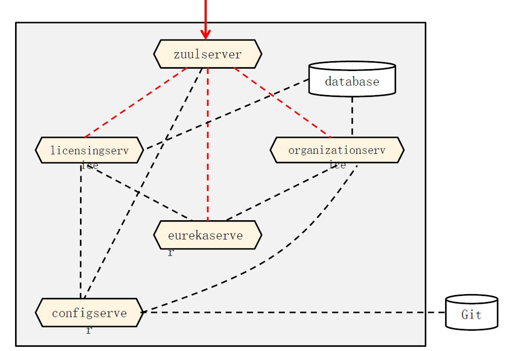

# 服务端开发2021复习

### 多选题 25道

### 问答题 5道

1. **web开发的分层，控制器、业务层、数据访问层、领域模型，以及mvc的view和model**

   session1 ppt：p16

   

2. **web框架处理的整个过程， dispatchservlet**

   session4 ppt：p5

   

3. **微服务相比传统单体的优势，典型的特征；单体应用程序的不足**

   session11 ppt：p2、p3

   **单体应用**

   数据库的表对所有模块可见

   一个人的修改整个应用都要重新构建、测试、部署

   整体复制分布式部署，不能拆分按需部署

   **微服务架构模式的特征**

   应用程序分解为具有明确定义了职责范围的细粒度组件

   完全独立部署，独立测试，并可复用

   使用轻量级通信协议，HTTP和JSON，松耦合

   服务实现可使用多种编程语言和技术

   将大型团队划分成多个小型开发团队，每个团队只负责他们各自的服务

1. **服务注册与发现的好处**

   session13 ppt：p2

   快速水平伸缩，而不是垂直伸缩。不影响客户端

   提高应用程序的弹性

   不用跳跃式增加服务器

2. **Eureka（Server、Client）、Ribbon、Feign、Zuul在微服务开发中的作用与相互关系**

   session13 && session15

   

