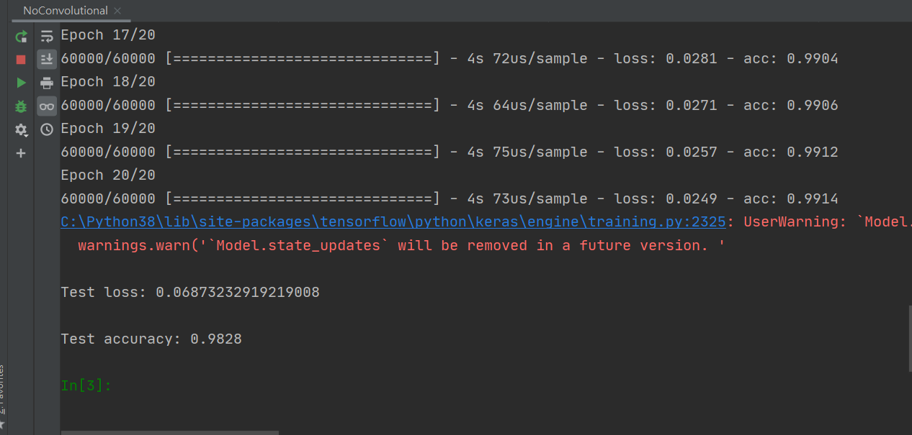
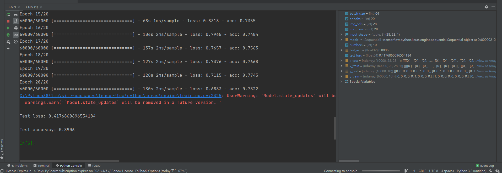
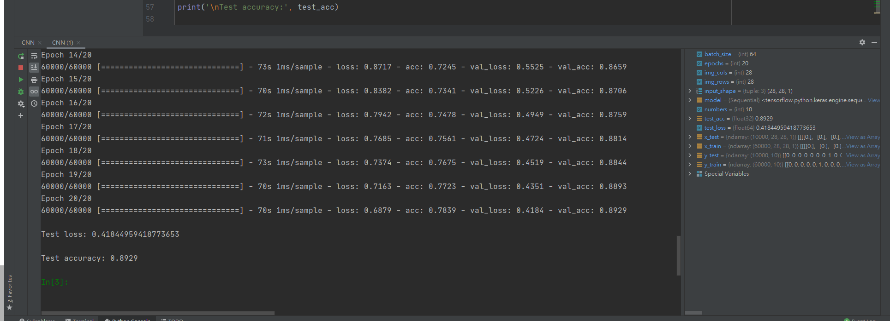
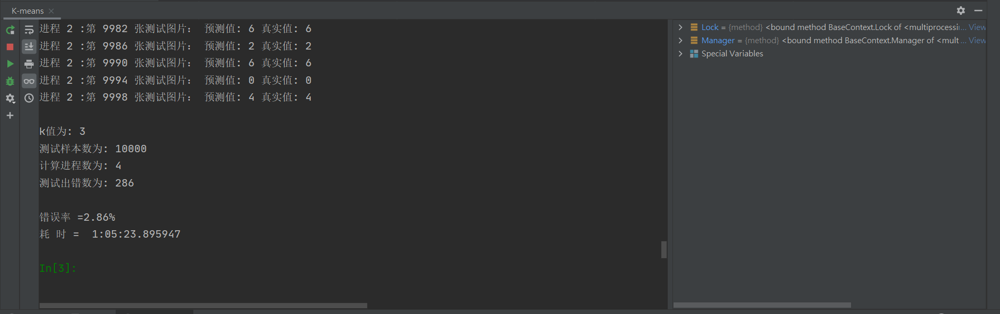

# 机器学习第一次作业

181250090 刘育麟

## 前置作业

### 环境配置

python3.8.5

tensorflow2.4.1

### 使用模型与数据集

tensorflow中的keras做CNN

mnist数据集（因为tensorflow自带了这个数据集，所以我直接使用了tensorflow自带的数据集并且下载到本地）

数据集可以用show.py打开前几张图片

## 只使用全连接层的神经网络

这是一开始做的，因为不需要卷积层，只有全连接层来做数据的降维与分类，速度极快，每一层只需要不到五秒的时间。因为在测试之后，发现这个的效果在迭代次数少的时候比卷积层的效果更好，就放上来。

这个在训练10次以上的准确率都在98%上下浮动。不过我觉得这个准确率应该是过拟合了，不太合理。我觉得第二个的准确率比较像是正常的模型会有的准确率。

### 获取数据与归一化

```python
mnist = tf.keras.datasets.mnist
(x_train, y_train),(x_test, y_test) = mnist.load_data(r"mnist.npz")
x_train, x_test = x_train / 255.0, x_test / 255.0
```

将数据下载下来之后，因为对训练数据进行归一化。图像是 28x28 的 NumPy 数组，像素值介于 0 到 255 之间，除以255就可以使得数据在0-1之间

### 模型构建

因为我一开始是照着tensorflow的教程做的，所以一开始的没有使用卷积层，单纯的使用全连接的方法，速度很快，基本上训练5秒钟左右就能出结果了。

```python
model = tf.keras.models.Sequential([
  tf.keras.layers.Flatten(input_shape=(28, 28)),
  tf.keras.layers.Dense(128, activation='relu'),
  tf.keras.layers.Dropout(0.2),
  tf.keras.layers.Dense(10, activation='softmax')
])
```

#### tf.keras.layers.Flatten

tf.keras.layers.Flatten，对数据进行降维。将图像格式从二维数组（28 x 28 像素）转换成一维数组（28 x 28 = 784 像素）。将该层视为图像中未堆叠的像素行并将其排列起来。该层没有要学习的参数，它只会重新格式化数据。

####  tf.keras.layers.Dense

展平像素后，网络会包括两个 tf.keras.layers.Dense 层的序列。它们是密集连接或全连接神经层。第一个 Dense 层有 128 个节点（或神经元）。第二个（也是最后一个）层会返回一个长度为 10 的 logits 数组。每个节点都包含一个得分，用来表示当前图像属于 10 个类中的哪一类。

### 模型训练

#### 模型配置

在准备对模型进行训练之前，对其进行一些设置：

1. 损失函数 - 用于测量模型在训练期间的准确率。您会希望最小化此函数，以便将模型“引导”到正确的方向上。
2. 优化器 - 决定模型如何根据其看到的数据和自身的损失函数进行更新。
3. 指标 - 用于监控训练和测试步骤。以下示例使用了准确率，即被正确分类的图像的比率。

```python
model.compile(optimizer='adam', loss='sparse_categorical_crossentropy', metrics=['accuracy'])
```

#### 训练神经网络模型

总共训练20次，每次训练样本数为64个。我发现这个模型只要训练超过10次，准确度大部分在98左右进行浮动。下面是训练的过程。

1. 将训练集train_images数组和训练集标签train_labels馈送给模型。

2. 模型学习将图像和标签关联起来。

3. 模型对测试集test_images数组进行预测。

4. 验证预测是否与测试集标签test_labels数组中的标签相匹配。

```python
model.fit(x_train, y_train, epochs=epochs, batch_size=batch_size, validation_data=(x_test, y_test))
```

### 模型测试

```python
test_loss, test_acc = model.evaluate(x_test, y_test, verbose=0)
print('\nTest loss:', test_loss)
print('\nTest accuracy:', test_acc)
```

##### 准确率与损失函数



## 有卷积层的神经网络

加上卷积层之后，我发现时间直线上升，准确率直线下降，可能是我电脑不太行的缘故，CPU只有i5-8，GPU只有1050的缘故，我是照着网上的一个卷积层进行调参，基本和他相同，但是测试出来的准确度却无法像网上的一样有98%。我与另一个设置了同样的次数来进行训练，这个训练是次数越多，效果越好，在训练10次以后已经能有60%的准确率。如果不加验证集，训练20次后的准确率是89.06%，加了验证集后准确率是89.29%。

### 获取数据与归一化

```python
(x_train, y_train), (x_test, y_test) = mnist.load_data(r"mnist.npz")
x_train = x_train.reshape(-1, img_rows, img_cols, 1)
x_test = x_test.reshape(-1, img_rows, img_cols, 1)
x_train = x_train.astype('float32')
x_test = x_test.astype('float32')
# 归一化
x_train /= 255
x_test /= 255
y_train = keras.utils.to_categorical(y_train, numbers)
y_test = keras.utils.to_categorical(y_test, numbers)
```

### 模型构建

代码中加入卷积层，一共两层，首层32个卷积次层64个卷积。激活函数采用relu，将小于0的置为0。卷积核往往采用5\*5或3\*3，这里采用的是5\*5的，而在扁平化之前将一部分数据丢掉，可以避免过拟合，获得更好的测试集准确度，但是这个属于超参数，所以我试了很多种，最后才确定这种方案。池化层是2\*2的。

```python
model = tf.keras.models.Sequential()
# 增加一层卷积，常用的滤波器是3*3或5*5的.32个卷积从1个平面抽取特征
model.add(tf.keras.layers.Conv2D(32, (5, 5), activation='relu', input_shape=input_shape))
# 64个卷积从32个平面抽取特征
model.add(tf.keras.layers.Conv2D(64, (5, 5), activation='relu'))
# 池化层采用2*2
model.add(tf.keras.layers.MaxPooling2D(pool_size=(2, 2)))
# 失活一部分神经元，让网络变瘦，同时dropout越小防止过拟合的效果就越好
model.add(tf.keras.layers.Dropout(0.5))
# 拉成一维，扁平化，为了全连接。
model.add(tf.keras.layers.Flatten())
# 全连接
model.add(tf.keras.layers.Dense(128, activation='relu'))
model.add(tf.keras.layers.Dropout(0.5))
# cnn中全连接层后会加上softmax函数
model.add(tf.keras.layers.Dense(numbers, activation='softmax'))
# 查看模型
model.summary()
```

#### 模型结构图

```
Model: "sequential"
_________________________________________________________________
Layer (type)                 Output Shape              Param #   
=================================================================
conv2d (Conv2D)              (None, 24, 24, 32)        832       
_________________________________________________________________
conv2d_1 (Conv2D)            (None, 20, 20, 64)        51264     
_________________________________________________________________
max_pooling2d (MaxPooling2D) (None, 10, 10, 64)        0         
_________________________________________________________________
dropout (Dropout)            (None, 10, 10, 64)        0         
_________________________________________________________________
flatten (Flatten)            (None, 6400)              0         
_________________________________________________________________
dense (Dense)                (None, 128)               819328    
_________________________________________________________________
dropout_1 (Dropout)          (None, 128)               0         
_________________________________________________________________
dense_1 (Dense)              (None, 10)                1290      
=================================================================
Total params: 872,714
Trainable params: 872,714
Non-trainable params: 0
_________________________________________________________________
```

### 模型训练

#### 模型配置

CNN一般采用交叉熵函数作为损失函数，其他参数基本与第一版相同

```python
model.compile(loss=keras.losses.categorical_crossentropy, optimizer=keras.optimizers.Adadelta(), metrics=['accuracy'])
```

#### 训练神经网络模型

训练20次，每次训练样本数为64个，并使用测试集作为验证集。训练过程与前面所说相同。

```python
model.fit(x_train, y_train, batch_size=batch_size, epochs=epochs, verbose=1, validation_data=(x_test, y_test))
```

### 模型测试

```python
test_loss, test_acc = model.evaluate(x_test, y_test, verbose=0)
print('\nTest loss:', test_loss)
print('\nTest accuracy:', test_acc)
```

#### 准确率与损失函数





## K-NN

我实现了另一个方法，就是使用k-NN进行计算。

把数据放到MNIST_data文件夹下即可

测试结果： 取3近邻时，正确率为97.14%

