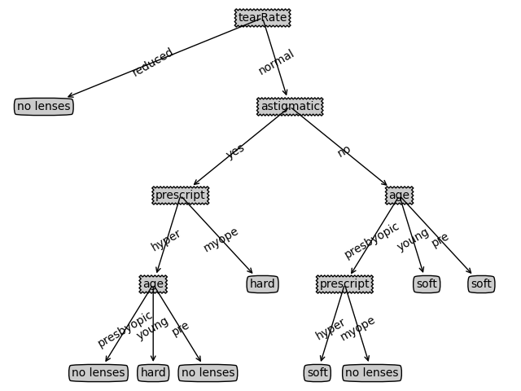

# 决策树作业

181250090 刘育麟

### 环境配置

python3.8.5

matplotlib 3.4.1

### 决策树算法原理

这里使用的是id3的决策树。

#### 信息熵

一个节点信息熵，$p_k$是每个属性出现的概率。

$Ent(D) = - \sum_{k = 1}^{K} p_{k} * log_{2}p_{k}$

每种特征中每个属性的信息熵

$Ent(D^{v})$

每个特征的信息熵，$\frac{|D^{v}|}{|D|}$为各个属性在该节点所有样本中的占比

$\sum_{v = 1}^{V} \frac{|D^{v}|}{|D|} Ent(D^{v})$

信息增益，a是属性

$Gain(D, a) = Ent(D) - \sum_{v = 1}^{V} \frac{|D^{v}|}{|D|} Ent(D^{v})$

#### 算法过程

1. 将所有的特征看成一个一个的节点。创建根节点。
2. 遍历所有特征。遍历到其中某一个特征时，遍历当前特征的所有分割方式，找到最好的分割点，将数据划分为不同的子节点，计算划分后子节点的信息熵。
3. 在遍历的所有特征中，比较寻找最优的特征以及最优特征的最优划分方式。选择信息增益最高的特征，根据特征则对当前数据集进行分割操作，产生子树。
4. 对新的子节点继续执行2 - 3步，直到下面的停止条件退出循环。

**决策树算法构建的停止条件**

1. 当子节点中只有一种类型或为空的时候停止构建(会导致过拟合)

2. 当前节点种样本数小于某个值，同时迭代次数达到指定值，停止构建，此时使用该节点中出现最多的类别样本数据作为对应值(比较常用)

### 核心代码

主要的核心代码在id3.py中

##### 建树的递归代码

```python
def create_tree(data_set, labels):
    # 决策结果的集合
    classList = [example[-1] for example in data_set]

    # 当类别与属性完全相同时停止，这里的classList[0]就是no lenses,soft 和hard
    if classList.count(classList[0]) == len(classList):
        # 返回标签。
        return classList[0]
    # 遍历完所有特征值时，返回数量最多的
    if len(data_set[0]) == 1:
        return main_feat(classList)

    # 获取最佳划分属性的Index，以0开始
    bestFeat = best_feature(data_set)
    bestFeatLabel = labels[bestFeat]
    my_tree = {bestFeatLabel: {}}
    # 清空labels中的该列
    del (labels[bestFeat])
    # 获取该列中所有的属性值
    featValues = [example[bestFeat] for example in data_set]
    # 唯一化
    uniqueVals = set(featValues)

    for value in uniqueVals:
        # 获取剩下的属性
        subLabels = labels[:]
        # 递归调用创建决策树
        my_tree[bestFeatLabel][value] = create_tree(split_data(data_set, bestFeat, value), subLabels)
    return my_tree
```

#### 遍历特征

##### 计算信息熵

```python
def calculate_shannon(data_set):
    data_set_len = len(data_set)
    label_counts = {}
    for feature_vec in data_set:
        # 提取soft hard还是不适合的标签
        label = feature_vec[-1]
        if label not in label_counts.keys():
            label_counts[label] = 0
        label_counts[label] += 1
    # 信息熵
    entropy = 0.0
    for key in label_counts.keys():
        # 这个就是每种决策结果（soft,hard还是no lenses占数据集的比重，也就是p）
        part_ent = float(label_counts[key] / data_set_len)
        # 将结果累加，得到根节点或该属性取值的信息熵
        entropy -= part_ent * log(part_ent, 2)
    return entropy
```

##### 计算最佳信息增益

```python
def best_feature(data_set):
    feature_num = len(data_set[0]) - 1
    # 计算根节点的信息熵
    root_env = calculate_shannon(data_set)
    info_increase = float(0)
    feature_pos = -1
    # 每列属性
    for i in range(feature_num):
        features = []
        # 同一列的相同属性
        for fe_choose in data_set:
            features.append(fe_choose[i])
        # 取值的集合
        unique_feature = set(features)
        # 信息熵
        entropy = 0.0
        for value in unique_feature:
            sub_data = split_data(data_set, i, value)
            # 计算该种可能性出现的概率
            probability = len(sub_data) / float(len(data_set))
            # 用这个概率去乘以子集的香农熵
            entropy += probability * calculate_shannon(sub_data)

        info_gain = root_env - entropy
        if info_gain > info_increase:
            info_increase = info_gain
            feature_pos = i
    return feature_pos
```

### 实验结果

```json
{
  'tearRate': {
    'reduced': 'no lenses',
    'normal': {
      'astigmatic': {
        'yes': {
          'prescript': {
            'hyper': {
              'age': {
                'presbyopic': 'no lenses',
                'young': 'hard',
                'pre': 'no lenses'
              }
            },
            'myope': 'hard'
          }
        },
        'no': {
          'age': {
            'presbyopic': {
              'prescript': {
                'hyper': 'soft',
                'myope': 'no lenses'
              }
            },
            'young': 'soft',
            'pre': 'soft'
          }
        }
      }
    }
  }
}
```

