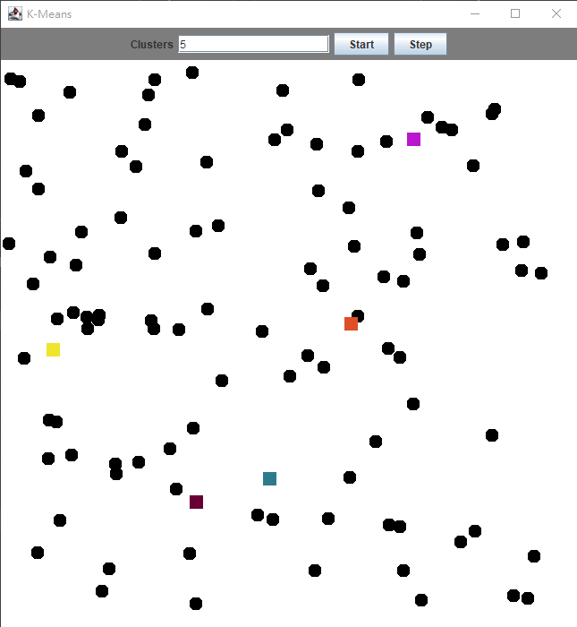
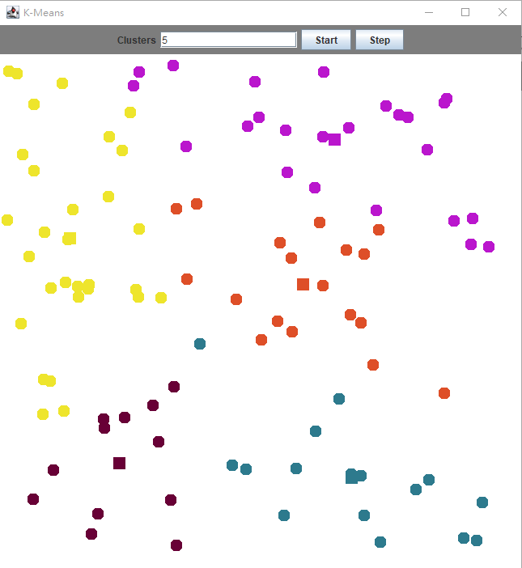
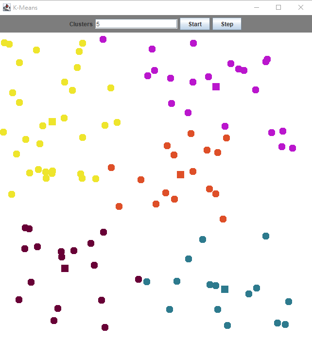
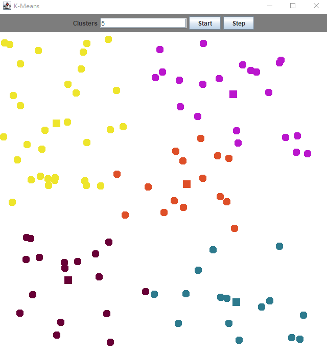
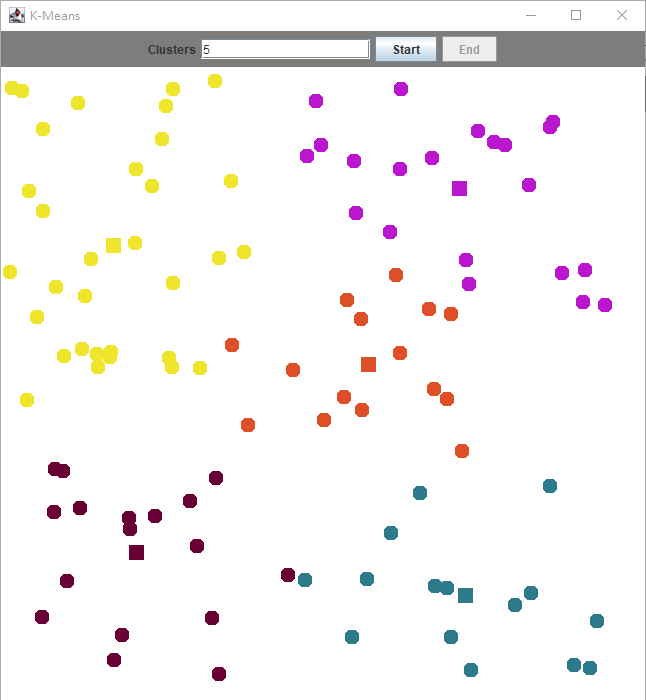
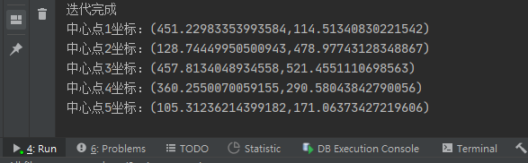

# Kmeans作业

181250090 刘育麟

### 环境配置

java环境，使用原生的Java UI组件JPanel和JFrame

### 算法原理

基于欧式距离的聚类算法，其认为两个目标的距离越近，相似度越大。

该实验产生的点为二维空间中的点。

#### 欧式距离

n维空间中的两个点X，Y

$dist(X, Y) = \sqrt{\sum_{i = 1}^{n} (x_{i} - y_{i})^{2}}$

#### 算法过程

1. 选择k，聚类的数量。
2. 选择k个点作为聚类中心。
3. 对每个样本点计算到k个聚类中心的距离，采用的是欧氏距离，将其分类到距离最近的类别中。
4. 根据每个类别，计算被分类在该类别中的所有点的中心。
5. 如果计算出来的中心和聚类中心相同，则退出循环，否则以新的计算出来的中心为每个聚类的聚类中心，不断重复3 - 4步。

### 核心代码

#### 设定K

```java
/*Step按钮的监听器*/
jButton2.addActionListener(new ActionListener() {
    public void actionPerformed(ActionEvent ae) {


        painting.assign();

        painting.updateCentroids();


        /*算法终止的话让按钮变灰并提示算法结束*/
        if (painting.stop(num++)) {
            jButton2.setText("End");
            jButton2.setEnabled(false);
        }


        painting.repaint();
    }
});
```

#### 计算欧式距离

```java
/*欧式距离*/
double Euc(Point p1, Point p2) {
    double distance = 0.0;

    for (int i = 0; i < Dimension; ++i)
        distance += (p1.x[i] - p2.x[i]) * (p1.x[i] - p2.x[i]);
    return Math.sqrt(distance);
}
```

#### 更新中心点

```java
/*更新中心点*/
void updateCentroid(int clusterNum) {
    //将newCluster数组的那个中心点置空
    for (int i = 0; i < Dimension; ++i)
        newCluster[clusterNum].x[i] = 0;

    int clusterSize = 0;

    for (int i = 0; i < Nodes; ++i)
        if (p[i].cluster == clusterNum) {
            //这个簇中有多少点
            clusterSize++;
            for (int j = 0; j < Dimension; ++j)
                newCluster[clusterNum].x[j] += p[i].x[j];
        }


    if (clusterSize == 0)
        return;

    for (int i = 0; i < Dimension; ++i)
        newCluster[clusterNum].x[i] /= (double) clusterSize;
}
```

#### 计算每个点的分类

```java
/*分配数据点到哪个簇*/
void assignPoint(int x) {
    double minDistance = 99999999;
    int nodeClassify = 1;
    for (int i = 0; i < K; ++i) {
        //计算欧式距离
        double newDistance = Euc(p[x], newCluster[i]);
        if (newDistance < minDistance) {
            minDistance = newDistance;
            nodeClassify = i;
        }
    }
    p[x].cluster = nodeClassify;
}
```

#### 判断终止条件

```java
/*判断算法是否终止*/
Boolean stop(int currentTime) {
    //超过迭代次数
    if (currentTime > range) {
        int num = 1;
        System.out.println("超过迭代次数");
        for (Point i : oldCluster) {
            System.out.println("中心点" + num + "坐标：(" + i.x[0] + "," + i.x[1] + ")");
            num++;
        }
        return true;
    }
    /*如果每一个中心点都与上一次的中心点相同，则算法终止，否则更新oldCentroid*/
    for (int i = 0; i < K; ++i)
        if (!samePoint(oldCluster[i], newCluster[i])) {
            for (int j = 0; j < K; ++j)
                copy(oldCluster[j], newCluster[j]);
            return false;
        }
    int num = 1;
    System.out.println("迭代完成");
    for (Point i : oldCluster) {
        System.out.println("中心点" + num + "坐标：(" + i.x[0] + "," + i.x[1] + ")");
        num++;
    }
    return true;
}
```

### 实验结果



点击start之后，产生新的随机点与初始聚类中心





点击step，将每一步的迭代展示出来，这里展示了4步，从左上角的图开始。



计算最后的五个中心点坐标

