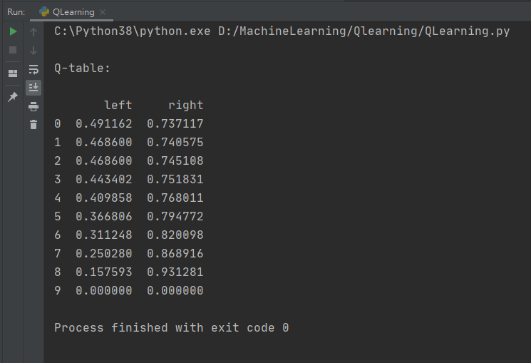

# RL小作业

181250090 刘育麟

### 实验环境

python 3.8.5

pandas 1.2.3

### 伪代码

```
create Q_table[][];
rows = states;
columns = actions; 
isFirst = true; 
repeat = 12;
Q_table.all.set(0);
A = {+1,-1}, S_all = [0,1,2,3,4,5,6,7]; 
ε = 0.2, y = 0.8, u = 0.1;
s = 0;
while1:
    while2:
        if (getRandom()<ε || isFirst) 
 	        a=random(A)
        else
 	        a = max (Q[S]).getType())
        s' = s + a;
        r = power ( 1 / ( len(S) – s' ), 5);
        Q_tables[s][a] = Q_tables[s][a] + u( r + y max(Q[s’]) - Q_tables[s][a]);
        if (s’ == len(S) - 1):
	        print(Q_table)
 	        repeat--;
        else:
 	        s= s';
 	        goto while2;
    if (repeat == 0)
 	    print(Q_table)
    else
 	    goto while1
```

1. 初始化q表，行表示状态，列表示动作。设定训练次数、贪婪算法的阈值$\epsilon$、学习率$u$、折扣率$y$。
2. 根据状态的数量产生状态集合$S$，设定移动方式$a$，因为是一维，所以是{-1, +1}
3. 循环：每一次训练重新循环一遍
   1. 循环：每次有一个状态$s$。如果$s$不是终止状态的话，选择动作，得到环境给出的一个反馈$s'$(新的状态)和$R$(奖励)
      1. 给定一个随机数，如果随机数小于$\epsilon$，或是这是循环一开始，则随机选择动作。否则选择选址最大的动作
      2. 计算$r$
      3. 更新Q值。更新公式为$Q(s,a) \leftarrow Q(s, a) + \mu (r + \gamma max_{a'} Q(s', a') - Q(s, a))$
      4. 判断是不是一次训练结束，结束则打印Q表，跳出循环，不是则将$s$变为$s'$

### 关键代码

#### 选择动作

$\epsilon = 0.2$的概论选择其他动作。而初始情况（表全零的时候），永远会选择向左，也就是永远在0处打转，死循环，所以随机选择。不然就选择下一行最大的Q所在的行为，进行移动。

```python
def choose_action(state, q_table):
    state_action = q_table.iloc[state, :]
    # 等于零就随便选一条路走
    if (np.random.uniform() < e) or (state_action.all() == 0):
        action_choose = np.random.choice(actions)
    else:
        action_choose = state_action.idxmax()
    return action_choose
```

#### 计算奖励值

根据与终点的距离返回一个奖励函数，这个奖励函数是下一状态与终止结点距离的反比的五次方计算得到。

```python
def get_state_reward(s, A):
    if A == "right":
        if s == states - 2:
            s2 = "terminal"
            reward = 1
        else:
            s2 = s + 1
            # 保证反比，
            reward = pow(1 / (states - s2), 5)
    else:
        # 这个是说到头了 不能再后退了
        if s == 0:
            s2 = s
        else:
            s2 = s - 1
        reward = pow(1 / (states - s2), 5)
    return s2, reward
```

#### 两层循环

```python
def q_learning():
    # 先初始化一个Q table
    q_table = pd.DataFrame(np.zeros((states, len(actions))), columns=actions)
    for episode in range(circles):
        step_count = 0
        # 选择一个初始的S
        S = 0
        is_terminal = False
        update_env(S, episode, step_count)
        # 如果S不是终止状态的话，选择动作，得到环境给出的一个反馈S_(新的状态)和R(奖励)
        while not is_terminal:
            A = choose_action(S, q_table)
            S2, R = get_state_reward(S, A)
            q_current = q_table.loc[:S, A]
            if S2 != "terminal":
                # 算出来实际的Q值
                q_next = R + y * q_table.iloc[S2, :].max()
            else:
                q_next = R
                is_terminal = True
            q_table.loc[:S, A] += u * (q_next - q_current)
            S = S2
            update_env(S, episode, step_count + 1)
            step_count = step_count + 1
    return q_table
```

### Q-table解析



可以发现，向右的奖励函数比向左的高，这是因为实验用的奖励函数是根据与终点的距离计算，当距离越短，奖励函数越大。第一次计算就会发现向右比向左更加好，所以在下次训练的时候，就因为贪心策略，更大概率会去选择下一步有更大奖励的动作，也就是向右。所以Q(S, right)的会越来越多，Q(S, left)会越来越少，而最后一个状态是终止状态，已经找到宝藏了，所以不需要进行往左或往右的选择了。