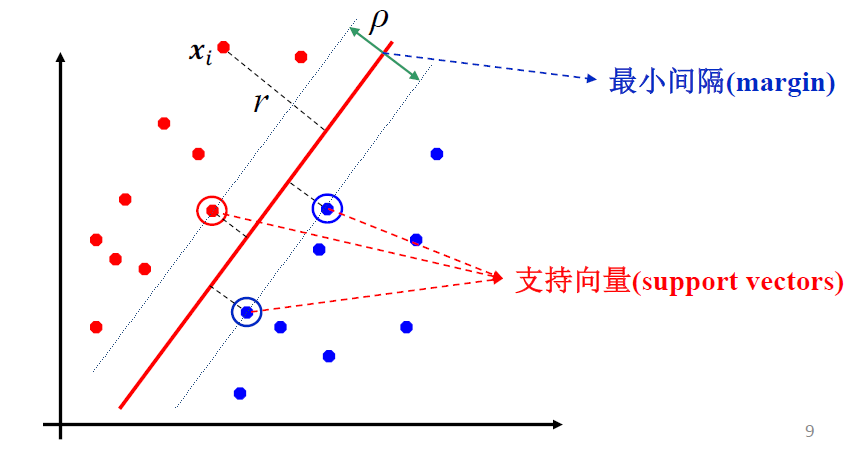
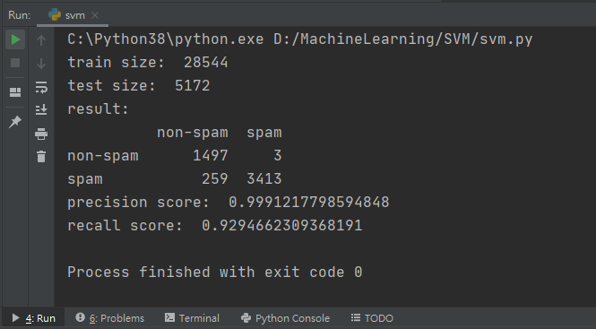

# SVM小作业

181250090 刘育麟

### 实验环境

python 3.8.5

pandas 1.2.3

scikit-learn 0.24.1

### 算法原理

SVM是一个线性分类器，但是比起一般的线性分类器，SVM选择的是鲁棒性最好、泛化能力最强的分界超平面，将数据分为两个部分。而选择最好的决策边界是根据支持向量所决定的，也就是说对于整个数据集，我只需要支持向量就可以计算出一样的决策边界，支持向量到决策边界的最短距离就是margin，而找到最小的margin就可以得到最好的那条分类超平面。

假设分类超平面为$f(x) = w^{T}x + b$

那么问题形式就是$argmax_{w,b} (min_{i} (\frac{|w^{T} x_{i} + b|}{||w||}))$

因为上面那个问题非常难以优化，所以我们将这个问题转换成另一个问题$argmin_{w, b} \frac{1}{2} w^{T}w $    $ s.t. y_{i} (w^{T} x_{i} + b) \ge 1, \forall i$

接着，引入拉格朗日乘子法求解$L(w, b, a) = \frac{1}{2} w^{T}w - \sum_{i = 1}^{n} a_{i} (y_{i}(w^{T} x_i + b) - 1)$    $s.t. a_{i} \ge 0$

有两个参数$w,b$，分别求导。

$\frac{\delta L}{\delta w} = w - \sum_{i = 1}^{n} a_{i} y_{i} x_{i} = 0$, $\frac{\delta L}{\delta b} = \sum_{i = 1}^{n} a_{i} y_{i} = 0$

带回$L$

$\widetilde{L} (a) = \sum_{i = 1}^{n} a_{i} - \frac{1}{2} \sum_{i = 1}^{n} \sum_{j = 1}^{n} a_{i} a_{j} y_{i} y_{j} x_{i}^T x_{j}$

其中$x_{i}^T x_{j}$是内积

接着，要确定最优解，使用KKT条件

$w = \sum_{i = 1}^{n} a_{i} y_{i} x_{i}$

$\sum_{i = 1}^{n} a_{i} y_{i} = 0$

$a_{i} (y_{i}(w^{T} x_i + b) - 1) = 0, \forall i$

$a_{i} \ge 0, \forall i$

$y_{i} (w^{T} x_{i} + b) \ge 1, \forall i$

接着在每次训练的时候，选择不同的$a_i, a_j$代入等式中进行计算，就可以得到$w, b$

而我们可以知道，对于任意训练样本$(x_i, y_i)$，$a_{i} < 0$的不需要计算，$a_{i} = 0$，则该样本不会在最后求解模型参数的式子中出现。如果$a_{i} > 0$，则必有$y_{i} (w^{T} x_{i} + b) = 1$，所对应的样本点位于最大间隔边界上，是一个支持向量。这显示出支持向量机的一个重要性质：训练完成后，大部分的训练样本都不需要保留，最终模型仅与支持向量有关。

### 实验结果

实验使用2、3、4、5、6作为训练集，1作为测试集，输出训练集和测试机的样本大小，最后输出精准率和召回率

