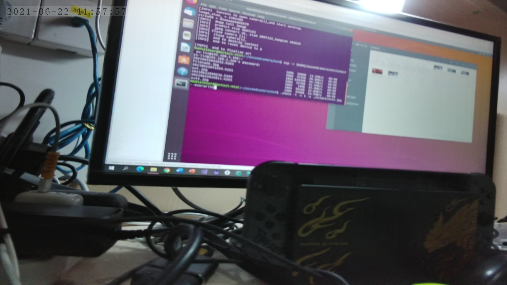
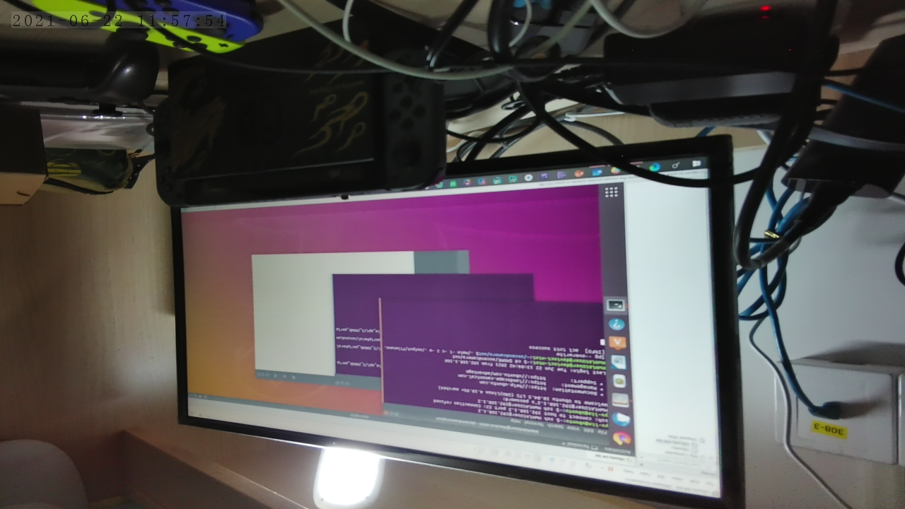
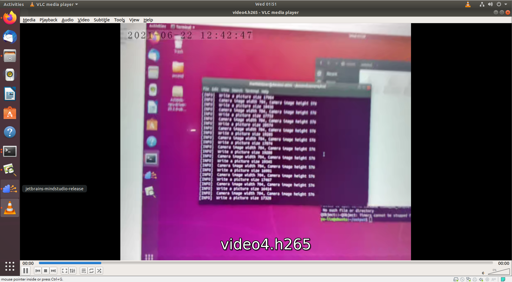

# atlas200DK基本实验

组号：12
组员：⻩⾬晨 181250052 李镔达 181250066 刘育麟 181250090 殷德林 181250178

## 配置环境

### 配置说明

配置环境使用的是vmware虚拟机，操作系统是Ubuntu18.04

使用3.3.0alpha1作为主要版本进行配置。

### 环境变量

#### 开发环境

因为我使用root用户配置的，所以环境变量配置上面略有不同，在/etc/profile里面的配置。

```bash
export JAVA_HOME=/usr/local/jdk1.8
export JRE_HOME=${JAVA_HOME}/jre
export CLASSPATH=.:${JAVA_HOME}/lib:${JRE_HOME}/lib
export PATH=.:${JAVA_HOME}/bin:$PATH
#用于设置python3.7.5库文件路径
export LD_LIBRARY_PATH=/usr/local/python3.7.5/lib:$LD_LIBRARY_PATH
#如果用户环境存在多个python3版本，则指定使用python3.7.5版本
export PATH=/usr/local/python3.7.5/bin:$PATH

export install_path=/usr/local/Ascend/ascend-toolkit/latest     # 以安装用户为HwHiAiUser为例
export ASCEND_OPP_PATH=${install_path}/opp
export ASCEND_AICPU_PATH=${install_path}
export TOOLCHAIN_HOME=${install_path}/toolkit
#开发离线推理程序时配置
export LD_LIBRARY_PATH=${install_path}/acllib/lib64:$LD_LIBRARY_PATH
export PATH=${install_path}/toolkit/bin:$PATH
export PYTHONPATH=${install_path}/toolkit/python/site-packages:${install_path}/pyACL/python/site-packages/acl:$PYTHONPATH
#进行模型转换/算子编译时配置
export LD_LIBRARY_PATH=${install_path}/atc/lib64:$LD_LIBRARY_PATH
export PATH=${install_path}/atc/ccec_compiler/bin:${install_path}/atc/bin:${install_path}/toolkit/bin:$PATH
export PYTHONPATH=${install_path}/toolkit/python/site-packages:${install_path}/atc/python/site-packages:$PYTHONPATH
export MindStudio_HOME=/home/yu-lin/Desktop/ascend/MindStudio/bin
export PATH=.:${MindStudio_HOME}:$PATH

export PATH=$PATH:/root/ascend_ddk/x86/bin

export DDK_PATH=${install_path}/arm64-linux

export NPU_HOST_LIB=$DDK_PATH/acllib/lib64/stub
```

#### atlas200DK

在~/.bashrc里面的配置。

```bash
export LD_LIBRARY_PATH=/usr/lib64
export LD_LIBRARY_PATH=/home/HwHiAiUser/Ascend/acllib/lib64:/home/HwHiAiUser/ascend_ddk/arm/lib
export PYTHONPATH=/home/HwHiAiUser/Ascend/pyACL/python/site-packages/acl
export ASCEND_AICPU_PATH=/home/HwHiAiUser/Ascend
```

### 配置过程

过程基本照着官网教程来做，其中的几个坑才特别标明。

一定需要Ubuntu环境，非Ubuntu环境没有netplan这个文件夹，无法配置网卡相关的操作，无法与开发板相连。

#### 开发环境（本机）

1. 配置python环境。

   https://support.huaweicloud.com/environment-deployment-Atlas200DK202/atlased_04_0021.html

2. 安装arm架构和x86架构的Ascend-toolkit进行环境的搭建。（注意版本号和安装路径的环境变量）

   https://support.huaweicloud.com/environment-deployment-Atlas200DK202/atlased_04_0022.html

3. 安装atlasutil库。

   https://gitee.com/ascend/samples/blob/master/cplusplus/environment/atlasutil_install/README_200DK_CN.md

4. 将atlasutil库编译好的so文件上传到200DK（如果已经上传可以跳过这一步）

5. 安装Presenter Agent库，因为是双架构，所以需要对两个环境进行安装，按照官网的教程进行操作。注意，在clone protobuf之后，备份整个文件之前，需要先手动添加第三方库，否则最后运行时会报错。

   ```bash
   cd $HOME/protobuf/third_party
   git clone https://gitee.com/xiaofanwasd/googletest.git
   export LD_LIBRARY_PATH=/home/HwHiAiUser/Ascend/acllib/lib64:/home/HwHiAiUser/ascend_ddk/arm/lib
   ```

   https://gitee.com/ascend/samples/blob/master/cplusplus/environment/presenteragent_install/README_200DK_CN.md

6. 将Presenter Agent库编译好的so文件上传到200DK。（如果已经上传可以跳过这一步）

#### atlas200DK

1. 配置使用网线连接外网的环境，不能只和开发环境互通。（需要apt install下包，所以这个是必要步骤）

2. 200DK换源时要注意要找arm架构的源，不然会报错。

3. 安装ffmpeg+opencv。

   https://gitee.com/ascend/samples/blob/master/cplusplus/environment/opencv_install/README_200DK_EN.md

4. 将开发板上安装的ffmpeg和opencv库导入开发环境中，提供编译使用。

#### 常见错误

1. 如果本机安装时提示xxx包找不到，这个包在/ascend底下，环境变量重新导入。
2. 如果提示xxx头文件找不到，检查是否完整的从200DK将ffmpeg和opencv库导入，或是将环境变量重新导入。
3. 如果200DK运行时提示找不到包，重新将本机的so文件导入200DK中。
4. 对源文件make时失败，查看是不是缺少包，如果是缺少Presenter Agent库相关的包，就是缺少第三方库。

## 实验结果

### 图片

在out目录下运行指令

```bash
./main -i -c 1 -o ./output/filename.jpg --overwrite
# filename是图片的名字
```






### 视频

视频生成的是.h265文件，需要在ubuntu下面安装vlc这个包并使用vlc指令运行。

前两个视频是50帧的长度，后面两个视频是1000帧的长度。

在out目录下运行指令

```bash
./main
```

[video1.h265](video1.h265) 

[video2.h265](video2.h265) 

[video3.h265](video3.h265) 

[video4.h265](video4.h265) 

运行视频时的截图如下



