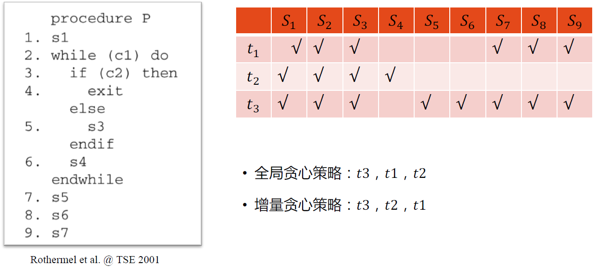
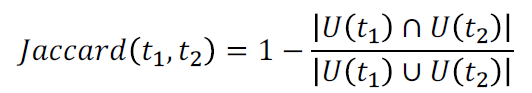
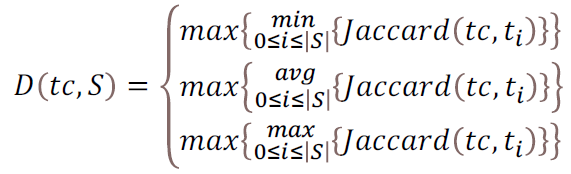
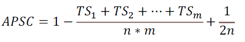
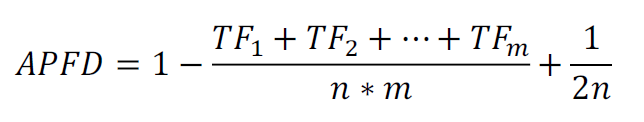
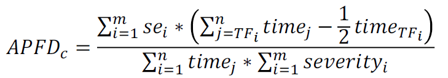
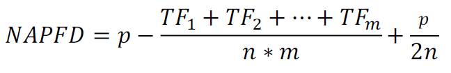
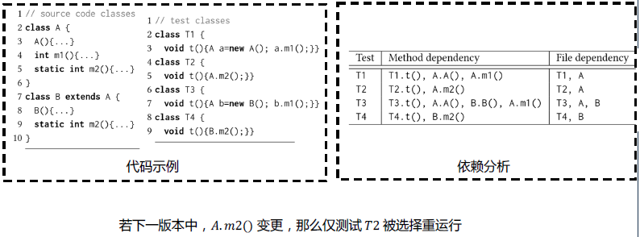

# 源码测试

## 回归测试

### 基本概念

+ 版本迭代后，重新测试用例。
+ 可有效保证代码修改的正确性并避免代码修改对被测程序其他模块产生的副作用。
+ 部分代码修改会影响接口，导致测试用例失效。
+ 新需求需要新用例

### 差分测试

+ 差分检测（Differential detection）是关于编码和检测的技术，即由载波到二进制信号（0和1）的相位权变化。每隔t秒信号取样一次，若相位变化为180度，二进制设置为“0”；若没有发生相位变化，二进制表示为“1”。

### 蜕变测试

+ 不知道测试结果的正确性
+ 蜕变测试依据被测软件的领域知识和软件的实现方法建立蜕变关系(Metamorphic Relation, MR)，利用蜕变关系来生成新的测试用例，通过验证蜕变关系是否被保持来决定测试是否通过。蜕变关系(Metamorphic Relation, MR) 是指多次执行目标程序时，输入与输出之间期望遵循的关系。
+ Ex. 一个程序可以算sin，sin (270) = sin ($\pi$ - 270)，测试时将两者分别计算并比较。

### 优化方法

+ 测试用例优先级（Test Case Prioritization，TCP）
+ 测试用例集约减（Test Suite Reduction，TSR）
+ 测试用例选择（Test Case Selection，TCS）

## 测试用例优先级

### 简介

+ 依照某种策略赋予每个测试用例的不同优先级，重新排序测试执行序列来最大化错误检测速率。
+ 优先级高的算法比优先级测试低的先执行
+ 通用测试排序：后续版本的测试用例优先级更高
+ 特定于版本的测试排序：不同版本特性测试用例优先级不同

### 主要策略

给定测试用例集$T$，$T$的全排列集$PT$（所有可能执行顺序），排序目标函数$f$（排序效果评分，高分优先级高），其定义域为$PT$，值域为实数。

寻找$P'\in PT$，使得$f(P') \ge f(P''), P'' \in PT(P' \not = P'')$。

#### 基于贪心的TCP

+ 全局贪心策略
  + 每轮优先挑选覆盖最多代码单元的测试用例。
  + 多个用例相同随机选择。
+ 增量贪心策略
    + 每轮优先挑选覆盖最多，且未被已选择用例覆盖代码单元的测试用例。
    + 所有代码单元均已被覆盖则重置排序过程
    + 多个用例相同随机选择

解析：

+ 全局贪心：因为t3覆盖代码行数最多，所以t3 -> t1 -> t2
+ 增量贪心：一开始所有代码都没覆盖，所以t3先，测完后，剩s4未覆盖，所以t2。最后全部覆盖所以重置，测试t1。

#### 基于相似性的TCP

+ 基本定义：每轮优先与已选择测试用例集差异性最大的测试用例。让测试用例均匀地分布在输入域中。

+ 排序步骤：

  （1）测试用例之间的距离计算：假设$U(t_1)$ 和 $U(t_2)$为测试用例$t_1$和$t_2$所覆盖的代码单元集合，那么这两个用例之间的距离计算如下：

  

  （2）测试用例与测试用例集之间的距离计算：分别使用最小距离、平均距离和最大距离度量方式计算待选择用例$t_c$与已选择用例集S的距离：

  

#### 基于搜索的TCP

+ 基本定义：探索用例排序组合的状态空间，以此找到检测错误更快的用例序列。

+ 排序步骤：

+ （1）种群构造：生成N个测试用例序列，之后随机生成切割点，互相交换两个用例序列切割点后部分的片段，仅交换相同测试用例的部分；同时以一定概率选择测试用例，并随机生成两个测试用例位置，进行互换，产生新的测试用例序列。

  （2）评估值计算：以语句覆盖为例，给定程序包含m个语句$M = \{s_1,s_2,...,s_m\}$和n个测试用例$T=\{t_1,t_2,...,t_n\}$，$T'$为某一次搜索中$T$的一个排序序列，$TS_i$为该测试用例序列$T'$中第一个覆盖语句$s_i$的测试用例下标，那么其适应度计算为：

  

#### 基于机器学习的TCP

+ 基本定义：基于测试分布特征，预测表现最佳的排序技术。

+ 排序步骤：

  （1）测试分布特征提取：给定被测程序，提取每个测试用例覆盖单元数；执行时间与单元时间内覆盖单元数。

  （2）模型生成：由于三种特征取值范围不同，使用min-max正则化，最后使用XGBoost学习特征进行预测。

### APFD

+ 平均故障检测百分比（Average Percentage of Faults Detected， APFD ）

+ 给定程序包含m个故障$F=\{f_1,f_2,...,f_m\}$和n个测试用例$T=\{t_1,t_2,...t_n\}$，$T'$为$T$的一个排序序列，$TF_i$为该测试用例序列$T'$中第一个检测到故障$f_i$ 的测试用例下标，则该排序序列$T'$的APFD值计算公式为

### APFDc

+ 开销感知平均故障检测百分比（Cost-cognizant Average Percentage of Faults Detected， APFDc）

+ 给定程序包含m个故障$F=\{f_1,f_2,...,f_m\}$，它们的严重程度分别为$Severity = \{se_1,se_2,...,se_m\}$，和n个测试用例$T=\{t_1,t_2,...t_n\}$，它们的执行时间分别是$Time=\{time_1,time_2,...,time_n\}$，$T'$为$T$的一个排序序列，$TF_i$为该测试用例序列$T'$中第一个检测到故障$f_i$ 的测试用例下标，则该排序序列$T'$的APFDc值计算公式为

### NAPFD

+ 归一化平均故障检测百分比（ Normalized Average Percentage of Faults Detected， NAPFD ）
+ 给定程序包含m个故障$F=\{f_1,f_2,...,f_m\}$和n个测试用例$T=\{t_1,t_2,...t_n\}$，$T'$为$T$的一个排序序列，$TF_i$为该测试用例序列$T'$中第一个检测到故障$f_i$ 的测试用例下标，$p$为$T'$检测到的故障数与程序总的故障数的比值，则该排序序列$T'$的NAPFD值计算公式为

## 测试用例选择

### 简介

+ 回归测试用例选择可以通过重新运行原始测试套件的一个子集，验证某些变更是否对当前软件版本的功能造成了影响。
+ 降低回归测试的开销
+ 最大化缺陷探测能力

### 主要策略

修改前的程序$P$，对应的测试用例集$T$，和修改后的程序$P'$。
寻找$T$的子集$T'$对$P'$进行测试，并且$T'$中的任意测试用例均是可以检测代码修改的测试用例。

#### 最小化测试用例选择

+ 从原本的测试用例集$T$中找出最小的子集$T_{min}$，$T_{min}$能够覆盖被测程序$P$中所有本次修改的、或者受本次修改影响的部分。
+ 每一条新增的或者被修改的语句都能够被至少一个来自原测试套件$T$的测试用例执行。

#### 安全测试用例选择

+ 从原本的测试用例集$T$中能够暴露修改后被测程序$P'$中的一个或多个缺陷的所有测试用例，构成安全回归测试集$T_S$

+ $T_S$中的每个测试都能够满足以下条件之一

  + 执行至少一条在$P'$中被删除的语句

  + 执行至少一条在$P'$中新增的语句

#### 基于数据流和覆盖的测试用例选择

+ 变更后的代码$P'$中使数据交互变化的语句构成语句集合$S_I$。从原本的测试用例集$T$中选取出所有覆盖到$S_I$中某条语句的测试用例，组成测试集$T_D$
+ $T_D$中的每个测试都能够满足以下条件之一
  + 执行至少一个在$P'$中被删除的Define-Use对
  + 执行至少一个在$P'$中新增的Define-Use对

#### 特制/随机测试用例选择

+ 随机测试用例选择：规定测试用例的选取数量为m，测试人员随机地从原本的测试用例集$T$中选出m个测试用例，组成随机回归测试集$T_R$
+ 面向剖面测试用例选择：与面向剖面程序编程有关（Aspect-Oriented Programming），从原本的测试用例集$T$中选出与某个剖面a有关的k测试用例，组成回归测试集$T_a$

## 基于程序分析的测试用例选择

### 简介

+ 根据技术的基本定义以及程序分析技术的特点，该技术一般被认为是一种安全测试用例选择技术
+ 通过程序分析技术计算出测试代码（方法、用例或套件）与生产代码之间的依赖关系，并在代码发生变更时，利用这些依赖关系将所有受到变更影响的测试代码（Change-Impacted Tests）自动选取出来，组成回归测试集。

+ 测试依赖：测试代码运行到某些生产代码而产生的联系

### 依赖分析

### 分类

#### 静态分析

+ 静态（程序）分析是指在没有实际执行程序的情况下对计算机软件程序进行自动化分析的技术（手动分析一般被称为程序理解或代码审查）。
+ 大多数情况下，分析的材料为源语言代码，少部分静态分析会针对目标语言代码进行（例如：分析Java的字节码）。

#### 动态分析

+ 动态（程序）分析通过在真实或虚拟处理器上执行程序来完成对程序行为的分析。
+ 为了使动态程序分析有效，必须使用足够的测试输入来执行目标程序，以尽可能覆盖程序所有的输出。进行动态分析时一般需要注意最小化插桩对目标程序的影响。

#### 动态 V.S. 静态

| 特征         | 动态 | 静态   |
| ------------ | ---- | ------ |
| 总体         | 好   |        |
| 依赖信息     | 多   |        |
| 开销         |      | 小     |
| 过拟合       |      | 有     |
| 插桩         | 需要 | 不需要 |
| 运行测试阶段 |      | 好     |

### 粒度

#### 细粒度

+ 基本块（Basic Block，BB）级：利用BB级变更和BB级测试依赖进行测试选取
+ 方法级：利用方法级变更和方法级测试依赖进行测试选取

#### 粗粒度

+ 文件（类）级：利用文件级变更和文件级测试依赖进行测试选取。由于Java语言会将每一类编译成一个.class文件，因此针对Java语言的文件级测试用例选择等同于类级别测试用例选择
+ 项目（模块）级：利用项目级变更和项目间依赖进行测试选取

### 流程

+ A Phase – 分析阶段：分析代码变更、计算测试依赖
+ E Phase – 执行阶段：运行选中测试
+ C Phase – 收集阶段：收集测试信息。按照产生的时间点不同，信息可以分成两类：运行时信息（动态测试依赖、覆盖信息）和测试运行结果（测试运行结果、测试运行时间）

+ 三阶段（Offline Mode）：A -> E -> C，执行测试和收集信息分开进行。测试需要运行两遍，但是能够更早得到测试反馈
+ 两阶段（Online Mode）：A -> EC，在执行测试的同时收集信息。延长了测试执行时间，但总时间更短

### 类防火墙算法

+ 使用对象关系图（Object Relation Graph）来描述测试类和生产类之间关系的算法。对象关系图描绘了面向对象程序中存在的继承、聚合以及关联关系。

+ A继承B，则B改动，A也要重新测试。
+ A聚合B，则B改动，A也要重新测试。
+ A访问B的数据成员、A要向B传递信息，则B改动，A也要重新测试。此外，A和B重新集成测试。