# 移动应用

## 基于图像理解的移动应用自动化测试

### 自动化脚本录制与回放

#### 简介

+ GUI测试脚本录制
  + 基于坐标
  + 基于控件树
  + 基于图像
+ 大多数移动应用在不同平台上设计的UI布局结构极为相似，因此可以利用这种相似性进行移动应用的GUI 测试脚本录制与回放

#### 框架

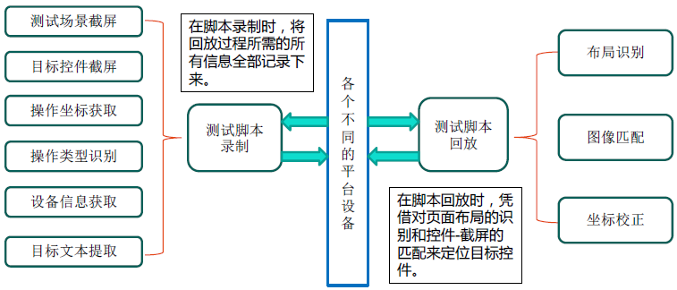

#### 脚本结构

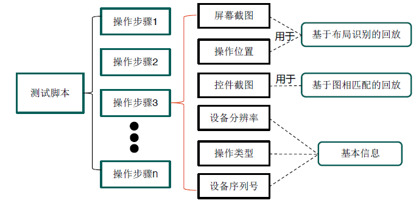

#### 脚本录制

+ 屏幕截图
+ 控件截图
+ 操作类型与操作位置
+ 设备分辨率、设备序列号

#### 脚本回放

##### 图像特征对比

+ 根据图标的特征进行比对，找到正确图标。
+ 根据屏幕特征点进行比对，找到正确跳转画面。
+ 最后，根据两个特征描述进行特征匹配，确定需要进行操作的控件。

##### 布局刻画

+ 计算机视觉算法找到所有GUI截图中的控件位置
+ 利用OCR技术提取GUI截图中的文本
+ 为所提取出来的控件划分控件组、行和列

##### 坐标校正

+ 基于布局识别的控件定位
  + 容易受不同平台的外部布局的影响
  + 不易受到图像变化的影响
+ 基于图像匹配的控件定位
  + 容易受到图像变化的影响
  + 不易受到不同平台的外部布局的影响
+ 为了结合二者的优点，提升算法的鲁棒性，引入权重参数$r$
  + $final = r*layout + (1-r)*image$

### 基于图文理解的报告排序

#### 众包测试

+ 可以向开发者提供多种不同软硬件平台支持的真实用户数据和操作信息
+ 测试报告数量庞大、人工审查过于耗时
+ 需要有种定义和排序测试报告的技术

#### 测试报告

+ 少量文字 + BUG截图
+ 原则：越早发现的BUG，越容易修复

#### 技术概述

+ 文本 + 图片结合分析

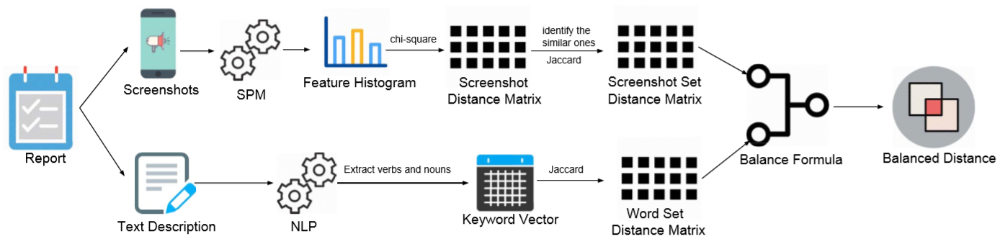

#### 文本处理

+ 自然语言处理

  + 关键词提取：通过CRF（Conditional Random Fields）来分词

  + 文本距离：采用SVM(Support Vector Machine)来标记词性

+ Jaccard距离

  + 测试报告集$R(r) = \{(S_i, T_i)|i=0,...,n\}$，$S$是屏幕截图，$T$是文本
  + 计算文本$T_i$间的距离

  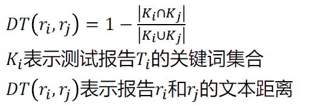

#### 截图处理

+ 操作

  + 图片 -> 特征向量

  + 分辨率、背景问题，不可直接简单RGB计算

  + chi-square距离

    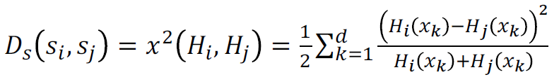

    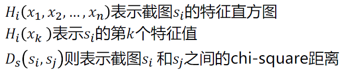

+ 截图的集合

  + 设定阈值$\gamma$筛选出内容相同的图片并求平均合并（同一份报告中的图片筛选 -> 不同报告图片集合筛选）

  + 测试报告$r_i,r_j$，筛选后的截图集合$S_i,S_j$

    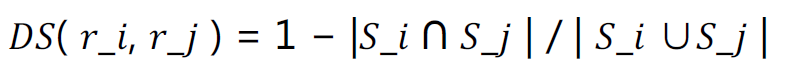

#### 图文结合

+ 文本DT，图片DS
+ DT相同，则判为相似
+ 无截图DS，则DT决定
+ 其他计算BD

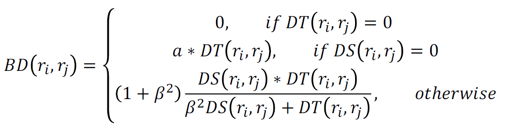

### 基于深度图文理解的报告排序

+ 就是上面那个报告排序的改进版

#### 技术框架

+ 计算机视觉提取控件
+ NLP技术分解文本
+ 建立DeepFeature
  + Bug Feature (BFT):$W_p + P$
  + Context Feature (CFT):$W_c + R$

#### 特征提取

+ 图片特征
  + 问题控件：定位产生Bug的控件元素
  + 上下文控件：除问题控件之外的其他控件

+ 文本特征
  + DL算法处理文本
  + Bug描述
  + 复现步骤

#### 特征聚合

+ Bug Feature (BFT)：与缺陷直接相关，包括问题控件和缺陷描述
+ Context Feature (CFT)：为缺陷构建上下文，包括上下文控件和复现步骤

#### 相似度计算

+ 将所有报告初始化到未排序报告池中
+ 向已排序报告池中添加Null Report
  + Null Report：一种预定义的测试报告
+ 从未排序报告池中，选出一份和已排序报告池中最不相似的报告加入到已排序报告池中，循环调用

### 基于图像理解的测试报告生成

#### 背景描述

+ 移动应用测试报告
  + 测试环境
  + 缺陷截图
  + 缺陷描述
+ 期望通过Computer Vision和Deep Learning来综合理解截图，然后自动生成文本描述。

#### 技术框架

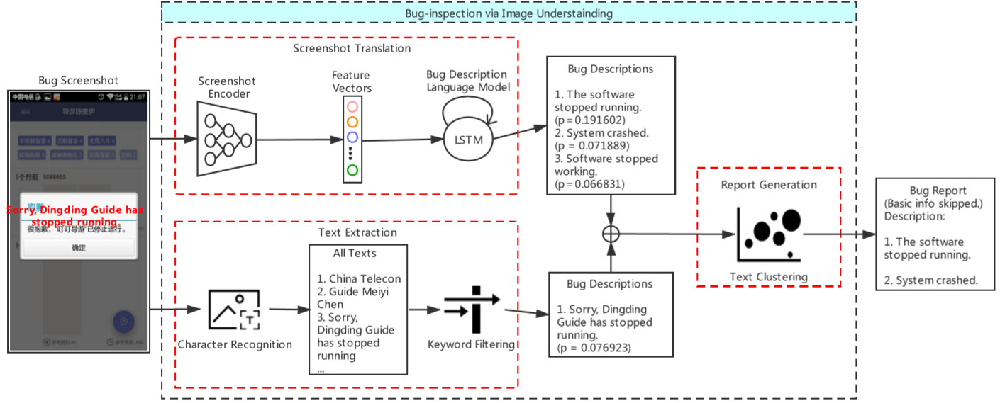

+ 截图翻译：从模块截图提取特征向量，生成缺陷描述
+ 文本提取：从截图提取文本信息并通过关键词列表筛选缺陷相关文本
+ 报告生成：聚类生成的文本，最终缺陷报告。

#### 截图翻译

+ 将缺陷截图转化为一组描述
+ 截图编码器：从截图中提取缺陷特征
  + CNN：Inception-v3转化截图
+ 缺陷描述解码器：通过缺陷特征生成描述
  + RNNs：最大化目标函数
  + LSTM：Long Short Term Memory，缺陷描述语言模型
  + Softmax层：生成下一个相关词汇
  + BeamSearch：生成描述

#### 文本提取

+ 目的是识别截图中的缺陷相关文本最为描述
+ 字符识别器：从截图中提取文本
  + OCR
+ 关键词过滤器：筛选出缺陷相关的文本
  + 预定义的关键词列表

#### 报告生成

+ 将截图翻译模块和文本提取模块的输出结合起来：使用文本聚类聚合不同类型的缺陷
+ 两个模块可能产生类似的报告，讲述相同的缺陷。
+ 处理文本聚类的方法：
  + TF－IDF：将文本转化为向量
  + K-Means：聚类算法

## 基于群智协同的众包测试

### 协作式众包测试

+ 协同测试：众测系统上发布测试任务（任务发布者）
+ 质量保证：众包工人参与测试任务，协作方式完成BUG报告（众包工人）
+ 聚合交付：识别并剔除恶意众包工人，审核报告并交付缺陷列表（管理者）

### 协同推荐

+ 信息共享：用户在提交报告时进行实施实时相似报告推荐，避免重复报告。
+ 任务分配：用户提交报告后会对其进行审核报告推荐和测试页面推荐，避免部分页面无法被测试。
+ 协作方式：用户对于相似报告和审核报告的推荐结果，可以点赞、踩点，利用用户的交叉审核，验证报告有效性。

#### 推荐算法

+ 相似报告推荐：找报告间向量最短的
+ 测试页面推荐：多元加权最短路径
+ 审核报告推荐：基于用户历史评分的矩阵分解

### 质量保证

#### 众包工人

+ 竞争式提交：不借鉴他人BUG报告，独立测试并提交报告。整体贡献归个人所有。
+ 协作式提交：借鉴他人BUG报告，复制粘贴他人报告生成子报告。整体贡献归该报告生成路径上的众包工人共同所有。
+ 审核：审核他人BUG报告，对他人报告点赞点踩，公众投票提供报告质量参考。

#### 顺序图

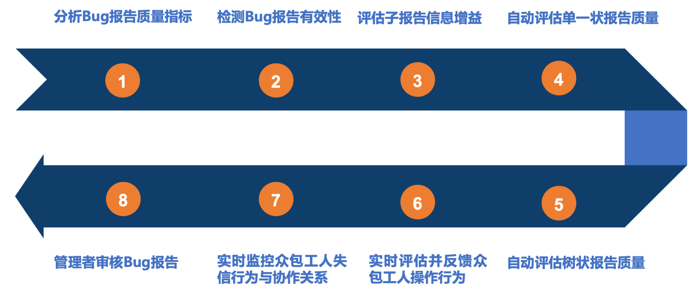

#### 顺序

+ 分析报告质量：分析报告BUG报告基本属性
+ 提取报告质量：根据BUG报告属性与指标字典提取质量指标。
+ 指标阶跃变换：根据节约变换函数将数值型的指标映射为相应的好与坏等级。
+ 检测报告有效行：有效指标数量超过阈值则有效。

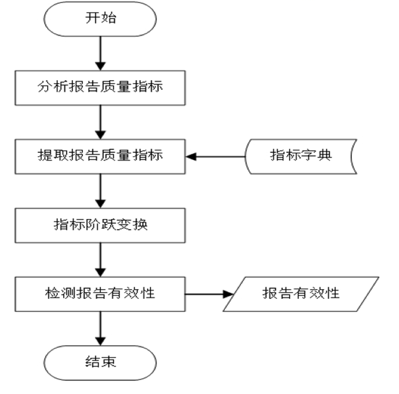

#### 反馈与监控

+ 反馈
  + 报告有效性反馈
  + 报告重复性反馈
  + Fork操作反馈
  + 点赞反馈
  + 点踩反馈
+ 监控
  + 失信行为监控
  + 点赞关系监控
  + 踩点关系监控
  + Fork关系监控

#### 小结

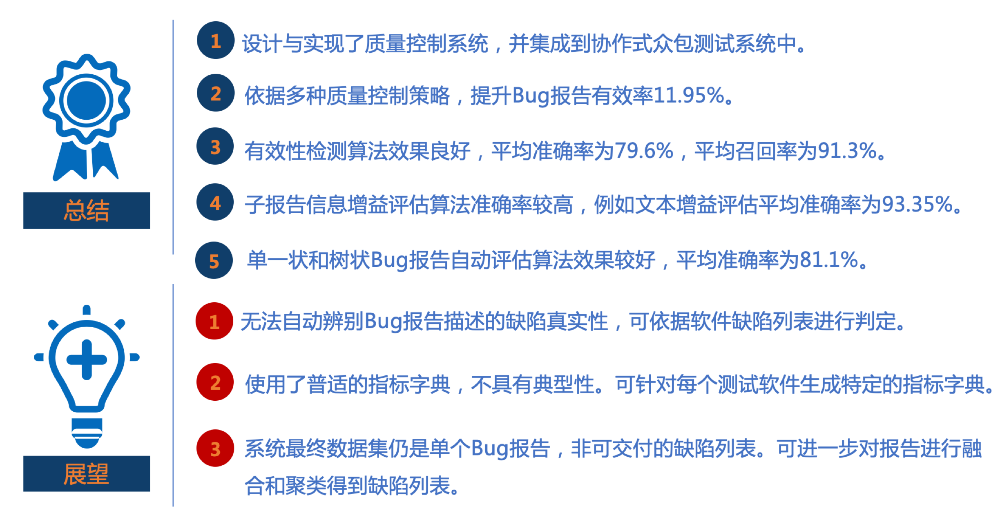

### 聚合交付

+ 聚合阶段 -> 融合阶段 -> 围绕报告融合构建审核业务流程
+ 构建一套基于报告融合的测试报告处理流程

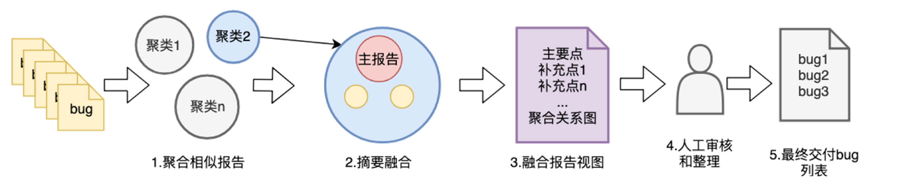

#### 聚合阶段

+ 将原始报告拆分成图片与文本信息，计算相似度取平均。
+ 聚类算法将相似报告聚合到一起。
+ 保持算法的可替换性、可扩展性。

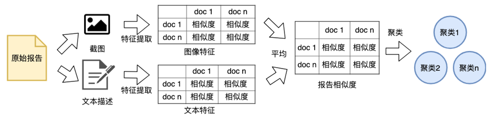

####  融合阶段

+ 主报告选取
+ 差异点识别
+ 差一点聚类及合并
+ 差异点排序

#### 审核业务

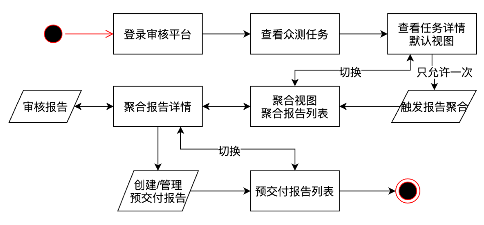

### 总体架构

