# AI测试

## 智能软件

### 生命周期

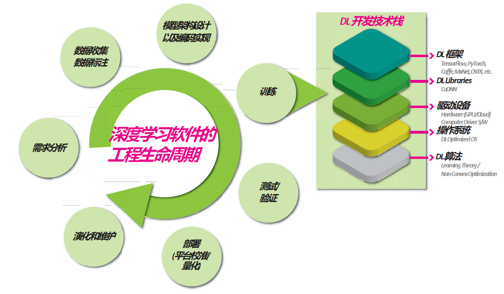

#### 需求分析

+ 分类识别 -> 目标检测 -> 语义分割 -> 实例分割

#### 数据采集

+ 互联网公开获取:
  + 公开数据集（kaggle、UCI）、爬虫（付费API）

+ 专业数据采集:
  + 采集内容、采集规模、预算
  + 采集过程要尽量与实际使用场景相一致

#### 数据标注

+ 数据清洗:根据来源不同，很多都需要清洗，例如爬虫、监控视频
+ 数据标注:
  + 数据标注软件
  + 众包任务标注
  + 领域专家标注

#### 模型设计与训练

+ 神经网络
+ 预防过拟合与欠拟合

#### 模型测试与部署

+ 准确性、鲁棒性、安全性的保证
+ 部署到框架中

### 智能软件测试

#### 差异

##### 决策逻辑

+ 传统软件的决策逻辑:
  + 程序代码控制决策逻辑
+ 智能软件的决策逻辑:
  + 深度学习模型的结构
  + 训练后得到的权重节点

##### 程序

+ 传统软件系统程序特征：控制流和数据流构建的业务处理
+ 智能软件系统程序特征：数据驱动构建的参数化数值计算
+ 智能软件系统的缺陷往往不是显式的代码或参数错误

#### 数据驱动

+ 使用容量更大、更复杂的模型，效果更好的算法
+ 数据规模可以短时间内迅速扩大

#### 难题

+ 数据量不够
+ 低质量数据
+ 数据分布不均
+ 不充分测试

## 模糊测试

### 介绍

#### 流程

+ 通过异常的输入自动化发现待测程序缺陷的技术。
+ 预期输入：变异数据
+ 预期输出：断言失败、无效输入、异常崩溃、错误输出

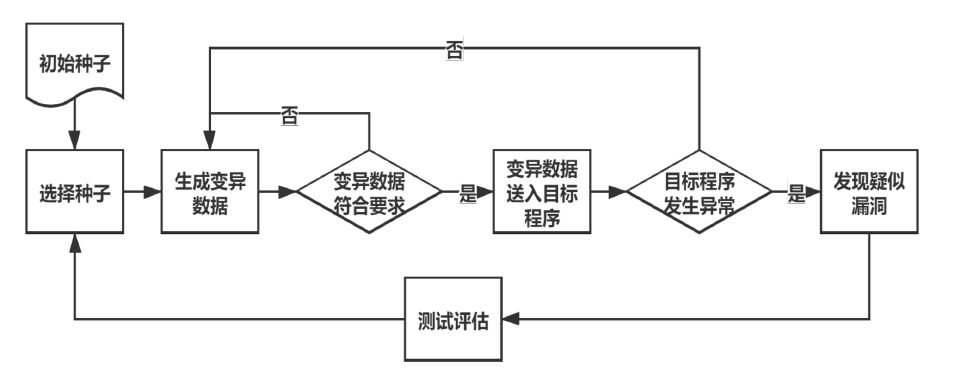

#### 测试难题

+ 无法穷举所有输入
+ 无法想到所有场景
+ 无法判定测试的预期输出

#### 解决难题

+ 大数定律：测试次数多 + 数据随机生成 = 概率低的偶然现象发生

#### 对比

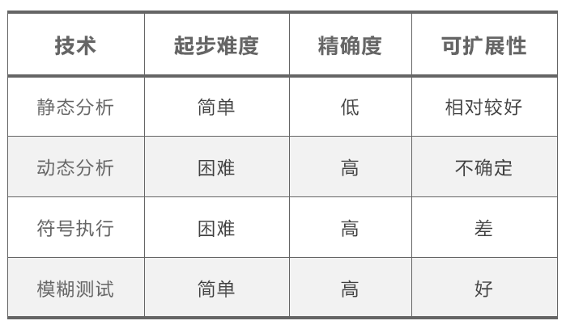

### 技术分类

#### 黑盒测试

+ 只关注输入和输出
+ 对界面、功能测试
+ 用户视角

#### 白盒测试

+ 测试所有路径逻辑
+ 对软件内部动作、结构、路径测试

#### 灰盒测试

+ 已知逻辑指导测试
+ 关注输出对于输入的正确性、内部表现

### 用例生成分类

#### 基于生成

+ 需要学习目标测试协议结构
+ 从0生成测试用例
+ 测试层次深

#### 基于变异

+ 学习已有数据模型
+ 扩增已有测试用例
+ 用例数量多但是不稳定

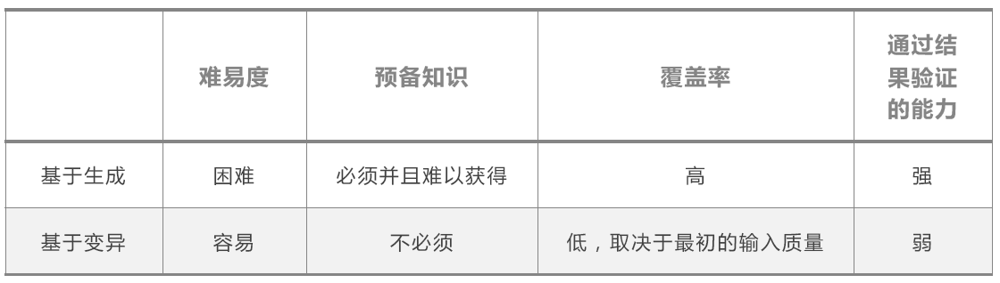

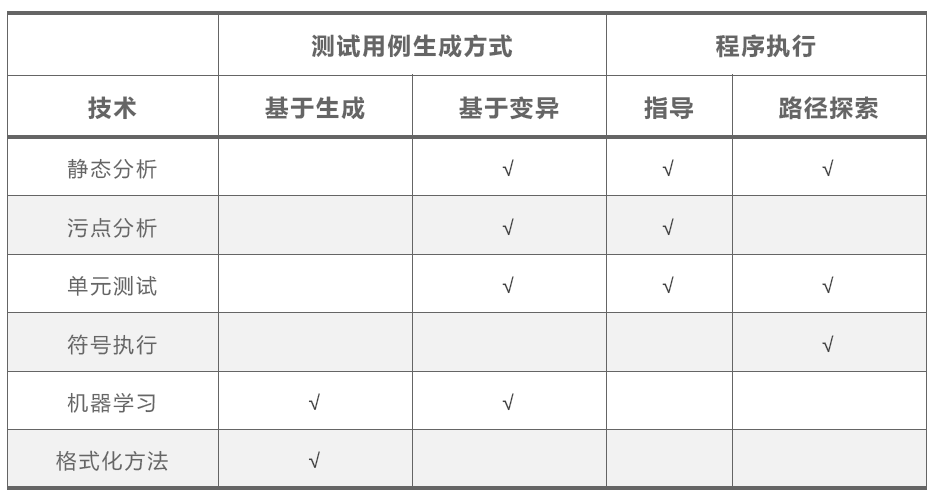

### 挑战

+ 结果很难预测
+ 通过的准则很难确定
+ 输出结果随时间变化
+ 需要更高效的持续测试方法
+ 性能依赖于数据

### 目标

+ 识别，完善所需的所有算法。
+ 收集大量的输入数据来训练AI。
+ AI如何处理输入数据。
+ AI会重复任务，即使数据输入是新的。
+ 训练AI的过程永远不会结束，因为算法正被不断改进

### 方法框架

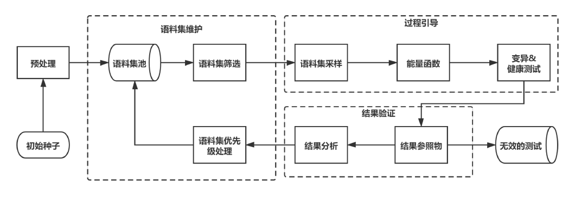

#### 种子集准备

+ 初始种子
+ 预处理
+ 种子打包形成语料集
+ 语料集筛选规则

#### 过程引导

+ 语料集采样：语料集采样根据模糊测试变异方法从送入过程引导的语料集中形成符合变异方法输入的种子元组。
+ 能量函数：旨在通过对语料集进行变异成功率检测实现在同样的测试计算资源尽可能生成多的能够成功变异的测试数据。
+ 数据变异：根据所选用的变异方法，对选取的原始测试数据施加扰动，生成新的测试输入。
+ 健康测试：根据所测试的程序制定了一定的规则用来检测模糊测试变异的测试数据是否有效。

#### 结果验证

+ 结果参照物：是否产生运行崩溃、结果参考物对比
+ 结果分析：覆盖率分析、传统反馈

### 测试数据生成

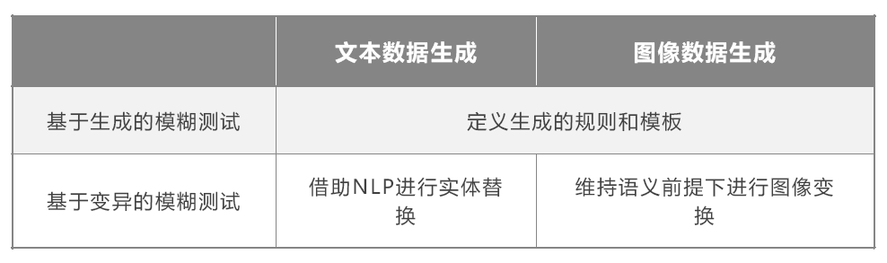

#### 文本数据

+ 加噪：同义词替换、随即插入、随即交换、随即删除
+ 回译：中文翻译英文再翻译回中文

#### 图像数据

+ 翻转、旋转、缩放等等

### 应用场景

+ 结果反馈和结果分析都由深度学习模型提供
+ 模型同时指导语料集的维护（灰盒测试）

#### 模型反馈

+ 测试覆盖率划分语料集优先级
  + 提高测试覆盖率——新的种子
  + 更易变异——更高的优先级
  + 被选取次数较少——更高的优先级

#### 算子测试数据生成

+ 组成神经网络模型，算子接口
  + 目标：测试算子库，精准快速测试
  + 方法：差分测试与模糊测试结合

## 图像扩增

### 概述

#### 数据扩增

+ 通过轻微变换现有数据或创建新的合成图像来得到新数据的技术。应用领域有图像扩增、文本扩增、雷达扩增……

#### 基本原则

+ 扩增后的标签保持不变/相应修改标签。Ex. 6 -> 9 (x)
+ 扩增需要基于先验知识。针对不同任务和场景，数据扩增的策略不同。Ex. 猫身上增加斑点
+ 不引入无关的数据。Ex. 猫的图片集中添加狗

#### 图像基本属性

+ 亮度：颜色的明暗变化。灰度图像的明暗与灰度值有关。
+ 对比度：一幅图像中明暗区域最亮的白和最暗的黑之间不同亮度层级的测量，也体现了从黑到白的渐变层次。
+ 饱和度：色彩的鲜艳程度，也称作纯度。饱和度为0就是灰度图像。
+ 灰度直方图：描述图像中灰度分布情况，描述图像中具有该灰度级的像素的个数。$p(r_k)=\frac{n_k}{MN},r_k灰度级,n_k具有灰度R_k的像素个数,MN总像素个数$。

### 方法

#### 原样本扩增

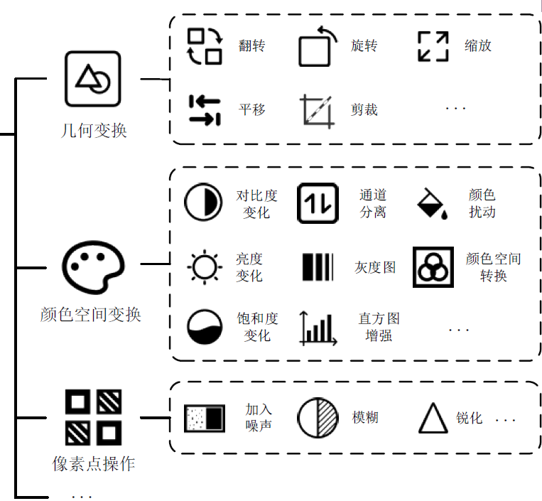

#### 单样本扩增

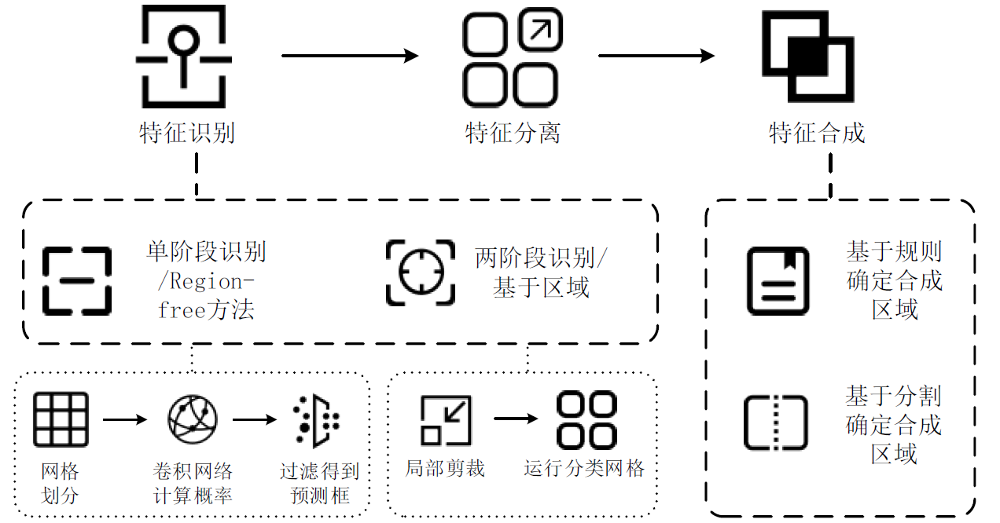

+ 两阶段：找到可能包含物体的区域 -> 对该区域进行分类
+ 单阶段：图片缩放划分等分网络，并且卷积后过滤获得最后预测框。
+ 特征合成：基于规则、基于分割确定合成区域

#### 多样本扩增

+ 样本级合成：标签a的特征 + 标签b的特征 = 标签a

  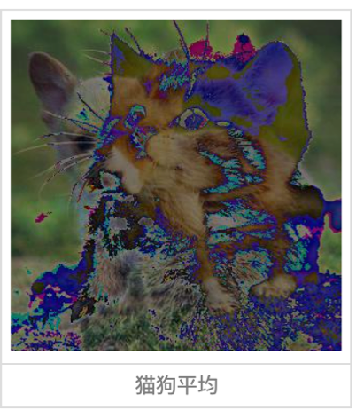

+ 特征级合成：将不同特征在同一张图上面重新排列组合

+ 标签降级：变成不同的特征

### 医疗图像扩增

#### 难点

+ 患者隐私保护，医学影像匮乏
+ 共享临床数据困难
+ 影像质量参差不齐
+ 需要专家手动贴标签

#### 特点

+ 图像中不同形式的细微结构可能代表某种病变
+ 不能保证扩增的质量
+ 不同疾病要使用不同的扩增方法

#### 过程

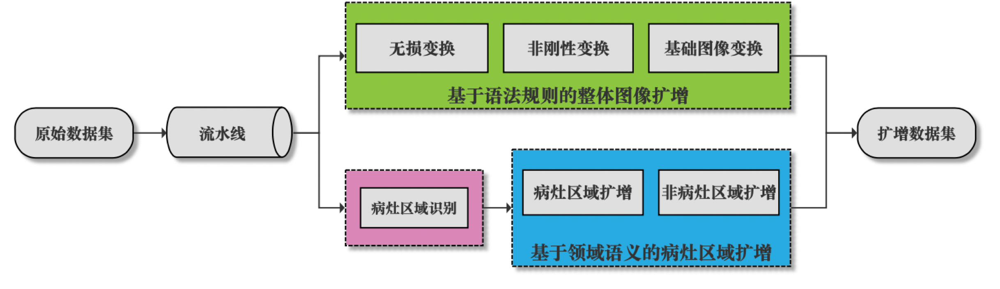

+ 无损变换：不改变其中内在的病症特征，避免破坏医学图像中的关键结构。Ex. 翻转、倾斜
+ 非刚性变换：人体组织器官、细胞生长、病变皆非刚性。通过非线性的拉伸、扩张等方法改变图像的内部信息。Ex. 弹性变换、高斯畸变。
+ 基础图像变换： Ex. 随即裁剪、随即擦除、缩放变换
+ 病灶区域扩增
  + 通过对一张图像的病灶区域覆盖范围进行变化，模拟病症发展的范围。
  + 随机组合病情某个时期可能出现的征象。
  + 可改变征象在图像中的位置以及出现的数量。
+ 非病灶区域扩增：保留关键信息，保证扩增数据的有效性。测试医疗图像分类模型针对非病灶区域的分类结果是否具有不变性。Ex. 对非病灶区域添加噪声、颜色变换……

#### 作用

+ 在系统优化层面，通过医疗图像数据扩增技术扩展训练数据集，从而提高系统的精度和泛化能力。
+ 在系统评估层面，将扩增后得到的医疗数据集作为测试数据集，通过大量数据的测试，对医疗智能诊断系统的鲁棒性进行评估。