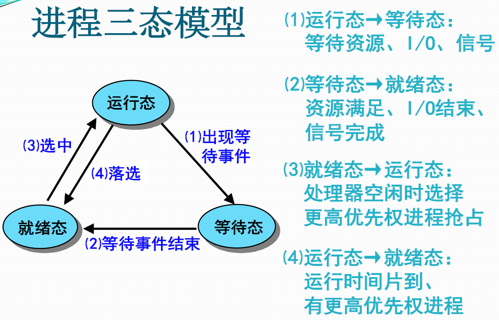
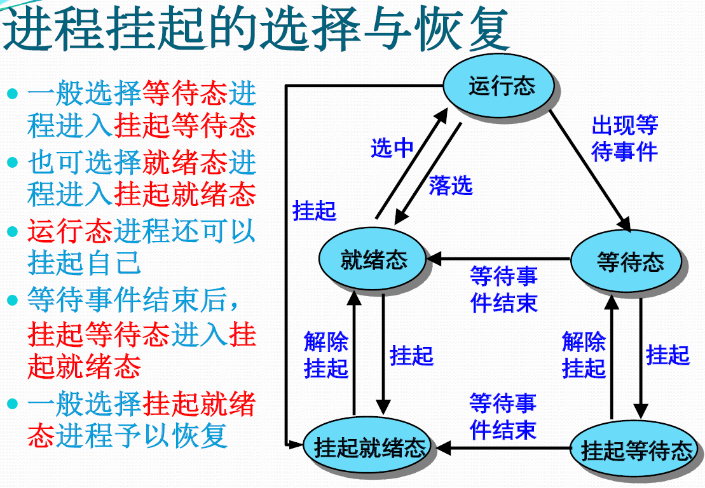
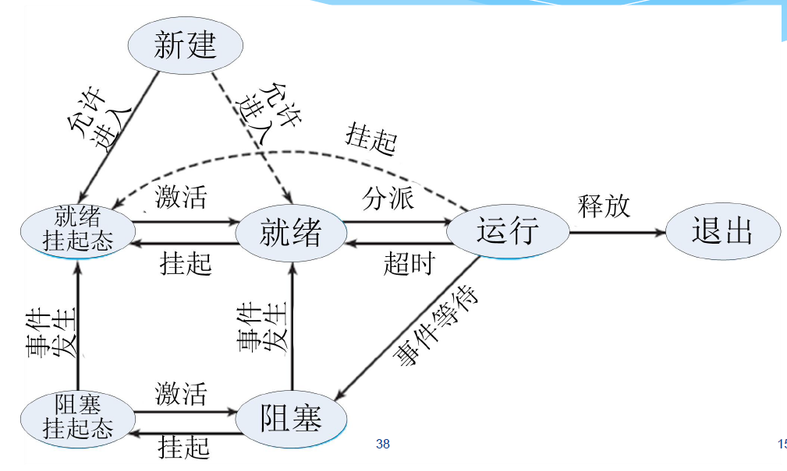
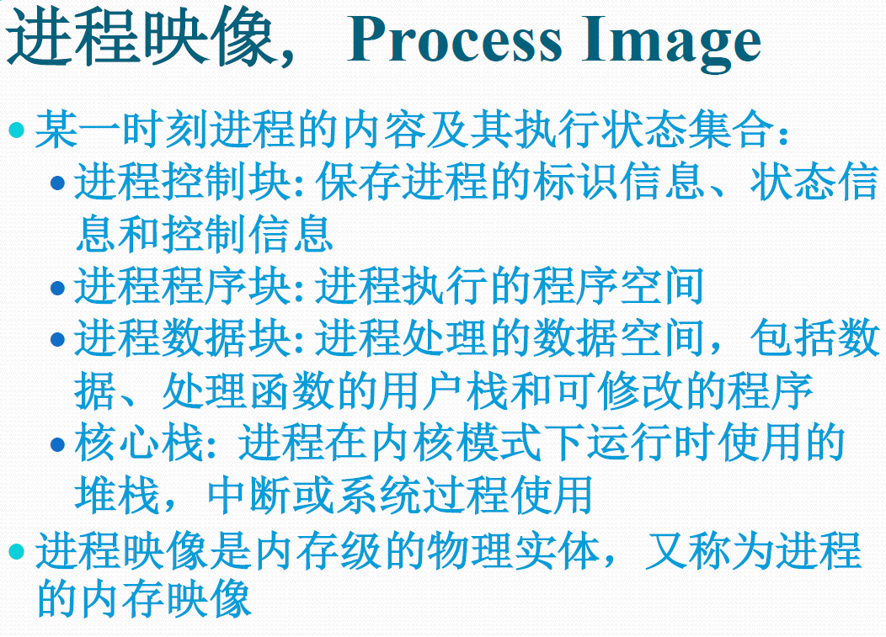
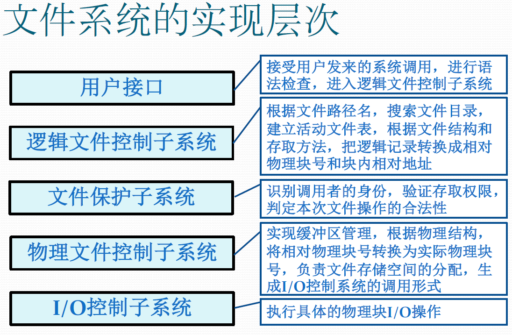
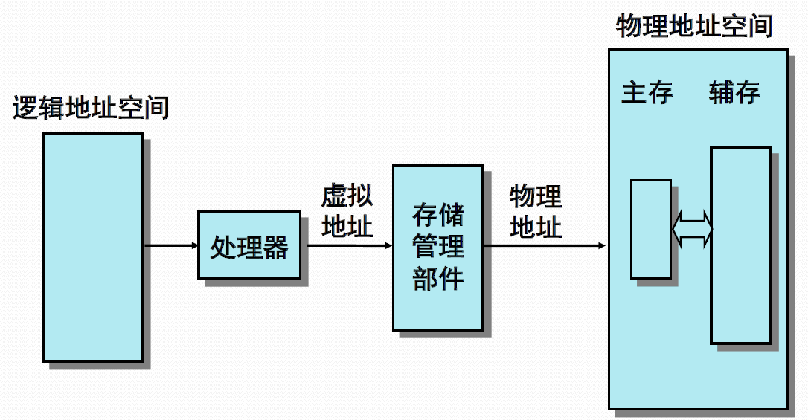
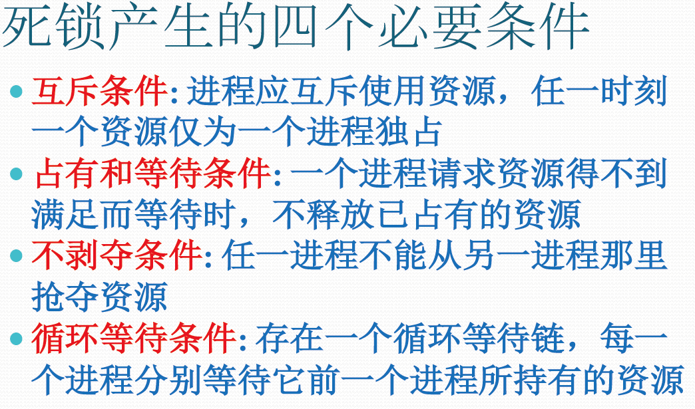

# 考前必背

简答题可能会问的

根据前几年考的整理出来的，还有一些我猜可能会考的

## 3、5、7状态进程模型（14、15、16）

## 操作系统中最基础的抽象（14）

+ 进程抽象--是对已进入主存正在运行的程序在处理器上操作的状态集的抽象 。
+ 虚存抽象--是对物理主存的抽象，进程可获得一个硕大的连续地址空间来存放可执行程序和数据，可使用虚拟地址来引用物理主存单元。
+ 文件抽象--是对设备(磁盘)的抽象 。

## 进程映像（13、15、16）

## IO软件四层次（19）

## 文件系统层次

## 虚存分页（19）

## 死锁条件

## 大题

### 管程

### PV

### 银行家算法

### 缺页调度

（往年题型看一下，差不多就那几道题型变来变去）