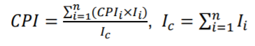
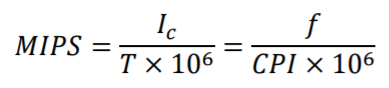
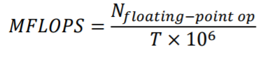

### 计算机

1. 计算机是指**“通用电子数字计算机（general-purpose electronic digital computer ）”** 

   - 通用：不是一种专用设备

   - 所有计算机在给予足够时间和容量存储器的条件下，都可 以完成同样的计算
   - 当希望完成新的计算时，不需要对计算机重新设计
   - 电子（非机械）：采用电子元器件
   - 数字（非模拟）：信息采用数字化的形式表示

2. 计算机系统 

   - 硬件：处理器、存储器、外部设备
   - 软件：程序，文档

### 组织与结构

1. **结构：**
   - 对程序员可见（程序员必须清楚）
   - 对程序的逻辑执行有直观影响
   - 包括：指令集、各种数据类型的大小
2. **组织：**
   - 对程序员不可见（程序员没有必要清楚）
   - 操作部件与其内部联系
   - 包括：控制信号、存储技术

### 冯诺依曼体系

1. **主要思想：**储存器储存程序和数据
2. **组成部分：** 
   - 存储器：地址和存储的内容
   - 处理单元：执行信息的实际处理
   - 控制单元：指挥信息的处理
   - 输入设备：将信息送入计算机中
   - 输出设备：将处理结果以某种形式显示在计算机外

### 摩尔定律

1. **主要内容：**在一个芯片上所放的晶体管数目每年翻倍(1965-1969)/18个月翻倍(1970-现在)
2. **影响：**
   - 芯片成本下降 -> 计算机逻辑运算、储存成本下降
   - 小的体积便于携带
   - 计算机、设备性能提升
   - 减少散热以及电力需求
   - 集成电路的可靠性、稳定性更高

### 计算机性能

1. **评价参数：**性能、价格、规格、安全性、稳定性、功耗

2. **评估样本：**

   - CPU：速度
   - Memory：容量、速度
   - I/O：速度、容量
   - 主要目标是提升CPU速度

3. **系统时钟 System clock：**

   + 时钟率(Hz)：每秒能处理的基本指令
   + 时钟周期(s)：1/时钟率

4. **指令执行 Instruction execution：**

   + CPI：每条计算机指令执行需要的时钟周期。

     

   + i：指令类型 i 、Ii：指令类型 i 的指令数量、CPIi：指令类型 i 所需时钟周期

   + 执行程序所耗费时间：

     

   + t：时钟周期

   + 每秒执行多少百万条指令：

     

   + 每秒多少百万条浮点数操作：

     

5. **基准 Benchmarks：**

   - 测试计算机性能的基准

     

### 例题

CPI = [45000 \* 1 + (32000 + 15000 + 8000) \* 2] / 100000 = 1.55
MIPS= 40M / 1.55 / 1M = 25.8
执行时间 = 1/40M \* 1.55 \* 100000 = 3.875 ms