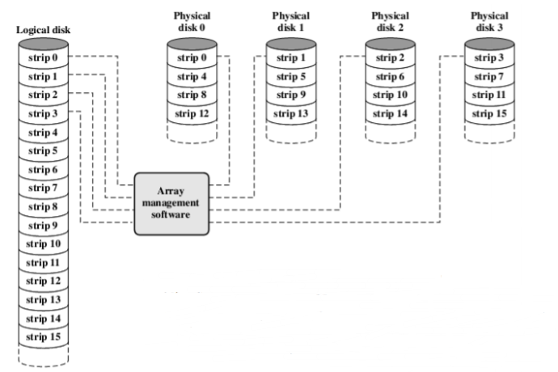
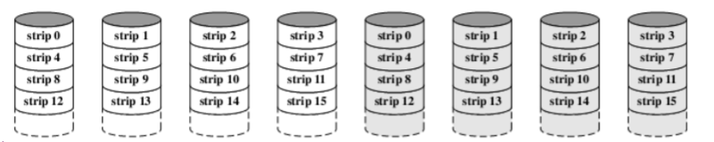
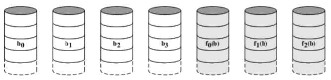
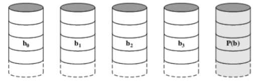
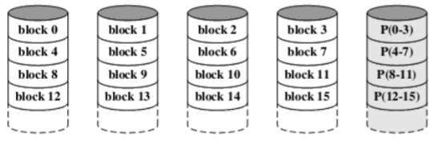
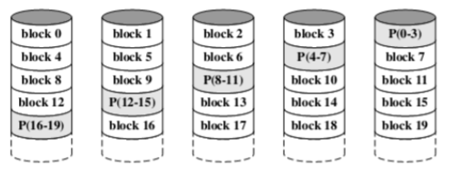

### 磁盘冗余阵列 RAID Redundant Array of Independent Disks

1. **思想：**
   + 单个或者多个I/O处理任务被平均分配给多个盘（以一种较高的速度来处理，降低各个磁盘负担）
   + 数据分布在多个盘上
2. **特性：**
   + RAID是一组物理盘，被视为一个单一的逻辑盘。
   + 数据被分配在多个盘上
   + 增加冗余信息，得到额外的好处（以空间换时间），多存一些东西来提高可靠性及恢复数据。

### RAID Level 0

1. **思想：**
   + 将每个磁盘切成大小一样的块，每个磁盘上的同一行看成一个整体（条带）同时工作。
   + 不包含冗余信息（不能算是真正的RAID）。
2. **用处：**
   + 高效率传输。
   + 提高I/O的需求。
3. **与其他单一的大磁盘比较：**
   + 如果两个不同RAID 0 块的I/O请求同时发送，RAID 0 可以同时处理，而整块的大磁盘需要一一处理。

### RAID Level 1

1. **思想：**
   + 组成与RAID 0 相似。
   + 增加完全一样的镜像储存部分，这样就有一个完全一样的备份。
2. **优点：**
   + 读请求可以从两个磁盘任何一个磁盘读，效率高。
   + 写请求要写两个条带，但是可以同时完成。
   + 提高安全性，非常可靠。
   + 若出错，处理过程非常简单。
3. **缺点：**
   + 耗费大。
   + 有一个盘特别慢，带动整个系统变慢。（木桶效应，无法发挥所有硬盘的最高效率）
4. **用处：**限于储存系统软件以及那些重要文件。
5. **与RAID 0 比较：**
   + 读请求时，RAID 1 可以达到RAID 0 的双倍。
   + 写请求时，两者差不多。

### RAID Level 2

1. **思想：**
   + 数据被划分到每一个磁盘中。
   + 每个条带很小，只储存一个byte或word。
   + 使用海明码校验。
2. **读：**全部磁盘都要读。
3. **写：**全部磁盘都要写。
4. **缺点：**
   + 同一时刻只能支持一个I/O
   + 随着磁盘稳定性的提高，逐渐被抛弃。

### RAID Level 3

1. **思想：**
   + 与RAID 2 类似。
   + 检测盘只用一个盘。

2. **优点：**无论哪个磁盘坏掉，都可以将它恢复。（但只能判断一个磁盘坏掉的情况）
3. **缺点：**同一时刻只能支持一个I/O

### RAID Level 4

1. **思想：**

   + 将每块数据放在不同磁盘，允许磁盘独立读写数据。
   + 用一个磁盘做校验盘。
   + 每次写入需要更新校验盘。

2. **缺点：**

   + 数据盘进行读写时往往需要等待校验盘计算完毕。

   + 当小的块进行改写时，速度要比Level 3慢
   + 校验盘成为Level 4 系统的瓶颈。

### RAID Level 5

1. **思想：**
   + 与RAID 4 类似。
   + 对于每个条带，每个盘轮流做校验盘。 
   + 防止I/O瓶颈的出现。

### RAID Level 6

1. 思想：
   + 两个校验盘在不同的盘上。
2. 优点：
   +  3 4 5 只能处理一个盘出错的情况，或者两个盘出错的间隔时间要小于处理时间
   + 针对之前 只能判断一个盘出错的缺点
   + 再加一个校验盘Q， 和P分开独立进行计算 
   + 可以处理至多三个盘出错的情况
3. 缺点：每次写入会影响两个盘。

