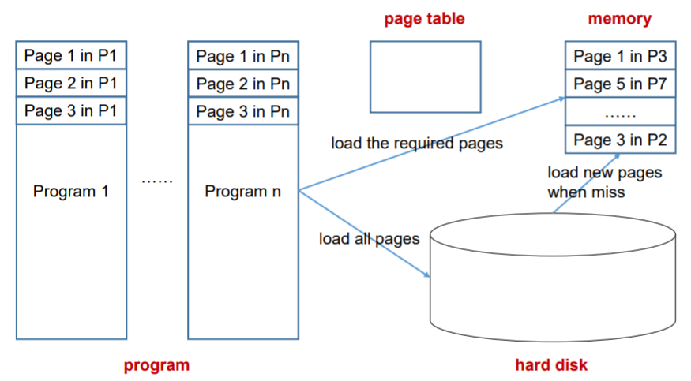
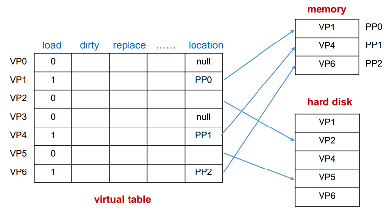
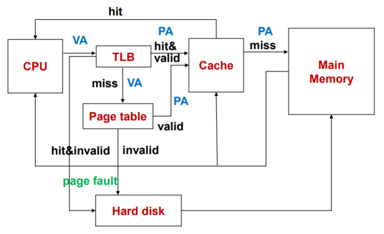

### 内存管理 Memory Management

1. **思想：**
   + 为了载入更多的程序，计算机必须有更大的内存。
   + 采用交换技术
     + 分区
     + 分页
   + 采用虚拟内存
     + 按需分页
     + 虚拟地址

### 分区 Partitioning

1. **操作系统：**固定大小。
2. **用户程序：**
   + 内存里有许多大小不同的空间
   + 当载入程序时，找到最小的空的区域并塞入。
3. **缺点：**浪费空间（产生碎片）。

### 分页 Paging

1. **思想：**
   + 将内存分为固定大小的区域，叫做页框(page frame)，并将程序分为若干小块，叫做页(page)。
   + 加载页进页框里。
2. **逻辑地址：**在指令中的地址
3. **物理地址：**在内存中的地址

### 虚拟内存 Virtual Memory

1. **问题：**内存大小有限制，但是内存容量需求加大。

2. **思想：**仅仅加载当前需要使用的页（其他不需要使用的页放在硬盘上）

3. **本质：**

   + 程序在逻辑地址中的空间比内存更大。
   + 只加载需要的程序进内存里。
   + 在硬件中将逻辑地址转为物理地址。
   + 当发生未命中时，交换内存中的数据。

   

4. **一些问题：**

   + 页的大小（4KB,8KB 注意：Cache速度大概是内存的10倍，而内存速度是硬盘的十万倍，所以块的大小应大点）
   + 映射方式：关联映射
   + 写的策略：写回（过一段时间统一写，尽量减少同步操作）
   + 类型：
     + 页式虚拟内存
     + 段式虚拟内存
     + 段页式虚拟内存

5. **页(Page)：**

   + 将虚拟内存分成与物理内存大小相同页（虚页或者说是逻辑页）

   + 物理内存中的页/逻辑页：主存里的页

   + 虚拟内存中的页/虚拟页：虚拟的页

6. **页表：**

   + 记录所有的虚页所对应的位置，是否有效，脏位等等
   + 存在主存中
   + 虚拟地址：虚拟内存的页号以及页内偏移量

   

7. **TLB(Translation Lookaside Buffer)：**

   + 目的：
     + 页表的使用增加对主存的访问。
     + 减少访问，将常用的数据加载到Cache里。

   + TLB：

     + 加载到Cache里的页表
     + 使用关联映射、组关联映射
     + 使用随机替换策略。

     

     

8. **段(Segment)：**

   + 将程序分为几段，并塞入内存。
   + 虚拟地址：段数+偏移量

9. **段与页的比较：**

   + 页
     + 优点：简单、低成本
     + 缺点：指令或数据可能跨页
   + 段
     + 优点：程序在段中得到保护
     + 缺点：没有固定长度

10. **段与页结合：**

    + 思想：将程序与数据分为几个段，并将美国段分为几个页。
    + 每个段有自己的页表。
    + 虚拟地址 = 段数+页数+偏移量
    + 优点：程序被共享并且在段中被保护
    + 缺点：虚拟地址变得冗长，需要更多的表查找时间。

