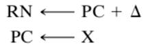
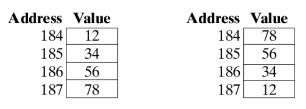

### 指令概述

1. **指令周期：**

   + 定义：一条指令执行需要的过程，包括：拿指令、执行指令

     

   + 过程

     1.取指令  2.指令操作译码  3.操作数地址计算  4.取操作数(若有多个操作数,继续计算,取) 5.数据操作  6.操作数地址计算  7.存操作数(若有多个,继续计算,存)  8.检查是否有中断，若有且允许中断，处理中断，完成后,取下一条指令

2. **指令构成：**

   + 操作码：指定将要完成的操作. 
   + 原操作数引用：操作会涉及到一个或多个源操作数,这是操作所需要的输入
   + 结果操作数引用：操作可产生一个结果
   + 下一指令引用：它告诉CPU这条指令完成后到哪儿去取下一条指令

3. **指令表示：**

   + 指令由一个位串表示，相应于指令的各要素,位串划分成几个字段，指令的这种状况被称为指令格式：

     

     

   + 机器指令符号表示法：

     操作码被缩写成助记符表示。
   
4. **指令类型：**

   + 数据处理：算数和逻辑指令
   + 数据存储：存储器指令
   + 数据传输： I/O指令
   + 控制：测试和转移指令

5. **跳转指令的地址保存：**

   + 从当前位置到调用的指令，以及调用返回当前位置的指令。

   + 寄存器保存：（不适合多重调用）
   + 保存于跳转的程序开头：（程序1调用2次程序2的时候开头的地址会被替换）
   + 采取堆栈的方式（最佳）：

### 操作数

1. **类型：**地址、数值、字符、逻辑数据

2. **地址：**
   + 一条指令 —— 四地址（2源操作数，1目标操作数，1下一条指令）
   + 下一条指令的地址是隐性的。
   + 每条指令的地址数目是基本的设计决策。每条指令中的地址数目越少，则指令的长度越短，指令也更原始（不需要复杂的CPU)，另一方面，它又会使得总的指令条数更多，而导致执行时间更长，程序也更长更复杂。

3. **数值：**

   + 计算机存储的数据时受限的
     + 数值的幅值是有限
     + 浮点数情况下数值精度有限
   + 3种数值类型：
     + 整数或定点数
     + 浮点数
     + 十进制数

4. **字符：**

   + IRA 国际参考字母表/ ASCII   7位
   + EBCDIC  扩展的二进制编码的十进制交换码
   + Unicode：16位或者32位

5. **逻辑数据：**

   + 正常情况下，每个字或其他可寻址单元（字节、半字节）是作为单一一数据单元看待的。然而，某些时候将一个n位单元看成是由n个1位项组成，每项有值0或1，是有用的。当数据以这种方式看待时，数据就被认为是逻辑数据。

6. **大端小端法 Big endian and little endian：**

   + 每个数据有相同的地址
   + 大端小端的顺序必定相反。
   + 大端或小端不影响一块数据在结构中的顺序。
   + 大端：字符串排序、十进制、IRA转储、顺序一致。
   + 小端：容易将32位整数地址变16位整数地址、容易进行高精度计算
   + 例：把12345678（16进制）存进地址184
   + 左为大端法，右为小端法。

   

7. **寻址模式：**

   + 立即寻址
     + 操作数的值 = 指令地址区域里的内容
     + 优点：不需要内存映射去获得操作数
     + 缺点：数据长度受限
   + 直接寻址
     + 操作数的值 = 指令地址区域的地址 -> 数据
     + 优点：只要一次内存映射
     + 确定啊：地址空间有限
   + 间接寻址
     + 操作数的值 = 指令地址区域的地址 -> 下一个地址 -> 数据
     + 优点：更大的地址空间
     + 缺点：需要两次内存映射
   + 寄存器寻址
     + 操作数的值 = 寄存器里的值
     + 优点：在指令里占的空间很少，不需要内存映射
     + 缺点：地址空间受限
   + 寄存器间接寻址
     + 操作数的值 = 寄存器里的地址 -> 数据
     + 优点：扩大地址空间，比间接寻址使用较少的内存映射
     + 缺点：需要至少一次内存映射
   + 偏移寻址
     + 操作数的值 = 寄存器里的地址 + 指令里的偏移量 -> 数据
     + 类型：相对寻址、基址寄存器寻址、变址
   + 相对寻址
     + 操作数的值 = PC寄存器里的值 + 指令里的偏移量 -> 数据
     + 优点：利用指令局部性的概念，并保存指令的地址位
   + 基址寄存器寻址
     + 操作数的值 = 被引用的寄存器里的值 + 指令里的偏移量 -> 数据
     + 寄存器的引用可以是显式的也可以是隐式的。
   + 变址
     + 操作数的值 = 被引用的主存的值 + 指令里引用的寄存器（变址寄存器）存的偏移量 -> 数据
     + 拓展：包含间接寻址和变址
     + 后变址： EA=(A)+(R)
     + 前变址： EA= (A+(R))
   + 栈寻址
     + 操作数的值 = 寄存器里的栈顶位置 -> 数据

### 指令设计

1. **指令格式：**

   + 指令格式通过它的各个构成部分来定义指令的位安排。
   + 一个指令格式必须包括一个操作码，以及隐式或者显示的、零个或多个操作数。
   + 格式必须显示或隐式的表示每个操作数的地址模式

2. **指令长度：**

   + 权衡考虑：强有力的指令清单与必须要节省空间。

3. **位的分配：**

   + 对于一个给定的指令场地，很清楚在操作码数目和寻址能力之间有一个权衡考虑的问题，越多的操作码意味着操作码字段要更多的位，这就减少了寻址可用的位数。

   + 采取变长的操作码：有一个最小操作码长度，但是对于某些操作码，可使用指令附加位的方法来指定附加的操作。

   + 影响因素：

     + 寻址方式的数目

     + 操作数数目

     + 寄存器与存储器比较

     + 寄存器组的数目

     + 地址范围

     + 地址粒度

4. 可变长度的指令：

   + 提供多种长度的指令格式
   + 优点：容易产生各种类型的操作码
   + 缺点：增加执行的复杂度