### 微操作

1. **思想：**

   + 执行程序的时候，计算机操作由一序列指令周期组成，每周期执行一条极其指令。每个指令周期又能看做是由几个更小的单位组成。
   + 一种通常的方法是分解成取指、间址、执行和中断。

+ 只有取指周期和执行周期总是必有的。

  + 事实上，这每个较小的周期又由一串涉及到CPU寄存器操作的更小的步骤组成，人们将这些步骤称位微操作。

  

2. **取指周期：**

   + 发生在指令周期的一开始。

     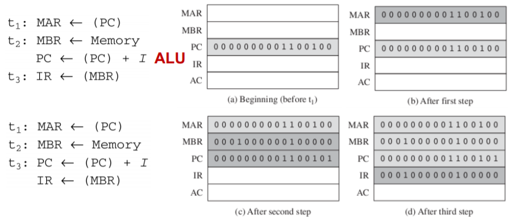

   + PC+1也可以在T3执行。

3. **两个简单原则：**

   + 时间流动的顺序必须是恰当的。

   + 必须避免冲突。不要试图在一个时间单位内取读、写同意寄存器，否则结果不可预料。

4. **间址周期：**

   + 如果指令是间接地址，则间址周期是要在执行周期前执行。

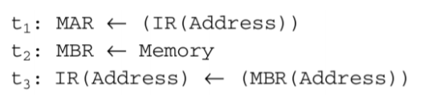

5. **中断周期：**

   + 在执行周期后，是否允许中断。

     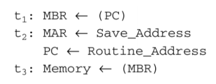

6. **执行周期：**

   + 因为有不同的操作码，所以有许多不同的执行指令。

   

   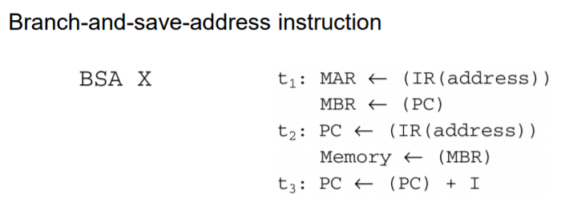

7. 指令周期：

   + 取指、间址和中断周期都各有一个序列，而对于执行周期则是每一操作码有一个序列。为完善此模型，需要将微操作序列连接在一起。
   + 我们假设一个2位的新寄存器，叫做指令周期代码(ICC)，此ICC定义了CPU处于周期哪一部分的状态。
   + 00：取指、01：间址、10：执行、11：中断

   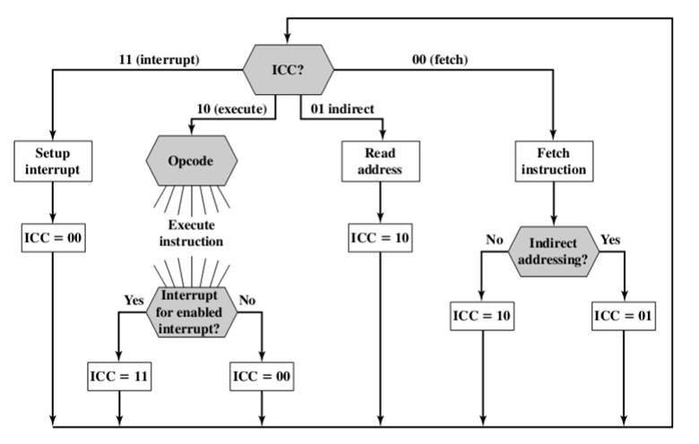

### 处理器控制的功能需求

1. 通过把CPU的操作分解到它的最基础级，就能严格地定义控制器必定引起什么发生。于是，就可以定义控制器的功能需求，即控制器必须完成的功能。这些功能需求的定义是设计和实现控制器的基础。

2. **3个步骤：**

   + 定义CPU的基本元素

   + 描述CPU完成的微操作

   + 确定为使微操作完成，控制器必须具备的功能。

3. **关于：**

   + CPU的基本功能元素：ALU、寄存器、内部数据路径、外部数据路径、控制器。
   + 所有的微操作可按如下分类。
     + 在寄存器之间传送数据
     + 将数据由寄存器传送到外部界面（如系统总线)
     + 将数据由外部界面传送到寄存器。
     + 以寄存器作为输入、输出、完成算数或逻辑运算。

4. **控制器的两个基本任务：**

   + 排序：根据正被执行的程序，控制器使CPU以适当的顺序按步通过一串微操作
   + 执行：控制器使得每个微操作得以完成。

5. **输入和输出控制器的一般模型：**

   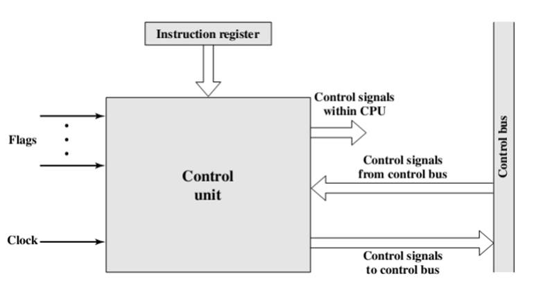

6. **输入：**

   + 时钟 ： 控制器要每个时钟脉冲完成一个（或一组同时）的微操作。这有时被称为处理器周期时间或时钟周期时间。

   + 指令寄存器：当前指令的操作码用于确定在执行周期内完成何种微操作

   + 标志：控制器需要一些标志来确定CPU的状态和前面ALU操作的结局。

   + 来自控制总线的控制信号：系统总线的控制线部分向控制器提供，如中断信号和认可信号这样的控制信号。

7. **输出：**

   + CPU内的控制信号 
     + 用于寄存器和他者之间传输数据
     + 用于启动指定的ALU功能

   + 到控制总线的控制信号
     + 对存储器的控制信号
     + 到I/O模块的控制信号。

### 控制信号

1. **三类控制信号：**

   + 启动ALU功能

   + 控制数据路径

   + 外部系统总线上的或者其他外部接口上的。
   + 所有控制信号都是一串二进制输入，每位对应一个逻辑门。

2. **例子 —— 取指周期：**

   + 传送PC的数据到MAR
     + 启动控制信号打开PC与MAR之间的逻辑门。

   + 由存储器读一个字装入MBR并增量PC
     + 一个控制信号打开逻辑门，以便允许MAR的内容传送到地址总线
     + 一个存储器读控制信号送到控制总线
     + 一个允许数据总线上内容被存入MBR的开门信号
     + 对PC内容+1并返存PC逻辑的控制信号

   + 接着，控制器发出打开MBR和IR之间门的控制信号。

3. **控制信号举例：**

   + 数据路径

   + ALU

   + 系统总线

   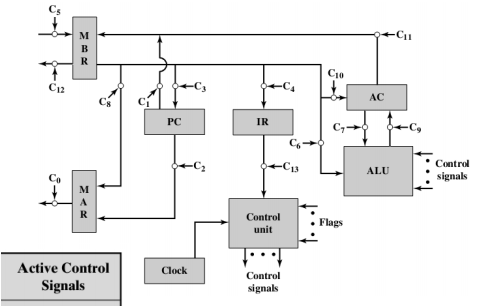

   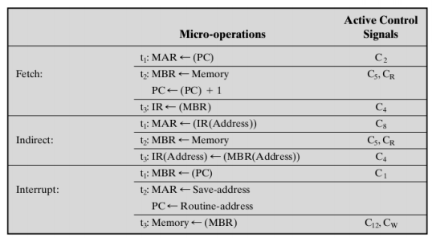

4. **考虑控制器的最小性：**

   + 控制器是整个计算机运行的引擎，它只需要知道将被执行的指令和算数、逻辑运算结果的性质（如 正负、溢出）。
   + 它不需要知道正在被处理的数据或者得到的实际结果具体是什么。
   + 它控制人和事情只是以少量的送到CPU内的和送到系统总线上的控制信号来实现。

5. **处理器内部组织：**

   + 使用一个CPU内部总线，ALU和所有CPU寄存器都链接到单一的内部总线上。

   + 为将数据由各寄存器移到此总线上或者从此总线移出，提供了门和控制信号。

     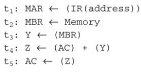

   

### 控制器实现 Hardwired Implementation

1. **两种方式：**

   + 硬连线实现
   + 微程序实现
   + 以硬连线实现，控制器本质上是一个组合电路。它的输入逻辑信号转换成一组输出逻辑信号，即控制信号。

### 硬连线实现

1. **关键输入：** 

   + 指令寄存器、时钟、标志、控制信号。
   + 其中，在标志和控制总线信号情况中，一般是每个位都有某种意义。
   + 另外两个输入对于控制器不是直接使用的。

2. **控制单元输入 —— 指令寄存器：**

   + 为简化控制其逻辑，应使每一操作码有一个唯一的逻辑输入。

   + 译码器完成这个功能，译码器有n位二进制输入和2^n个二进制输出。每一个都能激活唯一的输出。

   + 控制器的译码器更加复杂，要考虑到变长的操作码。

3. **控制单元输入 —— 时钟**：

   + 时钟脉冲周期要足够长，以允许信号能够沿着数据路径传播和通过CPU电路。

   + 控制器在一个指令周期以不同的时间单位发送不同的控制信号

   + 使用一个计数器作为控制器的输入，以不同的控制信号做T1.T2等等

     

4. **控制器逻辑：**

   + 为每个控制信号得到一个布尔表达式。

   + PQ=00 取指周期

   + PQ=01 间址周期

   + PQ=10 执行周期

   + PQ=11 中断周期

   + C5控制的是使得外部数据总线上的数据被读入MBR

   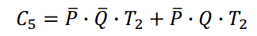

   + 即控制信号仅仅在取指和间址周期的第二个时间单位有效。

   + 当然这个表示还不完整。

   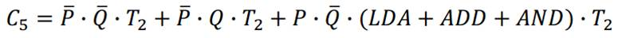

### 微程序 Microprogramming Language

1. **硬连线控制的问题：**

   + 设计和测试困难

   + 设计不灵活
   + 微程序控制：除使用控制信号外，每个微操作以符号表示来描述。

2. **微程序语言：**

   + 微指令：每行描述一个时间内出现的一组微操作

   + 微程序/固件：这种指令的序列

   + 微程序介于软件与硬件之间。
     + 以固件进行设计要比硬件容易，但是写一个固件程序远比写一个软件程序难。

3. **基本思想：**

   + 考虑到对于每个微操作，控制器所做的全部事情就是产生一组控制信号。对任意一个微操作，控制器送出的每个控制线或是开或是关。

   + 每控制线由一个二进制数字表示。

   + 于是我们构造了控制字，其中每位代表一条控制线。

   + 每个微操作能用控制字中的不同的0和1的样式来表示。

   + 将这些控制字串起来，就能表示控制器完成的微操作序列了。

   + 微操作序列不是固定的。我们把控制字放入一个存储器中，每个字有自己唯一的地址。

     + 给每个控制字添加一个地址字段，以指示某种条件为真是将要执行下一控制字的位置。

     + 添加少数几位用于说明条件的真假。

     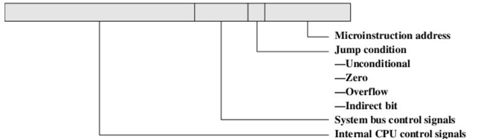

4. **微指令解析：**

   + 每一CPU内部控制线和每一系统总线控制线都有相应一位；同时还有一个指示转移发生条件的条件字段和转移目标地址的字段。

     + 为执行这条微指令，打开所有位值位1的控制线，关闭所有位值为0的控制线，生成的控制信号将使得一个或多个微操作被完成。
     + 若条件位指示的条件是假，则顺序执行下一条指令。
     + 若位真，则地址字段指向的微指令下面将被执行。

     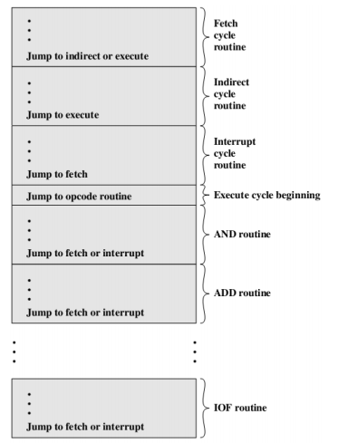

5. **微程序控制器：**

   + 控制存储器：存有一组微指令，当以微指令由控制存储器独处后，即被传送到控制缓冲寄存器。

   + 控制地址寄存器： 存有下面将被读取的微指令地址，此控制器的左半部分与控制器发出的控制线相连接，于是由控制存储器读一条微指令同时执行这条微指令。

   + 排序器，它向控制地址寄存器装入和发出度命令。

   + 微指令具有相同的输入（IR,ALU标志、时钟）和输出（控制信号）

   + 执行：

     + 为执行一条指令，排序逻辑发出一个读命令给控制寄存器。
     + 控制地址寄存器指定的一个字被读入控制缓冲寄存器。
     + 控制缓冲寄存器中的内容生成控制信号，并为排序逻辑提供下一地址信息
     + 排序逻辑根据这个地址信息和ALU标志，将一个新地址装入控制地址寄存器。所有这些事情发生在一个时钟脉冲周期内。

   + 每条微指令结束的时候，排序逻辑都要将一个新地址装入控制地址寄存器，取决于ALU标志和控制缓冲寄存器中的内容，它要进行三选一的判决：

     + 取顺序下一条指令：加1到控制地址寄存器
     + 基于下一条转移微指令转到一个新的例程，将控制缓冲寄存器的地址字段装入控制地址寄存器
     + 转移到一个机器指令例程：根据IR中的操作码向控制地址寄存器装入。

     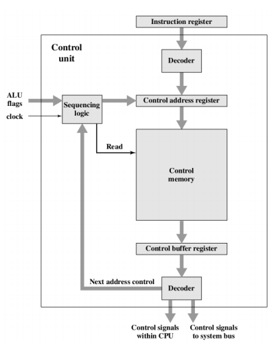

6. **关于两个译码器：**

   + 上方：将IR中的操作码翻译成一个控制存储器地址。

   + 下方：不用于水平微指令 而是用于垂直微指令。

   + 水平微指令：微指令的控制字段每一位接到控制线

   + 垂直微指令：一个代码用于将被完成的一项动作。优点在于垂直指令更紧缩，代价是一个小的附加逻辑量

   + 优点：控制单元设计简单，廉价，不容易出错

   + 缺点：一定程度上减慢了速度。

7. **基本任务：**

   + 微指令排序：由控制存储器得到下一个微指令
   + 微指令执行：产生执行微指令所需的控制信号

8. **微指令排序：**

   + 设计考虑
     + 微指令的大小：减小微指令的大小就能降低控制存储器的成本
     + 微指令地址的生成时间：是尽可能快的执行微指令的最简单要求。
     
   + 排序技术：
     
     + 根据当前微指令、条件标志和指令寄存器内容，产生下一微指令的控制存储器地址。
     
   + 以微指令中的地址信息格式为依据，大致分为如下三类。
     
     + 双地址字段
     + 单地址字段
     + 可变格式
     
   + 双地址字段
   
     + 微指令中提供两个地址字段
     + 多路选择器根据地址选择输入、发送两个地址之中的某一个或操作码到控制地址寄存器。
   
     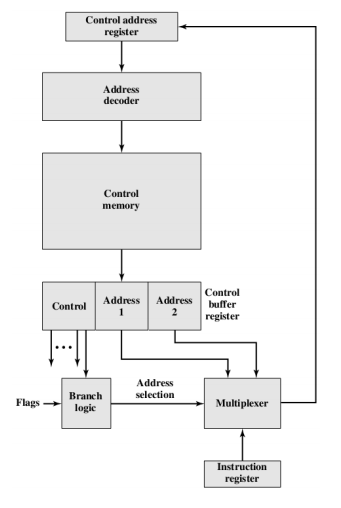
   
   + 单地址字段
   
     + 地址选择信号确认哪项被选中。
   
     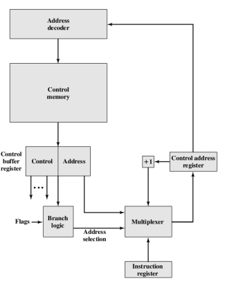
   
   + 可变格式
   
     + 提供两种完全不同的微指令格式
   
     + 一位用于指定哪种格式被使用。
   
     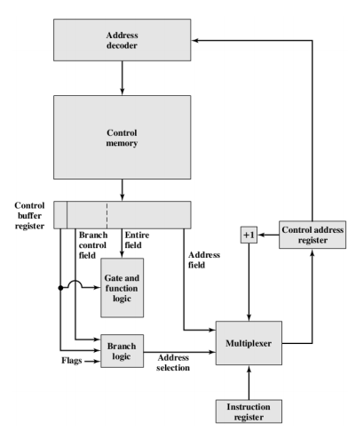
   
   + 地址生成
   
     + 显式：双地址字段、无条件转移、条件转移
   
     + 隐式：映射、加、残留控制
   
9. **微指令执行：**
   + 基本上，执行的作用在于产生控制信号。
   + 一些信号发往CPU内部
   + 另一些送往外部控制总线和其他外部界面