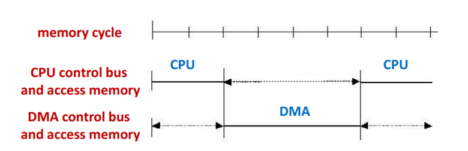
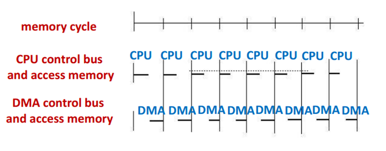

### 为什么不直接把外部I/O设备连接到总线？

1. 设备种类繁多，相应的操作方法繁多

2. 很多I/O设备的数据传递很慢，如果连接到总线，会拖慢处理器或者主存的速度。

3. 很多I/O设备的数据传递太快，使得主存或者处理器没有办法处理。

4. 外部设备可能会使用不同的数据格式，不同的字长。

### I/O模块

1. **用处：**外部设备与内部系统的桥梁。
2. **外部设备接口：**
+ 类型：
  
  + 控制信号
   + 状态信号（两者连在控制逻辑上）
  + 数据交换（缓冲区（8-16位））

### I/O模块的功能

1. **I/O模块与处理器之间的通信：**
   + 解码
   + 数据交换
   + 状态报告
   + 地址识别
2. **I/O模块与外部设备之间的通信：**命令、状态、数据交换
3. **控制与计时：**
   + CPU与外部设备以一种非预期的方式进行交互。
   + 一些资源得到共享。
   + 例：从外部设备传输数据到处理器
     + 处理器讯问I/O模块检查设备状态
     + I/O模块返回设备状态
     + 如果准备好了，处理器通过对I/O模块的命令提出传送数据传输的要求
     + I/O模块从外部设备中获取数据
     + 数据从I/O模块传送到处理器
4. **数据缓冲：**
   + 有些I/O快，有些I/O慢，需调整传送速率。
5. **检错：**报错并传给处理器。

### I/O模块结构

1. **种类：**

   + 平行接口 Parallel interface：总线和外部设备同时传输多位的数据。（计算机内部用）
   + 串行接口 Serial interface：外部设备一次只能传一条数据。（外设用）
   + 平行接口要求与时钟周期同步，线不能太长。

2. **编程式I/O：**

   + 当需要传输数据时候，处理器直接执行一个程序控制I/O操作，需要等待直到I/O模块处理完毕才能继续下条指令。
   + 顺序
     + 发送一个命令到I/O模块
     + I/O模块完成被请求的动作，然后再I/O状态寄存器中的某位进行设置，此过程中处理器不停地检查I/O模块的状态，I/O模块不会向CPU发送中断请求，所以此过程中CPU一直处于忙状态
     + 准备就绪后，处理器从I/O模块读取字，并向存储器写入字。
   + I/O命令：
     + 控制（激活外设，告诉它做什么）
     + 测试（测试与I/O模块以及外设有关的各种状态）
     + 读（从外设获得数据项，存入内部缓冲区）
     + 写（从数据总线获得一个数据项，传到外设）
   + I/O指令：
     + 很容易映射到I/O命令（一对一的关系）
     + 取决于外设的寻址方式。
     + 当处理器、主存以及I/O共享一个总线的时候，有两种寻址方式
       + 存储映射式寻址：存储单元和I/O设备有单一的地址空间，处理器把I/O模块的状态、数据寄存器看成存储单元一样对待，并使用相同机器指令存取存储器和I/O设备。
       + 分离式寻址：地址空间与存储器是分离的。总线既有存储器读线和写线，又有输入和输出命令线。
   + 优点：简单
   + 缺点：总线忙

3. **中断驱动式I/O：**

   + 处理器发出一条命令，继续处理下一条指令，直到I/O模块完成操作后，中断CPU。

   + 关于中断：

     + 从I/O模块的视角：收到读的命令----读的数据到寄存器----引发中断-----等到CPU响应中断----将数据传送到数据总线上

     + 从CPU的角度：发送命令----做其他事情，在某个指令周期结尾判断是否有中断------保存环境相应中断----获取数据并写入内存----恢复环境

   + 怎么判断是哪个设备？

     + 多加几根线？（不可行）即使采用了多根线，也连到了不同的I/O模块上，因此每根线上仍然需要采用3种技术中的一种。

     + 软件轮询 （慢）

     + 菊花链（向量中断 01串）

     + 总线仲裁

   + 中断总线的优先级

     + 多线：多处理器处理

     + 轮询：轮询顺序

     + 菊花链：先后

     + 总线仲裁：优先级

   + 优先级

     + 响应优先级（本身的优先级） —— 优先中断
  + 处理优先级（紧急程度的优先级） —— 中断别人的中断
     + 屏蔽字：由处理优先级决定（屏蔽自己以及优先级比自己低的中断）
   
4. **直接访问内存(DMA)：**

   + 思想： I/O模块与主存直接进行数据交换，不需要CPU参与。

   + 顺序：

     + CPU想要读或者写数据块的时候，发送一个命令给DMA模块，包括以下信息
       + 是请求读还是写，使用处理器和DMA模块之间的读或者写控制线
       + 所涉及的I/O设备地址，经数据线通知
       + 读或写存储器中的起始单元地址，经数据线通知并被DMA模块存入它的地址寄存器中
       + 读或写的字数，经数据线通知并被DMA模块存入他的数据计数寄存器中    

     + CPU继续执行其他工作，委托DMA模块执行并关心这个I/O操作，DMA模块传送整个的一块数据，不经过CPU。
     + 当传送完毕后，给一个中断信号给CPU。

   + 总线使用：

     + 为了传输数据给存储器或者从存储器中取出数据，DMA需要占用控制总线，因此只有在CPU不需要总线或者强制CPU暂时挂起操作的时候才能使用总线。

   + 终止CPU

     + 优点：方便控制

     + 缺点：影响CPU正常工作，没有办法使得主存得到充分利用。

     + 适合高速I/O设备

       

   + 周期窃取法（周期挪用法）

     + 优点：使得CPU与内存得到充分利用，即使得到I/O请求

     + 缺点： DMA需要每次申请

     + 适合周期较长的I/O

       

   + Alternate(time sharing)

     + 优点：CPU既没有停止也没有等待，DMA不需要请求总线
     + 适合： CPU的处理周期大于 存储器的处理周期。

     

   + 连接方式：

     + 单总线（独立DMA）
       + 所有模块共享一条系统总线
       + DMA模块使用编程式I/O来交换数据
       + 廉价但是效率低

     + 单总线（继承DMA与I/O）
       + 除了系统总线之外，DMA模块与一个或者更多的I/O设备之间有通道
       + 减少总线周期
     + I/O总线
       + 连接DMA与I/O模块
       + 减少I/O在DMA模块的接口

### I/O发展

1. **CPU直接连外设**
2. **控制模块加进来**
3. **中断加进来**
4. **DMA加进来**