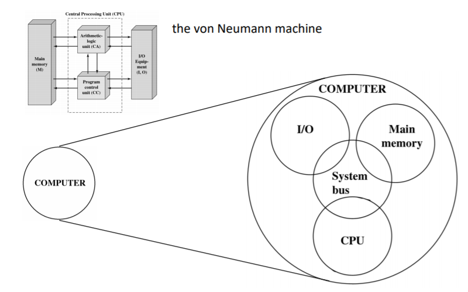
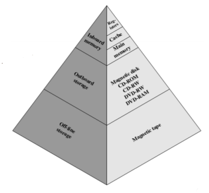
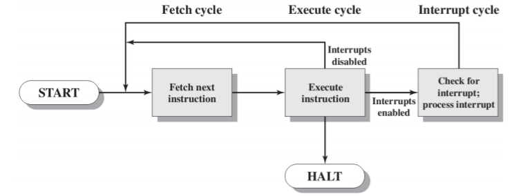
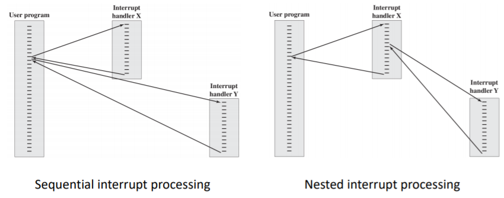

## 总览

+ 计算机因为每个组件之间的交互产生许多问题。
+ 冯诺依曼模型中，数据和指令存在一个唯一的可读可写内存中。
+ 内存中的内容可寻址，不需要知道里面存的是指令还是数据。
+ 顺序执行指令，除非有明确地修改。

## 计算机组件

### Memory 内存

1. **思想：**

   + 冯诺依曼模型中，数据和指令存在一个唯一的可读可写内存中。
   + 内存中的内容可寻址，不需要知道里面存的是指令还是数据。

2. **问题：**主存与CPU之间的传输速度差距越来越大。

3. **解决方法：**

   + 加cache，减少访问内存次数以及增加数据传输率。
   + 增加每次读取的字节数。

4. **组件要求：**

   + 容量：越大越好
   + 速度：与处理器速度相同
   + 代价：相对于其他组件而言是合理的。
   + 关系：时间越短，代价越高。

5. **改善方案：**建构memory金字塔，上面快、下面慢。

   

### I/O 输入、输出设备

1. **思想：**外部资源收集的数据与CPU和内存的交互。
2. **问题：**I/O性能跟不上CPU性能的增长速度。
3. **解决：**
   + 使用“流”（Buffering）
   + 新的接口

### CPU 中央处理器

1. **思想：**

   + 顺序执行指令，除非有明确地修改。
   + 冯诺依曼模型中，数据和指令存在一个唯一的可读可写内存中。
   + 内存中的内容可寻址，不需要知道里面存的是指令还是数据。

2. **问题：**等待I/O设备时CPU的空闲问题

3. **解决：**

   + 中断：当其他模块（如：I/O）发出中断信号时，打断当前动作并执行中断信号。

   + 中断侦测：增加中断循环在指令循环中。

     

   + 多重中断：

     + 嵌套中断处理(Nested interrupt processing)
     + 连续中断处理(Sequential interrupt processing)

     

### Bus 总线

1. **思想：**总线是连接两个或两个以上的设备，是一种共用的传输介质。
2. **数据传输类型：**
   + 地址线：可与数据线复用。
   + 数据线：可与地址线复用。
   + 控制线：控制数据线和地址线的使用。

