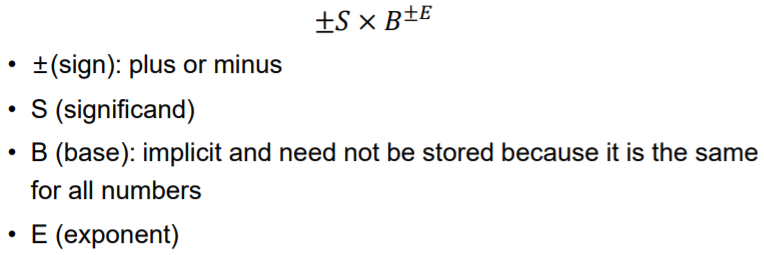
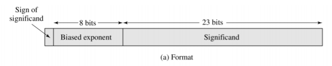
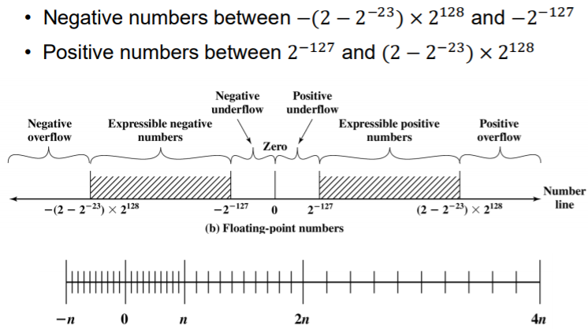

### 整数表示

1. **二进制：**

   + 为了表示出多个数值，必须对多个位进行组合

   + 如果有k位，最多能区分出2^k个不同的值

   + 类型：

     + 无符号整数

     + 有符号整数：原码、反码、补码

   + 原码和反码在进行加法运算时都会造成不必要的硬件需求， 于是就出现了补码

2. **补码：**

   + 表示方法：

     

   + 表示范围：

     

### 浮点数表示

1. **定义：**

   + 表示实数

   + 不动点表示的值有限制

   +  将浮点数用科学表示法表示

     

2. **表示法：**

   + 正负数符号存在第一位。
   + 因为第一位永远是1，所以不需要储存在significand里面。
   + 指数的值 =  exponent的值 + 127
   + 指数的底为2。

   

3. **表示范围：**

   

4. **问题：**有些数字无法表达。

5. **解决：**

   + 精度与范围的权衡
     + 增加 exponent位数：可表示范围增加，精度降低。
     + 增加significand位数：增加精度，可表示范围降低。
   + 用更大的底数：
     + 增加可表示的最大范围，降低精度。

6. **32位与64位：**

   + 32位：1 + 8 + 23
   + 64位：1 + 11 + 52

   + 增加精度和范围。
   + 减少越界与溢出的机会。

7. **IEEE 754 标准：**

   

### 十进制表示

1. **意义：**
   + 浮点数问题：
     + 精度限制
     + 高代价转换
   + 应用需要：长数值计算
   + 解决：用二进制编码的十进制表示0-9（`Binary-Coded Decimal` BCD）
2. **Natural Binary Coded Decimal (NBCD, 8421 code)：**
   + 0 ~ 9: 0000 ~ 1001
   + 符号：
     + 正数：1100 / 0 
     + 负数：1101 / 1
   + 例子：+2039: 1100 0010 0000 0011 1001 / 0 0010 0000 0011 1001