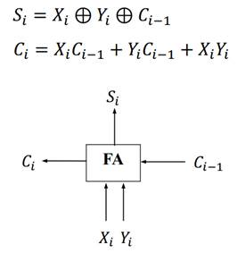
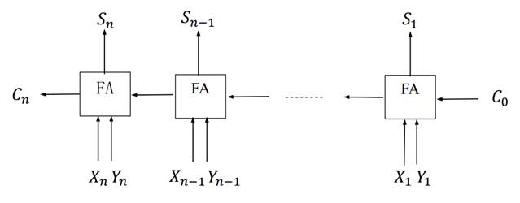
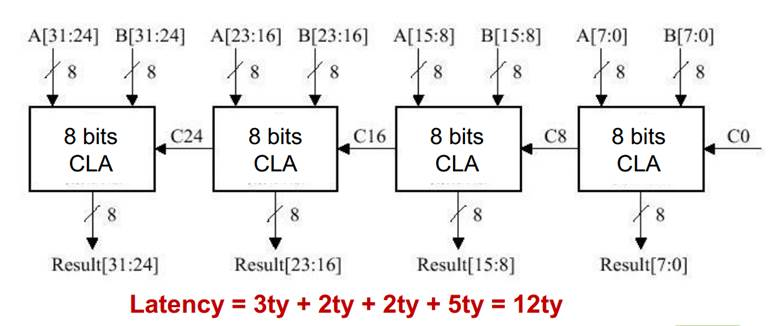
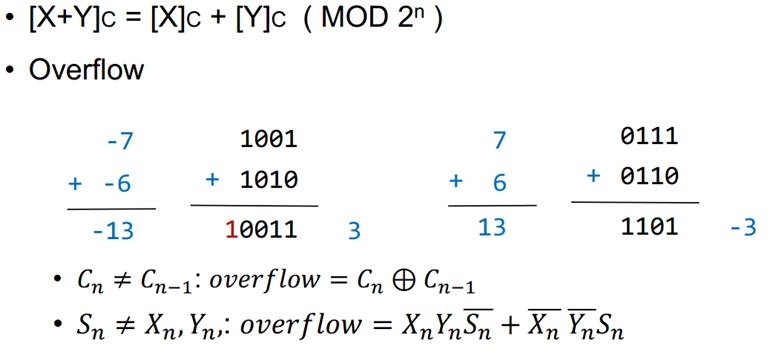

### 硬件

1. **ALU：**

   + 计算机用来进行运算以及逻辑操作的部分。
   + ALU从寄存器里取数据，将操作结果（数据、标志位）存到寄存器里。
   + 控制单元提供信号来控制ALU的操作以及数据的在ALU的移动。

2. **全加法器：**

   + X + Y

   + 延迟：

     + 与门、或门 1ty； 

     + 异或 ：3ty

   + 计算Xi的时候需要6ty 

   + 计算Ci的时候需要1+1=2ty

     

3. **串行进位加法器：**

   +  可以同时计算完成。

   + Cn : 2n ty

   + Sn : 2n+1 ty  

   + 缺点：速度慢

     

4. **超前进位加法器：**

   + 计算出Pi Gi需要1个延迟
   + 接着计算出Ci需要2个延迟。
   + 进而计算出Si需要3个延迟，总共6个延迟。
   + 缺点：复杂

   

   

5. **部分超前进位：**

   + 将CLA组合在一起。

     

### 整数运算操作

1. **加法：**

   

2. **减法：**

   + 减数去补做加法，判断溢出同加法。

     

3. **乘法：**

   + Booth’s 算法

     1. Y后补零；Y0=0。

     2. 看Y末两位，若Y0-Y1=0，不操作，若为1 Product+X，若为-1 Product-X 。
     3. 右移。
     4. 重复步骤2和3。n次 n为位数。得到最后结果。

     例：  -7* -6 = 42  

     X:【-7】c = 1001   -X:【7】c=0111   Y:【-6】c=1010

     |          |      | Product | Y           |
     | -------- | ---- | ------- | ----------- |
     | initial  |      | 0000    | 10100       |
     | Y0-Y1=0  | ->   | 0000    | 01010       |
     | Y1-Y2=-1 | -X   | 0111    | 01010       |
     |          | ->   | 0011    | 10101       |
     | Y2-Y3=1  | +X   | 1100    | 10101       |
     |          | ->   | 1110    | 01010       |
     | Y3-Y4=-1 | -X   | 0101    | 01010       |
     |          | ->   | 0010    | 10101    42 |

4. **除法：**

   + 恢复余数
     + 步骤：
       1. 被除数扩展n位（在前面增加n位符号位），将其存入余数寄存器与商的寄存器（各n位）
       2. 左移余数与商，若余数与除数异号，余数 + 除数，否则减，若符号改变，则恢复，商补零，否则补1
       3. 重复2（共做n次）
       4. 如果被除数与除数的符号不同，把商取反加一
       5. 余数存放在余数寄存器中。例：-7/3=-2余-1

   -7 1001； 3  0011 ； 

   |           | Reminder | Quotient | Divisor |
   | --------- | -------- | -------- | ------- |
   | Initial   | 1111     | 1001     | 0011    |
   | <-        | 1111     | 001      | 0011    |
   | +         | 0010     | 001      | 0011    |
   | Recover - | 1111     | 0010     | 0011    |
   | <-        | 1110     | 010      | 0011    |
   | +         | 0001     | 010      | 0011    |
   | Recover - | 1110     | 0100     | 0011    |
   | <-        | 1100     | 100      | 0011    |
   | +         | 1111     | 1001     | 0011    |
   | <-        | 1111     | 001      | 0011    |
   | +         | 0010     | 001      | 0011    |
   | Recover - | 1111     | 0010     | 0011    |
   |           | 1111     | 1110     |         |

   + 不恢复余数
     + 步骤：
       1. 把被除数扩展n位（前面加n位符号位），存在余数寄存器与商寄存器中，各n位。
       2. 如果余数寄存器中的数与除数符号相同，做减，否则做加。若结果与除数符号相同，商寄存器后补1否则补0。 左移。
       3. 重复2，共n次。
       4. 左移商，若商符号与除数相反，则+1
       5. 若余数与除数符号相同，则余数减除数，否则做加法。

   |         | Reminder | Quotient  | Divisor |
   | ------- | -------- | --------- | ------- |
   | Initial | 1111     | 1001      | 0011    |
   | +       | 0010     | 1001    1 | 0011    |
   | <-      | 0101     | 0011      | 0011    |
   | -       | 0010     | 0011   1  | 0011    |
   | <-      | 0100     | 0111      | 0011    |
   | -       | 0001     | 0111   1  | 0011    |
   | <-      | 0010     | 1111      | 0011    |
   | -       | 1111     | 1111   0  | 0011    |
   | <-      | 1111     | 1110      | 0011    |
   | +       | 0010     | 1110   1  | 0011    |
   |         | -        | <- +1     |         |
   |         | 1111     | 1110      |         |

   