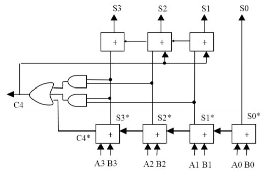

## 运算操作

### 加法

1. **实现：**范围在[10, 19]，则结果要调整。（需调整的加“0110”，并且前一位加1）

   

### 减法

1. **加“补码”：**

   N1 - N2 = N1 + (10^n - N2)

2. **计算补码：**将第二个数的每一个数字转成“补码”（转换的数字与原本数字相加为1001），两个数相加，并且最后一个要加 1 。

3. **转回“正数”：**

   + 如果最高位不进位，则将每一个数字转换成“补码”，并且符号为负。
   + 如果最高位进位，则不用转换，符号为正。

