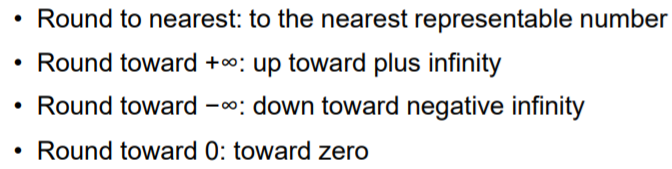

## 运算操作

### 加法和减法

1. **判断：**有没有操作数为 0  。

2. **使指数位相同：**小的往大的靠。

3. **操作：**

   + 加法：直接加
     + 符号同做加法，否则做减法。
     + 高位进位，则overflow。
   + 减法：加第二个操作数的补码
     + 高位进位，计算补码后，修正（符号同被减数）
     + 高位不进位，计算补码（符号为被减数的负数）

4. **调整结果：**

   + 指数溢出(overflow) —— 返回正无穷或负无穷。
   + 指数下溢(underflow) —— 返回 0 。
   + 主要数字溢出(over flow) —— 出现于加法，重新调整。
   + 主要数字下溢(under flow) —— 循环调整。

### 乘法

1. **判断：**有没有操作数为 0  。
2. **指数计算：**指数相加并减去偏差值（指数的值 =  exponent的值 + 127）。
3. **主要数字计算：**两数相乘。
4. **调整结果：**
   + 指数溢出(overflow) —— 返回正无穷或负无穷。
   + 指数下溢(underflow) —— 返回 0 。

### 除法

1. **判断：**有没有操作数为 0  。
   + 除数为 0 ，报错。
   + 被除数为 0 ，返回 0 。
2. **指数计算：**指数相加并加上偏差值（指数的值 =  exponent的值 + 127）。
3. **主要数字计算：**两数相除。
4. **调整结果：**
   + 指数溢出(overflow) —— 返回正无穷或负无穷。
   + 指数下溢(underflow) —— 返回 0 。

### 精度考虑

1. **保护位：**

   + ALU计算是32位。
   + 主要数字(significand)只有8位。
   + 返回时在后面多加几位当作保护位。

   

2. **四舍五入：**

   + ALU中计算是32位。
   + 返回时将最后被抛弃的几位做四舍五入。

   

   