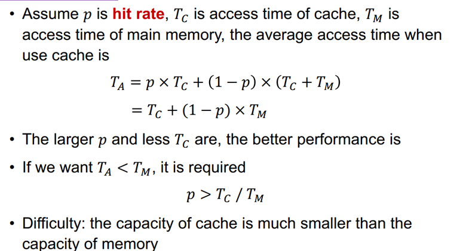
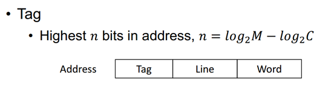
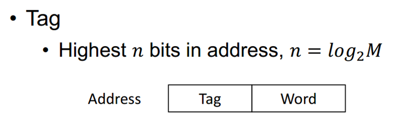
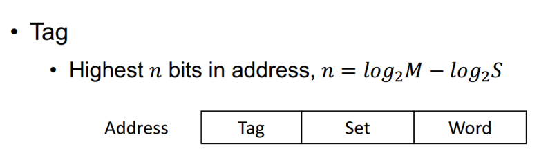

### 储存器金字塔

### Cache

1. **思想：**

   + 运用一个更小更快的寄存器来减少内存的访问次数。
   + 是对主存的部分拷贝。
   + 处于CPU和主存之间 ，可能集成在CPU或其他模块中。

2. **基本工作机制：**

   + Check：当处理器试图从主存访问数据时，先检查该数据是否在Cache中

   + 若命中，数据直接从Cache传输至CPU

   + 若没有命中，CPU访问主存，将一块数据传输至Cache中，然后再从Cache传输到CPU。

3. **如何判断命中：**

   + 冯诺依曼的设计：每个内存都可以被一个地址访问。
   + Cache用标签(tags)去判断需要访问的数据在主存中的地址。

4. **局部性原则：**

   + 时间的局部性：重复利用特定数据
   + 空间的局部性：在附近的数据也一起使用
   + 序列的局部性：发生空间局部性的特殊情况，如：遍历一维数组。
   + 传回一块利用空间局部性，提高命中率，节省时间。

5. **平均访问时间：**

   

6. **Cache的容量：**

   + 增加命中率

   + 增加成本和访问时间

7. **Cache的映射策略：**

   + 直接映射 Direct Mapping

     + 每个块只有一个映射行。

     + 设j为主存中的块数，C为Cache中的行数，则主存中每块对应在Cache中的行数
     + 行数 i = j mod C（Cache中每行存一块）

     

     + 优点：简单，匹配快，查找快
     + 缺点：抖动
     + 适用于大容量的Cache

   + 关联映射 Associative Mapping

     + 任何块可能被存在任何行。

       

     + 优点：防止抖动。

     + 缺点：复杂而且浪费资源。

     + 适用于小容量的Cache

   + 组关联映射 Set Associative Mapping

     + Cache被分为固定的组，每个块可以被存在指定的组里的任何一行。

     + 组号s = j mod S

     + K路组：k=C/S,每组的行数

       

     + 权衡任何容量的Cache

   + 比较

     + K=1   直接映射 
     + K=C   关联映射
     + 关联度(Correlation 每块对应寄存器中行的可能数):
       1. 直接映射1  关联映射C   组关联映射K
       2. 相关度越小，命中率越低，check时间更少，Tag长度越短

8. **Cache的替代方案：**

   + LRU Least Recently Used 

     + 最近最少用

     + 每行使用标记位 USE bit。
     
   + FIFO First In First Out 先进先出

   + LFU Least Frequently Used 最不常用

   + Random 随机

9. **Cache的写策略：**

   + 写入 
     + 为保证Cache与主存的一致性，往Cache写入时同时也要往主存写入
     + 优点：保证主存的实时更新。
     + 缺点：但降低写入速度，容易产生瓶颈。
   + 写回
     + 在Cache中增加一位（脏位）表示是否被修改过，若“脏”，则替换整个块时前将其写回
     + 减少写入操作，但会有不必要的麻烦（如输出时会取得主存中未修改的数据）
     + 策略：输出时候强制修改主存
     + 优点：最小化内存写入。
     + 缺点：因为内存没有实时更新，所以许多读写要透过Cache，造成更复杂的电路以及潜在瓶颈。

10. **Cache行大小：**

    + 行变大
      + 提高命中率
    + 行太大
      + 可能降低命中率（原因: Cache总大小不变时，行变大，减少了行数，使得替换频繁）

11. **Cache数量：**

    + 一个
      + 便集成到处理器，简化电路设计
    + 两个
      + 减少内存访问
      + 层次式：L1 L2
      + 设计复杂：要保证3个之间数据的一致性
      + L2 可以使用另外一条路，也可以放在处理器上
      + 注意：L1与L2的关系可以类比于单个Cache时候Cache与主存的关系
    + 统一
      + 指令和数据之间更高的命中率
      + 只需设计一个Cache
    + 分开
      + 消除指令间缓存争用，对指令流水线很重要。